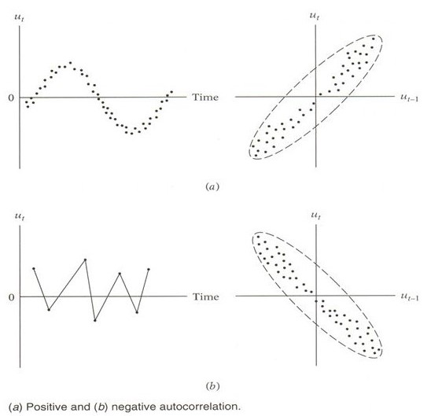

```{r setup, include=FALSE}
knitr::opts_chunk$set(echo = TRUE)
```


- 출처 : [Data Mining for Business Analytics](https://www.dataminingbook.com/book/r-edition)

##### [Data Mining for Business Analytics](https://www.dataminingbook.com/book/r-edition)을 공부하면서 요약하였다.


# **1 추세를 가진 모형**

- 시계열에서 회귀 모형은 관측값이 종속변수 ($Y$)이고 시간이 독립변수 ($t$)이다.
- 모형 설명과 함께 Ridership on Amtrak Trains(미국 철도 회사 “Amtrak”에서 수집한 1991년 1월~2004년 3월까지 매달 환승 고객 수)의 예제에 적용해본다.

```{r}
pacman::p_load("data.table",
               "forecast")

# Data 불러오기

Amtrak.data <- fread(paste(getwd(),"Amtrak.csv", sep="/"))

# Create time series

ridership.ts <- ts(Amtrak.data$Ridership, start=c(1991,1), end=c(2004,3), freq=12)
plot(ridership.ts, xlab="Time", ylab="Ridership", ylim=c(1300,2300), bty="l")
```

- 데이터에 대한 그래프를 보면 계절성과 추세가 같이 있다.
- 전반적인 추세가 선형인 것 같지 않지만 선형 추세가 어떻게 적합되는지 설명하기 위해서 먼저 가장 간단한 선형 추세만 고려해보았다.

## **선형 추세**

- 가장 간단한 선형 추세모형은 $Y_{t}=\beta_{0}+\beta_{1}t+\epsilon$이다.
  - $Y_{t}$ : 관측값
  - $t$ : 시간
  - $\beta_{0}$ : level
  - $\beta_{1}$ : trend
  - $\epsilon$ : noise
- `forecast` package에 `tslm()`을 이용하여 쉽게 모형을 추정할 수 있다.
- 관측값을 training data와 validation data로 나누어 적합과 예측을 시도한다.
- 선형 추세만 가지는 모형은 `tslm()` 함수 인자에 `y~trend`를 해준다.
- 예측은 `forecast()`함수를 이용하며, `h`는  미래 몇 시점까지 예측할 것인지를 나타내고 `level`은 신뢰구간의 신뢰수준을 의미한다.

```{r}
# Decompose train data and validation data

train.ts <- window(ridership.ts,start=c(1991,1), end=c(2001,3))
valid.ts <- window(ridership.ts,start=c(2001,4))
nValid   <- length(valid.ts)

# Fit linear trend model to training set and create forecasts

train.lm      <- tslm(train.ts ~ trend)
train.lm.pred <- forecast(train.lm, h=nValid, level=0)   # h : Number of periods for forecasting / level : Confidence level for prediction intervals.
```

```{r}
# Plot

plot(train.lm.pred, ylim=c(1300,2600), ylab="Ridership", xlab="Time", bty="l", xaxt="n", xlim=c(1991,2006.25), main="", flty=2)
axis(1, at=seq(1991,2006,1), labels=format(seq(1991,2006,1)))     
lines(train.lm.pred$fitted, lwd=2, col="blue")     
lines(valid.ts)


plot(train.lm.pred$residuals, ylim=c(-420,500), ylab="Residual", xlab="Time", bty="l", xaxt="n", xlim=c(1996,2006.25), main="")
axis(1, at=seq(1991,2006,1), labels=format(seq(1991,2006,1)))
lines(valid.ts-train.lm.pred$mean, lwd=1)

```

- 첫번째 그래프는 선형 추세모형으로 적합된 값과 예측값이 파란색 선으로 나타나 있으며 원래 관측값은 검은색 선이다.  
- 두번째 그래프는 잔차를 보여준다. 
- 이 두 그래프를 보면 추정값과 예측값이 실제값과 얼마나 차이가 나는지 볼 수 있다.
  - 잔차 그래프를 보면 여전히 추세와 계절성이 남아있다.
  
```{r}
summary(train.lm)
```


- 그래프 외에 통계적으로도 $p$값이 0.3896으로 추정된 회귀식이 적절하지 못함을 알 수 있다.


## **지수 추세**

- 지수 추세는 시간에 따라서 시계열이 지수적으로 증가/감소하며 비선형 추세를 가진 형태 중 하나이다.
- 모형식은  $\log{Y_{t}}=\beta_{0}+\beta_{1}t+\epsilon$로 $Y_{t}=ce^{\beta_{1}t+\epsilon}$의 양변에 $log$를 취하여 비선형을 선형으로 변환하여 분석한다.
- R 함수 `tslm()`에서 `lambda=0`이면 지수 추세이다.
  - `lambda` 인자는 Box-Cox 변환(정규분포를 따르는 확률변수로 변수변환하는데 유용)을 적용하는데 사용된다.
- `lambda=0`이면 $\log{Y_{t}}$을 적합하고, 예측값은 자동으로 원래 scale로 변환된다.
- `lambda=1`이면 시계열은 변환되지 않으며 모형은 선형 추세를 가진다.


```{r}
# Fit exponential trend using tslm() with argument lambda=0

train.lm.expo.trend      <- tslm(train.ts ~ trend, lambda=0)
train.lm.expo.trend.pred <- forecast(train.lm.expo.trend, h=nValid, level=0)

# Fit linear trend using tslm() with argument lambda = 1 (No transform of y)

train.lm.linear.trend      <- tslm(train.ts ~ trend, lambda=1)
train.lm.linear.trend.pred <- forecast(train.lm.linear.trend, h=nValid, level=0)
```

```{r}
# Plot

plot(train.lm.expo.trend.pred, ylim=c(1300,2600), ylab="Ridership", xlab="Time", bty="l", xaxt="n", xlim=c(1991,2006.25), main="", flty=2)
axis(1, at=seq(1991,2006,1), labels=format(seq(1991,2006,1))) 
lines(train.lm.expo.trend.pred$fitted, lwd=2, col="blue") 
lines(train.lm.linear.trend.pred$fitted, lwd=2, col="black", lty=3)
lines(train.lm.linear.trend.pred$mean, lwd=2, col="black", lty=3)
lines(train.ts)
lines(valid.ts)
```

## **다항 추세**

- 비선형 추세의 또 다른 형태이다.
- 예제는 U자형 추세를 가지므로 2차 함수 형태를 고려하였으며 모형식은 $Y_{t}=\beta_{0}+\beta_{1}t+\beta_{2}t^2+\epsilon$이다.
- 다항 추세가 있는 모형은 `I()`을 이용한다.

```{r}
# Fit quadratic trend using function I(), which trats an object "as is"

train.lm.poly.trend      <- tslm(train.ts ~ trend +  I(trend^2))
train.lm.poly.trend.pred <- forecast(train.lm.poly.trend, h=nValid, level=0)
```

```{r}
plot(train.lm.poly.trend.pred, ylim=c(1300,2600), ylab="Ridership", xlab="Time", bty="l", xaxt="n", xlim=c(1991,2006.25), main="", flty=2)
axis(1, at=seq(1991,2006,1), labels=format(seq(1991,2006,1))) 
lines(train.lm.poly.trend.pred$fitted, lwd=2)
lines(valid.ts)

```

```{r}
plot(train.lm.poly.trend.pred$residuals,  ylim=c(-420,500), ylab="Residual", xlab="Time", bty="l", xaxt="n", xlim=c(1996,2006.25), main="")
axis(1, at=seq(1991,2006,1), labels=format(seq(1991,2006,1))) 
lines(valid.ts-train.lm.poly.trend.pred$mean, lwd=1)
```

- 첫번째 그래프를 보면 앞선 선형 추세와 지수 추세보다 추세를 잘 잡아내고 있다.
- 두번째 그래프를 보면 추세는 없으며 오직 계절성만 나타내고 있다.

# **2 계절성을 가진 모형**

- 계절성 패턴은 같은 모양이 반복되는 형태이다.
- 계절성만 가지는 모형은 `tslm()` 함수 인자에 `y~season`을 해준다.
- 계절성의 경우 모형을 추정하기 위하여 더미변수가 추가된다. (`tslm()`에서 자동적으로 더미변수를 생성) 
<center></center>
- 12달이기에 11개의 더미변수가 생성된다.

## **Additive 계절성**

- additive 계절성 : 시계열의 분산이 일정한 경우

```{r}
# Include season as a predictor in tslm(). Here it creates 11 dummies,
# One for each month except for the first season, January.

train.lm.season      <- tslm(train.ts ~  season)     # 참조변수 = Season 1
train.lm.season.pred <- forecast(train.lm.season, h=nValid, level=0)

summary(train.lm.season)
```

- season8의 회귀계수는 396.66으로 8월달의 평균 승객수는 1월달의 평균 승객수보다 396.66배 높다.

```{r}
plot(train.lm.season.pred, ylim=c(1300,2600), ylab="Ridership", xlab="Time", bty="l", xaxt="n", xlim=c(1991,2006.25), main="", flty=2)
axis(1, at=seq(1991,2006,1), labels=format(seq(1991,2006,1))) 
lines(train.lm.season.pred$fitted, lwd=2)
lines(valid.ts)

```

```{r}
plot(train.lm.season.pred$residuals,  ylim=c(-420,500), ylab="Residual", xlab="Time", bty="l", xaxt="n", xlim=c(1996,2006.25), main="")
axis(1, at=seq(1991,2006,1), labels=format(seq(1991,2006,1))) 
lines(valid.ts-train.lm.season.pred$mean, lwd=1)

```

- 그래프를 보면 계절성은 해결했지만 추세는 여전히 U형태로 남아있다.

## **Multiplicative 계절성**

- Multiplicative 계절성 : 시계열의 분산이 점점 증가하거나 감소하는 경우
- 시계열의 분산 안정화를 위하여 로그 변환이 필요하다. (`tslm()`에서 `lambda=0` 설정)

```{r}
# Multiplicative seasonality

train.expo.lm.season      <- tslm(train.ts ~  season, lambda=0)
train.expo.lm.season.pred <- forecast(train.expo.lm.season, h=nValid, level=0)

# Plot

plot(train.expo.lm.season.pred, ylim=c(1300,2600), ylab="Ridership", xlab="Time", bty="l", xaxt="n", xlim=c(1991,2006.25), main="", flty=2)
axis(1, at=seq(1991,2006,1), labels=format(seq(1991,2006,1))) 
lines(train.expo.lm.season.pred$fitted, lwd=2)
```

# **3 추세와 계절성을 가진 모형**

- 추세와 계절성을 동시에 가지는 시계열 모형은 `tslm()`함수 인자에서 `y~trend+season`을 해준다.
- 예제는 U형태의 추세와 계절성을 동시에 가지는 모형으로써 2차함수 추세와 계절성을 적합시켜보았다.

```{r}
train.lm.trend.season      <- tslm(train.ts ~ trend + I(trend^2) + season)
train.lm.trend.season.pred <- forecast(train.lm.trend.season, h=nValid, level=0)

summary(train.lm.trend.season)
```

```{r}
plot(train.lm.trend.season.pred, ylim=c(1300,2600), ylab="Ridership", xlab="Time", bty="l", xaxt="n", xlim=c(1991,2006.25), main="", flty=2)
axis(1, at=seq(1991,2006,1), labels=format(seq(1991,2006,1))) 
lines(train.lm.trend.season.pred$fitted, lwd=2)
lines(valid.ts)

```

```{r}
plot(train.lm.trend.season.pred$residuals,  ylim=c(-420,500), ylab="Residual", xlab="Time", bty="l", xaxt="n", xlim=c(1996,2006.25), main="")
axis(1, at=seq(1991,2006,1), labels=format(seq(1991,2006,1))) 
lines(valid.ts-train.lm.trend.season.pred$mean, lwd=1)
```

- 첫번째 그래프를 보면 모형 적합과 예측이 잘 된 것을 볼 수 있다.
- 두번째 그래프를 보면 추세와 계절성이 모두 해결되었다.

# **4 자기상관과 ARIMA 모형**

## **자기상관**

- 양의 자기상관 : 값이 일반적으로 같은 방향을 향하는 것
- 음의 자기상관 : 값이 일반적으로 반대 방향을 향하는 것
<center></center>
- 자기상관은 현재 시점($t$)과 미래의 하나 또는 그 이상의 시점($t+k$, $k$>0)에서 관측된 시계열들의 상관관계를 의미한다.
  - $k>1$에 대하여, 강한 자기상관은 전형적인 주기변동을 의미한다. 예를 들어, 매월 data의 시차 12에서 강한 자기상관은 12개월마다 주기가 반복됨을 의미한다.
  - $k=1$에 대하여, 강한 양의 상관은 강한 선형추세를 의미한다.
  - $k=1$에 대하여, 강한 음의 상관은 강한 스윙을 의미한다.
- 자기 상관은 계절성 패턴을 파악하는 데 유용하며 `Acf()` 함수를 이용하여 자기상관을 구할 수 있다.

```{r}
reidership.24.ts <- window(train.ts, start=c(1991,1), end=c(1991,24) )
Acf(reidership.24.ts, lag.max=12, main="")
```

- 예제의 자기상관 그래프를 보면 시차 6에서 강한 음의 자기상관을 보여준다. 즉, 6개월 단위로 높아지다가 낮아지는 것을 의미한다. (여름에는 높고 겨울에는 낮음)

### **잔차의 자기상관**

- 추가적으로 잔차의 자기상관을 살펴보는 것도 매우 유용하다. 왜냐하면 잔차는 white noise이기 때문에 독립이어야한다. 즉, 잔차의 자기상관 그래프는 막대가 모두 선 안에 있어야한다.
  - 예를 들어 계절성이 잘 모형화되었다면, 잔차는 주기에서 자기상관이 0이다. 즉, 막대가 선 안에 있다.
- 다음 그래프는 2차함수 추세와 계절성을 가진 회귀모형의 잔차의 자기상관이다.  

```{r}
Acf(train.lm.trend.season$residuals, lag.max = 12, main="")
```

- 계절성이 있는 데이터를 잘 모형화했기 때문에 주기인 12에서 막대가 선 안에 있으므로 자기상관은 0이다.
- 그러나 시차 1에서 강한 양의 자기상관을 보이며 지수적으로 감소하는 것을 알 수 있다.

## **통합된 자기상관 정보에 의한 예측 향상**

- 일반적으로 자기상관을 이용하는 두 가지 방법이 있다.
  - 회귀모형에 직접적으로 자기상관을 포함하는 방법 (ARIMA 모형 등)
    - 기존의 선형회귀모형보다 더 정확한 결과를 생성한다.
    - 통계적 전문지식과 경험이 필요하다.
  - 잔차에 대한 2차 예측모형 구축하는 방법 (짧은 기간에 대한 예측을 향상)
- 첫번째 방법은 비정상시계열에 대하여 데이터 변환을 필요로 하지만 두번째 방법은 잔차에 모형을 구축시킴으로써 데이터 변환이 필요 없다.
  - 잔차는 white noise이기 때문에 자기상관 외에 어떠한 추세나 주기적 행동을 포함하지 않을 것이다.

### **잔차에 대한 2차 예측모형 구축**

- 잔차에 예측모형을 구축함으로써 짧은 기간에 대한 예측을 향상시킬 수 있다. 향상된 예측값을 얻는 방법은 다음과 같다.
  -  예측 모형을 이용하여 미래 $k$ 시점의 예측값($F_{t+k}$)을 생성한다.
  - AR 모형 또는 다른 모형을 사용하여 미래 $k$ 시점의 잔차에 대한 예측값($E_{t+k}$)을 생성한다.
  - 예측 모형을 이용하여 구한 예측값과 잔차에 대한 예측값을 더하여 향상된 예측값($F_{t+k}+E_{t+k}$)을 얻는다.
- 예제의 잔차의 자기상관은 시차 1에서 강한 양의 자기상관을 보이며 지수적으로 감소하기에 잔차에 AR(1) 모형을 적합시킬 수 있다.
  - 잔차에 대한 AR(1) 모형식은 $E_{t}=\beta_{0}+\beta_{1}E_{t-1}+\epsilon$이다.
    - $E_{t}$ : 시점 $t$에서 잔차
- 다음은 예제의 잔차에 AR(1) 모형을 적합시킨 결과이다.

```{r}
# Fit linear regression with quadratic tren and seasonality to Ridership 

train.lm.trend.season <- tslm(train.ts ~ trend + I(trend^2) + season)    # 관측값에 대한 예측모형

# Fit AR(1) model to training residuals
# Use Arima() in the forecast package to fit an ARIMA model

train.res.arima      <- Arima(train.lm.trend.season$residuals, order=c(1,0,0))   # 잔차에 AR(1) 모형 적합
train.res.arima.pred <- forecast(train.res.arima, h=nValid, level=0)             # 적합된 AR(1) 모형으로 미래 잔차 예측

summary(train.res.arima)

```

- AR(1) 회귀 계수 (0.5998)와 잔차의 자기상관 그래프에서 시차가 1일 때 자기상관 (0.6041)은 비슷하다.
- 잔차에 AR(1) 모형에 대한 추정된 회귀식은 $\hat{E}_{t}=0.3728491+0.5997814*(E_{t-1}-0.3728491)$이다.

```{r}
# Plot

plot(train.lm.trend.season$residuals, ylim=c(-250,250), ylab="Residual", xlab="Time", bty="l", xaxt="n", xlim=c(1991,2006.25), main="")
axis(1, at=seq(1991,2006,1), labels=format(seq(1991,2006,1)))
lines(train.res.arima.pred$fitted, lwd=2, col="blue")
```

- 그래프를 보면 training data에 대한 잔차와 AR(1)모형에 의해 추정된 잔차는 비슷한 것을 볼 수 있다.  
- 다음은 미래 1시점에서 잔차 예측값을 얻는 방법이다.

```{r}
valid.res.arima.pred <- forecast(train.res.arima, h=1)
valid.res.arima.pred

```

- 미래 1시점에서 잔차 예측값은 0.3728491+0.5997814*(12.108-0.3728491)=7.411이다.

```{r}
forecast(train.lm.trend.season, h=1)
```

- 향상된 예측값은 2004.271+7.411=2011.682로 기존의 예측값 2004.271보다 실제값 2023.792에 더 가깝다.
- 잔차에 모형을 적합한 후 RMSE나 MAPE를 통하여 validation data에 대한 예측 성능을 살펴볼 수 있으며 잔차의 잔차 자기상관을 통하여 모형을 평가할 수 있다.

```{r}
Acf(train.res.arima$residuals, lag.max = 12)
```

- 잔차의 자기상관 그래프는 막대 모두 선 안에 있으므로 독립성을 만족한다.
- 다음은 validation data에 대하여 향상된 예측값을 얻는 방법이다.


```{r}
# Improved forecast 

res.arima         <- as.data.frame(train.res.arima.pred)[,1]
fore              <- as.data.frame(forecast(train.lm.trend.season, h=nValid, level=0 ))[,1]
Improved_forecast <- apply(cbind(res.arima,fore), 1,sum)   # Data.frame 변환
Improved_forecast
```

```{r}
# Plot

Improved_forecast <- ts(Improved_forecast, start=c(2001,4), end=c(2004,3), freq=12) # Time series 변환

plot(train.lm.trend.season.pred, ylim=c(1300,2600), ylab="Ridership", xlab="Time", bty="l", xaxt="n", xlim=c(1991,2006.25), main="")
axis(1, at=seq(1991,2006,1), labels=format(seq(1991,2006,1))) 
lines(Improved_forecast, lwd=1, col="orange")
lines(valid.ts)
```

