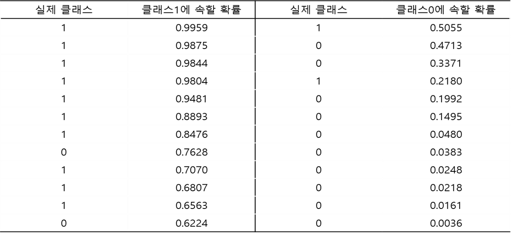
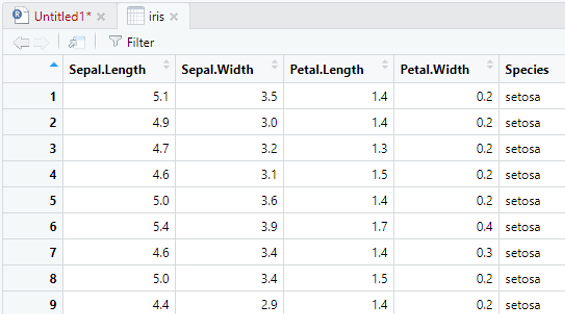

```{r setup, include=FALSE}
knitr::opts_chunk$set(echo = TRUE)
```


# **1. Classification Matrix**
<center></center>

<br />

#### **Version 1**  
```{r}

pp <- c(0.9959, 0.9875, 0.9844, 0.9804, 0.9481, 0.8893, 
        0.8476, 0.7628, 0.7070, 0.6807, 0.6563, 0.6224,
        0.5055, 0.4713, 0.3371, 0.2180, 0.1992, 0.1495, 
        0.0480, 0.0383, 0.0248, 0.0218, 0.0161, 0.0036) # pp :  클래스 1에 속할 확률


ac <- c(1, 1, 1, 1, 1, 1, 1, 0, 1, 1, 1, 0, 
        1, 0, 0, 1, 0, 0, 0, 0, 0, 0, 0, 0)             # ac : 실제 클래스


pred <- rep(0, length(pp))                              # rep(0, 5) : 0을 5개 생성

cv <- 0.5                                               # Cutoff Value(분류 기준값)
pred[pp>=cv]<- 1                                        # 예측확률>=cv이면 "1", 그렇지 않으면 "0"

table(ac, pred)                                         # table(행, 열) : 오분류 행렬 

```

<br />

#### **Version 2 ("function" 이용!)**

```{r}
CM <- function(cv) {
  
  pp <- c(0.9959, 0.9875, 0.9844, 0.9804, 0.9481, 0.8893, 
          0.8476, 0.7628, 0.7070, 0.6807, 0.6563, 0.6224,
          0.5055, 0.4713, 0.3371, 0.2180, 0.1992, 0.1495, 
          0.0480, 0.0383, 0.0248, 0.0218, 0.0161, 0.0036)  # pp :  클래스 1에 속할 확률
  
  
  ac <- c(1, 1, 1, 1, 1, 1, 1, 0, 1, 1, 1, 0, 
          1, 0, 0, 1, 0, 0, 0, 0, 0, 0, 0, 0)              # ac : 실제 클래스
  
  
  pred <- rep(0, length(pp))                               # rep(0, 5) : 0을 5개 생성
  
  pred[pp>=cv] <- 1                                        # 예측확률>=cv이면 "1", 그렇지 않으면 "0"
  
  table(ac, pred)                                          # table(행, 열) : 오분류 행렬  
}

CM(0.75)


```


# **2. ConfusionMatrix**

<br />

#### **Version 1**

```{r}
pacman::p_load("e1071", "caret")                         # For confusionMatrix 

pp <- c(0.9959, 0.9875, 0.9844, 0.9804, 0.9481, 0.8893, 
        0.8476, 0.7628, 0.7070, 0.6807, 0.6563, 0.6224,
        0.5055, 0.4713, 0.3371, 0.2180, 0.1992, 0.1495, 
        0.0480, 0.0383, 0.0248, 0.0218, 0.0161, 0.0036)  # pp :  클래스 1에 속할 확률


ac <- c(1, 1, 1, 1, 1, 1, 1, 0, 1, 1, 1, 0, 
        1, 0, 0, 1, 0, 0, 0, 0, 0, 0, 0, 0)              # ac : 실제 클래스


pred <- rep(0, length(pp))                               # rep(0, 5) : 0을 5개 생성

cv <- 0.5                                                # Cutoff Value(분류 기준값)
pred[pp>=cv] <- 1                                        # 예측확률>=cv이면 "1", 그렇지 않으면 "0"

pred <- as.factor(pred)                                  # as.factor:범주형으로 변환
ac   <- as.factor(ac)

confusionMatrix(pred, ac, positive="1")                  # confusionMatrix (예측 클래스, 실제 클래스, positive=“관심 클래스”)

```

<br />

#### **Version 2 ("function" 이용!)**

```{r}

CM<-function(cv) {
  pp <- c(0.9959, 0.9875, 0.9844, 0.9804, 0.9481, 0.8893, 
          0.8476, 0.7628, 0.7070, 0.6807, 0.6563, 0.6224,
          0.5055, 0.4713, 0.3371, 0.2180, 0.1992, 0.1495, 
          0.0480, 0.0383, 0.0248, 0.0218, 0.0161, 0.0036)    # pp :  클래스 1에 속할 확률
  
  
  ac <- c(1, 1, 1, 1, 1, 1, 1, 0, 1, 1, 1, 0, 
          1, 0, 0, 1, 0, 0, 0, 0, 0, 0, 0, 0)                # ac : 실제 클래스
  
  
  pred<-rep(0, length(pp))                                   # rep(0, 5) : 0을 5개 생성
  
  pred[pp>=cv]<-1                                            # 예측확률>=cv이면 "1", 그렇지 않으면 "0"
  
  pred <- as.factor(pred)                                    # as.factor:범주형으로 변환
  ac   <- as.factor(ac)
  
  confusionMatrix(pred, ac, positive="1") 	                 # confusionMatrix (예측 클래스, 실제 클래스, positive=“관심 클래스”)                                                          
}

CM(0.5)

detach(package:e1071)
detach(package:caret)
```


# **3. ROC 곡선**

## **3-1. Package "ROCR"**

```{r}
pacman::p_load("ROCR")

pp <- c(0.9959, 0.9875, 0.9844, 0.9804, 0.9481, 0.8893, 
        0.8476, 0.7628, 0.7070, 0.6807, 0.6563, 0.6224,
        0.5055, 0.4713, 0.3371, 0.2180, 0.1992, 0.1495, 
        0.0480, 0.0383, 0.0248, 0.0218, 0.0161, 0.0036)   # pp :  클래스 1에 속할 확률


ac <- c(1, 1, 1, 1, 1, 1, 1, 0, 1, 1, 1, 0, 
        1, 0, 0, 1, 0, 0, 0, 0, 0, 0, 0, 0)               # ac : 실제 클래스

pred <- prediction(pp,ac)                                 # prediction(예측 확률, 실제 클래스)
perf <- performance(pred, "tpr", "fpr", colorize=T)       # tpr : 민감도 
                                                          # fpr : 1-특이도                    
plot(perf, col="blue", lwd=3)
abline(0,1,lty=2)


```

<br />

#### **AUC**

```{r}
perf.auc <- performance(pred, "auc")
attributes(perf.auc)$y.values

detach(package:ROCR)

```


## **3-2. Package "Epi"**

<br />

#### **Version 1 (실제 클래스와 예측 확률을 아는 경우)**

```{r}
pacman::p_load("Epi", "devtools")                          # For ROC
# install_version("etm", version="1.1", repos = "http://cran.us.r-project.org")

pp <- c(0.9959, 0.9875, 0.9844, 0.9804, 0.9481, 0.8893, 
        0.8476, 0.7628, 0.7070, 0.6807, 0.6563, 0.6224,
        0.5055, 0.4713, 0.3371, 0.2180, 0.1992, 0.1495, 
        0.0480, 0.0383, 0.0248, 0.0218, 0.0161, 0.0036)    # pp :  클래스 1에 속할 확률


ac <- c(1, 1, 1, 1, 1, 1, 1, 0, 1, 1, 1, 0, 
        1, 0, 0, 1, 0, 0, 0, 0, 0, 0, 0, 0)                # ac : 실제 클래스

ROC(pp, ac, plot="ROC")                                    # ROC(예측 확률, 실제 클래스)

```

<br />

#### **Version 2 (모형을 바로 이용하는 경우)**


```{r}
pacman::p_load("moonBook")          	        # For data "radial"  

data(radial)
ROC(form=male~height,data=radial,plot="ROC")	# ROC(모형) : 키(height)에 따라 남자와 여자를 구분

detach(package:Epi)
```


## **3-3. Package "pROC"**

<br />

#### **Version 1 (실제 클래스와 예측 확률을 아는 경우)**

```{r}
pacman::p_load("pROC")     # For roc and roc.test

pp <- c(0.9959, 0.9875, 0.9844, 0.9804, 0.9481, 0.8893, 
        0.8476, 0.7628, 0.7070, 0.6807, 0.6563, 0.6224,
        0.5055, 0.4713, 0.3371, 0.2180, 0.1992, 0.1495, 
        0.0480, 0.0383, 0.0248, 0.0218, 0.0161, 0.0036)       # pp :  클래스 1에 속할 확률


ac <- c(1, 1, 1, 1, 1, 1, 1, 0, 1, 1, 1, 0, 
        1, 0, 0, 1, 0, 0, 0, 0, 0, 0, 0, 0)                   # ac : 실제 클래스

perf.roc <- roc(ac, pp, ci=T, percent=F, plot=T, col="blue")  # roc(실제 클래스, 예측 확률)

auc(perf.roc)      # AUC
```

<br />

#### **Version 2 (모형을 바로 이용하는 경우)**

```{r}
pacman::p_load("pROC", "moonBook")                                            # For roc and roc.test

b1 <- roc(male~height, radial, ci=T, percent=F, plot=T)                       # 키(height)에 따라 남자와 여자를 구분
b2 <- roc(male~weight, radial, ci=T, percent=F, plot=T, add=TRUE, col="red")	# 몸무게(weight)에 따라 남자와 여자를 구분


roc.test(b1,b2,plot=T)		# 두 ROC곡선의 AUC 동일성 검정

detach(package:moonBook)
detach(package:pROC)
```


# **4. 향상 차트**


## **4-1. 단순 랜덤과 향상 차트** 

```{r}
pacman::p_load("gains")  # For gains
 
pp <- c(0.9959, 0.9875, 0.9844, 0.9804, 0.9481, 0.8893, 
        0.8476, 0.7628, 0.7070, 0.6807, 0.6563, 0.6224,
        0.5055, 0.4713, 0.3371, 0.2180, 0.1992, 0.1495, 
        0.0480, 0.0383, 0.0248, 0.0218, 0.0161, 0.0036)  # pp :  클래스 1에 속할 확률

ac <- c(1, 1, 1, 1, 1, 1, 1, 0, 1, 1, 1, 0, 
        1, 0, 0, 1, 0, 0, 0, 0, 0, 0, 0, 0)              # ac : 실제 클래스

gain <- gains(ac, pp, groups=length(ac))
plot(c(0, gain$cume.pct.of.total*sum(ac)) ~ c(0, gain$cume.obs), 
xlab = "데이터 개수", ylab = "누적", type="l")
lines(c(0,sum(ac))~c(0,length(ac)), col="gray", lty=2)

```

## **4-2. 막대그래프를 이용한 향상 차트**

```{r}
pacman::p_load("gains")    # For gains

pp <- c(0.9959, 0.9875, 0.9844, 0.9804, 0.9481, 0.8893, 
        0.8476, 0.7628, 0.7070, 0.6807, 0.6563, 0.6224,
        0.5055, 0.4713, 0.3371, 0.2180, 0.1992, 0.1495, 
        0.0480, 0.0383, 0.0248, 0.0218, 0.0161, 0.0036)    # pp :  클래스 1에 속할 확률

ac <- c(1, 1, 1, 1, 1, 1, 1, 0, 1, 1, 1, 0, 
        1, 0, 0, 1, 0, 0, 0, 0, 0, 0, 0, 0)                # ac : 실제 클래스

gain <- gains(ac, pp)

barplot(gain$mean.resp / mean(ac), names.arg = gain$depth, 
        xlab = "Percentile", 
        ylab = "Mean Response", 
        main = "Decile-wise lift chart")
```


## **4-3. Package "ROCR"**

```{r}
pacman::p_load("ROCR")

pp <- c(0.9959, 0.9875, 0.9844, 0.9804, 0.9481, 0.8893, 
        0.8476, 0.7628, 0.7070, 0.6807, 0.6563, 0.6224,
        0.5055, 0.4713, 0.3371, 0.2180, 0.1992, 0.1495, 
        0.0480, 0.0383, 0.0248, 0.0218, 0.0161, 0.0036)    # pp :  클래스 1에 속할 확률

ac <- c(1, 1, 1, 1, 1, 1, 1, 0, 1, 1, 1, 0,
        1, 0, 0, 1, 0, 0, 0, 0, 0, 0, 0, 0)                # ac : 실제 클래스

pred <- prediction(pp,ac)                                  # prediction(예측 확률, 실제 클래스)

perf <- performance(pred, "lift", "rpp")                   # lift : lift 값 
                                                           # rpp : 양성 예측의 비율
plot(perf, main="lift curve", colorize=T, lwd=2)           # Lift Chart

detach(package:ROCR)
```


## **4-4. Package "lift"**

```{r}

pacman::p_load("lift")

pp <- c(0.9959, 0.9875, 0.9844, 0.9804, 0.9481, 0.8893, 
        0.8476, 0.7628, 0.7070, 0.6807, 0.6563, 0.6224,
        0.5055, 0.4713, 0.3371, 0.2180, 0.1992, 0.1495, 
        0.0480, 0.0383, 0.0248, 0.0218, 0.0161, 0.0036)     # pp :  클래스 1에 속할 확률

ac <- c(1, 1, 1, 1, 1, 1, 1, 0, 1, 1, 1, 0, 
        1, 0, 0, 1, 0, 0, 0, 0, 0, 0, 0, 0)                 # ac : 실제 클래스


plotLift(pp, ac, cumulative = TRUE, n.buckets = 24)         # plotlift(예측 확률, 실제 클래스,  n.buckets = 케이스 수)
                                                                                   
TopDecileLift(predicted=pp, labels=ac)                      # Top 10% 향상도 출력

detach(package:lift)
```


# **5. Unbalanced Target**

```{r}
pacman::p_load("caret")

# 비례식을 이용한 과샘플링 결과의 confusionMatrix 
OS.table <- as.table( matrix(c(390, 110, 80, 420),2,2) )
confusionMatrix(OS.table)

# 과샘플링 가중치를 이용한 결과의 confusionMatrix 
Ori.table <- as.table( matrix(c(764.4, 215.6, 3.2, 16.8),2,2) )
confusionMatrix(Ori.table)

```


# **6. 모형 선택**

<br />

> 예제로 사용될 데이터는 R에 내장되어 있는 "iris" 데이터이다.


<center></center>

<br />

- Sepal.Length : 꽃받침의 길이
- Sepal.Width   : 꽃받침의 너비
- Petal.Length  : 꽃잎의 길이
- Petal.Width    : 꽃잎의 너비
- Species : 품종(versicoloer, setosa, virginica)

<br />

```{r}
pacman::p_load("rpart", "randomForest", "caret", "kernlab")

set.seed(12345)                                                    # 똑같은 결과 나오게 하기 위해 seed 고정
DATA <- createDataPartition(y=iris$Species, p=0.7, list=FALSE)     # Training Data로 70% 분할
TrD  <- iris[DATA,]                                                # Training Data
TeD  <- iris[-DATA,]                                               # Test Data

set.seed(12345)                                                    # 똑같은 결과 나오게 하기 위해 seed 고정
control <- trainControl(method = 'cv', number = 10)                # 10-fold-Cross Validation 
tree <- train(Species~., data = TrD, method = 'rpart', 
              metric = 'Accuracy', trControl=control)              # 의사결정나무
rf   <- train(Species~., data = TrD, method = 'rf', 
              metric = 'Accuracy', trControl = control)            # 랜덤포레스트
svm  <- train(Species~., data = TrD, method = 'svmRadial', 
              metric = 'Accuracy', trControl = control)            # 서포트벡터머신
knn  <- train(Species~., data = TrD, method = 'knn', 
              metric = 'Accuracy', trControl = control)            # K-최근접 이웃

resamp <- resamples(list(의사결정나무 = tree, 랜덤포레스트 = rf, 
                               SVM = svm, kNN = knn))              # Resampling Results
summary(resamp)

sort(resamp, decreasing = TRUE)    # Resampling Results를 내림차순으로 정렬
dotplot(resamp)                    # dot plot
```


