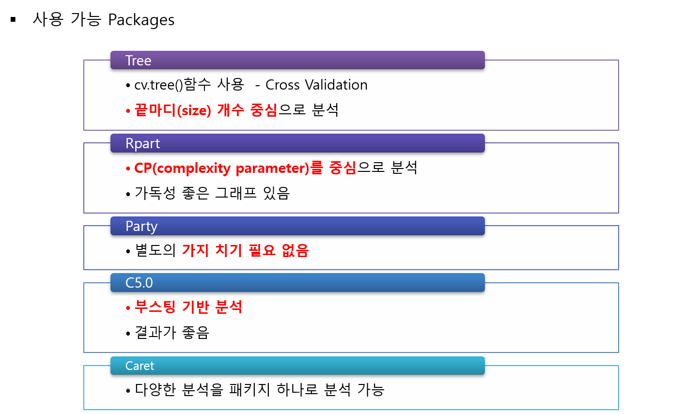

```{r setup, include=FALSE}
knitr::opts_chunk$set(echo = TRUE)
```


 다양한 의사결정나무모형을 실습하기 위해서 사용될 예제 데이터는 "Universal Bank_Main"로 유니버셜 은행의 고객들에 대한 데이터(출처 : Data Mining for Business Intelligence, Shmueli et al. 2010)이다. 데이터는 총 2500개이며, 변수의 갯수는 13개이다. 여기에서, **Target**은 `Person.Loan`이다.

<center></center>

<br />

<center></center>

의사결정나무를 분석할 수 있는 패키지는 여러가지가 있다.

<center></center>

이 중 실습에서는 "caret"을 이용하여 "rpart"와 "C5.0" 방법으로 의사결정나무 분석을 한다.

-----------------

# **1. 데이터 불러오기**
  
```{r}
pacman::p_load("data.table", "dplyr")         

UB   <- fread(paste(getwd(),"Universal Bank_Main.csv", sep="/")) %>%       # 데이터 불러오기
   data.frame() %>%                                                     # Data frame 변환
   mutate(Personal.Loan = ifelse(Personal.Loan==1, "yes","no")) %>%     # Character for classification
   select(-1)                                                           # ID변수 제거


# select columns
cols <- c("Family", "Education", "Personal.Loan", "Securities.Account", 
          "CD.Account", "Online", "CreditCard")

UB   <- UB %>% 
  mutate_at(cols, as.factor)                                            # 범주형 변수 변환


glimpse(UB)                                                             # 데이터 구조
```


# **2. 데이터 분할**

```{r}
# Partition (Traning Data : Test Data = 7:3)

pacman::p_load("caret")

y      <- UB$Personal.Loan                            # Target
 
set.seed(200)
ind    <- createDataPartition(y, p=0.7, list=T)       # Training Data를 70%로 추출


UB.trd <- UB[ind$Resample1,]                          # Traning Data


UB.ted <- UB[-ind$Resample1,]                         # Test Data

```


# **3. Method  "rpart"**
<br />

## **3-1. 모형 적합**

<center></center>

Turn Parameter인 `CP`의 그리드를 조정하기 위해서 그리드를 조정해주지 않았을 때 결과를 참고하였다. 아래는 그리드를 조정해주지 않았을 때 기본적인 결과이다. (`caret`에서 자동적으로 `xval = 0`이며, 최적의 cp를 이용하여 최종 모형을 적합하기 때문에 가지치기를 할 필요가 없다.)


```{r}
fitControl <- trainControl(method="cv", number=5)    # 5-fold-cross validation

set.seed(100)                                        # seed 고정 for cross validation


rtree.caret <- train(Personal.Loan~., data=UB.trd, method="rpart", trControl = fitControl)   
rtree.caret
```

모수가 하나이기 때문에 `Grid Search` 방법으로 3개의 `CP` 값을 얻고 각 `CP`로 고정한 후 5-Fold-Cross Validation 방법으로 정확도를 얻었다. `CP`가0.05일 때 정확도가 가장 높은 것을 알 수 있다. 아래는 `CP`가 0.05일 때 가장 좋으므로, `CP`의 탐색 범위를 조절한 코드이다.

```{r}
customGrid <- expand.grid(cp = seq(0.01,0.07, by=0.001))   # cp의 탐색 범위 


set.seed(100)                                              # seed 고정 for cross validation


rtree.grid.caret <- train(Personal.Loan~., data=UB.trd, tuneGrid = customGrid,
                          method="rpart", trControl = fitControl)
rtree.grid.caret
```

```{r}
plot(rtree.grid.caret)  
```

`cp` 값이 0.02일 때 정확도가 가장 높다는 것을 알 수 있으며, 최종 모형은 `cp` = 0.02일 때 적합된 모형이다.


## **3-2. Tree 그림**
<br />

### **3-2-1. "Plot"**
```{r}
plot(rtree.grid.caret$finalModel)
text(rtree.grid.caret$finalModel, use.n=TRUE, all=TRUE, cex=0.8)
```


### **3-2-2. "fancyRpartPlot"**
```{r}
pacman::p_load("rattle")
fancyRpartPlot(rtree.grid.caret$finalModel)    # 가독성 좋은 그래프
```


### **3-2-3. "visTree"**

```{r}
pacman::p_load("visNetwork","sparkline")  # 네트워크 기반 그래프

visTree(rtree.grid.caret$finalModel)  
```

## **3-3. 모형 평가**


```{r}
# 적합된 모형으로 Test Data의 클래스 예측

rtree.grid.caret.pred <- predict(rtree.grid.caret, newdata=UB.ted)   # predict(트리모형, Test Data) 

```

### **3-3-1. ConfusionMatrix**

```{r}
confusionMatrix(rtree.grid.caret.pred, UB.ted$Personal.Loan, positive = "yes")   # ConfusionMatrix(예측 클래스, 실제 클래스, positive="관심 클래스")
```

### **3-3-2. ROC 곡선**
<br />


#### **1) Package "pROC"**

```{r}
pacman::p_load("pROC")

test.rtree.prob <- predict(rtree.grid.caret, newdata = UB.ted, type="prob")  #  Training Data로 적합시킨 모형에 대한 Test Data의 각 클래스에 대한 예측 확률


test.rtree.prob <- test.rtree.prob[,2]                                       # "yes"에 대한 예측 확률


ac             <- UB.ted$Personal.Loan                                       # 범주형을 숫자형으로 변환할 때 문자형으로 변환한 뒤 숫자형으로 변환해야함


pp             <- as.numeric(test.rtree.prob)                                # "yes"에 대한 예측 확률

tree.roc       <- roc(ac, pp, plot = T, col = "red")                         # roc(실제 클래스, 예측 확률)

auc            <- round(auc(tree.roc),3)
legend("bottomright",legend=auc, bty="n")


detach(package:pROC)
```
<br />

#### **2) Package "Epi"**

```{r}
pacman::p_load("devtools", "Epi")
# install_version("etm", version = "1.1", repos = "http://cran.us.r-project.org")

ROC(pp, ac, plot="ROC")		# ROC(예측 확률, 실제 클래스) / 최적의 cutoff value 예측 가능

detach(package:Epi)
```


<br />

#### **3) Package "ROCR"**

```{r}
pacman::p_load("ROCR")                                                  

rtree.pred <- prediction(test.rtree.prob, UB.ted$Personal.Loan) # prediction(예측 확률, 실제 클레스)   


rtree.perf <- performance(rtree.pred, "tpr", "fpr")             # performance(, "민감도", "1-특이도")

plot(rtree.perf, col="red")                                     # ROC Curve

perf.auc        <- performance(rtree.pred, "auc")               # AUC
auc             <- attributes(perf.auc)$y.values
legend("bottomright", legend=auc, bty="n")
```

<br />

### **3-3-3. 향상 차트**

<br />

#### **1) Package "ROCR"**

```{r}
rtree.perf       <- performance(rtree.pred, "lift", "rpp") 	    # Lift Chart
plot(rtree.perf, main="lift curve", colorize=T, lwd=2)	

detach(package:ROCR)
```

#### **2) Package "lift"**

```{r}
pacman::p_load("lift")

ac.numeric <- ifelse(UB.ted$Personal.Loan=="yes",1,0)                  # 실제 클래스를 수치형으로 변환

plotLift(test.rtree.prob, ac.numeric, cumulative = T, n.buckets = 24)  # plotLift(예측 확률, 실제 클래스)


TopDecileLift(test.rtree.prob, ac.numeric)		                         # Top 10% 향상도 출력

detach(package:lift)
```

# **4. Method "C5.0"**

<br />

## **4-1. 모형 적합**

Turn Parameter인 `trials`의 그리드를 조정하기 위해서 그리드를 조정해주지 않았을 때 결과를 참고하였다. 아래는 그리드를 조정해주지 않았을 때 기본적인 결과이다.  

```{r}
fitControl <- trainControl(method="cv", number=5)                            # 5-fold-cross validation


set.seed(100)                                                                # seed 고정 for cross validation


ctree.caret <- train(x = UB.trd[,-9], y = UB.trd$Personal.Loan, data=UB.trd, #  x= , y= 로 명시! 아니면 Package "C50" 했을 때와 예측이 다름
                     
                     method="C5.0", trControl = fitControl)                    
ctree.caret 
```

`caret`에서 `C5.0`은 `model`, `winnow`, `trials` Parameter를 가진다.
- `model` : Model Type으로 `rules`는 규칙 기반, `tree`는 의사결정나무
- `winnow` : `TRUE` 이면 유용하지 않은 예측 변수는 제외하고 모형 적합 (예측 변수가 많을 떄 유용)
- `trials` : 부스팅 횟수

`trials` = 5일 때 가장 정확도가 높으므로, 탐색 범위를 그 근방에서 조정해준다.

```{r}
customGrid <- expand.grid(model  = c("tree"),  
                          winnow = FALSE,
                          trials = seq(5,20,1))   # 모수 탐색 범위 

set.seed(100)                                     # seed 고정 for cross validation


ctree.grid.caret <- train(x = UB.trd[,-9], y = UB.trd$Personal.Loan, data=UB.trd, tuneGrid = customGrid,
                          method="C5.0", trControl = fitControl)           
ctree.grid.caret

plot(ctree.grid.caret)     

```


`trials` 이 19일 때 정확도가 가장 높다는 것을 알 수 있으며, 최종 모형은 `trials` = 19일 때 적합된 모형이다.

## **4-2. Tree 그림**

`caret`에서는 `C5.0`에 대해서 최종 모델에 대한 plot을 그릴 수 없다. 그래서 최적의 Tune Parameter를 가지고 Package `C50`에서 다시 모형 적합 후 그림을 그릴 수 있다. 이 때 `caret`의 최종모형에 대한 예측과 `C50`의 모형에 대한 예측이 같은지 확인하는 것이 필요하다.

```{r}
pacman::p_load("C50", "MASS","partykit")  

set.seed(100)
c5model = C5.0(x = UB.trd[,-9], y = UB.trd$Personal.Loan,
                       trials = ctree.grid.caret$bestTune$trials, rules = ctree.grid.caret$bestTune$model == "rules",
                       control = C5.0Control(winnow = ctree.grid.caret$bestTune$winnow))

```

```{r}
c5model.pred          <- predict(c5model, newdata=UB.ted, type="prob")           # C50에 대한 예측 확률

ctree.grid.caret.pred <- predict(ctree.grid.caret, newdata=UB.ted,type="prob")   # Caret에 대한 예측 확률

sum(c5model.pred[,1]==ctree.grid.caret.pred[,1]) == dim(UB.ted)[1]               # 예측 확률이 모두 같은 지 확인

c5model.pred          <- predict(c5model, newdata=UB.ted)                        # C50에 대한 예측 클래스 

ctree.grid.caret.pred <- predict(ctree.grid.caret, newdata=UB.ted)               # Caret에 대한 예측 클래스

sum(c5model.pred==ctree.grid.caret.pred) == dim(UB.ted)[1]                       # 예측 확률이 모두 같은 지 확인


```


```{r}
plot(c5model)
```

## **4-3. 모형 평가**

```{r}
# 적합된 모형으로 Test Data의 클래스 예측
ctree.grid.caret.pred <- predict(ctree.grid.caret, newdata=UB.ted)   # predict(트리모형, Test Data) 

```

### **4-3-1. ConfusionMatrix**

```{r}
confusionMatrix(ctree.grid.caret.pred, UB.ted$Personal.Loan, positive = "yes") # ConfusionMatrix(예측 클래스, 실제 클래스, positive="관심 클래스")

```

### **4-3-2. ROC 곡선**
<br />

#### **1) Package "pROC"**

```{r}
pacman::p_load("pROC")

test.ctree.prob <- predict(ctree.grid.caret, newdata = UB.ted, type="prob")  #  Training Data로 적합시킨 모형에 대한 Test Data의 각 클래스에 대한 예측 확률

test.ctree.prob <- test.ctree.prob[,2]                                       # "yes"에 대한 예측 확률


ac             <- UB.ted$Personal.Loan                                       # 범주형을 숫자형으로 변환할 때 문자형으로 변환한 뒤 숫자형으로 변환해야함

pp             <- as.numeric(test.ctree.prob)                                # "yes"에 대한 예측 확률

tree.roc       <- roc(ac, pp, plot = T, col = "red")                         # roc(실제 클래스, 예측 확률)

auc            <- round(auc(tree.roc),3)
legend("bottomright",legend=auc, bty="n")


detach(package:pROC)
```

<br />

#### **2) Package "Epi"**

```{r}
pacman::p_load("devtools", "Epi")
# install_version("etm", version = "1.1", repos = "http://cran.us.r-project.org")

ROC(pp, ac, plot="ROC")		# ROC(예측 확률, 실제 클래스) / 최적의 cutoff value 예측 가능

detach(package:Epi)

```

<br />

#### **3) Package "ROCR"**

```{r}
pacman::p_load("ROCR")                                                  

ctree.pred <- prediction(test.ctree.prob, UB.ted$Personal.Loan) # prediction(예측 확률, 실제 클레스)   


ctree.perf <- performance(ctree.pred, "tpr", "fpr")             # performance(, "민감도", "1-특이도") 

plot(ctree.perf, col="red")                                     # ROC Curve

perf.auc        <- performance(ctree.pred, "auc")               # AUC
auc             <- attributes(perf.auc)$y.values
legend("bottomright", legend=auc, bty="n")

```

### **4-3-3. 향상 차트**
<br />

#### **1) Package "ROCR"**


```{r}
ctree.perf       <- performance(ctree.pred, "lift", "rpp") 	    # Lift Chart
plot(ctree.perf, main="lift curve", colorize=T, lwd=2)	

detach(package:ROCR)

```

<br />

#### **2) Package "lift"**

```{r}
pacman::p_load("lift")

ac.numeric <- ifelse(UB.ted$Personal.Loan=="yes",1,0)                  # 실제 클래스를 수치형으로 변환

plotLift(test.ctree.prob, ac.numeric, cumulative = T, n.buckets = 24)  # plotLift(예측 확률, 실제 클래스)

TopDecileLift(test.ctree.prob, ac.numeric)		                         # Top 10% 향상도 출력

detach(package:lift)
```


# **5. 모형 비교**

```{r}
pacman::p_load("ROCR")

rtree.pred <- prediction(test.rtree.prob, UB.ted$Personal.Loan)    # prediction(예측 확률, 실제 클레스)  

rtree.perf <- performance(rtree.pred, "tpr", "fpr")                # performance(, "민감도", "1-특이도")                      
plot(rtree.perf, col="blue")                                       # ROC Curve
par(new=TRUE)
ctree.perf <- performance(ctree.pred, "tpr", "fpr")                # performance(, "민감도", "1-특이도")                      
plot(ctree.perf, col="red")                                        # ROC Curve
legend("bottomright", legend=c("rpart","C50"), col=c("blue", "red"), lty=c(1,1))
detach(package:ROCR)
```


