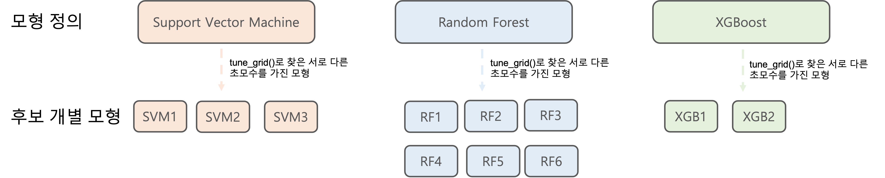
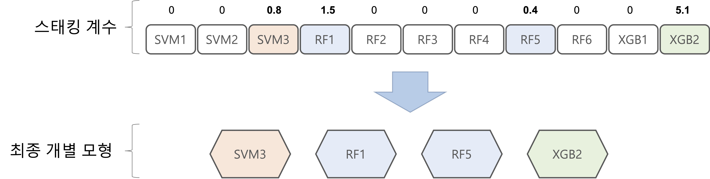

```{r setup, include=FALSE}
knitr::opts_chunk$set(echo = TRUE)
options(width=200)
```


```{css, echo=FALSE}

p, ul, li{
text-align: justify
}

```


> Package `tidymodels (Ver 0.2.0)`는 R에서 머신러닝(Machine Learning)을 `tidyverse principle`로 수행할 수 있게끔 해주는 패키지 묶음이다. 특히, 모델링에 필요한 필수 패키지들을 대부분 포함하고 있기 때문에 데이터 전처리부터  시각화, 모델링, 예측까지 모든 과정을 `tidy framework`로 진행할 수 있다. 또한, Package `caret`을 완벽하게 대체하며 보다 더 빠르고 직관적인 코드로 모델링을 수행할 수 있다. 
Package `tidymodels`를 이용하여 `Stacking`을 수행하는 방법을 설명하기 위해 "Heart Disease Prediction" 데이터를 예제로 사용한다. 이 데이터는 환자의 심장병을 예측하기 위해 총 918명의 환자에 대한 10개의 예측변수로 이루어진 데이터이다(출처 : Package MLDataR, Gary Hutson 2021). 여기서 **Target**은 `HeartDisease`이다.

<center>
  {width=85%}
</center>

<br />

<center>
  {width=70%}
</center>


<br />

> Stacking을 위한 개별 모형 : `Support Vector Machine`, `Random Forest`, `XGBoost`

----------

# **1. 데이터 불러오기**

```{r}
# install.packages("tidymodels")
pacman::p_load("MLDataR",                                              # For Data
               "data.table", "magrittr",
               "tidymodels",
               "stacks",                                               # For Stacking
               "doParallel", "parallel")

registerDoParallel(cores=detectCores())


data(heartdisease)
data <- heartdisease %>%
  mutate(HeartDisease = ifelse(HeartDisease==0, "no", "yes"))


cols <- c("Sex", "RestingECG", "Angina", "HeartDisease")

data   <- data %>% 
  mutate_at(cols, as.factor)                                        


glimpse(data)                                                          
```

`Caution!` 스태킹에서 이진 분류 문제인 경우, 관심 클래스가 Target의 두 번째 Level이기 때문에 이에 맞게 설정하는 것이 필요하다.


-----------

# **2. 데이터 분할**

```{r}
set.seed(100)                                                          
data.split <- initial_split(data, prop = 0.7, strata = HeartDisease)   
HD.train   <- training(data.split)
HD.test    <- testing(data.split)
```

-----------

# **3. Stacking**

- 스태킹(Stacking)은 여러 개별 모형을 서로 결합해 예측 결과를 도출한다는 점에서 배깅(Bagging) 및 부스팅(Boosting)과 유사하나, 스태킹은 `개별 모형의 예측 결과를 메타 데이터셋`으로 만들어 메타 모형에 적용하다는 점에서 차별화 된다.
    - 즉, 개별 모형의 예측 결과를 메타 모형의 예측변수로 사용한다.
        - 메타 모형의 예측변수 개수 $=$ 개별 모형의 개수가 된다.
- R에서 Package `tidymodels`를 이용하여 스태킹을 구현하기 위해 Package `stacks`을 추가로 설치해야 하며, 스태킹을 수행하기 위해 다음과 같은 과정을 따른다.
    1. Package `recipes, parsnip, workflows, rsample, tune`을 사용하여 후보가 될 수 있는 개별 모형들을 구축한다.
    2. 함수 `stack()`를 사용하여 `Data Stack`를 초기화한다. 여기서 `Data Stack`은 `tibble` 형태이다.
    3. 2번에서 초기화한 `Data Stack`에 후보 개별 모형들의 예측 결과를 추가하기 위해 함수 `add_candidates()`를 사용한다. 그러면, `Data Stack`은 첫 번째 열은 `Assessment` 그룹의 실제 Target을, 나머지 열은 각 후보 개별 모형들의 예측 결과를 나타내는 객체가 된다. 즉, `Data Stack`은 위에서 언급한 메타 데이터셋과 같다.   
    4. 메타 데이터셋 `Data Stack`에 대한 모델링을 수행하기 위해 함수 `blend_prediction()`를 사용한다. 메타 모형으로 정규화된 일반화 선형 모형(LASSO 또는 Ridge 등)을 사용하기 때문에 스태킹은 후보 개별 모형의 예측 결과를 선형 결합하여 최종 예측을 도출한다. 이때 스태킹 계수(Weight)를 추정하기 위해 패널티(Penalty) 항이 추가된 음의 로그 우도 함수를 손실 함수로 사용한다.
    5.  스태킹 계수(Weight)가 0이 아닌 후보 개별 모형은 스태킹을 위한 최종 개별 모형으로 선택되며, 분할되지 않은 전체 Training Data를 이용하여 최종 개별 모형에 대한 모델링을 수행하기 위해 함수 `fit_members()`를 사용한다.  
    6. 함수 `predict()`를 사용하여 Test Data에 대한 결과를 예측한다.

<center>
  {width=70%}
</center>

-----------

## **3-1. fit_resamples()를 이용한 Stacking**


- 각 모형의 모수(Hyperparameter)를 `직접 설정`했을 때 스태킹을 수행하는 방법이다.

-----------

### **3-1-1. 후보 개별 모형 정의 및 평가**


- Package `recipes, parsnip, workflows, rsample`을 사용하여 후보 개별 모형 Support Vector Machine, Random Forest, XGBoost 모형을 정의한다.

-----------

#### **3-1-1-1. 전처리 정의**

- `workflow`를 위해 `recipes`를 이용하여 전처리를 정의한다.


```{r}
rec  <- recipe(HeartDisease ~ ., data = HD.train) %>%                  # recipe(formula, data)
  step_normalize(all_numeric_predictors()) %>%                         
  step_dummy(all_nominal_predictors(), one_hot = TRUE)                 
```

-----------

#### **3-1-1-2. 모형 정의**

- `parsnip`를 이용하여 모형을 정의한다.

```{r}
# Support Vector Machine (Kernel : Radial Basis Function)
svm.rbf.mod <- svm_rbf(cost      = 2.95,                               
                       rbf_sigma = 0.00460) %>%                        
  set_mode("classification") %>%                                       
  set_engine("kernlab")                                                


svm.rbf.mod %>% 
  translate()
```


```{r}
# Random Forest
rf.mod <- rand_forest(mtry  = 5,                                       
                      trees = 551,                                     
                      min_n = 5) %>%                                   
  set_mode("classification") %>%                                       
  set_engine("randomForest" ,                                          
             importance = TRUE)


rf.mod %>%
  translate()
```

```{r}
# XGBoost
xgb.mod <- boost_tree(mtry           = 12,                             
                      trees          = 881,                           
                      tree_depth     = 9,                              
                      learn_rate     = 0.00250,                        
                      min_n          = 2,                              
                      loss_reduction = 1.88,                           
                      sample_size    = 0.628,                          
                      stop_iter      = 10) %>%                         
  set_mode("classification") %>%                                       
  set_engine("xgboost")                                                           


xgb.mod %>% 
  translate()
```

-----------

#### **3-1-1-3. Workflow 정의**

- 함수 [`workflow_set()`](https://workflowsets.tidymodels.org/reference/workflow_set.html)를 이용하여 전처리와 모형 조합에 대한 `Workflow`를 쉽게 만들 수 있다.

```{r}
ml.models <- workflow_set(preproc = list(basic = rec),                 
                          models  = list(svm  = svm.rbf.mod,          
                                         rf   = rf.mod,  
                                         xgb  = xgb.mod),   
                          cross = TRUE)                                

ml.models                                                           
```

`Result!` 총 3개의 Workflow가 생성되었다.

-----------

#### **3-1-1-4. Resampling**

- `rsample`을 이용하여 Resampling을 수행한다.
    - Resampling 방법은 Training Data를 `Analysis` 그룹과 `Assessment` 그룹으로 나누어 `Analysis` 그룹을 이용하여 모형을 구축하고 `Assessment` 그룹을 이용하여 구축된 모형을 평가하는 과정을 반복한다.
    - 이때 스태킹을 위해 `Assessment` 그룹에 대한 예측 결과를 저장해야 한다.
        - K-Fold Cross-Validation은 Training Data의 Data Point가 `Assessment` 그룹으로 한 번만 분류되기 때문에 각 Data Point에 대한 예측 결과도 한 개이다.
        - 만약, Data Point가 여러 번 `Assessment` 그룹으로 분류되어 예측 결과가 여러 개 생성되면 평균을 내어 Data Point당 한 개의 예측 결과만 나타나도록 한다.

<center>
  {width=85%}
</center>


```{r}
ml.models.re <- ml.models %>%
  workflow_map("fit_resamples",                                             
               seed = 100, verbose = TRUE,                                  # Options to workflow_map()
               # Options to fit_resamples() 
               resamples = vfold_cv(HD.train, v = 5),                       
               control   = control_resamples(save_pred = TRUE,              
                                             parallel_over = "everything",  
                                             save_workflow = TRUE),        
               metrics = metric_set(roc_auc, accuracy))                    

ml.models.re   
```

`Caution!` 분류 문제인 경우, 후보 개별 모형마다 각 클래스에 대한 예측 결과들이 저장된다.

-----------

### **3-1-2. 메타 모형 구축을 위한 데이터 셋 생성(후보 개별 모형의 예측 결과 추가)**

- `Data Stack`은 `tibble` 형태로 첫 번째 열은 `Assessment` 그룹의 실제 Target이고 나머지 열은 각 후보 개별 모형의 예측 결과이며, 메타 모형을 구축하는 데 사용되는 데이터셋이다. 
    - 학습을 위한 메타 모형의 Target 변수는 `Assessment` 그룹의 실제 Target 변수이다.

#### **3-1-2-1. Data Stack 객체 초기화**

- 함수 `stacks()`를 이용하여 후보 개별 모형의 예측 결과를 저장하기 위한 `Data Stack` 객체를 먼저 생성한다. 

```{r}
stack.condidate <- stacks()                                            
stack.condidate
```

-----------

#### **3-1-2-2. Data Stack에 후보 개별 모형의 예측 결과 추가**

- 위에서 생성한 `Data Stack`에 함수 `add_candidates()`를 이용하여 후보 개별 모형들의 예측 결과를 추가한다. 

```{r}
stack.condidate %<>%                                        
  add_candidates(ml.models.re)                                        
stack.condidate
```


```{r}
as_tibble(stack.condidate)                                             
```

`Result!` 첫 번째 열은 `Assessment` 그룹의 실제 Target이며, 두 번째 열부터 후보 개별 모형들의 예측 결과를 나타낸다.

-----------

### **3-1-3. 메타 모형 적합**

- `후보 개별 모형들의 예측 결과`는  `정규화된 일반화 선형 모형을 활용하여 선형 결합`한다.
    - 즉, 정규화된 일반화 선형 모형이 메타 모형으로 사용된다.
    - 정규화된 일반화 선형 모형은 회귀(Regression) 문제인 경우 선형 모형, 이진 분류(Binary Classification) 문제인 경우 로지스틱 모형, 다중 분류(Multinomial Classification) 문제인 경우 다중 로지스틱 모형이 된다.
- 구체적으로, 정규화된 일반화 선형 모형의 계수를 추정하기 위해 사용되는 손실 함수는 음의 로그 우도 함수에 `패널티` 항이 추가되어 있다.
    - 패널티 항의 종류는 `L1 Regularization` 과 `L2 Regularization` 그리고 `Elastic Net`이 있다.
    - 후보 개별 모형들의 `예측 결과들은 서로 상관관계가 매우 높은 경향`이 있기 때문에 영향을 미치지 않는 모형을 제외하는 `L1 Regularization`를 사용하는 것이 유용하다.


```{r}
set.seed(100)
ens <- blend_predictions(stack.condidate,
                         penalty = 10^(-2:-1),                        
                         mixture = 1,                                 
                         non_negative = TRUE)                         
ens  
```

`Caution!` 이진 분류 문제인 경우, 첫 번째 클래스(Level)에 대한 예측 확률을 제외한다. 그렇기 때문에 관심 클래스가 두 번째 클래스가 되도록 설정해줘야 한다. 이 예제에서 `HeartDisease`의 두 번째 클래스는 "yes"이므로 "yes"대한 예측 확률을 이용하여 결합한다.  
`Result!` 후보 개별 모형들의 "스태킹 계수(Weight)"가 모두 0이 아니므로, 모든 후보 개별 모형들의 예측 결과를 결합하여 최종 예측 결과를 도출한다.


```{r}

autoplot(ens) +
  theme_bw()


autoplot(ens, "weights") +
  geom_text(aes(x = weight + 0.01, label = model), hjust = 0) +
  theme_bw() + 
  theme(legend.position = "none") +
  lims(x=c(-0.01, 80))
```

`Caution!` Bootstraps Resampling 방법을 이용하여 최적의 패널티 값을 찾는다.


```{r}
ens[["equations"]][["prob"]][[".pred_yes"]]
```

-----------

### **3-1-4. 최종 개별 모형 적합**

- "스태킹 계수(Weight)"가 0이 아닌 후보 개별 모형들은 스태킹을 위한 최종 개별 모형으로 선택되며, 전체 Training Data를 이용하여 선택된 최종 개별 모형을 구축하기 위해 함수 `fit_members()`를 사용한다.


```{r}
set.seed(100)
fit.ens <- fit_members(ens)                                          
fit.ens
```

-----------

### **3-1-5. 예측**

```{r}
ens.pred <- predict(fit.ens, HD.test) %>%                                    # predict(, type = "class" / "prob")
  bind_cols(HD.test)
ens.pred
```

```{r}

classification_metrics <- metric_set(accuracy, mcc, 
                                     f_meas, kap,
                                     sens, spec)                             # Assessment Measure
classification_metrics(ens.pred, truth = HeartDisease,                       
                       estimate = .pred_class)              


member_preds <- HD.test %>%
  select(HeartDisease) %>%
  bind_cols(predict(fit.ens, HD.test, members = TRUE))                       # predict(, members = TRUE)
member_preds
```

`Caution!` 함수 `predict(, members = TRUE)`를 통해 구축된 최종 개별 모형들의 Test Data에 대한 예측 결과를 출력할 수 있다.


```{r}
map_dfr(member_preds, 
        accuracy,                                                                             
        truth = HeartDisease, data = member_preds) %>%               
  mutate(member = colnames(member_preds))
member_preds

# Ref. https://www.hfshr.xyz/posts/2020-11-30-model-stacking/
multi_metric <- metric_set(accuracy, kap)

map_dfr(
  member_preds,
  ~ multi_metric(
    member_preds,
    truth = HeartDisease,                                                   
    estimate = .x
  ),
  .id = "model"
) %>%
  select(model, .metric, .estimate) %>%
  pivot_wider(names_from = .metric, values_from = .estimate) %>%
  filter(model != "HeartDisease") %>%                                        
  mutate(model = if_else(model == ".pred_class", "model_stack", model)) %>% 
  arrange(desc(accuracy)) %>% 
  mutate(across(where(is.numeric), round, 2))
```

-----------

## **3-2. tune_grid()를 이용한 Stacking**

- 각 모형의 모수를 함수 `tune_grid()`로 찾을 때 스태킹을 수행하는 방법이다.

<center>
  {width=85%}
</center>


-----------

### **3-2-1. 후보 개별 모형 정의 및 평가**

- Package `recipes, parsnip, workflows, rsample`을 사용하여 후보 개별 모형 Support Vector Machine, Random Forest, XGBoost를 정의하고자 한다.

-----------

#### **3-2-1-1. 전처리 정의**

- `workflow`를 위해 `recipes`를 이용하여 전처리를 정의한다.

```{r}
rec  <- recipe(HeartDisease ~ ., data = HD.train) %>%                  # recipe(formula, data)
  step_normalize(all_numeric_predictors()) %>%                         
  step_dummy(all_nominal_predictors(), one_hot = TRUE)                 
```

-----------

#### **3-2-1-2. 모형 정의**

- `parsnip`를 이용하여 모형을 정의한다.

```{r}
# Support Vector Machine (Kernel : Radial Basis Function)
svm.rbf.mod <- svm_rbf(cost      = tune(),                            
                       rbf_sigma = tune()) %>%                         
  set_mode("classification") %>%                                      
  set_engine("kernlab")                                                


svm.rbf.mod %>% 
  translate()
```


```{r}
# Random Forest
rf.mod <- rand_forest(mtry  = tune(),                                 
                      trees = tune(),                                  
                      min_n = tune()) %>%                              
  set_mode("classification") %>%                                       
  set_engine("randomForest" ,                                          
             importance = TRUE)


rf.mod %>%
  translate()
```

```{r}
# XGBoost
xgb.mod <- boost_tree(mtry           = tune(),                               
                      trees          = tune(),                         
                      tree_depth     = tune(),                         
                      learn_rate     = tune(),                         
                      min_n          = tune(),                         
                      loss_reduction = tune(),                         
                      sample_size    = tune(),                         
                      stop_iter      = tune()) %>%                    
  set_mode("classification") %>%                                       
  set_engine("xgboost")                                                  


xgb.mod %>% 
  translate()
```

-----------

#### **3-2-1-3. Workflow 정의**

- 함수 [`workflow_set()`](https://workflowsets.tidymodels.org/reference/workflow_set.html)를 통해 전처리와 모형 조합에 대한 `Workflow`를 쉽게 만들 수 있다.

```{r}
ml.models <- workflow_set(preproc = list(basic = rec),                
                          models  = list(svm  = svm.rbf.mod,          
                                         rf   = rf.mod,  
                                         xgb  = xgb.mod),   
                          cross = TRUE)                                

ml.models                                                             
```

`Result!` 총 3개의 Workflow가 생성되었다.

-----------

#### **3-2-1-4. 모수 범위 업데이트**

- `Random Forest`와 `XGBoost`의 경우 `mtry`는 상한이 `?`로 설정되어 있으므로 함수 `update()`를 이용하여 범위 수정을 해야 한다.

```{r}
rf.param <- extract_parameter_set_dials(rf.mod) %>%                          
  update(mtry =  mtry(c(1, 
                        ncol(select(juice(prep(rec)), -HeartDisease))  
  ))) 

# rf.param %>%
#   extract_parameter_dials("mtry")

xgb.param <- extract_parameter_set_dials(xgb.mod) %>%                          
  update(mtry =  mtry(c(1, 
                        ncol(select(juice(prep(rec)), -HeartDisease))  
  ))) 

ml.models %<>%
  option_add(param_info = rf.param, id  = "basic_rf") %>%
  option_add(param_info = xgb.param, id = "basic_xgb")

ml.models 
```

`Result!` "basic_rf"와 "basic_xgb"의 `option`열이 `opts[1]`로 바뀌었다.

-----------

#### **3-2-1-5. 모수 튜닝**

- 함수 `tune_grid()`를 이용하여 최적의 모수 조합을 찾기 위해 먼저 후보 모수 집합을 설정해야한다.
    - `grid` 옵션을 통해 각 모형마다 후보 모수 집합을 랜덤하게 찾을 수 있다. 
- 각 후보 모수 집합에 대해 `rsample`을 이용하여 Resampling을 수행한다. 
    - Resampling 방법은 Training Data를 `Analysis` 그룹과 `Assessment` 그룹으로 나누어 `Analysis` 그룹을 이용하여 모형을 구축하고 `Assessment` 그룹을 이용하여 구축된 모형을 평가하는 과정을 반복한다.
    - 이때 스태킹을 위해 `Assessment` 그룹에 대한 예측 결과를 저장해야 한다.
        - K-Fold Cross-Validation은 Training Data의 Data Point가 `Assessment` 그룹으로 한 번만 분류되기 때문에 각 Data Point에 대한 예측 결과도 한 개이다.
        - 만약, Data Point가 여러 번 `Assessment` 그룹으로 분류되어 예측 결과가 여러 개 생성되면 평균을 내어 Data Point당 한 개의 예측 결과만 나타나도록 한다.

<center>
  {width=85%}
</center>

<br />

```{r}
ml.models.tune <- ml.models %>%
  workflow_map("tune_grid",                                                 
               seed = 100, verbose = TRUE,                                  # Options to workflow_map()
               # Options to tune_grid() 
               grid = 10,                                                   
               resamples = vfold_cv(HD.train, v = 5),                      
               control   = control_grid(save_pred = TRUE,                   
                                        parallel_over = "everything",       
                                        save_workflow = TRUE),              
               metrics = metric_set(roc_auc, accuracy))                    
ml.models.tune        
```

`Caution!` 분류 문제인 경우, 후보 개별 모형마다 각 클래스에 대한 예측 결과들이 저장된다.

-----------

### **3-2-2. 메타 모형 구축을 위한 데이터 셋 생성(후보 개별 모형의 예측 결과 추가)**

- `Data Stack`은 `tibble` 형태로 첫 번째 열은 `Assessment` 그룹의 실제 Target이고 나머지 열은 각 후보 개별 모형의 예측 결과이며, 메타 모형을 구축하는 데 사용되는 데이터셋이다. 
    - 학습을 위한 메타 모형의 Target 변수는 `Assessment` 그룹의 실제 Target 변수이다.

#### **3-2-2-1. Data Stack 객체 초기화**

- 함수 `stacks()`를 이용하여 후보 개별 모형의 예측 결과를 저장하기 위한 `Data Stack` 객체를 먼저 생성한다.  

```{r}
stack.condidate <- stacks()                                         
stack.condidate
```

-----------

#### **3-2-2-2. Data Stack에 후보 개별 모형의 예측 결과 추가**

- 위에서 생성한 `Data Stack`에 함수 `add_candidates()`를 이용하여 후보 개별 모형들의 예측 결과를 추가한다. 

```{r}
stack.condidate %<>%                                        
  add_candidates(ml.models.tune)                                      
stack.condidate
```

`Result!` [모수 튜닝][**3-2-1-5. 모수 튜닝**]에서 각 모형마다 10개의 다른 모수 집합을 찾았기 때문에 30(10 $\times$ 3(모형 개수))개의 후보 개별 모형이 추가되었다.

```{r}
as_tibble(stack.condidate)                                             
```

`Result!` 첫 번째 열은 `Assessment` 그룹의 실제 Target이며, 두 번째 열부터 후보 개별 모형들의 예측 결과를 나타낸다.

```{r}
collect_parameters(stack.condidate, "basic_rf")                                           
```

`Caution!` 함수 `collect_parameters()`를 이용하여 후보 개별 모형의 모수 값을 확인할 수 있다.

-----------

### **3-2-3. 메타 모형 적합**

- `후보 개별 모형들의 예측 결과`는  `정규화된 일반화 선형 모형을 활용하여 선형 결합`한다.
    - 즉, 정규화된 일반화 선형 모형이 메타 모형으로 사용된다.
    - 정규화된 일반화 선형 모형은 회귀(Regression) 문제인 경우 선형 모형, 이진 분류(Binary Classification) 문제인 경우 로지스틱 모형, 다중 분류(Multinomial Classification) 문제인 경우 다중 로지스틱 모형이 된다.
- 구체적으로, 정규화된 일반화 선형 모형의 계수를 추정하기 위해 사용되는 손실 함수는 음의 로그 우도 함수에 `패널티` 항이 추가되어 있다.
    - 패널티 항의 종류는 `L1 Regularization` 과 `L2 Regularization` 그리고 `Elastic Net`이 있다.
    - 후보 개별 모형들의 `예측 결과들은 서로 상관관계가 매우 높은 경향`이 있기 때문에 영향을 미치지 않는 모형을 제외하는 `L1 Regularization`를 사용하는 것이 유용하다.


```{r}
set.seed(100)
ens <- blend_predictions(stack.condidate,
                         penalty = 10^(-2:-1),                         
                         mixture = 1,                                 
                         non_negative = TRUE)                          
ens     
```

`Caution!` 이진 분류 문제인 경우, 첫 번째 클래스(Level)에 대한 예측 확률을 제외한다. 그렇기 때문에 관심 클래스가 두 번째 클래스가 되도록 지정해줘야 한다. 이 예제에서 `HeartDisease`의 두 번째 클래스는 "yes"이므로 "yes"대한 예측 확률을 이용하여 결합한다.  
`Result!` "스태킹 계수(Weight)"가 0이 아닌 모델은 총 2개이다. 즉, 30개의 후보 개별 모형들 중 2개의 후보 개별 모형들의 예측 결과만을 결합하여 최종 예측 결과를 도출한다.


```{r}
autoplot(ens) +
  theme_bw()

autoplot(ens, "weights") +
  geom_text(aes(x = weight + 0.01, label = model), hjust = 0) +
  theme_bw() + 
  theme(legend.position = "none") +
  lims(x = c(-0.01, 2.5)) 
```

`Caution!` Bootstraps Resampling 방법을 이용하여 최적의 패널티 값을 찾는다.

```{r}
ens[["equations"]][["prob"]][[".pred_yes"]]
```

-----------

### **3-2-4. 최종 개별 모형 적합**

- "스태킹 계수(Weight)"가 0이 아닌 후보 개별 모형들은 스태킹을 위한 최종 개별 모형으로 선택되며, 전체 Training Data를 이용하여 선택된 최종 개별 모형을 구축하기 위해 함수 `fit_members()`를 사용한다.

<center>
  {width=85%}
</center>

<br />

```{r}
set.seed(100)
fit.ens <- fit_members(ens)                                          
fit.ens
```


```{r}
fit.ens$member_fits$basic_rf_1_07 %>%
  extract_fit_engine()
```

`Caution!` 함수 `extract_fit_engine()`를 통해 구축된 모형을 확인할 수 있다.

-----------

### **3-2-5. 예측**

```{r}
classification_metrics <- metric_set(accuracy, mcc, 
                                     f_meas, kap,
                                     sens, spec)                            
classification_metrics(ens.pred, truth = HeartDisease,                   
                       estimate = .pred_class)              


member_preds <- HD.test %>%
  select(HeartDisease) %>%
  bind_cols(predict(fit.ens, HD.test, members = TRUE))                       # predict(, members = TRUE)
member_preds
```


`Caution!` 함수 `predict(, members = TRUE)`를 통해 구축된 최종 개별 모형들의 Test Data에 대한 예측 결과를 출력할 수 있다.


```{r}
map_dfr(member_preds, 
        accuracy,                                                                                
        truth = HeartDisease, data = member_preds) %>%                     
  mutate(member = colnames(member_preds))
member_preds

# Ref. https://www.hfshr.xyz/posts/2020-11-30-model-stacking/
multi_metric <- metric_set(accuracy, kap)

map_dfr(
  member_preds,
  ~ multi_metric(
    member_preds,
    truth = HeartDisease,                                                   
    estimate = .x
  ),
  .id = "model"
) %>%
  select(model, .metric, .estimate) %>%
  pivot_wider(names_from = .metric, values_from = .estimate) %>%
  filter(model != "HeartDisease") %>%                                        
  mutate(model = if_else(model == ".pred_class", "model_stack", model)) %>%  
  arrange(desc(accuracy)) %>% 
  mutate(across(where(is.numeric), round, 2))
```


