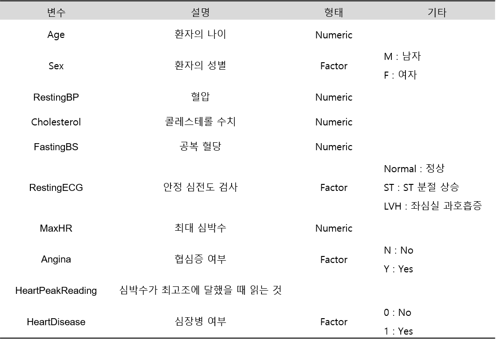
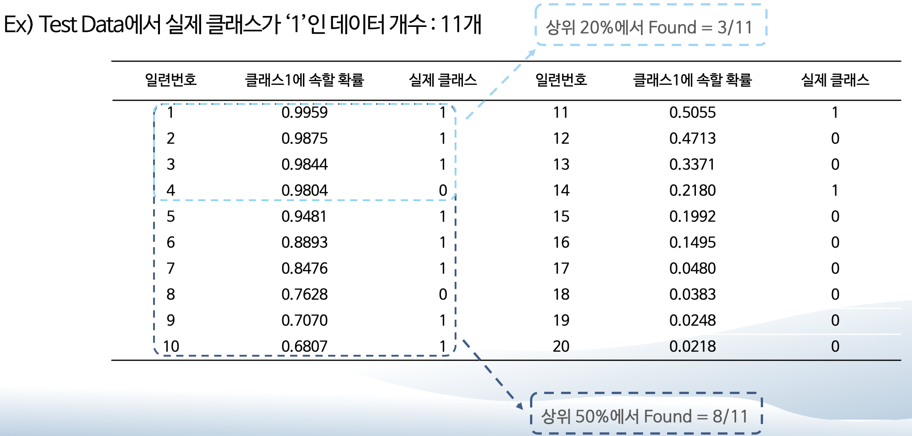

```{r setup, include=FALSE}
knitr::opts_chunk$set(echo = TRUE)
options(width=200)
```

```{css, echo=FALSE}

p, ul, li{
text-align: justify
}

```

> Package `tidymodels (Ver 0.2.0)`는 R에서 머신러닝(Machine Learning)을 `tidyverse principle`로 수행할 수 있게끔 해주는 패키지 묶음이다. 특히, 모델링에 필요한 필수 패키지들을 대부분 포함하고 있기 때문에 데이터 전처리부터  시각화, 모델링, 예측까지 모든 과정을 `tidy framework`로 진행할 수 있다. 또한, Package `caret`을 완벽하게 대체하며 보다 더 빠르고 직관적인 코드로 모델링을 수행할 수 있다.


](./image/tidyverse.png)

](./image/tidymodel2.png)

<br />

> Package `tidymodels`를 이용하여 `머신러닝을 수행하는 방법`을 설명하기 위해 "Heart Disease Prediction" 데이터를 예제로 사용한다. 이 데이터는 환자의 심장병을 예측하기 위해 총 918명의 환자에 대한 10개의 예측변수로 이루어진 데이터이다(출처 : Package MLDataR, Gary Hutson 2021). 여기서 **Target**은 `HeartDisease`이다.

<center>
  {width=85%}
</center>

<br />

<center>
  {width=70%}
</center>

<br />

> `Ver.1`과의 차이점으로는 `Workflow`를 이용한다는 점이다.

----------


# **1. 데이터 불러오기**

```{r}
# install.packages("tidymodels")
pacman::p_load("MLDataR",                                              # For Data
               "data.table", "magrittr",
               "tidymodels",
               "doParallel", "parallel")

registerDoParallel(cores=detectCores())


data(heartdisease)
data <- heartdisease %>%
  mutate(HeartDisease = ifelse(HeartDisease==0, "no", "yes"))


cols <- c("Sex", "RestingECG", "Angina", "HeartDisease")

data   <- data %>% 
  mutate_at(cols, as.factor)                                           # 범주형 변수 변환

glimpse(data)                                                          # 데이터 구조
```

-----------

# **2. 데이터 분할**

- `tidymodels` 안에는 다양한 Package들이 포함되어 있는데 데이터 분할은 Package `rsample`에 있는 함수 `initial_split()`를 이용한다.
    
```{r}
set.seed(100)                                                          # seed 고정
data.split <- initial_split(data, prop = 0.7, strata = HeartDisease)   # initial_split(, strata = 층화추출할 변수)
HD.train   <- training(data.split)
HD.test    <- testing(data.split)
```

-----------

# **3. Workflow**

- `Workflow`는 전처리와 모형 적합을 함께 묶을 수 있는 객체이다.
    - 즉, `Recipe (전처리)`와 `parsnip (모형 적합)`을 `workflow`로 결합한다.
- 따라서, 데이터 전처리와 모형 적합을 따로 수행하지 않고 `workflow`를 이용하여 한 번에 모형을 구축할 수 있다.     
- `Workflow`는 쉽게 전처리 과정을 더하거나 뺄 수 있다.
- `Workflow`는 [`Resampling`][**6. Resampling 방법**] 또는 [`모수 튜닝`][**7. 모수 튜닝**]을 사용할 경우 필수적으로 사용된다.
- 게다가, `다양한 모형에 다른 전처리 과정`을 적용할 때 유용하며, 이것은 함수 [`workflow_set()`](https://workflowsets.tidymodels.org/reference/workflow_set.html)를 통해 전처리와 모형 조합을 쉽게 만들 수 있다.

-----------

## **3-1. Recipe 정의**

- 데이터 전처리는 Package `recipes`를 이용한다.
- Package `recipes`를 이용하여 전처리를 정의하는 방법은 다음과 같다.
    1. Target과 예측변수에 대해 함수 `recipe()`로 명시한다.
        - 함수 `recipe()` 이용
    2. 함수 `step_*()` 이용하여 전처리 과정을 정의한다.
        - 각 변수에 적용할 수 있는 전처리 함수는 [여기](https://recipes.tidymodels.org/reference/index.html)를 잠조한다.

```{r}
rec <- recipe(HeartDisease ~ ., data = HD.train) %>%
  step_normalize(all_numeric_predictors()) %>%                       # 모든 수치형 예측변수들을 표준화
  step_dummy(all_nominal_predictors(), one_hot = TRUE)               # 모든 범주형 예측변수들에 대해 원-핫 인코딩 더미변수 생성
```

-----------

## **3-2. 모형 정의**

- 모형을 구축하기 위해 모형을 먼저 정의한다.
    - 모형을 정의하기 위해 `모형 타입(Type)`과 `모형 종류(set_mode)` 그리고 `사용할 패키지(set_engine)`가 필요하다. 
        - 모형 타입 : 사용하고자하는 머신러닝 함수 정의  
            - 예를 들어, Random Forest는 함수 `rand_forest()`를 사용한다.
        - 모형 종류 : Target 유형 정의 
            - 분류(Classification) 또는 회귀(Regresssion) 중 하나를 선택한다.
        - 사용할 패키지 : 사용하고자하는 Package 정의
            - Random Forest는 Package `randomForest`, `ranger`, `spark`를 사용할 수 있다.
- Package `tidymodels`에서 사용할 수 있는 모형은 [여기](https://www.tidymodels.org/find/parsnip/)를 참조한다.

```{r}
rf.mod <- rand_forest(mtry = 12, trees = 100) %>%                    # 모형 특정 -> 어떤 모형을 사용하겠다 정의
  set_mode("classification") %>%                                     # Target 유형 정의(classification /  regression)
  set_engine("randomForest",                                         # 사용하고자하는 패키지 정의(randomForest / ranger / spark)
             importance = TRUE)                                      # randomForest 패키지의 함수에 대한 옵션 지정
```

-----------

## **3-3. Workflow 정의**

- 위에서 정의한 [Recipe 정의][**3-1. Recipe 정의**]와 [모형 정의][**3-2. 모형 정의**]를 하나로 묶는다.
    - 함수 `update_model()`는 다른 모형을 적용할 경우 사용한다.
    - workflow는 함수 `add_*()`, `remove_*()`, `update*()`를 이용하여 다양하게 변형할 수 있으며, 자세한 내용은  [여기](https://workflows.tidymodels.org/)와 [여기](https://workflows.tidymodels.org/reference/workflow.html)를 참조한다.


```{r}
rf.wflow <- workflow() %>%                                             # Workflow 정의
  add_recipe(rec) %>%                                                  # 3-1에서 정의 : Recipe 추가
  add_model(rf.mod)                                                    # 3-2에서 정의 : 모형 추가

rf.wflow
```

`Caution!` 함수 `add_formula()`는 [Recipe 정의][**3-1. Recipe 정의**]에서 `formula`를 정의했기 때문에 사용할 필요가 없다. 만약, Recipe에서 정의를 하지 않았다면 함수 `add_formula()`를 이용하여 정의를 해야 한다.

-----------

## **3-4. 모형 적합**

```{r}
set.seed(100)  
rf.wflow.fit <- fit(rf.wflow, data = HD.train)
rf.wflow.fit
```

- 함수 `extract_fit_engine()`를 통해 구축된 모형을 확인할 수 있다. 

```{r}
rf.wflow.fit %>% 
  extract_fit_engine()                                                 
```


------------

# **4. 예측**

- 예측 및 모형 평가는 [3-4. 모형 적합][**3-4. 모형 적합**]에서 얻은 적합 결과 `rf.wflow.fit`을 이용한다.

## **4-1. 예측 클래스**

```{r}
rf.pred.class <- predict(rf.wflow.fit, HD.test)
rf.pred.class
```

------------

## **4-2. 예측 확률**

```{r}
rf.pred.prob  <- predict(rf.wflow.fit, HD.test, type = "prob")
rf.pred.prob
```

------------

## **4-3. 모든 예측 결과 출력**

- 함수 `augment()`를 이용해서 예측 클래스와 예측 확률을 포함한 결과를 한 번에 출력할 수 있다.

```{r}
rf.pred <- augment(rf.wflow.fit, HD.test)
rf.pred

rf.pred %>%
  select(contains(".pred"))                                      # 예측 결과들만 추출
```

------------ 

# **5. 모형 평가**

](./image/Evaluation-measures.png)

- 분류와 회귀에 사용될 수 있는 척도는 [여기](https://yardstick.tidymodels.org/articles/metric-types.html)를 참조한다.
- 자세한 예제는 [여기](https://www.tmwr.org/performance.html#binary-classification-metrics)를 참조한다.

-----------

## **5-1. 척도**

### **5-1-1. ConfusionMatrix**

```{r}
conf_mat(rf.pred, truth = HeartDisease, estimate = .pred_class)        # truth : 실제 클래스,  estimate : 예측 클래스
```

```{r}
conf_mat(rf.pred, truth = HeartDisease, estimate = .pred_class) %>%
  autoplot(type = "mosaic")                                            # autoplot(type = "heatmap") 
```

------------ 

### **5-1-2. Accuracy**

```{r}
accuracy(rf.pred, truth = HeartDisease, estimate = .pred_class)        # truth : 실제 클래스,  estimate : 예측 클래스
```

------------

### **5-1-3. 여러 척도를 한 번에 나타내기**

- 함수 `metric_set()`를 통해 여러 척도를 한 번에 나타낼 수 있다. 함수의 자세한 옵션은 [여기](https://yardstick.tidymodels.org/articles/metric-types.html)를 참조한다.

```{r}
classification_metrics <- metric_set(accuracy, mcc, 
                                     f_meas, kap,
                                     sens, spec, roc_auc)              # Test Data에 대한 Assessment Measure
classification_metrics(rf.pred, 
                       truth = HeartDisease, estimate = .pred_class,   # truth : 실제 클래스, estimate : 예측 클래스
                       .pred_yes, event_level = "second")              # For roc_auc                       
```

`Caution!` "ROC AUC"를 계산하기 위해서는 관심 클래스에 대한 예측 확률이 필요하다. 예제 데이터에서 관심 클래스는 "yes"이므로 "yes"에 대한 예측 확률 결과인 `.pred_yes`가 사용되었다. 또한, Target인 "HeartDisease" 변수의 유형을 "Factor" 변환하면 알파벳순으로 클래스를 부여하기 때문에 관심 클래스 "yes"가 두 번째 클래스가 된다. 따라서 옵션 `event_level = "second"`을 사용하여 관심 클래스가 "yes"임을 명시해주어야 한다.   

------------

## **5-2. 그래프**

<div class=text-justify> 

`Caution!` 함수 "roc_curve(), gain_curve(), lift_curve(), pr_curve()"에서는 첫번째 클래스(Level)를 관심 클래스로 인식한다. R에서는 함수 `Factor()`를 이용하여 변수 유형을 변환하면 알파벳순(영어) 또는 오름차순(숫자)으로 클래스를 부여하므로 "HeartDisease" 변수의 경우 "no"가 첫번째 클래스가 되고 "yes"가 두번째 클래스가 된다. 따라서, 예제 데이터에서 관심 클래스는 "yes"이기 때문에 옵션 `event_level = "second"`을 사용하여 관심 클래스가 "yes"임을 명시해주어야 한다.

</div>

### **5-2-1. ROC Curve**

```{r}
rf.pred %>% 
  roc_curve(truth = HeartDisease, .pred_yes,                           # truth : 실제 클래스,  관심 클래스 예측 확률 
            event_level = "second") %>%                                
  autoplot()
```


------------

### **5-2-2. Gain Curve**

- Gain Curve는 관심 클래스 대비 해당 분위수에서의 관심 클래스 비율을 나타낸 그래프이다.   

```{r}
rf.pred %>% 
  gain_curve(truth = HeartDisease, .pred_yes,                          # truth : 실제 클래스,  관심 클래스 예측 확률 
             event_level = "second") %>%                               
  autoplot()
```

`Caution!` 관심 클래스의 예측 확률을 내림차순으로 정렬한 후 그래프로 나타낸다. 함수 `gain_curve()`에 대한 자세한 설명은 [여기](https://yardstick.tidymodels.org/reference/gain_curve.html)를 참조한다.  
`Result!` x축인 `%Tested`은 Test Data의 분위수이며, y축인 `%Found`은 관심 클래스 대비 해당 분위수에서의 관심 클래스 비율(즉, 해당 분위수에서의 관심 클래스 빈도 / Test Data에서의 관심 클래스 빈도)을 나타낸다. 그리고 `회색 영역의 삼각형`은 'Perfect' Gain Curve으로 정확도가 100%인 모형에 대한 Gain Curve이다.

<center>
  {width=70%}
</center>

-----------

### **5-2-3. Lift Curve**

- Lift Curve는 전체 반응률 대비 해당 분위수의 반응률를 나타낸 그래프이다.   

```{r}
rf.pred %>% 
  lift_curve(truth = HeartDisease, .pred_yes,                          # truth : 실제 클래스,  관심 클래스 예측 확률 
             event_level = "second") %>%                               
  autoplot()
```

`Caution!` 관심 클래스의 예측 확률을 내림차순으로 정렬한 후 그래프로 나타낸다. 함수 `lift_curve()`에 대한 자세한 설명은 [여기](https://yardstick.tidymodels.org/reference/lift_curve.html)를 참조한다.  
`Result!` x축인 `%Tested`은 Test Data의 분위수이며, y축인 `Lift`는 전체 관심 클래스 비율 대비 해당 분위수의 관심 클래스 비율(함수 `gain_curve()`의 `y축 %Found`)을 `x축 %Tested`으로 나눈 값(함수 `gain_curve()`의 `y축 %Found`/`x축 %Tested`)을 나타낸다. 

<center>
  {width=70%}
</center>

-----------

### **5-2-4. Precision Recall Curve**

```{r}
rf.pred %>% 
  pr_curve(truth = HeartDisease, .pred_yes,                            # truth : 실제 클래스,  관심 클래스 예측 확률 
           event_level = "second") %>%                                 
  autoplot()
```


-----------

# **6. Resampling 방법**

- Resampling 방법은 Training Data의 일부를 모형 구축에 사용하고 구축된 모형을 평가하기 위해 또 다른 일부를 사용하는 과정을 반복한다. 이러한 방법은 모형의 성능을 측정하기 위해 사용되며, [모수 튜닝][**7. 모수 튜닝**]에서 최적의 모수 조합을 찾을 때 사용한다.

](./image/resampling.svg)

- 위의 그림처럼 Training Data를 `Analysis` 그룹과 `Assessment` 그룹으로 분할한다.
    - `Analysis` 그룹 : 모형을 구축하기 위해 사용하는 데이터셋
    - `Assessment` 그룹 : 구축된 모형을 평가하기 위해 사용하는 데이터셋
- 만약, Resampling 방법을 통해 20개의 모형이 구축되면 모형 평가 척도값도 20개가 나온다. 
- 이러한 경우, 최종 모형 평가 척도값은 20개의 평균을 사용한다.
    - 이 방법은 일반화 특성이 매우 우수한 것으로 알려져 있다.

-----------

## **6-1. K-Fold Cross-Vailidation**

<center>
](./image/three-cv.svg)
</center>

](./image/three-cv-iter.svg)

- K-Fold Cross Validation은 Training Data를 K개의 Fold로 나눈 후, K-1개의 Fold(`Analysis` 그룹)를 이용하여 모형을 구축하고 1개의 Fold(`Assessment` 그룹)를 이용하여 구축된 모형을 평가한다.
- 총 K번을 반복하기 때문에 K개의 평가 척도값이 계산된다.


```{r, eval = FALSE}
set.seed(100)
vfold_cv(data, v)      
```

- `data` : Data Frame 형태의 (Training) Data
- `v` : Fold 개수

-----------

## **6-2. Repeated K-Fold Cross-Vailidation**

- [K-Fold Cross-Vailidation][**6-1. K-Fold Cross-Vailidation**]를 반복하는 Resampling 방법이다.

```{r, eval = FALSE}
vfold_cv(data, v, repeats)     
```

- `data` : Data Frame 형태의 (Training) Data
- `v` : Fold 개수
- `repeats` : K-Fold Cross-Vailidation 반복 수

-----------

## **6-3. Leave-One-Out Cross-Validation**

- Training Data에서 오직 한 개의 Data Point만을 이용하여 평가하고 나머지 Data Point들을 이용하여 모형을 구축한다.
- 총 데이터 개수만큼 반복하기 때문에 평가 척도값도 데이터 개수만큼 계산된다.


```{r, eval = FALSE}
loo_cv(data)   
```

- `data` : Data Frame 형태의 (Training) Data

-----------

## **6-4. Monte Carlo Cross-Validation**

- Training Data를 랜덤하게 `Analysis` 그룹과 `Assessment` 그룹으로 나눈다.
- 따라서, 한 개의 Data Point가 `Assessment` 그룹으로 여러 번 선택될 수 있다.

```{r, eval = FALSE}
mc_cv(data, prop, times) 
```

- `data` : Data Frame 형태의 (Training) Data
- `prop` : `Analysis` 그룹의 비율
- `times` : Resampling 반복 수

-----------

## **6-5. Validation Set**

](./image/validation.svg)

- 전체 Data를 Test Data와 Not Test Data로 나누고, Not Test Data는 `Training Data`와 `Validation Data`로 나눈다.
    - `Training Data` : 모형을 구축하기 위해 사용하는 데이터셋
    - `Validation Data` : 구축된 모형을 평가하기 위해 사용하는 데이터셋
    
```{r, eval = FALSE}
validation_split(data, prop)
```
 
- `data` : Data Frame 형태의 (Not Test) Data
- `prop` : `Training Data`의 비율


-----------

## **6-6. Bootstrapping**

- Training Data에서 중복을 허용하면서 랜덤하게 Training Data와 똑같은 크기의 `Analysis` 그룹을 만든다.
    - 중복을 허용했기 때문에, `Analysis` 그룹에 한 개의 Data Point가 여러 번 선택될 수 있다.
- `Analysis` 그룹에 포함되지 않은 Data Point는 `Assessment` 그룹으로 분류되어 구축된 모형을 평가하는 데 사용된다.

```{r, eval = FALSE}
bootstraps(data, times)   
```

- `data` : Data Frame 형태의 (Training) Data
- `times` : Resampling 반복 수

-----------

## **6-7. Resampling 방법을 이용한 모형 적합**

- 예를 위해, 위에서 소개한 Resampling 방법 중 가장 많이 사용되는 [K-Fold Cross-Validation][**6-1. K-Fold Cross-Vailidation**]을 이용한다.

`Caution!` Resampling 방법을 통해 계산된 `Assessment` 그룹의 평가 척도값이 Workflow를 사용하지 않았을 때(tidymodels_Ver.1)와 결과가 다르다. 그래서, [모수 튜닝][**7. 모수 튜닝**]을 할 때, Workflow를 사용하지 않았을 때와 최적의 모수 조합이 다를 수 있다.

-----------

### **6-7-1. Resampling 방법 정의**

```{r}
set.seed(100)                                                          # seed 고정
train.fold <- vfold_cv(HD.train, v = 5)          
train.fold
```

`Caution!` 데이터를 먼저 5개의 Fold로 나눈 후, `Analysis` 그룹의 Dataset(4개의 Fold에 속한 513명의 환자)을 이용하여 모형을 구축하고 `Assessment` 그룹의 Dataset(1개의 Fold에 속한 129명의 환자)을 이용하여 구축된 모형을 평가한다.

-----------

### **6-7-2. 모형 적합**

- Resampling 방법을 적용한 결과는 함수 `fit_resamples()`를 이용하여 확인할 수 있다.

```{r}
set.seed(100)
rf.fit.rs <- workflow() %>%                                            # Workflow 정의
  add_recipe(rec) %>%                                                  # 3-1에서 정의
  add_model(rf.mod) %>%                                                # 3-2에서 정의
  fit_resamples(resamples = train.fold)                                # 6-7-1에서 정의 : Resampling 방법 적용 

rf.fit.rs
```

`Caution!` 위에서 생성된 "rf.fit.rs"는 "fit_resamples(preprocessor = rec, object = rf.mod, resamples = train.fold)"와 동일한 결과를 출력한다.  
`Result!` `.metrics`열은 `Assessment` 그룹의 평가 척도값이 포함되어 있으며, `.notes`열은 Resampling 동안에 생성되는 에러나 경고를 포함한다.

```{r}
# Assessment 그룹에 대한 평균 Assessment Measure
collect_metrics(rf.fit.rs)     
```


```{r}
# 각 Assessment 그룹에 대한 Assessment Measure
collect_metrics(rf.fit.rs, summarize = FALSE)  
```

`Caution!` 함수 `collect_metrics(, summarize = FALSE)`을 이용하면 각 `Assessment` 그룹에 대한 모형 평가 척도값을 확인할 수 있다.

-----------

### **6-7-3. 각 Fold에 대한 결과**

- 함수 `control_resamples()`를 이용하여 `Assessment` 그룹에 대한 예측 결과를 저장할 수 있다.

```{r}
re.control <- control_resamples(save_pred = TRUE,                      # Resampling의 Assessment 결과 저장
                                parallel_over = "everything")          # 병렬 처리(http:://tune.tidymodels.org/reference/control_grid.html)
set.seed(100)
workflow() %>%  
  add_recipe(rec) %>%                                                  # 3-1에서 정의
  add_model(rf.mod) %>%                                                # 3-2에서 정의
  fit_resamples(resamples = train.fold,                                # 6-7-1에서 정의 : Resampling 방법 적용 
                control = re.control) %>%      
  collect_predictions()
```

`Caution!` 함수 `collect_predictions()`을 이용하면 각 `Assessment` 그룹에 대한 예측 결과를 확인할 수 있다.

-----------

# **7. 모수 튜닝**

- 모형을 구축하기 위해서는 모수를 먼저 명시해줘야 한다.
- 최적의 모수 조합을 찾기 위해, 후보 모수 집합에 대해 [Resampling][**6. Resampling 방법**] 방법을 적용하여 각 후보 모수 집합에 대한 모형을 평가한다.

-----------

## **7-1. Regular Grid**

- Package `dials`에 있는 함수 `grid_regular()`를 이용한다.
- 모수별로 후보 모수값들을 지정한 후 조합을 생성한다.
    - 예를 들어, Random Forest의 경우 `mtry = 2, 4`, `trees = 100, 200`, `min_n = 5, 6` 처럼 모수별로 후보 모수값을 먼저 지정한 후 이에 대한 조합 {(`mtry`, `trees`, `min_n`) : (2, 100, 5), (2, 100, 6), (2, 200, 5), (2, 200, 6), (4, 100, 5), (4, 100, 6), (4, 200, 5), (4, 200, 6)}을 생성한다.

```{r, eval = FALSE}
grid_regular(x, levels)                                    
```

- `x` : param 객체, 리스트 또는 모수
- `levels` : 각 모수에 대한 후보 개수

-----------

## **7-2. Irregular Grid**

### **7-2-1. Random Grid**

- 후보 모수 집합을 랜덤하게 생성한다.

```{r, eval = FALSE}
grid_random(x, size)                                    
```

- `x` : param 객체, 리스트 또는 모수
- `size` : 후보 모수 집합 개수

-----------

### **7-2-2. Latin Hypercube**

- [Random Grid][**7-2-1. Random Grid**]와 같이 후보 모수 조합을 랜덤하게 생성을 하지만, 모수 공간이 중복될 가능성이 가장 낮은 랜덤 조합을 찾기 때문에 [Random Grid][**7-2-1. Random Grid**]보다 더 효율적이다.

```{r, eval = FALSE}
grid_latin_hypercube(x, size)                                    
```

- `x` : param 객체, 리스트 또는 모수
- `size` : 후보 모수 집합 개수

-----------

## **7-3. Expand Grid**

- 모수별로 직접 후보값을 할당한다.

```{r, eval = FALSE}
expand.grid(...)                                    
```

- `...` : 모수 이름과 후보값을 벡터 또는 범주로 지정

-----------

## **7-4. 모수 튜닝을 이용한 모형 적합**

- [Latin Hypercube][**7-2-2. Latin Hypercube**]로 후보 모수 집합을 랜덤하게 생성한 후, [K-Fold Cross-Validation][**6-1. K-Fold Cross-Vailidation**]을 이용하여 각 후보 모수의 조합에 대해 평가한다.

-----------

### **7-4-1. 모형 정의**

- 모형에서 튜닝하고 싶은 모수는 함수 `tune()`으로 지정한다.

```{r}
rf.tune.mod <- rand_forest(mtry = tune(), trees = tune()) %>%          # Tuning 하고 싶은 모수를 tune() 으로 설정
  set_mode("classification") %>%                                         
  set_engine("randomForest")     

# Workflow 정의 
rf.tune.wflow <- workflow() %>%
  add_model(rf.tune.mod) %>%                                           
  add_recipe(rec)                                                      # 3-1에서 정의
```

-----------

### **7-4-2. 모수 범위 확인**

- 함수 `extract_parameter_set_dials()`를 이용하여 모수들의 정보를 확인한다.

```{r}
rf.param    <- extract_parameter_set_dials(rf.tune.wflow)               
rf.param                                                                 
```

`Result!` `object`열에서 `nparam`은 모수값이 수치형임을 나타낸다. 또한, `nparam[+]`는 해당 모수의 범위가 명확하게 주어졌음을 의미하고, `nparam[?]`는 모수의 범위에서 상한 또는 하한의 값이 명확하지 않다는 것을 의미한다. 이러한 경우, 상한 또는 하한의 값을 명확하게 결정하여야 한다.   


```{r}
rf.param %>%
  extract_parameter_dials("mtry")                                       
```

`Caution!` 함수 `extract_parameter_dials()`를 이용하여 모수 범위를 자세히 확인할 수 있다.  
`Result!` `mtry`의 상한이 `?`이므로 상한값을 결정하여야 한다.

-----------

### **7-4-3. 모수 범위 수정**

- 모수의 범위를 수정하는 방법은 두 가지가 있다.
    1. 함수 `update()`를 이용하여 상한값과 하한값을 직접 할당한다.
        - `update(모수 이름 = 모수 이름(c(하한, 상한)))`
    2. 함수 [`finalize()`](https://dials.tidymodels.org/reference/finalize.html)를 이용하여 데이터셋을 기반으로 한 자동화 방법을 통해 상한값과 하한값을 결정한다. 

```{r}
# 1. 직접 할당하는 방법
## 전처리가 적용된 데이터의 예측변수 개수가 상한이 되도록 설정
rf.param %<>%
  update(mtry =  mtry(c(1, 
                        ncol(select(juice(prep(rec)), -HeartDisease)) # juice(prep(rec)) : Recipe 적용 -> 전처리가 적용된 데이터셋 생성, ncol(select(., -Target)) : 전처리가 적용된 데이터의 예측변수 개수
  ))) 

# ## 2. 데이터 기반으로 ?를 수정함
# rf.param %<>%
#   finalize(HD.train)                                                 # 상한이 HD.train의 변수 개수 10개로 수정됨 

rf.param %>%
  extract_parameter_dials("mtry")                                     
```

`Result!` `mtry`의 상한이 `13`으로 수정되었다.

-----------

### **7-4-4. 후보 모수 집합에 대한 모형 평가**

- 함수 `tune_grid()`를 이용하여 각 후보 모수 조합에 대한 모형 평가를 한다.
- 예를 위해, 각 후보 모수 조합에 대해 5-Cross-Validation을 적용하여 모형 평가를 한다.

```{r}
set.seed(100)
train.fold <- vfold_cv(HD.train, v = 5)                                # 5-Cross-Validation                              
                           
                       
set.seed(100)
rf.tune.fit <- rf.tune.wflow %>%                                       # 7-4-1에서 정의 : Workflow
  tune_grid(                                                           # 함수 tune_grid 
    resamples = train.fold,                                            # 위에서 정의한 Resampling -> 5-Cross-Validation
    grid =  rf.param %>%                                               # 후보 모수 집합 
      grid_latin_hypercube(size = 10),
    control = control_grid(save_pred = TRUE,                           # Resampling의 Assessment 결과 저장
                           parallel_over = "everything")               # 병렬 처리(http:://tune.tidymodels.org/reference/control_grid.html) 
    # metrics = metric_set(roc_auc, accuracy)                            # Assessment 그룹에 대한 Assessment Measure
  )

rf.tune.fit

```

`Caution!` 위에서 생성된 "rf.tune.fit"은 "tune_grid(preprocessor = rec, object = rf.tune.mod, resamples = train.fold, grid =  rf.param %>% grid_latin_hypercube(size = 10), control = control_grid(save_pred = TRUE, parallel_over = "everything"))"와 동일한 결과를 출력한다.


```{r}
# Assessment 그룹에 대한 평균 Assessment Measure
collect_metrics(rf.tune.fit)
```

`Result!` 각 후보 모수 조합별로 성능을 확인할 수 있다. 평가 척도는 기본적으로 "Accuracy"와 "ROC AUC"이다.

```{r}
# 그래프
autoplot(rf.tune.fit) + 
  scale_color_viridis_d(direction = -1) + 
  theme(legend.position = "top") + 
  theme_bw()
```

-----------

### **7-4-5. 최적의 모수 조합 확인**

- 함수 `show_best()`를 이용하여 예측 성능이 좋은 모형을 `내림차순`으로 확인할 수 있다.
- 함수 `select_best()`를 이용하여 성능이 `가장 좋은` 최적의 모수 조합을 확인할 수 있다.
- 아래 예제는 "ROC AUC"를 기준으로 그 결과를 살펴본다.

```{r}
# Metric 기준으로 예측 성능이 우수한 모수 조합 순서대로 확인
show_best(rf.tune.fit, "roc_auc")                                      # show_best(, "accuracy")

# 최적의 모수 조합 확인
best.rf <- rf.tune.fit %>% 
  select_best("roc_auc")                                               # select_best("accuracy")
best.rf 
```

`Result!` `mtry = 2`, `trees = 681`일 때 "ROC AUC" 측면에서 모형의 예측 성능이 가장 좋다. 

-----------

### **7-4-6. 최적의 모수 조합을 이용한 모형 적합**

- 위에서 찾은 최적의 모수 조합을 이용하여 모형을 구축한다.
- 함수 `finalize_workflow()`을 이용하여 [7-4-1에서 정의한 "workflow"][**7-4-1. 모형 정의**]를 최적의 모수 조합을 가지는 "workflow"로 업데이트한다.

```{r}
final.rf.wflow <- rf.tune.wflow %>%                                    # 7-4-1에서 정의
  finalize_workflow(best.rf)                                           # finalize_workflow : 최적의 모수 조합을 가지는 workflow로 업데이트
final.rf.wflow
```


```{r}
# 모형 적합
set.seed(100)
final.rf.fit   <- final.rf.wflow %>% 
  fit(data = HD.train)
final.rf.fit

# 최종 모형
final.rf.fit %>% 
  extract_fit_engine()
```

-----------

## **7-5. 예측**

```{r}
pred <- augment(final.rf.fit, HD.test)                                 # predict(final.rf.fit, HD.test) 
pred
```

-----------

## **7-6. 모형 적합과 예측을 한 번에 하기**

- 함수 `last_fit()`를 이용하여 최적의 모수 조합에 대해 Training Data를 이용한 모형 적합과 Test Data에 대한 예측을 한 번에 수행할 수 있다.

```{r}
# Ref. https://github.com/tidymodels/tune/issues/300 (last_fit과 fit의 결과가 다름)
#      https://github.com/tidymodels/tune/pull/323 (last_fit seed X)

final.rf.last <- final.rf.wflow %>%
  last_fit(split = data.split)                                         # data.split : 데이터 분할할 때 initial_split에 의한 변수
final.rf.last

# 구축된 모형
final.rf.last %>%
  extract_fit_engine()

# 예측 결과
final.rf.last %>%
  collect_predictions()  

# Test Data에 대한 Assessment Measure
final.rf.last %>%
  collect_metrics()
```

`Caution!` 함수 `last_fit()`은 seed 고정이 되지 않아 Reproducibility (재생산성)가 만족되지 않는다.  

-----------

## **7-7. Bayesian Optimization**

- Bayesian 기법을 이용하여 `후보 모수 집합을 제안`하는 방법이다.
- 현재 Resampling 결과를 분석하고 `아직 평가되지 않은 모수 값을 제안하는 예측 모델`을 만든다.
- 주요 관심사는 모형에서 권장하는 `모수를 선택하는 방법`이다.
- 가장 일반적으로 사용되는 Gaussian Process (GP)를 고려하면, 위에서 설명된 Grid 방법에 의해 생성되는 초기 모수 집합의 Metric에 다변량 가우시안 분포를 가정한다.
    - GP에 대한 독립변수 입력은 모수 값이며, 후보 모수의 Metric에 대한 평균과 분산을 예측한다.
    - 위에서 설명된 Grid 방법에 의해 생성되는 초기 모수 집합에 기초하여 GP를 적합하고, 다음 후보 모수들이 예측되며, 그 중 평균과 분산 관점에서 가장 좋은 모수를 최종 후보 모수로 둔다.
- 각 모수에 대해 사전 분포로 가우시안 분포를 가정한다.
- [모수 모형을 평가할 때][**7-4-4. 후보 모수 집합에 대한 모형 평가**] 함수 `tune_grid()` 대신 함수 `tune_bayes()`를 이용한다.
    - 함수 `tune_bayes()`에 대한 자세한 옵션은 [여기](https://tune.tidymodels.org/reference/tune_bayes.html)를 참조한다.
- Bayesian Optimization에 대한 자세한 설명은 [여기](https://www.tmwr.org/iterative-search.html)를 참조한다.

```{r, eval = FALSE}
tune_bayes(object, resamples, metrics, initial, param_info, iter, control)
```

- `object` : Workflow 또는 parsnip 모델
- `resamples` : Resampling 
- `metrics` : 성능에 대해 평가할 척도
- `initial` : `tune_grid()`의 결과 또는 초기값
- `param_info` : 모수의 범위
- `iter` : 검색의 최대 반복 수
- `control` : `control_bayes()`에 의해 생성되는 control 객체

```{r, eval = FALSE}
ctrl <- control_bayes(verbose = TRUE
                      # no_improve = 20,                                 # no_improve 반복 내에서 개선된 모수가 발견되지 않으면 검색을 중지
                      # uncertain = 4,                                   # uncertainty 반복 내에서 개선이 없을 경우 불확실성 표본을 추출하는 정수(또는 Inf) -> 변동이 큰 다음 후보가 선택됨/ 평균 예측을 고려하지 않기 때문에 순수 탐색의 효과가 있음
                      )

set.seed(100)
rf.tune.be <- rf.tune.wflow %>%
  tune_bayes(
    resamples  = train.fold,                                            # Resampling 방법
    metrics    = metric_set(roc_auc),                                   # Assessment 그룹에 대한 Assessment Measure
    initial    = rf.tune.fit,                                           # tune_grid()를 사용하여 생성된 객체/ 정수 / 초기값
    param_info = rf.param,                                              # 모수 범위
    iter       = 25,                                                    # 최대 검색 반복 수
    control    = ctrl
  )
```
