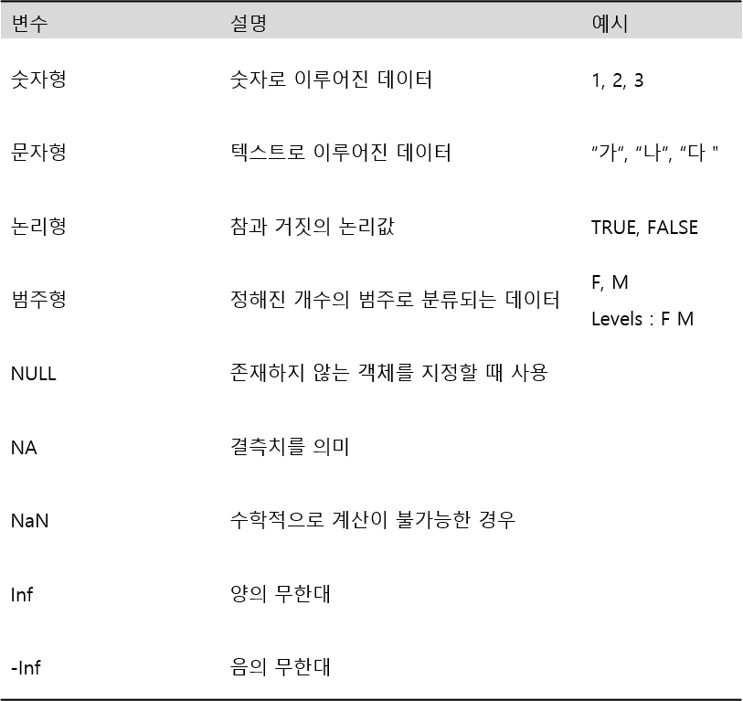

```{r setup, include=FALSE}
knitr::opts_chunk$set(echo = TRUE)
```

```{css, echo=FALSE}

p, ul, li{
text-align: justify
}

```

- **참고 : R과 통계분석(Tidyverse 활용), 박동련 저**

# **1. 데이터 유형**
<center>
{width=80%}
</center>

--------

## **1-1. 숫자형(Numeric)**

- 숫자로 구성된 데이터로 산술, 비교, 논리 연산이 모두 가능하다.
- 숫자 형태에 따라 `정수(Integer)`, `실수(Double)`, `복소수(Complex)`로 나뉜다.
    - `L` 기호를 사용하면 정수, 그렇지 않으면 실수로 간주한다.
    - `i` 기호를 사용하면 복소수의 허수로 간주한다. 

```{r}
# 정수(Integer)
x <- c(1, 2, 3, 4)
x
# 데이터 유형 확인
class(x)
```

`Caution!` 함수 `class()`로 데이터의 유형을 확인할 수 있으며, 그 외에도 함수 `typeof()`, 함수 `mode()`를 사용할 수 있다. 

--------

```{r}
# 실수(Double)
x <- c(0.1, 0.5, 0.8, 1.0)
x

# 데이터 유형 확인
class(x)
```

`Result!` 실수형은 함수 `class()`를 사용하면 `numeric`으로 출력한다. 

--------

```{r}
# 복소수(Complex)
x <- c(1+1i, 2+2i, 3+4i, 5+2i)
x

# 데이터 유형 확인
class(x)
```


--------

## **1-2. 문자형(Character)**

- 텍스트로 구성된 데이터로 `작은따옴표('텍스트')` 또는 `큰따옴표("텍스트")`로 표현한다.
- 산술, 논리 연산은 불가능하며, 비교 연산은 인코딩 형태에 따라 가능하다.

```{r}
x <- c("가", "나", "다")
x

# 데이터 유형 확인
class(x)
```

--------

```{r}
x <- c("1", "20", "30")
x

# 데이터 유형 확인
class(x)
```

`Result!` 숫자도 '10' 또는 "10"처럼 따옴표로 묶여 있으면 문자형이 된다.

--------

## **1-3. 논리형(Logical)**

- 참과 거짓의 논리값으로 `TRUE (T)`또는 `FALSE (F)`로 표현한다.
    - `TRUE (T)`는 참을 의미하고, `FALSE (F)`는 거짓을 의미한다.
    - 대소문자를 구분하기 때문에 `true` 또는 `false`와 다르다.
- `FALSE`는 `0`이고 `TRUE`는 `0 이외의 숫자`로 표현할 수 있다.
- 비교 연산이 가능하다.

<center>
{width=80%}
</center>
</br>

```{r}
x <- c(TRUE, FALSE)
x

# 데이터 유형 확인
class(x)
```

--------

```{r}
x <- c(T, F)
x

# 데이터 유형 확인
class(x)
```

--------

```{r}
x <- 3 > 2
x

# 데이터 유형 확인
class(x)
```

--------

```{r}
# 산술 연산
x <- TRUE
y <- FALSE
z <- TRUE

sum(c(x, y, z))
```

`Caution!` R에서 `TRUE`는 숫자 1을 나타내고 `FALSE`는 숫자 0으로 인식한다.  
`Result!` $x+y+z=1+0+1=2$를 출력한다.

--------

## **1-4. 범주형(Categorical)**

- 정해진 몇 개의 범주로 분류되는 데이터를 의미한다.
- 범주형은 크게 범주의 순서 여부에 따라 명목척도와 순위척도로 나뉜다.
    - 명목 척도 : 범주에 순서가 존재하지 않는 경우 
        - 예 : 성별, 혈액형 등
    - 순서척도 : 범주에 순서가 존재하는 경우
        - 예 : 학년
- 범주형 데이터는 함수 `factor()`를 사용하며, 일반적으로 범주(Levels)는 알파벳 순서 또는 오름차순으로 자동 지정된다.        
        
```{r}
# 명목척도
x <- factor(c("F", "M", "F"))
x

# 데이터 유형 확인
class(x)
```

--------

```{r}
# 범주 순서 바꾸기
x <- factor(c("F", "M", "F"), levels = c("M", "F"))
x

# 데이터 유형 확인
class(x)
```

--------

```{r}
# 순서척도 Ver.1
x <- factor(c("1", "2", "3"), ordered = TRUE)
x

# 데이터 유형 확인
class(x)
```

--------

```{r}
# 순서척도 Ver.2
x <- ordered(c("1", "2", "3"), levels = c("1", "2", "3"))
x

class(x)
```

`Caution!` 순서척도는 함수 `ordered()`를 사용하여 생성할 수도 있다.

--------

## **1-5. 특수한 상태를 나타내는 형태**

| |
|:--------|:--------|
| NULL    | 존재하지 않는 객체를 지정할 때 사용 |  
| NA      | Not Available의 약자로 결측치(Missing Value)를 의미 |  
| NaN     | Not a Number의 약자로 수학적으로 연산이 불가능한 경우를 의미 | 
| Inf     | Infinite의 약자로 양의 무한대를 의미 |
| -Inf    | 음의 무한대를 의미 |
| |


```{r}
# NULL
x <- c(90, 80, 75, 60, NULL)
x
length(x)
```

`Result!` R에서 `NULL`은 값이 없다고 생각하기 때문에 출력되지 않으며 x의 길이는 4가 된다.

--------

```{r}
# NA
x<- c(90, 80, 75, 60, NA)
x
length(x)
```

`Result!` R에서 `NA`는 `NULL`과 다르게 값이 출력되며 x의 길이는 5가 된다.

--------

```{r}
# NaN
0/0
```

--------

```{r}
# Inf
1/0
```

--------

```{r}
# -Inf
-1/0
```


--------

## **1-6. 데이터 유형 확인**

- 함수 `is.데이터 유형()`을 이용하여 데이터 유형을 확인할 수 있다.
    - 출력값은 논리값 `TRUE` 또는 `FALSE`이다.

<center>
{width=80%}
</center>
</br>

```{r}
x <- c(1, 3, 5)
is.double(x)
is.integer(x)
is.numeric(x)
is.character(x)
is.logical(x)
```

---------

```{r}
x <- c("1", "3", "5")
is.numeric(x)
is.character(x)
```

--------

```{r}
x <- c(TRUE, FALSE)
is.numeric(x)
is.logical(x)
```

--------

```{r}
x <- factor(c("사과", "포도", "수박"))
is.character(x)
is.factor(x)
```

--------

## **1-7. 데이터 유형 변환**

- 함수 `as.데이터 유형()`을 이용하여 데이터 유형을 변환할 수 있다.

<center>
{width=80%}
</center>
</br>


```{r}
x <- c(1, 0, 3, 5)
is.integer(x)

# 정수형 변환
y <- as.integer(x)
y
is.integer(y)

# 문자형 변환
z <- as.character(x)
z
is.character(z)

# 범주형 변환
xx <- as.factor(x)
xx
is.factor(xx)

# 논리형 변환
yy <- as.logical(x)
yy
```

`Result!` 0 이외의 숫자는 `TRUE`, 0은 `FALSE`로 변환한다.

```{r}
is.logical(yy)
```

--------

# **2. 데이터 구조**

<div class=text-justify>

- `벡터(Vector)`, `행렬(Matrix)`, `배열(Array)`은 동일한 유형의 데이터를 원소로 가지는 반면, `데이터 프레임(Data Frame)`과 `리스트(List)`는 서로 다른 유형의 데이터를 원소로 가질 수 있다. 

</div>

{width=100%}

</br>


--------

## **2-1. 벡터(Vector)**

- 벡터는 하나의 변수를 나타내기 위한 것으로써 1차원으로 배열된 데이터 구조이다.
- 벡터를 구성하고 있는 원소는 모두 동일한 유형이어야 한다.
- 벡터는 함수 `c()`를 이용하여 생성한다.

### **2-1-1. 벡터 생성**

```{r}
x <- 3
x
```

`Caution!` 원소가 하나인 벡터를 스칼라(Scalar)라고 하며, 스칼라를 만들 때에는 함수 `c()`를 사용하지 않아도 된다.

--------

```{r}
x <- c(1, 2, 6, 10, 11, 103)
x
```

--------

```{r}
x <- c(TRUE, FALSE, TRUE, TRUE)
x
```

--------

```{r}
x <- c("가", "나", "다", "라")
x
```

--------

`Caution!` 다른 유형의 데이터가 벡터에 뒤섞여 있다면 더 복잡한 형태의 유형으로 강제 변환되며, 복잡한 유형은 문자형(Character) $>$ 복소수형(Complex) $>$ 숫자형(Numeric) $>$ 논리형(Logical)이다. 

```{r}
# 다른 유형으로 구성된 벡터
x <- c(1, 3, "가")
x

# 데이터 유형 확인
class(x)

```

`Result!` 숫자형과 문자형으로 구성된 벡터는 문자형 데이터로 통일된다.

--------

```{r}
# 다른 유형으로 구성된 벡터
x <- c(TRUE, "가", "다")
x

# 데이터 유형 확인
class(x)
```

`Result!` 논리형과 문자형으로 구성된 벡터는 문자형 데이터로 통일된다.

--------

```{r}
# 다른 유형으로 구성된 벡터
x <- c(1, 3, TRUE)
x

# 데이터 유형 확인
class(x)
```

`Result!` 논리형과 숫자형으로 구성된 벡터는 숫자형 데이터로 통일된다.

--------

### **2-1-2. 벡터에 데이터 추가 및 벡터들의 결합**

- 기존의 벡터에 추가적으로 데이터를 덧붙이는 작업이나 벡터들을 결합하는 작업은 함수 `c()`를 이용하여 할 수 있다.

```{r}
# 데이터 추가
x <- c(1, 3, 5)
y <- c(x, 10)
y
```

--------

```{r}
# 벡터들의 결합
x <- c(11, 12, 14)
y <- c(2, 3, 1)
z <- c(x, y)
z
```

--------

### **2-1-3. 일정한 구조를 갖는 벡터의 생성**

- `콜론(:) 연산자` 또는 함수 `seq()`를 이용하여 일정한 간격이 있는 자료를 쉽게 생성할 수 있다.
    - `콜론(:) 연산자`는 연산자의 왼쪽 숫자에서 시작하여 오른쪽 숫자를 초과하지 않을 때까지 1씩 증가하는 수열을 생성한다.
        만약, 왼쪽의 숫자가 오른쪽의 숫자보다 크면 1씩 감소하는 수열을 생성한다.
    - 함수 `seq(from, to, by)`는 `from`에서 `to`까지 `by`만큼 증가(감소)하여 간격이 일정한 수열을 생성한다.    
- 함수 `rep()`를 이용하여 반복된 패턴이 있는 자료를 간편하게 생성할 수 있다.
    - 옵션 `times`는 데이터 전체를 지정된 횟수만큼 반복시키며, 옵션 `each`는 데이터의 요소들이 각각 each번 반복한다.

```{r}
# 콜론 연산자
1:5

-3:3

1.5:5.4

5:-3
```

--------

```{r}
# seq
seq(from = 1, to = 10, by = 3)
seq(from = 6, to = 0, by = -2)
seq(from = 1, to = 6, by = 1.8)
```

--------

```{r}
# rep
rep(1, times = 2)
rep(1:5, times = 5)
rep(c("M", "F"), times = 3)
rep(c("M", "F"), times = c(5, 8))


rep(1:5, each = 5)
rep(1:5, each = c(4, 10, 2, 3, 6))
rep(c("M", "F"), each = 3)
```

--------

### **2-1-4. 벡터의 연산**

- 벡터와 스칼라의 연산은 벡터의 모든 원소와 스칼라와의 연산이 이루어진다.
- 벡터와 벡터의 연산은 대응되는 원소끼리 이루어진다.

```{r}
# 벡터와 스칼라의 연산
x <- c(1, 10, 3, 4, 6)

x+3
x-3
x*3
x/3
x^3
```

--------

```{r}
# 벡터와 벡터의 연산
x <- c(1, 10, 3, 4, 6)
y <- c(9, 3, 2, 11, 4)

x+y
x-y
x*y
x/y
x^y
```

--------

### **2-1-5. 벡터의 인덱싱**

- 벡터의 인덱싱(Indexing)이란 벡터의 일부분만을 선택하는 것을 의미한다.
- 하나의 `대괄호[]`를 인덱싱 기호로 사용한다.


```{r}
x <- c(5, 9, 10, 3, 1, 8)
x[c(1, 4, 3)]
```

`Result!` 벡터 x의 1, 4, 3번째 자리의 원소만 출력한다.

--------

```{r}
x[-c(1, 4, 3)]
```

`Result!` 벡터 x의 1, 4, 3번째 자리의 원소를 제외한 원소들을 출력한다.

--------

```{r}
x[10]
```

`Result!` 지정한 위치가 벡터의 길이보다 크기 때문에 결측값인 `NA`를 출력한다.

--------

```{r}
x[x>3]
```

`Result!` 논리형 벡터에 의한 인덱싱의 경우에는 `TRUE`인 자료가 선택된다.

--------

## **2-2. 행렬(Matrix)과 배열(Array)**

- 1차원 구조인 벡터에 부가적인 속성 중 하나인 차원(Dimension)이 추가되면 이차원 구조인 행렬이나 다차원 구조인 배열이 된다.
- 행렬과 배열도 원소는 모두 동일한 유형이어야 한다.

--------

### **2-2-1. 행렬 생성**

- 행렬은 함수 `matrix()`를 이용하여 생성한다.
    - 행렬로 전환될 벡터를 먼저 입력하고 이어서 행과 열의 개수를 옵션 `nrow`와 `ncol`를 이용하여 각각 지정할 수 있다.
        - 벡터가 먼저 입력되어 행렬을 구성하는 요소의 전체 개수가 주어진 상태이므로, 옵션 `nrow` 혹은 `ncol` 둘 중 하나만 사용해도 된다.
    - 옵션 `byrow`를 이용하여 행 단위로 벡터를 채울 것인지 지정할 수 있다.
        - Default는 `byrow = FALSE`로 열 단위로 벡터가 채워진다.
        
```{r}
x <- matrix(c(1, 3, 10, 5, 3, 9, 6, 7), nrow = 4)
x
```

--------
        
```{r}
x <- matrix(c(1, 3, 10, 5, 3, 9, 6, 7), nrow = 4, byrow = TRUE)
x
```

--------

`Caution!` 행렬 생성에 유용하게 사용되는 또 다른 함수로 함수 `cbind()`와 `rbind()`가 있다. 함수 `cbind()`는 기존의 벡터들을 열 단위로 묶어서 행렬을 만들 때 사용할 수 있고, 함수 `rbind()`는 벡터들을 행 단위로 묶어서 행렬을 구성할 때 사용할 수 있다. 또한, 두 함수는 기존의 행렬에 열 또는 행을 추가하는 경우에도 사용할 수 있다.

```{r}
# 행렬 생성
x <- c(1, 4, 6)
y <- c(10, 8, 7)

cbind(x, y)
rbind(x, y)
```

--------

```{r}
# 기존의 행렬에 열 또는 행 추가
x <- c(1, 4, 6)
y <- c(10, 8, 7)

z <- cbind(x, y)

cbind(z, u = 1:3)
rbind(z, 5:6)
```

--------

`Caution!` 함수 `cbind()`와 `rbind()`를 사용할 때 결합 대상이 되는 벡터들의 길이가 서로 다르면 순환법칙이 적용된다.

```{r}
x <- c(1, 4, 6, 5, 2)
y <- c(10, 8)
z <- 10

cbind(x, y, z)
```

`Result!` y와 z의 원소들이 x의 원소 길이에 맞추어 반복되었다.

--------

`Caution!` 함수 `rownames()`와 `colnames()`로 행렬의 행과 열에 이름을 붙일 수 있다.

```{r}
x <- c(1, 4, 6)
y <- c(10, 8, 7)

z <- cbind(x, y)
rownames(z) <- c("a", "b", "c")
colnames(z) <- c("one", "two")
z
```

--------

`Caution!` 함수 `nrow()`, `ncol()`, `dim()`으로 행렬의 행, 열, 차원을 확인할 수 있다.

```{r}
x <- c(1, 4, 6)
y <- c(10, 8, 7)

z <- cbind(x, y)

nrow(z)
ncol(z)
dim(z)
```

--------

### **2-2-2. 행렬의 연산**

<center>
{width=80%}
</center>
</br>

```{r}
x <- matrix(1:4, nrow = 2, byrow = TRUE)
y <- matrix(c(5, 10, 8, 3), nrow = 2, byrow = TRUE)

x
y

x+y
x-y
x/y
x*y

# 행렬곱
x%*%y

# 각 열의 평균
colMeans(x)

# 각 열의 합
colSums(x)

# 각 행의 평균
rowMeans(x)

# 각 행의 합
rowSums(x)

# 행렬의 대각원소
diag(x)

# 대각행렬
diag(1:4)

# 항등행렬
diag(5)

# 고유값과 고유벡터
eigen(x)

# 역행렬
solve(x)

# 전치행렬
t(x)


```


--------

### **2-2-3. 배열 생성**

- 배열은 형렬을 몇 겹으로 쌓은 다차원 구조로, 함수 `array()`를 이용하여 생성한다.
- 배열은 다차원 구조이므로 각 차원에 대한 정의가 함수 함수 `array()` 안에 포함되어야 한다.
- 배열은 행렬로 전환될 벡터가 먼저 입력되고 배열의 차원이 `c(행 개수, 열 개수, 행렬 개수)` 벡터로 입력된다.

```{r}
x <- array(1:4, c(2, 3, 3))
x
```

`Result!` 벡터 1, 2, 3, 4를 이용하여 행의 개수가 2이고, 열의 개수가 3인 행렬이 3개 생성되었다.

--------

```{r}
x <- array(1:24, c(4, 3, 2))
x
```

`Result!` 벡터 1~24를 이용하여 행의 개수가 4이고, 열의 개수가 3인 행렬이 2개 생성되었다.

--------

`Caution!` 각 차원에 대한 이름은 함수 `dimnames()`로 붙일 수 있으며, 문자형 벡터들도 이루어진 리스트를 할당해야 한다.

```{r}
dimnames(x) <- list(X = c("x1", "x2", "x3", "x4"), Y = c("y1", "y2", "y3"), Z = c("z1", "z2"))
x
```

--------

### **2-2-4. 행렬과 배열의 인덱싱**

- 벡터와 동일하게 행렬에서도 데이터의 일부분을 선택하는 인덱싱을 수행할 수 있다.
    - 행렬의 경우, `[행번호, 열번호]`로 원소를 선택할 수 있다.
    - 배열의 경우, `[행번호, 열번호, 행렬번호]`로 원소를 선택할 수 있다.

```{r}
# 행렬
x <- matrix(1:10, nrow = 5, byrow = TRUE)
x

x[3, 2] 
```

`Result!` 행렬 x의 3번째 행 2번째 열 원소가 선택되었다.

--------

```{r}
x[2:3, ]
```

`Result!` 행렬 x의 2번째와 3번째 행의 원소들이 선택되었다.

--------

```{r}
x[ ,1]
```

`Result!` 행렬 x의 1번째 열의 원소들이 선택되었다.

--------

```{r}
# 배열
y <- array(1:24, c(4, 3, 2))
y

y[1, 3, 1]
```

`Result!` 배열 y의 1번째 행렬의 1번째 행 3번째 열의 원소가 선택되었다.

--------

```{r}
y[1, , 1]
```

`Result!` 배열 y의 1번째 행렬의 1번째 행의 원소들이 선택되었다.

--------

```{r}
y[, , 2]
```

`Result!` 배열 y의 2번째 행렬의 원소들이 선택되었다.

--------

## **2-3. 데이터 프레임(Data Frame)**

- 가장 유용하게 활용되는 데이터 구조인 데이터 프레임은 행과 열의 2차원 구조를 갖고 있으며, 하나의 열에는 같은 유형의 원소만이 올 수 있으나 각각의 열은 서로 다른 유형의 원소를 가질 수 있다.
    - 여기서 열은 변수가 되고 행은 각 케이스의 관찰값이 된다.

--------

### **2-3-1. 데이터 프레임 생성**

- 데이터 프레임은 함수 `data.frame()`를 이용하여 생성한다.
    - 이름을 붙인 벡터를 차례로 입력하며, 각각의 벡터들은 열(변수)이 되고, 행 번호는 자동으로 생성된다.
    - 입력하는 벡터의 길이는 반드시 같아야 한다.
        - 벡터의 길이가 다를 경우, 가장 길이가 긴 벡터의 길이만큼 반복되어 입력된다.

```{r}
df <- data.frame(x = c(1, 3, 10), y = c("가", "나", "다"))
df
```

--------

```{r}
df <- data.frame(x = c(1, 3), y = c("가", "나", "다", "라"), z = 6)
df
```

--------

`Caution!` 데이터 프레임은 행렬과 같이 2차원 구조여서 함수 `rownames()`와 `colnames()`의 역할이 행렬과 동일하다. 하지만, 데이터 프레임에서는 함수 `names()`가 함수 `colnames()`와 같은 역할을 하고 있다.

```{r}
# 행 이름
rownames(df)

# 행 이름 수정
rownames(df) <- c("a", "b", "c", "d")
df
```

--------

```{r}
# 열 이름
names(df)

# 열 이름 수정
names(df) <- c("one", "two", "three")
df
```

--------

`Caution!` 데이터 프레임은 함수 `nrow()`, `ncol()`, `dim()`으로 행렬의 행, 열, 차원을 확인할 수 있다.

```{r}
nrow(df)
ncol(df)
dim(df)
```

--------

`Caution!` 함수 `str()`를 이용하여 데이터 프레임의 특성을 살펴볼 수 있다. 

```{r}
str(df)
```


--------

### **2-3-2. 데이터 프레임의 인덱싱**

- 앞서 언급했듯이, 데이터 프레임은 행렬과 같은 2차원 구조이기 때문에 인덱싱도 행렬과 동일하다.
    - 즉, `[행번호, 열번호]`로 원소를 선택할 수 있다.
    
```{r}
df <- data.frame(x = c(1, 3), y = c("가", "나", "다", "라"), z = 6)
df

df[2, 3]
```

`Result!` 데이터 프레임 df의 2번째 행 3번째 열 원소가 선택되었다.

--------

```{r}
df[, c(1,3)]
```

`Result!` 데이터 프레임 df의 1번째, 3번째 열 원소들이 선택되었다.

--------

```{r}
df$y
```

`Caution!` 데이터 프레임은 `$` 기호를 이용하여 원하는 이름의 열을 한꺼번에 선택할 수 있다.  
`Result!` 데이터 프레임 df의 변수 "y" 원소들이 선택되었다.

--------

```{r}
df[x<2,]
```

`Result!` 데이터 프레임 df의 변수 "x" 값이 2보다 작은 행만 선택되었다.

--------

## **2-4. 리스트(List)**

- 리스트는 R에서 가장 포괄적인 형태의 데이터 구조이다. 
- 구성요소로서 벡터, 배열, 데이터 프레임, 함수, 다른 리스트 등이 될 수 있으며, 여러 다른 유형의 객체들을 하나로 묶은 또 다른 객체라고 할 수 있다.

--------

### **2-4-1. 리스트 생성**

- 리스트는 함수 `list()`를 이용하여 생성한다.

```{r}
x <- list(a = c(1, 3, 10), b = c("가", "나", "다", "라"), d = data.frame(x1 = 1:9, x2 = 2:10), e = list(1, 3))
x
```

--------

### **2-4-2. 리스트 인덱싱**

- 리스트의 인덱싱 기호는 하나의 대괄호 또는 겹쳐진 두 개의 대괄호이다.
    - 대괄호 하나를 사용하여 선택하면 원래의 구조가 그대로 유지되어 항상 리스트가 되고, 겹쳐진 두 개의 대괄호를 사용하면 해당되는 구성요소의 객체 구조가 된다.
  
```{r}
x[3]
```

--------

```{r}
class(x[3])
```

`Result!` 리스트 x의 3번째 구성요소인 데이터 프레임으로 이루어진 리스트가 된다.

--------

```{r}
x[[3]]

class(x[[3]])
```

`Result!` 리스트 x의 3번째 구성요소인 데이터 프레임이 된다.

--------

`Caution!` 리스트도 데이터 프레임과 같이 `$` 기호를 사용하여 인덱싱 할 수 있다.

```{r}
x$b
x[["b"]]

class(x[["b"]])
class(x$b)
```

`Result!` 리스트 x$b는 x[["b"]]와 동일한 결과를 출력한다.
