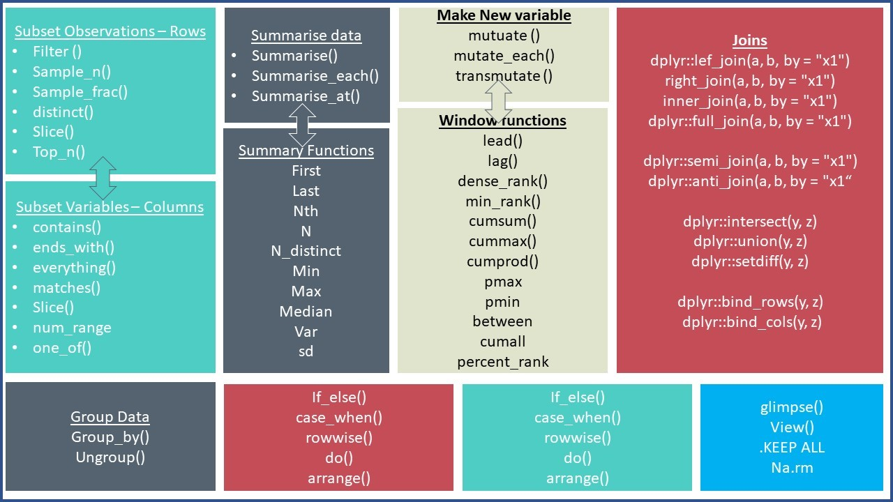

```{r setup, include=FALSE}
knitr::opts_chunk$set(echo = TRUE)
```

```{css, echo=FALSE}

p, ul, li{
text-align: justify
}

```

- **참고 : R과 통계분석(Tidyverse 활용), 박동련 저**

# **1. Package dplyr**

> Package `dplyr` (Ver. 1.0.9)는 Hadley Wichkham가 작성한 `데이터 처리에 특화`된 R 패키지이다. R에 입력된 데이터 세트는 대부분의 경우 바로 통계분석이 가능한 상태가 아니기 때문에 데이터를 분석하기 위해서는 원하는 형태로 가공하는 데이터 핸들링 기술이 필요하다. 통계 데이터 세트는 변수가 열, 관찰값이 행을 이루고 있는 2차원 구조를 가지고 있으며 데이터 프레임(Data Frame)으로 입력된다. Package `dplyr`는 이러한 `데이터 프레임`을 원하는 형태로 가공하고 처리하는 과정에 필요한 함수들을 포함한다.

--------

## **1-1. Package dplyr의 장점**

> Package `dplyr`의 장점은 다음과 같다.

- C++로 작성되어 불필요한 함수를 불러오지 않기 때문에 처리 속도가 매우 빠르다.
- 직관적으로 이해하기 쉽다.
- 파이프 연산자 `%>%`를 이용하여 불필요한 객체들을 생성할 필요가 없다.
- 코드를 작성하기 쉽다.

--------

## **1-2. Package dplyr 내장 함수**

> Package `dplyr`의 대표적인 함수는 다음과 같다.

<center>
{width=80%}
</center>

</br>

{width=100%}


그 외에도 Package `dplyr`에 포함된 함수는 [dplyr 설명 pdf](https://cran.r-project.org/web/packages/dplyr/dplyr.pdf), [dplyr 홈페이지](https://dplyr.tidyverse.org/reference/index.html), 그리고 [Cheat Sheet](https://nyu-cdsc.github.io/learningr/assets/data-transformation.pdf)를 참고한다.

--------

# **2. Package dplyr 설치**

```{r}
# 1. 기본적인 패키지 설치와 로드 방법
# install.packages("dplyr")
library(dplyr)
```

--------

```{r}
# 2. p_load 이용하여 설치와 로드를 한꺼번에 
# install.packages("pacman")		# For p_load
pacman::p_load("dplyr")			    # pacman::p_load : pacman 패키지의 p_load함수 사용
```

`Result!` 함수 `p_load()`는 작성된 패키지가 설치 되어있지 않으면 설치 후 함수 `library()`를 자동적으로 실행한다.

--------

# **3. 파이프 연산자 %>%**

- 파이프 기능은 한 명령문의 결과물을 바로 다음 명령문의 입력 요소로 직접 사용할 수 있도록 `명령문들을 서로 연결`하는 기능을 의미한다.
    - 파이프 기능은 분석 중간 단계로 생성되는 무수한 객체들을 따로 저장할 필요가 없기 때문에 프로그램 자체가 매우 깔끔하게 정리되며, 분석 흐름을 쉽게 이해할 수 있다는 장점이 있다.
- 이러한 파이프 기능은 파이프 연산자 `%>%`를 통해 사용할 수 있다.
    - 파이프 연산자 `%>%`의 단축키는 `shift+ctrl+m`이다.
    - 기본적인 형태는 `lhs %>% rhs`이다.
        - `lhs` : 데이터 객체이거나 데이터 객체를 생성하는 함수
        - `rhs` : `lhs`를 입력 요소로 하는 함수
    - 예를 들어, `x %>% f()`는 객체 `x`를 함수 `f()`의 입력 요소로 하는 `f(x)`를 의미한다.
    - `rhs`에 다른 요소가 있다면, `lhs`는 `rhs`의 첫 번째 입력 요소가 된다.
        - 즉, `x %>% f(y)`는 `f(x, y)`를 의미한다. 
    - 만약 `lhs`가 `rhs`의 첫 번째 요소가 아닌 경우에는 `lhs`가 입력되는 위치에 점(`.`)을 찍어야 한다.
        - 즉, `x %>% f(y, .)`은 `f(y, x)`를 의미한다.

```{r}
# 데이터 불러오기
data(mtcars)

data <- mtcars
str(data)           # 데이터 구조
```
-----------

```{r}
# 기본 함수 전처리
data1 <- select(mtcars, c(1, 3, 9))
data2 <- filter(data1, mpg >= 30)
data3 <- mutate(data2, new = mpg + disp)
data4 <- arrange(data3, new)
data4
```

```{r}
# 파이프 연산자 %>%를 활용한 전처리
data.pi <- data %>%
  select(c(1, 3, 9)) %>%
  filter(mpg >= 30) %>%
  mutate(new = mpg + disp) %>%
  arrange(new)

data.pi

```

`Result!` "data4"와 "data.pi"는 동일한 결과를 출력하지만 파이프 연산자 `%>%`를 활용한 "data.pi"는 불필요한 객체를 생성하지 않았다.

--------

# **4. 행을 대상으로 작업하는 함수**

## **4-1. 함수 filter()**

- 함수 `filter()`를 이용하면 주어진 데이터 프레임에서 특정한 조건을 만족하는 행을 선택할 수 있다.
    - `filter(data, 조건)` : data에서 `조건`을 만족하는 행을 선택
- 조건을 설정할 때는 비교 연산자`(>, >=, <, <=, !=, ==`)와 논리 연산자(`&, |, !`)가 사용되며, 연산자 `%in%`이 매우 유용하게 사용된다.

```{r}
# 변수 mpg의 값이 30 이상인 행 선택
data %>%
  filter(mpg >= 30)
```

--------

```{r}
# 변수 mpg의 값이 30 이상이고 변수 wt의 값이 1.8 미만인 행 선택
data %>%
  filter(mpg >= 30, wt < 1.8)
```

`Caution!` 논리 연산자 `&` 대신에 콤마(`,`)를 사용할 수 있다.

--------

```{r}
# 변수 mpg의 값이 30 이하이고, 변수 cyl의 값이 6 또는 8이며, 변수 am의 값이 1인 행 선택
data %>%
  filter(mpg <= 30, cyl %in% c(6, 8), am ==1)
```

--------

```{r}
# 변수 mpg의 값이 mpg의 중앙값과 Q3 사이에 있는 행 선택
data %>%
  filter(mpg >= median(mpg), mpg <= quantile(mpg, probs = 0.75))
```

`Caution!` 함수 `median()`은 중앙값을 계산하고, 함수 `quantile(, prob)`은 분위수를 계산하는 함수이다.

--------

```{r}
# 변수 mpg의 값이 30 이하이거나, 변수 wt의 값이 1.8 이하인 행 선택
data %>%
  filter(mpg <= 30 | wt <= 1.8)
```

--------

## **4-2. 함수 slice()**

- 함수 `slice()`는 행의 번호를 직접 지정해서 특정 행을 선택하거나 제거할 수 있다. 
    - `slice(data, index)` : data에서 `index` 행을 선택
- 양의 정수를 입력하면 해당 위치의 행이 선택되고, 음의 정수를 입력하면 해당 위치의 행이 제거된다.
    - 입력되는 정수는 모두 양수이거나 모두 음수이어야 한다.

```{r}
# 5번째 행부터 10번째 행까지 선택
data %>%
  slice(5:10)
```
    
-------- 
    
```{r}
# 5번째 행부터 10번째 행 제거
data%>%
  slice(-(5:10))
```

-------- 

```{r}
# 1번째, 4번째, 6번째 행 선택
data %>%
  slice(c(1, 4, 6))
```

-------- 

`Caution!` 함수 `slice()` 뿐만 아니라 그와 관련된 다른 함수들도 행을 선택하는 데 유용하게 사용될 수 있다. 

| |
|:--------|:--------|
| slice_head(data, n) | 처음 n개 행을 선택 |  
| slice_tail(data, n) | 마지막 n개 행을 선택 |  
| slice_sample(data, n, replace = FALSE) | 비복원 추출을 이용하여 n개의 행을 선택 </br> ※ replace = TRUE : 복원 추출	| 
| slice_max(data, 변수, n) | 특정 변수가 가장 큰 값을 갖는 n개의 행을 선택 |
| slice_min(data, 변수, n) | 특정 변수가 가장 작은 값을 갖는 n개의 행을 선택 |
| |


```{r}
# 함수 slice_head()
data %>%
  slice_head(n = 6)
```

-------- 
  
```{r}
# 함수 slice_tail()
data %>%
  slice_tail(n = 6)
```

--------

```{r}
# 함수 slice_sample() 비복원 추출
data %>%
  slice_sample(n = 10, replace = FALSE)
```

---------

```{r}
# 함수 slice_sample() 복원 추출
data %>%
  slice_sample(n = 10, replace = TRUE)
```

---------

```{r}
# 함수 slice_max()
data %>%
  slice_max(mpg, n = 3)
```

---------

```{r}
# 함수 slice_min()
data %>%
  slice_min(mpg, n = 3)
```

---------

## **4-3. 함수 arrange()**

- 함수 `arrange()`는 특정 변수를 기준으로 데이터 프레임의 행을 재배열할 때 사용된다.
    - `arrange(data, 변수)` : data에서 지정한 변수를 기준으로 행을 오름자순으로 재배열
        - 함수에는 정렬의 기준이 되는 변수를 입력하면 되는데, 2개 이상의 정렬 기준 변수를 입력하게 되면 추가된 변수는 앞선 변수가 같은 값을 갖는 행들을 정렬하는 기준으로 사용된다.
- 정렬은 오른차순이 Default이며, 내림차순으로 배열하고자 할 때에는 기준 변수를 함수 `desc()`와 함께 사용한다.        

```{r}
# 변수 mpg를 기준으로 오름차순 정렬
data %>%
  arrange(mpg)
```

---------

```{r}
# 변수 mpg를 기준으로 오름차순 정렬하되 같은 값일 경우 변수 cyl을 기준으로 오름차순 정렬
data %>%
  arrange(mpg, cyl)
```

---------

```{r}
# 변수 mpg를 기준으로 내림차순 정렬
data %>%
  arrange(desc(mpg))
```

---------

## **4-4. 함수 distinct()**

- 함수 `distinct()`는 중복 입력된 행을 제거할 때 사용된다.
    - 함수 `distinct(data, 변수, .keep_all = FALSE)` : data에서 지정한 변수의 중복 입력된 행을 제거
        - 옵션 `.keep_all = TRUE`을 하면 data의 모든 변수가 유지되는데, 이 경우에는 중복된 행 중에 처음 나타난 행이 유지된다.

```{r}
df1 <- data.frame(id = rep(1:3, times = 2:4), x1 = c(1:2, 1:3, 1:4))
df1
```
-----------

```{r}
# 변수 id의 값 중 중복된 값 제거
df1 %>%
  distinct(id)
```

`Result!` 변수 "id"의 값 중 중복된 값이 제거되어 1, 2, 3이 출력된다.

---------

```{r}
# 변수 id의 값 중 중복된 값 제거하되, 모든 변수 유지
df1 %>%
  distinct(id, .keep_all = TRUE)
```

`Result!` 변수 "id"의 값 중 중복된 값이 제거되고 중복값이 처음 나타난 행이 유지되었다.

---------

## **4-5. 함수 bind_rows()**

- 함수 `bind_rows()`는 다수의 데이터 프레임을 행 기준으로 결합하는 함수이다.
    - `bind_rows(데이터 프레임1, 데이터 프레임2, ..)` : 데이터 프레임들을 행 기준으로 결합
- 함수 `bind_rows()`는 함수 `rbind()`와 유사하지만 세 가지의 큰 차이점이 있다.
    - 함수 `bind_rows()`는 데이터 프레임에만 적용할 수 있다.
    - 함수 `bind_rows()`는 열의 길이가 다른 데이터 프레임도 결합할 수 있다.
    - 함수 `bind_rows()`는 열의 이름이 다른 데이터 프레임도 결합할 수 있다.

```{r}
# 열의 길이가 다른 두 데이터 프레임 결합
x <- data.frame(x1 = 1:4, x2 = c("가", "나", "다", "라"))
y <- data.frame(x1 = 3:6)

bind_rows(x, y)
```

`Result!` 데이터의 결측값은 `NA`로 처리된다.

---------

```{r}
# 열의 이름이 다른 두 데이터 프레임 결합
x <- data.frame(x1 = 1:4, x2 = c("가", "나", "다", "라"))
y <- data.frame(x1 = 3:6, x3 = c("a", "b", "c", "d"))

bind_rows(x, y)
```

`Result!` 데이터의 결측값은 `NA`로 처리된다.

---------

# **5. 열을 대상으로 작업하는 함수**

## **5-1. 함수 select()**

- 함수 `select()`를 이용하면 분석에 필요한 변수들만 선택할 수 있다.
    - `select(data, ...)` : data에서 지정한 변수를 선택
    
---------

### **5-1-1. 열 번호(또는 열 이름)에 의한 선택**

- 변수를 선택하는 가장 기본적인 방법은 열 번호(또는 열 이름)를 콤마(`,`)로 구분하여 나열하는 것이다.


```{r}
# 열 번호
data %>%
  select(c(1,4,7))
```

---------

```{r}
# 열 번호
data %>%
  select(1:4)
```

---------

```{r}
# 열 이름
data %>%
  select(c(mpg, cyl))
```

---------

`Caution!` 열을 제거하고자 하는 경우에는 논리 부정 연산자(`!`) 또는 마이너스(`-`) 연산자를 사용해야 한다.


```{r}
# 지정된 변수 제외
data %>%
  select(!c(mpg, cyl, hp))
```

---------

```{r}
# 지정된 변수 제외
data %>%
  select(-c(mpg, cyl, hp))
```

---------

```{r}
# 열 선택과 제거
data %>%
  select(1:4, -(8:10))
```

---------

### **5-1-2. 변수 유형에 의한 선택**

- 특정 유형의 변수를 선택해야 하는 경우 유용하게 사용할 수 있는 방법이다.
- 변수 유형에 의한 선택이란 함수 `where()` 안에 논리값을 출력하는 함수를 입력하여 `TRUE`가 되는 변수를 선택하는 방법이다.
    - 변수의 유형 파악은 함수 `is.numeric()` 또는 `is.character()` 등 `is.*()` 형태의 함수로 할 수 있다.
    
```{r}
# 숫자형 변수만 선택
data %>%
  select(where(is.numeric))
```

---------

```{r}
# 숫자형 변수이거나 문자형 변수 선택
data %>%
  select(where(is.numeric) |  where(is.character))
```

---------

### **5-1-3. 변수 선택과 관련된 함수의 이용**

|특정 위치의 열을 선택할 때 사용할 수 있는 함수 |
|:--------|:--------|
| everythig() | 모든 변수 선택 |  
| last_col()  | 마지막 변수 선택 |  
| |

|변수 이름을 구성하고 있는 문자열에 대한 매칭 작업으로 변수를 선택할 때 사용할 수 있는 함수 |
|:--------|:--------|
| starts_with("x") | 이름이 "x"로 시작하는 변수 선택 |  
| ends_with("x")   | 이름이 "x"로 끝나는 변수 선택 |  
| contains("x")    | 이름에 "x"가 포함된 변수 선택 | 
| |


```{r}
# 모든 변수 선택
data %>%
  select(everything())
```
    
-----------

```{r}
# 마지막 변수 선택
data %>%
  select(last_col())
```

-----------

```{r}
# 변수 이름이 m으로 시작하는 변수 선택
data %>%
  select(starts_with("m"))
```

`Caution!` 대소문자를 구분하기 위해 옵션 `.ignore.case = FALSE`를 해야 한다.

-----------

```{r}
# 변수 이름이 p으로 끝나는 변수 선택
data %>%
  select(ends_with("p"))
```

`Caution!` 대소문자를 구분하기 위해 옵션 `.ignore.case = FALSE`를 해야 한다.

-----------

```{r}
# 변수 이름에 A가 포함되어 있는 변수 선택
data %>%
  select(contains("A"))
```

`Caution!` 대소문자를 구분하기 위해 옵션 `.ignore.case = FALSE`를 해야 한다.

-----------

## **5-2. 함수 pull()**

- 함수 `pull()`은 데이터 프레임의 한 변수를 선택하여 벡터로 추출하고자 할 때 사용된다.
    - `pull(data, var)` : data에서 `var`에 지정된 변수를 벡터로 추출
- 변수 선택 방법은 옵션 `var`에 변수 이름을 지정하거나, 위치를 나타내는 정수를 지정하는 것이다.
    - 양의 정수는 첫 번째 변수를 시작점으로 하는 위치이고, 음의 정수는 마지막 변수를 시작점으로 하는 위치이다.
    
```{r}
data %>%
  pull(var = am)
```

-----------

```{r}
data %>%
  pull(var = 3)
```

`Result!` 앞에서 세 번째 변수인 "disp"의 값들이 추출되었다.

-----------

```{r}
data %>%
  pull(var = -3)
```

`Result!` 뒤에서 세 번째 변수인 "am"의 값들이 추출되었다.

-----------

## **5-3. 함수 rename()**

- 함수 `rename()`을 사용하면 변수의 이름을 변경할 수 있다.
    - `rename(data. new name = old name)` : data에서 기존의 이름 old name을 새로운 이름 new name으로 변경
- 함수 `rename()`을 사용하면 이름이 변경되지 않은 변수도 모두 그대로 유지가 된다.

```{r}
data %>%
  rename(MPG = mpg)
```


-----------

`Caution!` 많은 변수의 이름을 어떤 공통된 양식에 따라 모두 바꿔야 하는 경우, 하나씩 변경하는 방식은 매우 비효율적이다. 예를 들어, 대문자로 입력된 변수 이름을 모두 소문자로 변경하거나, 이름 중간에 들어간 점(.)을 밑줄(_)로 변경해야하는 경우에 하나씩 변경하는 방식이 아닌 해당되는 변수의 이름을 한꺼번에 모두 바꿀 수 있는 방식이 필요하다. 이러한 작업은 함수 `rename_with()`로 할 수 있다.

```{r}
# 모든 변수 이름을 대문자로 변경
data %>%
  rename_with(toupper)
```

-----------

```{r}
# 변수 이름에 a가 포함되어 있는 변수만 대문자로 변경
data %>%
  rename_with(toupper, contains("a"))
```

-----------

## **5-4. 함수 relocate()**

- 함수 `relocate()`를 이용하여 열의 위치를 변경할 수 있다.
    - `relocate(data, 변수)` : 지정한 변수를 제일 앞으로 이동
        - 옵션 `.after` 또는 ``.before`을 이용하여 위치를 지정할 수 있다.

```{r}
# 변수 wt를 제일 앞으로 이동
data %>%
  relocate(wt)
```

` Caution!` 특정 변수를 제일 앞으로 이동하는 작업은 함수 `select(data, 특정 변수, everything())`을 이용해서 할 수도 있다.

-----------  

```{r}
# 변수 wt를 변수 cyl 뒤로 이동
data %>%
  relocate(wt, .after = cyl)
```
        
-----------  

```{r}
# 변수 wt를 변수 cyl 앞로 이동
data %>%
  relocate(wt, .before = cyl)
```

-----------  

```{r}
# 변수 이름에 a가 포함되어 있는 변수들을 변수 cyl 앞으로 이동
data %>%
  relocate(contains("a"), .before = cyl)
```

-----------  

## **5-5. 함수 mutate()와 transmute()**

- 함수 `mutate()`와 `transmute()`는 기존의 변수들을 이용하여 새로운 변수를 만들어 데이터 프레임에 추가해야 할 경우에 사용한다.
    - `mutate(data, 표현식)`, `transmute(data, 표현식)` : data에서 표현식을 이용하여 새로운 변수를 생성
- 두 함수의 차이점은 함수 `mutate()`는 기존의 변수들을 유지하는 반면, 함수 `transmute()`는 생성된 새로운 변수를 제외한 기존의 변수들은 모두 제거한다.
- 새롭게 만들어진 변수는 데이터 프레임의 제일 마지막 변수로 추가된다.

```{r}
# 기존의 변수 mpg 값에 0.43을 곱한 변수 kml 생성
# kml이 10 이상이면 "good", 10 미만이면 "bad" 값을 갖는 변수 gp_kml 생성
data %>%
  mutate(kml    = 0.43*mpg,
         gp_kml = ifelse(kml >= 10, "good", "bad")) 
```

`Caution!` 함수 `ifelse(조건, true, false)`는 조건을 만족하면 true의 값을 갖고, 아니면 false의 값을 갖는다. 이때 조건의 만족 여부에 따라 할당되는 두 가지 값의 유형은 같아야 한다.

----------- 

```{r}
# 기존의 변수 mpg 값에 0.43을 곱한 변수 kml 생성
# kml이 11이상이면 "excellent", 11 미만 8 이상이면 "good", 8 미만이면 "bad" 값을 갖는 변수 gp_kml 생성
data %>%
  mutate(kml    = 0.43*mpg,
         gp_kml = case_when(kml >= 11            ~ "excellent",
                            8 <= kml & kml < 11 ~ "good", 
                            TRUE                 ~ "bad")) %>%
  relocate(kml, gp_kml)                                          # 맨 앞으로 이동
```

`Caution!` 함수 `case_when(조건1 ~ value1, 조건2 ~ value2, TREU ~ value3)`은 조건1을 만족하면 value1, 조건1은 만족하지 않으나 조건2를 만족하면 value2, 두 조건 모두 만족하지 않으면 value3의 값을 갖는다. 

----------- 

```{r}
# 생성된 새로운 변수를 제외하고 기존의 변수 제거
data %>%
  transmute(kml    = 0.43*mpg,
            gp_kml = ifelse(kml >= 10, "good", "bad")) 
```

-----------

`Caution!` 함수 `mutate()`와 연관된 다른 함수로는 `mutate_if()`, `mutate_at()`, `mutate_all()`이 있다.

| |
|:--------|:--------|
| mutate_if()  | 조건을 만족하는 변수에 대해서만 함수 적용 |  
| mutate_at()  | 여러 변수에 동일한 함수를 적용하거나 하나의 변수에 여러 함수를 적용 |  
| mutate_all() | 모든 변수에 함수 적용 | 
| |

```{r}
# 변수에 입력된 값들의 총합이 100 미만인 열에 대해서만 지수 함수 적용
data %>%
  mutate_if(function(x) sum(x) < 100, exp)
```

-----------

```{r}
# 숫자형 변수들이면 범주형으로 변환
a <- data %>%
  mutate_if(is.numeric, as.factor)
str(a)
```

----------

```{r}
# 변수 이름이 d로 시작하는 변수에 exp를 적용
data %>%
  mutate_at(vars(starts_with("d")), exp)                           
```

`Caution!` `mutate_at(data, vars(starts_with("d")), list(exp = exp))`을 하면 지수 함수 `exp`를 적용한 새로운 변수가 추가된다.

----------

```{r}
# 변수 mpg와 disp에 로그 함수와 +2를 적용
data %>%
  mutate_at(vars(mpg, disp), list(log = log, p2 = ~.x+2))
```

----------

```{r}
# 모든 변수에 지수 함수를 적용
data %>%
  mutate_all(exp)                                                 
```

`Caution!` `mutate_all(data, list(exp = exp))`을 하면 지수 함수 `exp`를 적용한 새로운 변수가 추가된다.

----------

```{r}
# 모든 변수에 지수 함수와 +2를 적용
data %>%
  mutate_all(list(exp = exp, p2 = ~.x+2))
```

----------- 

## **5-6. 함수 bind_cols()**

- 함수 `bind_cols()`는 다수의 데이터 프레임을 열 기준으로 결합하는 함수이다.
    - `bind_cols(데이터 프레임1, 데이터 프레임2, ..)` : 데이터 프레임들을 열 기준으로 결합
- 함수 `bind_cols()`는 함수 `cbind()`와 유사하나 데이터 프레임에만 적용할 수 있다.

```{r}
x <- data.frame(x1 = 1:4, x2 = c("가", "나", "다", "라"))
y <- data.frame(x3 = 3:6, x4 = c("a", "b", "c", "d"))

bind_cols(x, y)
```

----------- 

## **5-7. 함수 across()**

- 함수 `across()`는 다수의 열을 대상으로 작업을 해야 하는 경우에 활용하는 함수이다.
    - `across(.cols = everything(), .fns = NULL, ..., names = NULL)` : 옵션 `.cols`에 지정한 열을 대상으로 옵션 `.fns`에 입력된 함수를 적용
        - 옵션 `.fns`에는 3가지의 방법으로 함수를 입력할 수 있다.
            - 다른 부가적인 입력 요소 없이 하나의 함수만을 사용하는 경우에는 함수의 이름만 지정
            - 여러 함수를 적용해야 하는 경우에는 `list()` 안에 `name = fun`의 형식으로 나열
            - Package `purrr`에서 적용되는 방식의 함수 형식
- 함수 `across()`는 [함수 `mutate()`][**5-5. 함수 mutate()와 transmute()**]나 [함수 `summarise()`][**6. 함수 summarise**]와 같은 Package `dplyr` 기본 함수 안에서 사용한다.


```{r}
# 모든 숫자형 변수들의 평균 계산
data %>%
  summarise(across(where(is.numeric), mean))
```

----------- 

```{r}
# 모든 숫자형 변수들의 결측값을 제거한 평균 계산
data %>%
  summarise(across(where(is.numeric), ~mean(.x, na.rm = TRUE)))
```

`Caution!` 옵션 `na.rm = TRUE`를 하면 결측값을 제거한 후 평균을 계산한다.

----------- 

```{r}
# 변수 이름에 a가 포함되어 있는 변수들만 평균과 표준편차
data %>%
  summarise(across(contains("a"), list(Avg = mean, SD = sd)))
```

----------- 

```{r}
# 변수 mpg와 cyl의 결측값 개수
data %>%
  summarise(across(c(mpg, cyl), ~sum(is.na(.x))))
```

----------- 

```{r}
# 변수 cyl와 am를 범주형으로 변환
a <- data %>%
  mutate(across(c(cyl, am), as.factor))

str(a)
```


-----------  

# **6. 함수 summarise**

- 함수 `summarise()`는 통계함수와 함께 사용하여 데이터 프레임의 특정 변수에 속한 값들을 하나의 통계값으로 요약하는 함수이다.
    - `summarise(data, name = fun)` : data에서 함수 `fun`을 적용하여 그 결과를 `name`과 함께 출력
        - fun으로 사용하는 대표적인 함수는 다음과 같다. 
        
<center>
{width=80%}
</center>

</br>

```{r}
data %>%
  summarise(n = n(), n_cyl = n_distinct(cyl), avg_mpg = mean(mpg))
```

`Result!` 총 데이터 포인트 개수는 32개이고, 변수 "cyl"는 총 3개의 값으로 되어 있으며, 변수 "mpg"의 평균은 20.09062이다.

----------- 

```{r}
data %>%
  summarise(max_mpg = max(mpg), range_hp = range(hp))
```

`Result!` 변수 "mpg"의 최대값은 33.9이고, 변수 "hp"의 최소값과 최대값은 각각 52와 335이다.

----------- 

`Caution!` 함수 `summarise_at()`을 이용하여 지정한 여러 변수들에 함수를 한꺼번에 적용하거나 하나의 변수에 여러 함수를 적용할 수 있다. 

```{r}
# 변수 mpg와 wt의 최소값, 최대값, 중앙값
data %>%
  summarise_at(vars(mpg, wt), list(min = min, max = max, median = median))     # summarise_at(vars(mpg, wt), funs(min, max, median))
```

----------- 

`Caution!` 함수 `summarise_all()`을 이용하여 모든 변수에 함수를 한꺼번에 적용할 수 있다. 

```{r}
# 모든 변수의 평균과 75분위수
data %>%
  summarise_all(list(mean = mean, quantile = ~quantile(.x, prob = 0.75))) 
```


----------- 

# **7. 함수 group_by**

- 함수 `group_by()`는 한 개 이상의 변수를 이용하여 전체 데이터를 그룹으로 구분하는 기능을 갖고 있다.
    - `group_by(data, 변수)` : data에서 그룹을 구분하는 데 지정한 변수를 사용

```{r}
data %>%
  group_by(cyl)
```
    
`Result!` 변수 "cyl"에 의해 3개 그룹이 구성되었다.

-----------

```{r}
data %>%
  group_by(cyl, am)
```

`Result!` 변수 "cyl"와 "am"에 의해 6개 그룹이 구성되었다.

-----------

`Caution!` 각 그룹에 속한 데이터 포인트의 개수는 함수 `tally()`를 사용하면 알 수 있다.

```{r}
data %>%
  group_by(cyl, am) %>%
  tally()
```

-----------
 
## **7-1. 그룹별 요약**

- 함수 `group_by()`는 [함수 `summarise()`][**6. 함수 summarise**]와 함께 사용하면 그룹별로 통계함수를 적용할 수 있다.

```{r}
# cyl에 따른 변수 mpg의 평균
data %>%
  group_by(cyl) %>%
  summarise(avg_mpg = mean(mpg))
```

-----------

```{r}
# cyl에 따른 변수 disp의 합과 변수 hp 범위
data %>%
  group_by(cyl) %>%
  summarise(sum_disp = sum(disp), range_hp = range(hp))
```

-----------

```{r}
# cyl와 am에 따른 변수 wt의 사분위수
data %>%
  group_by(cyl, am) %>%
  summarise(quantile_wt = quantile(wt, prob = c(0.25, 0.5, 0.75)))
```

-----------

## **7-2. 그룹별 정렬**

- 함수 `group_by()`는 [함수 `arrange()`][**4-3. 함수 arrange()**]와 함께 사용하면 그룹별로 데이터를 정렬할 수 있다.

```{r}
data %>%
  group_by(cyl) %>%
  arrange(mpg, .by_group = TRUE)
```

`Result!` 옵션 `.by_group = TRUE`를 하면 그룹 변수가 첫 번째 정렬 변수로 사용되기 때문에 그룹 변수 "cyl"로 먼저 정렬한 후 각 그룹 내에서 변수 "mpg"에 의해 오름차순으로 정렬하였다.

