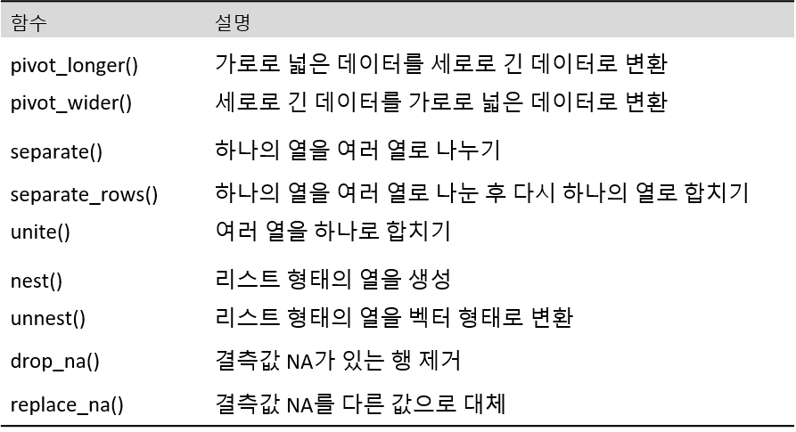
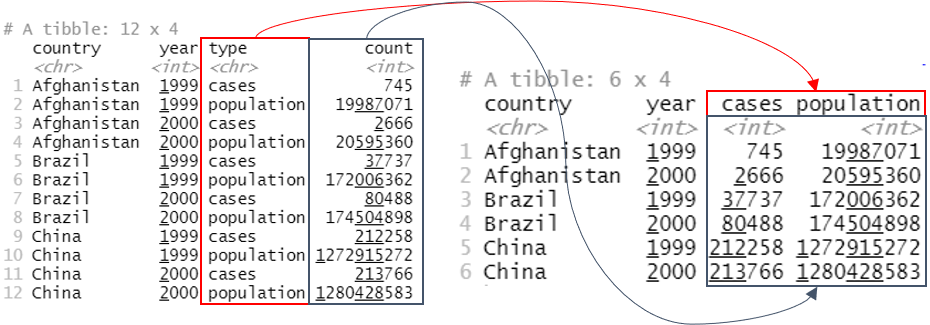
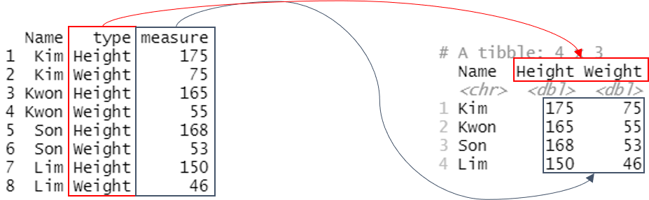
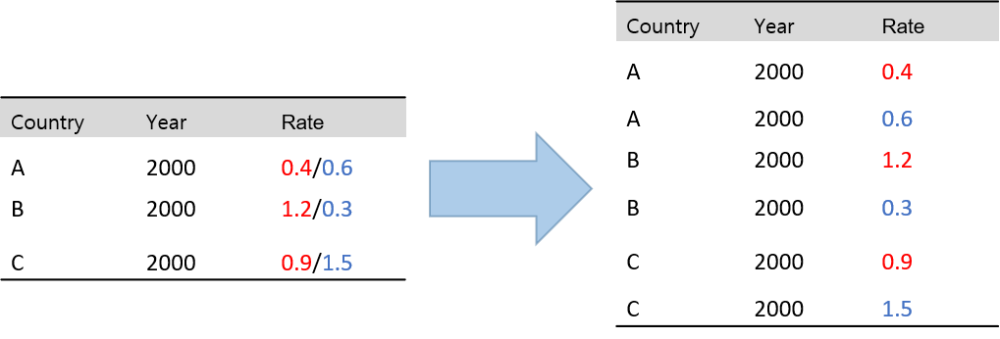

```{r setup, include=FALSE}
knitr::opts_chunk$set(echo = TRUE)
```

```{css, echo=FALSE}

p, ul, li{
text-align: justify
}

```

- **참고 : R과 통계분석(Tidyverse 활용), 박동련 저**

# **1. Package tidyr**

> Package `tidyr` (Ver. 1.2.0)는 "tidy"라는 영어 낱말 뜻(깔끔한, 잘 정돈한)처럼 데이터를 분석하기 쉽게 정리하는 데 도움을 주는 R 패키지이다. R에 입력된 데이터 세트는 대부분  바로 통계분석이 가능한 상태가 아니기 때문에 깔끔한 데이터(Tidy Data)로 정리하는 과정이 필요하다. 여기서, 깔끔한 데이터란 아래의 그림과 같이 1. 각 변수는 열에 해당하며, 2. 하나의 행은 하나의 관측을 의미하고, 3. 하나의 셀에는 하나의 관측값만 있는 데이터를 의미한다. 깔끔한 데이터는 표준화된 데이터 구조로 변수 및 관측치 추출이 용이하고, 모델링이 편하며 시각화가 쉬운 장점이 있다. 이러한 깔끔한 데이터를 만드는데 필요한 여러 함수가 Package `tidyr`에 포함되어 있다.

{width=100%}

--------

## **1-1. Package tidyr 내장 함수**

> Package `tidyr`의 대표적인 함수는 다음과 같다.

<center>
{width=100%}
</center>

</br>


그 외에도 Package `tidyr`에 포함된 함수는 [tidyr 설명 pdf](https://cran.r-project.org/web/packages/tidyr/tidyr.pdf), [tidyr 홈페이지](https://tidyr.tidyverse.org/), 그리고 [Cheat Sheet](https://github.com/rstudio/cheatsheets/blob/main/tidyr.pdf)를 참고한다.

--------

# **2. Package tidyr 설치**

```{r}
# 1. 기본적인 패키지 설치와 로드 방법
# install.packages("tidyr")
library(tidyr)
```

--------

```{r}
# 2. p_load 이용하여 설치와 로드를 한꺼번에 
# install.packages("pacman")		# For p_load
pacman::p_load("tidyr")			    # pacman::p_load : pacman 패키지의 p_load함수 사용
```

`Result!` 함수 `p_load()`는 작성된 패키지가 설치 되어있지 않으면 설치 후 함수 `library()`를 자동적으로 실행한다.

--------

# **3. 함수 pivot_longer()**

- 함수 `pivot_longer()`은 여러 열에 입력된 데이터를 하나의 열로 모으는 데 유용한 함수이다.
    - `pivot_longer(data, cols, names_to = "name", values_to = "value")` 
        - `data` : 데이터 프레임(Data Frame)
        - `cols` : 하나의 열로 합칠 열 이름
        - `names_to` : 선택된 `열의 이름`이 입력될 새로운 열 이름
        - `values_to` : 흩어진 `데이터`를 하나로 합쳐서 입력할 열 이름

{width=100%}

---------------

> Package `tidyr`에 내장된 데이터 프레임 "table4a"의 변수 "1999"와 "2000"에 입력된 관측값을 하나의 열로 모으기 위해 함수 `pivot_longer()` 적용

```{r}
data(table4a)
table4a

# Ver. 1
table4a %>%
  pivot_longer(cols = c("1999", "2000"),
               names_to = "year",                        # 변수 이름 "1999"와 "2000"이 입력될 새로운 열 이름
               values_to = "cases")                      # 변수 "1999"와 "2000"에 입력된 값들을 합쳐서 나타낼 새로운 열 이름


# Ver. 2
table4a %>%
  pivot_longer(cols = -country,
               names_to = "year",                        # 변수 이름 "1999"와 "2000"이 입력될 새로운 열 이름
               values_to = "cases")                      # 변수 "1999"와 "2000"에 입력된 값들을 합쳐서 나타낼 새로운 열 이름
```

<center>
{width=100%}
</center>

---------------

> 어떤 제품의 3년간 분기별 판매량이 df1이라고 할 때, 분기별 판매량을 하나의 열로 모으기 위해 함수 `pivot_longer()` 적용

```{r}
df1 <- data.frame(Year = c(2019, 2020, 2021),
                  Q1   = c(102, 85, 97),
                  Q2   = c(158, 105, 136),
                  Q3   = c(135, 103, 123),
                  Q4   = c(147, 93, 114))
df1

df1 %>%
  pivot_longer(cols      = -Year,
               names_to  = "Qtr",                         # 변수 이름 "Q1"~"Q4"가 입력될 새로운 열 이름
               values_to = "Sales")                       # 변수 "Q1"~"Q4"에 입력된 값들을 합쳐서 나타낼 새로운 열 이름
```

<center>
{width=100%}
</center>

---------------

> Package `tidyr`에 내장된 데이터 프레임 "billboard"의 변수 "wk1"부터 "wk76"까지 입력된 관측값을 하나의 열로 모으기 위해 함수 `pivot_longer()` 적용

Package `tidyr`에 있는 데이터 프레임 "billboard"에는 2000년 Billboard Top 100에 오른 노래의 가수("artist")와 노래 제목("track"), top 100 리스트에 들어간 날짜("data.entered"), 그리고 리스트에 오른 이후의 매주 순위가 변수 "wk1"부터 "wk76"까지 입력되어 있다. 원하는 분석은 매주 연속해서 top 100에 올라있던 노래만을 대상으로 리스트에 머물러 있던 최장 기간과 그 기간 중 최고 순위를 알아내는 것이기 때문에 변수 "wk1"부터 "wk76"까지에 이벽된 값들은 하나의 열에 입력되어야 적절한 통계분석이 가능하다. 

```{r}
data(billboard)
billboard

billboard %>%
  head(5)

billboard %>%
  pivot_longer(cols            = wk1:wk76,                    # Or starts_with("wk")
               names_to        = "week",                      # 변수 이름 "wk1"~"wk76"이 입력될 새로운 열 이름
               names_prefix    = "wk",                        # 변수 week의 입력값에서 "wk" 단어 제외
               names_transform = list(week = as.integer),     # 변수 week의 데이터 유형을 정수형으로 변환
               values_to       = "rank",                      # 변수 "wk1"~"wk76"에 입력된 값들을 합쳐서 나타낼 새로운 열 이름
               values_drop_na  = TRUE) %>%                    # 변수 rank의 NA값 제거
  head(10)
```

`Caution!` 옵션 `names_prefix`는 `names_to`에 입력된 열 이름에서 `제거하려는 문자열`에 정규표현식을 지정하면 되는데, 첫 문자부터 제거하는 경우에는 그냥 제거하는 문자열을 입력한다. 옵션 `names_transform`은 `names_to`에 입력된 열 이름의 유형을 변경할 때 사용한다. 또한, `values_to`에 입력된 관측값에 `NA`값을 제거하기 위해 옵션 `values_drop_na = TRUE`을 지정한다.

---------------


# **4. 함수 pivot_wider()**

- 함수 `pivot_wider()`은 하나의 열에 입력된 여러 변수의 데이터를 분리할 때 유용한 함수이다.
    - `pivot_wider(data, names_from = "name", values_from = "value")` 
        - `data` : 데이터 프레임
        - `names_from` : 새롭게 추가되는 `열의 이름`이 입력되어 있는 열 이름
        - `values_from` :`데이터`가 입력되어 있는 열 이름
 
  
{width=100%}

---------------  

> Package `tidyr`에 내장된 데이터 프레임 "table2"의 변수 "type"에 입력되어 있는 두 변수를 분리하기 위해 함수 `pivot_wider()` 적용

```{r}
table2

table2 %>%
  pivot_wider(names_from  = "type",
              values_from = "count")
```

<center>
{width=100%}
</center>

---------------  

> 세 명의 신장과 체중을 입력한 데이터 프레임 df2에서 변수 "type"에 입력되어 있는 두 변수를 분리하기 위해 함수 `pivot_wider()` 적용

```{r}
df2 <- data.frame(Name    = rep(c("Kim", "Kwon", "Son", "Lim"), each = 2),
                  type    = rep(c("Height", "Weight"), times = 4),
                  measure = c(175, 75, 165, 55, 168, 53, 150, 46))

df2

df2 %>%
  pivot_wider(names_from  = "type",
              values_from = "measure")
```

<center>
{width=100%}
</center>

---------------  

> Package `tidyr`에 내장된 데이터 프레임 "fish_encounters"의 변수 "station"에 입력되어 있는 변수를 분리하기 위해 함수 `pivot_wider()` 적용

```{r}
fish_encounters

fish_encounters %>%
  pivot_wider(names_from  = "station",
              values_from = "seen",
              values_fill = 0)                         # NA값 0으로 대체
```


--------------

# **5. 함수 separate()**

- 함수 `separate()`는 하나의 문자형 열에 입력된 데이터를 여러 열로 분리하는 데 유용한 함수이다.
    - `separate(data, col, into, sep, remove = TRUE, convert = FALSE)` 
        - `data` : 데이터 프레임
        - `col` : 분리하고 싶은 열
        - `into` : 데이터를 분리하여 따로 입력할 열 이름
        - `sep` : 구분자
        - `remove = TRUE` : `col`을 제거할 것인가를 나타내는 논리값
        - `convert = FALSE` : 분리 후 데이터의 유형을 바꿀 것인가를 나타내는 논리값

------------

> Package `tidyr`에 내장된 데이터 프레임 "table3"의 변수 "rate"에 입력되어 있는 두 관측값을 분리하기 위해 함수 `separate()` 적용

```{r}
table3

table3 %>%
  separate(col  = "rate",
           into = c("cases", "population"),
           sep  = "/")
```

-------------

> 데이터 프레임 "df3"의 변수 "Date"에 입력되어 있는 두 문자열을 분리하기 위해 함수 `separate()` 적용

```{r}
df3 <- data.frame(Date  = c("2020-Qtr.1", "2020-Qtr.2", "2020-Qtr.3", "2020-Qtr.3"),
                  Sales = c(102, 95, 119, 99))
df3

df3 %>%
  separate(col  = "Date",
           into = c("Year", "Qtr"),
           sep  = "-")
```

-------------

> 데이터 프레임 "df4"의 변수 "Date"에 입력되어 있는 두 문자열을 분리하기 위해 함수 `separate()` 적용

```{r}
df4 <- data.frame(Date  = c("2020Q1", "2020Q2", "2020Q3", "2020Q3"),
                  Sales = c(102, 95, 119, 99))
df4

df4 %>%
  separate(col  = "Date",
           into = c("Year", "Qtr"),
           sep  = 4)                                     # Or -2
```

`Caution!` 옵션 `sep`에 양의 정수를 입력하면 왼쪽 끝을 기준으로 입력값 위치에서 분리되고, 음의 정수를 입력하면 오른쪽 끝을 기준으로 입력값의 위치에서 분리된다.

-------------

`Caution!` 함수 `separate()`는 하나의 열에 입력된 문자열을 분리하는 데 사용되는 함수이다. 하지만, 하나의 열의 데이터를 분리한 후 다시 하나의 열로 만들고 싶다면 함수 `separate_rows(data, 분리하고 싶은 열, sep)`를 사용할 수 있다.

<center>
{width=100%}
</center>


```{r}
df5 <- data.frame(Contry = c("A", "B", "C"),
                  Year   = 2000,
                  Rate   = c("0.4/0.6", "1.2/0.3", "0.9/1.5"))

df5

df5 %>%
  separate_rows("Rate",                                           # 분리하고 싶은 열
                sep = "/")                                        # 구분자
```

-------------

# **6. 함수 unite()**

- 함수 `unite()`는 여러 열의 데이터를 하나의 열로 합치는 데 유용한 함수이다.
    - `unite(data, col, ..., sep, remove = TRUE)` 
        - `data` : 데이터 프레임
        - `col` : 합쳐서 새롭게 생성될 열 이름
        - `...` : 합쳐질 열
        - `sep` : 구분자
        - `remove = TRUE` : 합쳐질 열들을 제거할 인가를 나타내는 논리값

------------

> Package `tidyr`에 내장된 데이터 프레임 "table5"의 변수 "century"과 "year"에 입력되어 있는 두 데이터를 하나의 열로 합치기 위해 함수 `unite()` 적용

```{r}
table5

table5 %>%
  unite(col = year,                   # 합쳐서 새롭게 생성될 열 이름 
        century, year,                # 합쳐질 열
        sep = "-")
```

------------

> 데이터 프레임 "df6"의 변수 "Year"과 "Qtr"에 입력되어 있는 두 데이터를 하나의 열로 합치기 위해 함수 `unite()` 적용

```{r}
df6 <- data.frame(Year = "2020",
                  Qtr = c("Q1", "Q2", "Q3", "Q4"),
                  Sales = c(102, 95, 119, 99))
df6 

df6 %>%
  unite(col = "Date",               # 합쳐서 새롭게 생성될 열 이름 
        Year, Qtr,                  # 합쳐질 열
        sep = "/")
```

------------

# **7. 함수 nest()**

- 함수 `nest()`는 데이터 프레임의 열을 묶어서 `리스트` 형태의 열을 생성하는 데 유용한 함수이다.
    - 특히, 데이터 프레임으로부터 그룹별로 데이터를 요약할 때 유용하다.
    
```{r}
data(mtcars)

mtcars_cyl <- mtcars %>%
  dplyr::group_by(cyl) %>%
  nest()

mtcars_cyl
```
`Result!` 변수 "cyl"에 따른 데이터를 리스트 형식의 열("data")로 생성하였다.

```{r}
mtcars_cyl$data
```

`Caution!` 리스트 형식의 열을 데이터 프레임의 열로 수정하기 위해서는 함수 `unnest()`를 사용하면 된다.

```{r}
unnest(mtcars_cyl, cols = data)
```

------------

# **8. 함수 drop_na()**

- 함수 `drop_na()`는 결측값 `NA`가 포함된 행을 제거하는 데 유용한 함수이다.
    - `drop_na(data, ...)` 
        - `data` : 데이터 프레임
        - `...` : 결측값 `NA`를 탐색할 열로서 지정한 열에서 결측값 `NA`가 있는 행 제거 

```{r}
df7 <- data.frame(x = c(1:4, NA, 5, NA, 6:8, NA),
                  y = c(1, NA, 10, 8, 3, 5, 8, NA, 0, 2, 2))
df7

# 어떤 변수든지 NA가 포함되어 있는 행 모두 제거
df7 %>%
  drop_na()

# 변수 x의 값이 NA인 행 제거
df7 %>%
  drop_na(x) 
```
    
------------

# **9. 함수 replace_na()**

- 함수 `replace_na()`는 결측값 `NA`를 지정된 값으로 대체하는 데 유용한 함수이다.
    - `replace_na(data, replace)` 
        - `data` : 데이터 프레임 또는 벡터
        - `replace` : 결측값 `NA`를 대체할 값
            - `data`가 데이터 프레임이면, 리스트 형태로 각 열에 있는 결측값 `NA`를 대체할 값 지정
            - `data`가 벡터이면, 하나의 값 지정

```{r}
df7 <- data.frame(x = c(1:4, NA, 5, NA, 6:8, NA),
                  y = c(1, NA, 10, 8, 3, 5, 8, NA, 0, 2, 2))
df7

df7 %>%
  replace_na(list(x = 5))

df7 %>%
  replace_na(list(x = 5, 
                  y = 7))
```
    
