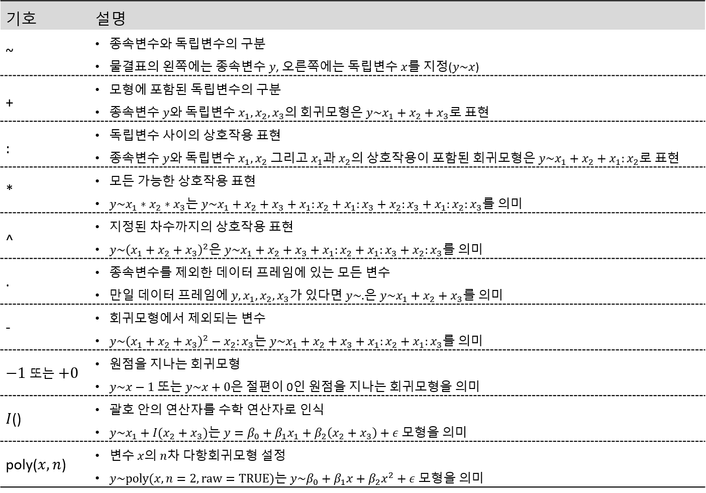
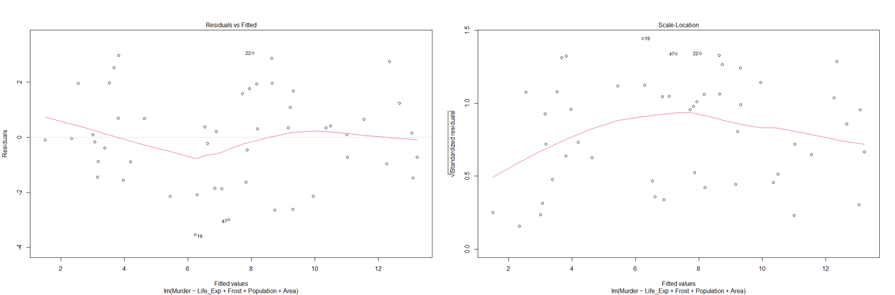

```{r setup, include=FALSE}
knitr::opts_chunk$set(echo = TRUE, warning = FALSE, message = FALSE)
options(width=200)
```


```{css, echo=FALSE}

p, ul, li{
text-align: justify
}

```


- **참고 : R과 통계분석(Tidyverse 활용), 박동련 저**

# **1. 회귀분석(Regression Analysis)**

> 회귀분석(Regression Analysis)이란 독립변수(설명변수)와 종속변수(반응변수) 사이의 관련성을 통계학적인 모형을 이용하여 분석하는 통계적 분석방법이다. 특히, 독립변수와 종속변수 사이의 관계를 선형방정식에 의해서 분석할 경우 선형회귀분석(Linear Regression Analysis)이라고 하며, 선형회귀분석은 독립변수가 하나인 단순선형회귀분석과 두 개 이상인 다중선형회귀분석으로 구분할 수 있다. 선형회귀모형은 통계분석 분야에서 가장 중요한 역할을 담당하고 있는 분석 도구 중 하나로서 종속변수의 예측에 유용하게 사용되고 있다. 신빙성 있는 예측이 이루어지기 위해서는 우선 최적의 독립변수들을 선택하여 모형을 적합해야 한다. 또한, 모형에 대한 진단과정 등을 통해 가정 만족 여부를 확인해야 한다. 이런 과정을 거쳐서 선정된 회귀모형만이 예측의 신빙성을 통계적으로 보장받을 수 있는 모형이 된다.  

- 종속변수 $Y$와 독립변수 $X_1, \ldots, X_k$ 사이에 다음과 같은 선형관계가 존재한다고 가정한다.
$$
\begin{align*}
Y=\beta_0 + \beta_1X_{1}+\beta_2X_{2}+\ldots + \beta_kX_{k} + \epsilon.
\end{align*}
$$
- 회귀계수의 효과적인 추정 및 해석을 위해서 오차항 $\epsilon$은 다음과 같은 가정이 필요하다.
    1. $n$개의 관측값이 있을 때, $\epsilon_1, \ldots, \epsilon_n$은 서로 독립이다.
    2.  $\epsilon_1, \ldots, \epsilon_n$은 모두 평균이 0 이고 분산이 $\sigma^2$인 정규분포를 따른다.
        - 즉,  $\epsilon$은 정규성과 등분산성을 만족한다.
- 오차항에 대한 가정으로부터 종속변수 $Y$도 다음과 같은 가정을 만족한다.
    1. $E(Y)=\beta_0 + \beta_1 X_1+ \ldots + \beta_k X_k$.
    2. $Var(Y) = \sigma^2$.
    3. $Y$는 정규분포를 따른다.

※ 선형성의 가정 및 오차항의 가정은 회귀모형에 대한 추론의 정당성을 보장하기 위한 것으로 만일 가정을 만족하지 않는다면, 신뢰구간 추정 및 검정 결과에 대한 신빙성이 떨어진다고 할 수 있다.

------------------

# **2. 회귀모형의 적합**

- 회귀분석의 일차적인 관심은 회귀계수(Regression Coefficient) $\beta_0, \ldots, \beta_k$의 추정이라고 할 수 있다.
- 회귀모형의 적합이란 회귀계수의 추정을 의미하는 것이며, 일반적으로 최소제곱법(Ordinary Least Squares)에 의해서 추정된다.
    - 최소제곱법이란 오차의 제곱합이 최소가 되도록 하는 회귀계수를 찾는 기법으로 $\text{min}_{\beta} \sum_{i=1}^n \epsilon_i^2 =$ $\text{min}_{\beta} \sum_{i=1}^n (y_i - \beta_0-\beta_1x_{1i}-\ldots-\beta_kx_{ki})^2$을 의미한다.
- R에서 기본적으로 제공하는 함수 `lm()`을 이용하여 회귀모형의 적합을 수행할 수 있으며 일반적인 사용법은 `lm(formula, data, subset, ...)`이다.
    - `formula` : 설정된 회귀모형을 나타내는 모형 공식
    - `data` : 회귀분석에 사용될 데이터 프레임(Data Frame)
    - `subset` : 데이터의 일부분만을 이용하여 회귀분석을 실시하고자 하는 경우 사용
        - 예를 들어, 처음 100개의 데이터만을 이용하여 회귀모형을 적합하고자 하는 경우에는 `subset = 1:100`을 지정한다.
-  다양한 형태의 회귀모형을 표현하기 위하여 옵션 `formula`에는 다음과 같은 기호를 사용할 수 있다.

{width=100%}


------------------------

## **2-1. 예제 state.x77**

- R에서 제공하는 데이터 `state.x77`에는 미국 50개 주와 관련된 8개 변수가 있다.
    1. `Population` : 인구수
    2. `Income` : 1인당 소득
    3. `Illiteracy` : 문맹률
    4. `Life Exp` : 기대 수명
    5. `Murder` : 인구 10만 명당 살인범죄율
    6. `HS Grad` : 고등학교 졸업률
    7. `Frost` : 대도시 지역에서 최저 기온이 영하인 날의 평균일수
    8. `Area` : 면적
- 변수 `Murder`를 종속변수로 하고 나머지 변수를 모두 독립변수로 하는 회귀모형을 적합해 본다.    

```{r}
# 데이터 불러오기 
data(state)

head(state.x77)

# 데이터 전처리
pacman::p_load("dplyr")

state_df <- state.x77 %>%
  as_tibble() %>%                            # Tibble 변환
  rename(Life_Exp = "Life Exp",              # 변수명 변경
         HS_Grad = "HS Grad") %>%
  relocate(Murder, .after = last_col()) %>%  # 종속변수를 마지막 열로 이동
  data.frame()                               # 데이터 프레임 변환

str(state_df)
```

------------------------

`Caution!` 회귀모형을 설정하기 전에 모형에 포함할 변수들의 관계를 살펴보는 것이 반드시 필요하다. 산점도행렬과 같은 그래프에 의한 탐색은 필수적이라 할 수 있으며, 연속형 변수의 경우에는 두 변수끼리 짝을 지어 상관계수를 살펴보는 것도 필요하다. 산점도행렬은 Package `GGally`에서 제공하는 함수 `ggpairs()`를 통해 작성할 수 있으며, 상관계수는 함수 `cor()`를 이용하여 계산할 수 있다.

```{r}
# 산점도행렬
pacman::p_load("GGally")

ggpairs(state_df, 
        lower = list(continuous = "smooth")) # 아래쪽 삼각형의 그래프
```

```{r}
# 상관계수
cor(state_df)

# 상관계수행렬
pacman::p_load("GGally")

ggcorr(state_df, 
       label = TRUE,          # 상관계수 출력
       label_round = 2)       # 상관계수 소숫점 이하 표시
```

`Result!` 종속변수 `Murder`는 변수 `Illiteracy`와 비교적 높은 양의 상관관계를 가지는 반면, 변수 `Life_Exp`와는 높은 음의 상관관계를 가지는 것으로 나타났다.

---------------------

```{r}
# 회귀모형의 적합
fit <- lm(Murder ~ ., data = state_df)
fit
```

`Result!` 함수 `lm()`에 의해 추정된 회귀모형은 다음과 같다.
$$
\begin{align*}
\hat{y}_{Murder}=&122.18039+0.00019x_{Population}-0.00016x_{Income}+1.37311 x_{Illiteracy}\\
&-1.65487x_{Life\_Exp} + 0.03234 x_{HS\_Grad}-0.01288 x_{Frost}+0.00001x_{Area}.
\end{align*}
$$
추정된 회귀계수는 독립변수가 1단위 증가할 때 종속변수가 회귀계수만큼 증가(또는 감소)한다라고 해석한다. 예를 들어, 변수 `Illiteracy`의 추정된 회귀계수는 1.37311이므로 문맹률이 1단위 증가하면, 인구 10만 명당 살인범죄율은 1.37311 증가한다. 또한, 변수 `Life_Exp`의 추정된 회귀계수는 -1.65487이므로 기대 수명이 1단위 증가하면, 인구 10만 명당 살인범죄율은 1.65487 감소한다. 

----------------


## **2-2. 예제 women**

- R에서 제공하는 데이터 `women`에는 여성 15명의 키(`height`)와 몸무게(`weight`)가 기록되어 있다.

```{r}
# 데이터 불러오기
data(women)

str(women)
```

-------------

```{r}
# 산점도행렬
pacman::p_load("GGally")

ggpairs(women, 
        lower = list(continuous = "smooth")) # 아래쪽 삼각형의 그래프

# 상관계수
cor(women)
```

`Result!` 변수 `height`와 변수 `weight`는 0.9 이상의 높은 양의 상관관계를 가지는 것으로 나타났다.

--------------

```{r}
# 회귀모형의 적합
lm(weight ~ height, data = women)
```

`Result!` 함수 `lm()`에 의해 추정된 회귀모형은 다음과 같다.
$$
\begin{align*}
\hat{y}_{weight}=-87.52+3.45x_{height}.
\end{align*}
$$
변수 `height`의 추정된 회귀계수는 3.45이므로 키가 1단위 증가하면 몸무게는 3.45 증가한다.

------------------

`Caution!` Package `ggplot2`에 내장되어 있는 함수 `geom_smooth(method, se)`를 이용하여 선형회귀모형을 시각화할 수 있다. 옵션 `method`는 선형회귀모형 "lm"과 비선형회귀모형 "loess" 등이 있으며, `se`는 신뢰구간의 표시 여부를 나타내는 논리값이다. 자세한 옵션은 [여기](https://ggplot2.tidyverse.org/reference/geom_smooth.html)를 참고한다.


```{r}
# 변수 height와 weight의 산점도 및 회귀모형
pacman::p_load("ggplot2")

ggplot(women, aes(x = height, y = weight)) +
  geom_point(size = 3) +              # 산점도
  geom_smooth(aes(color = "linear"), 
              method = "lm",          # 선형회귀모형 
              se = FALSE) +           # 신뢰구간 표시 여부
  geom_smooth(aes(color = "loess"),   
              method = "loess",       # 비선형회귀모형
              se = FALSE) +           # 신뢰구간 표시 여부
  labs(color = "")                    # Legend 라벨 변경
```

`Result!` 변수 `height`와 변수 `weight`의 관계는 선형이 아닌 것으로 보이며, 이러한 경우 독립변수 `height`의 제곱을 모형에 추가한 다항회귀모형이 좋은 대안이 될 수 있다. 

-----------------------------

```{r}
# 다항회귀모형
fit_w <- lm(weight ~ height + I(height^2), data = women)
fit_w
```

`Result!` 추정된 회귀모형은 다음과 같다.
$$
\begin{align*}
\hat{y}_{weight}=261.878-7.348x_{height}+0.083 x_{height}^2.
\end{align*}
$$

-----------------------------

## **2-3. 예제 Leinhardt**

- 범주형 변수를 독립변수에 포함해야할 때가 종종 있으며, 이러한 경우에는 범주형 변수를 더미변수(Dummy Variable)로 변환하는 작업이 필요하다.
    - 더미변수란 0 또는 1의 값을 가지는 변수이며, 범주형 변수의 범주 개수보다 1개 적게 만든다.
        - 예를 들어, 변수 `성별`에 "M", "F"값이 있을 때, 생성되는 더미변수는 1개이며, 변수 `성별`이 "F"이면 1, "M"이면 0의 값을 갖는 변수가 된다.
- 함수 `lm()`은 범주형 변수를 독립변수로 포함하면 범주의 개수에 따라 필요한 더미변수를 자동으로 모형에 포함한다. 
- Package `carData`에서 제공하는 데이터 `Leinhardt`는 1970년대 105개 나라의 신생아 사망률(`infant`)과 소득(`income`), 지역(`region`) 및 원유 수출 여부(`oil`)를 조사한 자료이다.
    - 변수 `infant`를 종속변수로 하고, 나머지 변수들은 독립변수로 하는 회귀모형을 적합하고자 한다.
        - 변수 `region`과 `oil`은 각각 4개, 2개의 범주를 갖고 있다.

```{r}
pacman::p_load("carData")

# 데이터 불러오기
data(Leinhardt)

str(Leinhardt)
```

----------------------

```{r}
# 산점도행렬
pacman::p_load("GGally")

ggpairs(Leinhardt)
```

`Result!` 변수 `infant`와 `income`은 오른쪽 꼬리가 매우 긴 분포를 갖고 있다.  
`Caution!` 종속변수의 경우에 정규분포 가정이 있지만, 독립변수의 분포 형태에 대해서는 특별한 가정은 없다. 하지만, 꼬리가 지나치게 긴 분포의 경우에는 대략 좌우대칭이 될 수 있도록 변환을 하는 것이 좋다.

----------------------

```{r}
# 데이터 전처리
Leinhardt_ln <- Leinhardt %>%
  mutate(ln_income = log(income),                          # 로그 변환
         ln_infant = log(infant)) %>%
  select(-c(income, infant))                               # Original Variable 제거

str(Leinhardt_ln)
```

----------------------

```{r}
# 회귀모형의 적합
fit_L <- lm(ln_infant ~ ln_income + region + oil, data = Leinhardt_ln)
fit_L
```

`Result!` 추정된 회귀모형은 다음과 같다.
$$
\begin{align*}
\hat{y}_{ln\_infant}=&6.5521 - 0.3398x_{ln\_income}-0.5498x_{regionAmericas}-0.7129x_{regionAsia}\\
&-1.0338x_{regionEurope}+0.6402x_{oilyes}.
\end{align*}
$$
변수 `region`과 `oil`은 범주형 변수이기 때문에 각각 범주 개수-1만큼의 더미변수가 생성되었다. 만약, 변수 `region`이 "Americas"일 경우, $x_{regionAmericas}$은 1, $x_{regionAsia}$와 $x_{regionEurope}$는 0을 대입한다. 또한, 변수 `region`이 "Africa"일 경우, $x_{regionAmericas}$, $x_{regionAsia}$ 그리고 $x_{regionEurope}$는 모두 0을 대입한다. $x_{oilyes}$은 변수 `oil`이 "yes"일 경우 1을, "no"일 경우 0을 대입한다.

------------------------------

# **3. 회귀모형의 추론**

- 회귀모형의 적합은 함수 `lm()`으로 이루어지며, 적합된 회귀모형의 추론은 함수 `lm()`으로 생성된 객체에 다음과 같은 함수를 적용시켜 생성된 결과물을 근거로 진행한다.

{width=100%}

-----------------------------

## **3-1. 예제 state.x77**

```{r}
# 회귀모형의 적합
fit <- lm(Murder ~ ., data = state_df)
fit

# 함수 summary()
summary(fit)
```

`Caution!` 함수 `summary()`를 적용하면 다음과 같은 결과를 얻을 수 있다.  
① Residuals : 오차의 추정값인 잔차의 요약 통계가 계산되어 있다. 오차항의 가정이 만족된다면, 잔차는 평균이 0인 정규분포를 따르게 되는데, 잔차의 요약 통계 결과 값으로 대략적인 판단을 할 수 있다.  
② Coefficients : 회귀계수의 추정값과 표준오차가 계산되어 있다. 또한, 개별 회귀계수의 유의성 검정인 $H_0 : \beta_i = 0$ vs $H_1 : \beta_i \ne 0$에 대한 검정통계량 $t$ 값과 $p$-값이 계산되어 있다. 유의수준 $\alpha$에서 $p<\alpha$이면 귀무가설 $H_0$를 기각하고, 이는 해당 독립변수가 종속변수에 유의한 영향력을 가진다라고 할 수 있다.  
③ Residual standard error : 오차항 $\epsilon$의 표준편차인 $\sigma$의 추정값으로 $\sqrt{\text{MSE}}$, 즉, 잔차 평균제곱합의 제곱근이다.  
④ Multiple R-squared, Adjusted R-squared : 회귀모형의 결정계수 $R^2$ 및 수정결정계수의 값이 계산되어 있다. 이 값들은 높을수록 추정된 회귀식이 주어진 데이터를 잘 설명하고 있다고 할 수 있다.  
⑤ F-statistic : 모든 회귀계수가 0이라는 가설, 즉, $H_0 : \beta_1=\beta_2=\ldots=\beta_k=0$ vs $H_1 : \text{Not } H_0$에 대한 검정통계량 $F$ 값과 $p$-값이 계산되어 있다. 유의수준 $\alpha$에서 $p<\alpha$이면 귀무가설 $H_0$를 기각하고, 이는 설정된 회귀모형이 통계적으로 유의하다라는 것을 의미한다.  
`Result!` 회귀분석 결과에서 가장 먼저 고려해야 하는 부분은 설정된 회귀모형의 유의성에 대한 문제로 이에 대한 검정 결과는 "F-statistic"을 확인하면 된다. 결과에서 검정통계량 $F$ 값은 25.29이며, $p$-값이 0에 가까우므로 설정된 회귀모형이 통계적으로 유의하다고 할 수 있다. 다음으로 회귀계수에 대한 추정 결과인 "Coefficients"를 보면 추정된 회귀식을 알 수 있으며, 고려한 독립변수들 중 유의수준 5%에서 변수 `Population`, `Life_Exp`가 종속변수 `Murder`에 유의한 영향을 미친다고 할 수 있다. 추정된 회귀식이 주어진 데이터를 얼마나 잘 설명하고 있는지 파악하기 위해서 "Multiple R-squared"와 "Adjusted R-squared"를 살펴보면, 각각 0.75이상의 높은 값으로 추정된 회귀선이 데이터를 약 75% 이상 설명하고 있음을 나타낸다. 
"Residuals"의 결과를 보면, 중앙값이 0에 가까우며, 제1사분위수(Q1)와 제3사분위수(Q3), 최솟값과 최댓값을 통해 좌우대칭인 것을 알 수 있다. 오차항 $\epsilon$의 추정된 표준편차는 1.746이다.

--------------------

```{r}
# 분산분석표
anova(fit)
```

-------------------

```{r}
# 신뢰구간
confint(fit, level = 0.95)
```

`Caution!` 회귀계수의 95% 신뢰구간에 0이 포함되었다는 것은 곧 5% 유의수준에서 귀무가설 $H_0 : \beta_i=0$을 기각할 수 없다는 것을 의미한다.

-------------------

```{r}
# 적합값
fitted(fit)
```

------------------

```{r}
# 잔차
residuals(fit)
```

`Result!` 잔차는 오차의 추정값으로 실제값 $y_i$과 적합된 회귀식에 의한 적합값 $\hat{y}_i$의 "차이"이다.

------------------

## **3-2. 예제 Leinhardt**

```{r}
# 회귀모형의 적합
fit_L <- lm(ln_infant ~ ln_income + oil, data = Leinhardt_ln)
fit_L
```

`Caution!` 이 모형에서는 종속변수 `ln_infant`와 연속형 독립변수 `ln_income`의 관계가 범주형 변수 `oil`이 "no"인 그룹과 "yes"인 그룹에서 동일하고, 단지 절편만 다르다고 가정하고 있는 것이다. 그러나, 두 그룹에서 종속변수와 연속형 독립변수의 기울기도 다르다고 가정하는 것이 더 포괄적인 접근이라 할 수 있으며, 이러한 경우에는 변수 `ln_income`과 `oil`의 상호작용도 모형에 포함해야 한다.

------------------

```{r}
# 회귀모형의 적합
fit_L <- lm(ln_infant ~ ln_income + oil + ln_income:oil, data = Leinhardt_ln)
summary(fit_L)
```

`Result!` 가장 먼저 설정된 회귀모형의 유의성에 대한 문제를 살펴보면, 결과에서 검정통계량 $F$ 값은 56.59이며, $p$-값이 0에 가까우므로 설정된 회귀모형이 통계적으로 유의하다고 할 수 있다. 다음으로 회귀계수에 대한 추정 결과인 "Coefficients"를 보면 추정된 회귀식을 알 수 있으며, 유의수준 5%에서 고려한 독립변수들이 모두 통계적으로 유의한 것으로 나타났다. 이것은 변수 `oil`이 "no"인 그룹과 "yes"인 그룹에서 변수 `ln_infant`와 `ln_income`의 관계에 유의적인 차이가 있다는 것을 의미한다. 추정된 회귀식이 주어진 데이터를 얼마나 잘 설명하고 있는지 파악하기 위해서 "Multiple R-squared"와 "Adjusted R-squared"를 살펴보면, 각각 0.6이상의 높은 값으로 추정된 회귀선이 데이터를 약 60% 이상 설명하고 있음을 나타낸다. 

------------------

```{r}
# Oil에 따른 산점도
pacman::p_load("ggplot2")

ggplot(Leinhardt_ln, aes(x = ln_income, y = ln_infant)) +
  geom_point() +
  geom_smooth(method = "lm", se = FALSE) +
  facet_wrap(~oil)
```

`Result!` 변수 `oil`이 "no"인 그룹에서는 변수 `ln_infant`와 `ln_income`의 회귀직선이 음의 기울기를 보여주며, 변수 `oil`이 "yes"인 그룹에서는 회귀직선이 양의 기울기를 보여주고 있다.

------------------

# **4. 변수선택**

- 변수선택은 종속변수의 변동을 설명할 수 있는 많은 독립변수 중에서 "최적"의 변수로 이루어진 모형을 찾아가는 절차를 의미한다.
- 종속변수에 영향을 미치는 독립변수가 많은 경우 모든 독립변수를 포함하여 회귀모형을 적합시키면, 실제로는 영향을 미치지 않는 변수가 포함되어 추정된 회귀모형의 설명력을 떨어뜨리거나 종속변수에 중요한 영향을 미치는 변수가 추정된 회귀선에서 제외되는 경우가 발생한다.
- 따라서, 고려할 수 있는 모든 독립변수의 조합을 비교해 봄으로써 최적의 모형을 찾는 것이 중요하다. 
- 변수선택 방법은 크게 두 가지로 구분되는데, ① 검정에 의하여 단계적으로 모형을 찾아가는 방법 ② 다양한 평가측도를 이용하여 모형을 찾아가는 방법이 있다.
    - 어떤 방법으로 변수선택을 할 것인지는 "최적" 모형을 어떻게 정의할 것인지에 달려있다.
    
------------------

## **4-1. 검정에 의한 변수선택**

- 검정에 의한 변수선택은 전진선택법(Forward Selection), 후진소거법(Backward Elimination), 단계별 선택법(Stepwise Selection)이 있다.
    1. 전진선택법 : 독립변수들 중에서 가장 큰 영향을 미치는 변수를 하나씩 추가해 가면서 주어진 유의수준에서 더 이상 중요한 변수가 없다고 판단될 때의 모형을 최적 모형으로 선택
        - 이 방법을 사용하는 경우 앞 단계에서 한 번 선택된 변수는 모형에서 제거되지 않는다.
    2. 후진소거법 : 모든 독립변수를 포함하는 모형에서 모형에 가장 영향력이 적은 변수부터 하나씩 제거해 가면서 주어진 유의수준에서 더 이상 제거할 변수가 없을 때의 모형을 최적 모형으로 선택
        - 이 방법을 사용하는 경우 앞 단계에서 제거된 변수는 다시 모형에 포함할 수 없다.
    3. 단계별 선택법 : 독립변수 중에서 가장 큰 영향을 미치는 변수를 하나씩 추가하되, 새롭게 변수가 추가되었을 때 앞서 선택된 변수들 중 중요도가 낮아진 변수는 제거하는 방법
        - 이 방법을 사용하는 경우 모형에 포함된 변수는 중요도가 낮아지면 제거한다.
- 변수선택 과정에서 요구되는 계산이 방대하지 않기 때문에 대규모의 독립변수가 있는 경우 손쉽게 중요 변수를 선택할 수 있다는 장점이 있다.
- 하지만, 변수의 선택과 제거가 "한 번에 하나씩" 이루어지기 때문에 이른바 "최적" 모형을 놓치는 경우가 발생할 수 있으며, 각 단계마다 여러 번의 검정이 동시에 이루어지기 때문에 1종 오류를 범할 확률이 증가하는 검정의 정당성 문제가 발생할 수도 있다.

--------------

## **4-2. 모형평가 측도에 의한 변수선택**

- 모형평가 측도인 수정결정계수, $C_p$ 통계량, Akaike Information Criterion (AIC)와 Bayesian Information Criterion (BIC) 등을 기준으로 변수선택을 한다면, 모형의 수립 목적에 부합한 모형을 찾을 가능성이 높을 것이다.

----------------

### **4-2-1. 함수 regsubsets()**

- Package `leaps`에서 제공하는 함수 `regsubsets()`는 "모든 가능한 회귀"에 의한 변수선택을 실시할 때 사용할 수 있다. 
    - 즉, 독립변수의 모든 가능한 조합으로 모형을 구성한 후 각 모형의 평가 측도를 계산하여 최적 모형을 선택하는 방법이다.
- 기본적인 사용법은 `regsubsets(formula, data, nbest = 1, nvmax = 8)`이다.
    - `formula` : 설정된 회귀모형을 나타내는 모형 공식
    - `data` : 회귀분석에 사용될 데이터 프레임
    - `nbest` : 출력하고자 하는 최적 모형 개수
    - `nvmax` : 모형에 포함할 독립변수의 최대 개수

```{r}
# 예제 state.x77
## 모든 가능한 회귀
pacman::p_load("leaps")

fit_r <- regsubsets(Murder ~ ., data = state_df,
                    nbest = 1,
                    nvmax = 7)

summ_r <- summary(fit_r)
summ_r
```

`Caution!` 독립변수의 개수가 $k$인 모형 중 결정계수가 가장 높은 모형에 포함되어 있는 변수에 별표가 표시되어 있다.  
`Result!` 출력 결과를 살펴보면, 독립변수가 1개인 모형 중에는 변수 `Life_Exp`가 있는 모형이 결정계수가 가장 높은 최적 모형이고, 독립변수가 2개인 모형 중에는 변수 `Life_Exp`와 `Frost`가 포함된 모형이 최적 모형이다. 또한, 독립변수가 3개인 모형 중에는 변수 `Population`, `Illiteracy`, `Life_Exp`가 포함된 모형이 최적 모형이다.

-------------------

`Caution!` 선정된 7개의 모형 중 각 통계량을 기준으로 최적 모형을 찾는 작업은 함수 `plot()`을 통해 시각적으로 확인할 수 있다.  

```{r}
plot(fit_r, scale = "bic")         # BIC
plot(fit_r, scale = "Cp")          # Cp
plot(fit_r, scale = "r2")          # R-squared
plot(fit_r, scale = "adjr2")       # Adjusted R-squared
```


`Result!` 그래프의 각 행은 하나의 모형을 의미하는 것으로 색이 채워진 직사각형은 모형에 포함된 변수를 나타내고 있다. 예를 들어, "adjr2"를 기준으로 본다면 가장 밑에 있는 행이 표현하고 있는 모형이 Adjusted R-squared가 낮은 모형으로서 변수 `Life_Exp`만 포함하고 있다. 또한, 가장 위에 있는 행이 Adjusted R-squared가 가장 높은 모형으로서 변수 `Population`, `Illiteracy`, `Life_Exp`, `Frost`, `Area`를 포함하고 있다. 

----------------------

```{r}
# 회귀계수
coef(fit_r, 
     id = 5)                      # 회귀계수를 출력하고 싶은 모형 번호
```

`Result!` Adjusted R-squared가 가장 높은 모형은 변수 `Population`, `Illiteracy`, `Life_Exp`, `Frost`, `Area`를 포함하고 있으며,  추정된 회귀계수는 0.00018, 1.17298, -1.60784, -0.01373, 0.00001이다.

--------------

### **4-2-2. 함수 step()**

- AIC 또는 BIC에 의한 변수선택은 함수 `step()`을 이용할 수 있으며, 기본적인 사용법은 함수 `step(회귀모형, scope, direction, trace, k)`이다.
    - `회귀모형` : 함수 `lm()`으로부터 얻어지는 회귀모형으로 단계별 선택을 시작하는 첫 단계 모형에 대한 객체이다.
        - 전진선택법에서는 절편만 있는 모형인 `lm(y~1, data)`를 지정하고 후진소거법에서는 모든 독립변수가 포함된 `lm(y~., data)`를 지정하는 것이 일반적이다.
    - `scope` : 탐색 범위를 지정하는 리스트(List)로서 `upper`와 `lower`를 요소로 가지고 있다.
        - `upper` : 모든 독립변수가 다 포함된 모형의 `lm` 객체
        - `lower` : 절편만 있는 모형의 `lm` 객체
    - `direction` : 수행할 변수선택법을 지정한다.
        - `forward` : 전진선택법
        - `backward` : 후진소거법
        - `both` : 단계별 선택법
    - `trace` : `FALSE`를 지정하면 모형 탐색 과정이 출력되지 않고 최종 모형만 나타나게 된다.
    - `k` : AIC에 의한 변수선택은 `k=2`이며, BIC에 의한 변수선택은 `k=log(데이터 개수)`으로 지정한다.
        
```{r}
# 예제 state.x77
## AIC 또는 BIC에 의한 변수선택
fit_null <- lm(Murder ~ 1, data = state_df)
fit_full <- lm(Murder ~ ., data = state_df)
```
        
-------------

```{r}
# AIC에 의한 전진선택법
step(fit_null,
     scope = list(lower = fit_null,
                  upper = fit_full),
     direction = "forward",
     trace = TRUE,
     k = 2)                            
```

`Result!` 가장 먼저 변수 `Life_Exp`가 추가되었으며, 그 이후로 변수 `Frost`, `Population`, `Area`, `Illiteracy`가 추가되었다. 

----------------

```{r}
# BIC에 의한 전진선택법
step(fit_null,
     scope = list(lower = fit_null,
                  upper = fit_full),
     direction = "forward",
     trace = TRUE,
     k = log(nrow(state_df)))       
```

`Result!` 가장 먼저 변수 `Life_Exp`가 추가되었으며, 그 이후로 변수 `Frost`, `Population`, `Area`가 추가되었다. 

----------------

```{r}
# AIC에 의한 후진소거법
step(fit_full,
     scope = list(lower = fit_null,
                  upper = fit_full),
     direction = "backward",
     trace = TRUE,
     k = 2)    
```

`Result!` 가장 먼저 변수 `Income`이 제거되었으며, 그 이후로 변수 `HS_Grad`가 제거되었다. 

--------------------

```{r}
# BIC에 의한 후진소거법
step(fit_full,
     scope = list(lower = fit_null,
                  upper = fit_full),
     direction = "backward",
     trace = TRUE,
     k = log(nrow(state_df)))  
```

`Result!` 가장 먼저 변수 `Income`이 제거되었으며, 그 이후로 변수 `HS_Grad`, `Illiteracy`가 제거되었다. 

--------------------

```{r}
# AIC에 의한 단계별 선택법
step(fit_null,
     scope = list(lower = fit_null,
                  upper = fit_full),
     direction = "both",
     trace = TRUE,
     k = 2)   
```

`Result!` 가장 먼저 변수 `Life_Exp`가 추가되었으며, 그 이후로 변수 `Frost`, `Population`, `Area`, `Illiteracy`가 추가되었다. 

-------------------

```{r}
# BIC에 의한 단계별 선택법
step(fit_null,
     scope = list(lower = fit_null,
                  upper = fit_full),
     direction = "both",
     trace = TRUE,
     k = log(nrow(state_df))) 

```

`Result!` 가장 먼저 변수 `Life_Exp`가 추가되었으며, 그 이후로 변수 `Frost`, `Population`, `Area`가 추가되었다. 

-------------------

# **5. 회귀진단**

- 회귀진단은 선택된 회귀모형이 가정사항을 만족하고 있는지를 확인하는 과정을 의미한다.
- 선택된 모형이 회귀모형의 가정을 전혀 만족하지 못하고 있다면 예측이나 추론 등은 통계적 신빙성이 전혀 없는 결과가 될 수 있다.
- 일반적으로 회귀진단은 회귀모형에 대한 진단과 관찰값에 대한 진단으로 구분해서 진행된다.

-------------------

## **5-1. 회귀모형의 가정 만족 여부 확인**

- 회귀모형의 가정은 다음과 같이 4가지로 구분된다.
    1. $n$개의 관측값이 있을 때, 오차항 $\epsilon_1, \ldots, \epsilon_n$의 평균은 0이고 분산은 $\sigma^2$이다.
    2. 오차항 $\epsilon_1, \ldots, \epsilon_n$의 분포는 정규분포이다.
    3. 오차항 $\epsilon_1, \ldots, \epsilon_n$은 서로 독립이다.
    4. 종속변수와 독립변수의 관계는 선형이다.
    
---------------------

```{r}
# 예제 state.x77
# BIC에 의한 단계별 선택법
fit_null <- lm(Murder ~ 1, data = state_df)
fit_full <- lm(Murder ~ ., data = state_df)

fit_s <- step(fit_null,
     scope = list(lower = fit_null,
                  upper = fit_full),
     direction = "both",
     trace = TRUE,
     k = log(nrow(state_df))) 
fit_s

plot(fit_s)
```

`Result!` 첫 번째 그림은 잔차 산점도로서, 잔차 $e_i=y_i-\hat{y}_i$와 추정된 회귀식에 의한 적합값 $\hat{y}_i$의 산점도이다. 두 번째 그림은 표준화잔차의 정규 분위수-분위수 그래프, 세 번째 그림은 표준화잔차의 절대값에 제곱근을 적용시켜 얻은 값과 적합값 $\hat{y}_i$의 산점도이다. 마지막으로, 네 번째 그림은 관찰값의 진단에 사용되는 그래프이다.  
`Caution!` 각 그래프에 3개의 숫자가 표시되어 있는 것을 볼 수 있는데, 이것은 각 그래프에서 가장 극단적인 세 점의 행 번호이다.

------------------------

### **5-1-1. 오차항의 등분산성 가정**

- 회귀모형의 가정 중 1번은 오차항의 등분산성을 의미하며, 이를 확인하는 기본적인 방법은 함수 `plot()`으로 생성되는 잔차 $e_i$와 추정된 회귀식에 의한 적합값 $\hat{y}_i$의 산점도와 표준화잔차의 절대값에 제곱근을 적용시켜 얻은 값과 적합값 $\hat{y}_i$의 산점도를 살펴보는 것이다.





</br>

`Caution!` 첫 번째 그림은 Y축이 0인 수평선을 중심으로 점들이 거의 일정한 폭을 유지하며 분포하고 있는지 확인해야하고, 두 번째 그림은 점들이 전체적으로 증가하거나 감소하는 패턴이 있는지 확인해야 한다.  
`Result!` 두 그림 모두 분산이 일정하지 않다는 증거를 확인하기 어려워 보인다.

-----------------------------

`Caution!` Package `car`의 함수 `ncvTest()`를 통해 Breusch-Pagan 검정을 수행하여 가설검정을 통해 확인할 수 있다.

```{r}
pacman::p_load("car")

ncvTest(fit_s)
```

`Result!` $H_0 :$ 오차항의 분산이 일정하다 vs $H_1 :$ Not $H_0$일 때, $p$-값이 0.95로 유의수준 5%에서 $p$-값이 0.05보다 크기 때문에 귀무가설을 기각하지 못한다. 즉, 오차항의 분산이 일정하다.

--------------------------------

### **5-1-2. 오차항의 정규분포 가정**

- 회귀모형의 가정 중 2번은 오차항의 정규성을 의미하며, 이를 확인하는 기본적인 방법은 함수 `plot()`으로 생성되는 표준화잔차의 정규 분위수-분위수 그래프를 살펴보는 것이다.


`Caution!` 점들이 기준선 근처에 있는지 확인해야 한다.  
`Result!` 점들이 기준선 근처에 있는 것으로 보아 정규성에 문제가 없어 보인다.

----------

`Caution!` 오차항의 정규성은 함수 `shapiro.test()`를 통해 Shapiro-Wilk 검정을 수행하여 가설검정을 통해 확인할 수 있다.

```{r}
shapiro.test(residuals(fit_s))
```

`Result!` $H_0 :$ 오차항은 정규분포를 따른다 vs $H_1 :$ Not $H_0$일 때, $p$-값이 0.4788로 유의수준 5%에서 $p$-값이 0.05보다 크기 때문에 귀무가설을 기각하지 못한다. 즉, 오차항은 정규분포를 따른다.

-----------

### **5-1-3. 오차항의 독립성 가정**

- 회귀모형의 가정 중 3번은 오차항의 독립성을 의미하며, 수집된 데이터가 시간적 혹은 공간적으로 서로 연관되어 있는 경우에는 오차항의 독립성 가정이 만족되지 않을 수 있다.
- 독립성 가정은 우선 $\epsilon_i$가 $\epsilon_{i-1}$과 연관되어 있는지 여부, 즉, 1차 자기상관관계를 확인하기 위해 Durbin-Watson 검정을 수행할 수 있다.
    - Durbin-Watson 검정은 Package `car`에서 제공하는 함수 `durbinWatsonTest()`를 통해 수행할 수 있다.
- 하지만, Durbin-Watson 검정은 1차 자기상관계수만을 확인하기 때문에 오차항이 독립이라고 바로 결론을 내릴 수는 없다.
- 오차항의 1차 자기상관계수부터 $K$차 자기상관계수가 모두 0이라는 귀무가설을 검정하는 Breusch-Godfrey 검정을 통해 일반적인 형태의 독립성 위반을 확인해야 한다.
    - 이 작업은 Package `forecast`의 함수 `checkresiduals()`를 통해 수행할 수 있다.
    
```{r}
# 독립성
pacman::p_load("forecast")

checkresiduals(fit_s)
```

`Caution!` 첫 번째 그림은 잔차의 시계열 그래프이고, 두 번째 그림은 각 시차별 잔차의 표본 자기상관계수가 작성되어 있으며, 세 번째 그림은 잔차의 히스토그램이 작성되어 있다.  
`Result!` 두 번째 행의 첫 번째 그림은 막대선이 모두 점선 표시 안에 있으면 자기상관계수가 0이라는 귀무가설을 기각하지 못한다. 즉, 오차항의 독립성 가정을 만족하려면 막대선이 모두 점선 표시 안에 있어야 한다. 또한, 1차 자기상관계수부터 10차 자기상관계수가 모두 0이라는 귀무가설은 $p$-값이 0.8224로 유의수준 5%에서 $p$-값이 0.05보다 크기 때문에 귀무가설을 기각하지 못한다. 

------------------

## **5-2. 다중공선성**

- 다중공선성은 회귀모형의 가정과 직접적인 연관이 있는 것은 아니지만 회귀모형의 추정결과를 해석하는 과정에 큰 영향을 미칠 수 있는 문제가 된다.
    - 즉, `독립변수들 사이에 강한 선형관계가 존재`하는 다중공선성의 문제가 생기면 회귀계수 추정량의 분산이 크게 증가하게 되어 결과적으로 회귀계수의 신뢰구간 추정 및 검정에 큰 영향을 미치게 된다.
- 다중공선성은 분산팽창계수(Variance Inflation Factor)를 계산해 보면 확인할 수 있다. 
    - 분산팽창계수의 값이 10 이상이라는 것은 다중공선성이 강하게 존재한다라는 것을 의미한다.
- 분산팽창계수는 Package `car`에서 제공하는 함수 `vif()`를 통해 계산할 수 있다.

```{r}
pacman::p_load("car")

vif(fit_s)
```

`Result!` 분산팽창계수가 모두 10 이하의 값으로 계산되었기 때문에 다중공선성의 문제는 없는 것으로 보인다.

-------------------

# **6. 예측**

- 변수선택과 모형진단 과정 등을 통해 회귀모형이 완성되면 분석의 마지막 단계인 예측을 수행할 수 있게 된다.
- 예측은 새롭게 주어진 독립변수의 값에 대하여 종속변수의 값을 예측하는 것이다.
- 예측은 R에서 제공하는 함수 `predict()`로 할 수 있으며, 기본적인 사용법은 `predict(object, newdata)`이다.
    - `object` : 예측에 사용할 회귀모형의 `lm` 객체
    - `newdata` : 새롭게 주어지는 독립변수의 값을 포함한 데이터 프레임
    
```{r}
# 예제 state.x77를 이용한 예측
# 분석과 예측을 위한 데이터 분리
analysis <- state_df[1:45,]
new      <- state_df[-(1:45),]

# BIC에 의한 단계별 선택법
fit_null <- lm(Murder ~ 1, data = analysis)
fit_full <- lm(Murder ~ ., data = analysis)

fit_s <- step(fit_null,
              scope = list(lower = fit_null,
                           upper = fit_full),
              direction = "both",
              trace = FALSE,
              k = log(nrow(analysis))) 
fit_s

# 회귀모형의 추론
summary(fit_s)

# 회귀진단
plot(fit_s)

# 예측
pred <- predict(fit_s, newdata = new)
pred

# 그래프
data.frame(obs = new$Murder, pred = pred) %>%
  tibble::rownames_to_column(var = "state") %>%
  ggplot(aes(x = obs, y = pred)) +
  geom_point() +
  geom_abline(intercept = 0, slope = 1) +
  geom_text(aes(label = state),
            nudge_x = 0.3, nudge_y = 0.2) +
  labs(x = "Observation", y = "Prediction") +
  theme_bw()
```