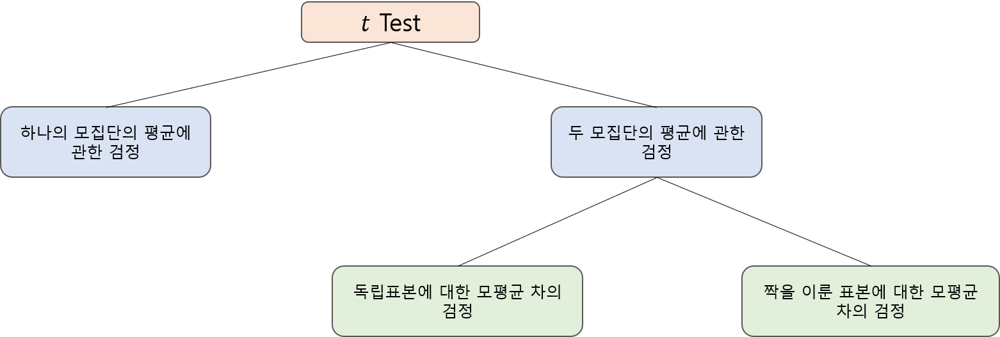
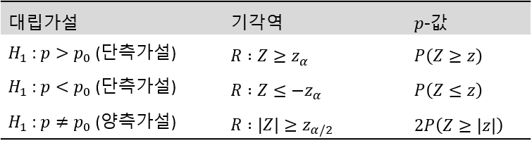

```{r setup, include=FALSE}
knitr::opts_chunk$set(echo = TRUE, warning = FALSE, message = FALSE)
options(width=200)
```


```{css, echo=FALSE}

p, ul, li{
text-align: justify
}

```

- **참고**
    - **R과 통계분석(Tidyverse 활용), 박동련 저**
    - **통계학: R을 이용한 분석, 인하대학교 통계학과 저**


# **1. 서론**

> 통계적 가설검정(Hypothesis Testing)은 모집단에 대한 가설을 설정한 후 표본에 근거하여 그 가설을 기각(Reject) 또는 채택(Accept)할 것인지를 결정하기 위한 일련의 과정이다. 가설은 귀무가설($H_0$)과 대립가설($H_1$)로 구분되며, 이 두 가설 중 어느 하나를 선택하는데 사용되는 통계량을 검정통계량(Test Statistic)이라고 한다. 가설의 기각 또는 채택은 유의수준(Significance Level)을 어떻게 설정하느냐에 따라서 달라진다. 가설검정은 대립가설의 형태에 따라 양측검정(Two-side Test)과 단측검정(One-side Test)으로 구분된다. 다음은 모평균 검정에서의 양측검정과 단측검정에 대한 일반적인 가설의 형태를 나타낸다.

$$
\begin{align}
&\cdot \;\text{양측검정} \;\;\;: \begin{cases}
H_0 : \mu = \mu_0\\
H_1 : \mu \ne \mu_0
\end{cases}\\
&\cdot \;\text{우단측검정} : \begin{cases}
H_0 : \mu \le \mu_0\\
H_1 : \mu > \mu_0
\end{cases}\\
&\cdot \;\text{좌단측검정} : \begin{cases}
H_0 : \mu \ge \mu_0\\
H_1 : \mu < \mu_0
\end{cases}
\end{align}
$$


> `하나의 모집단`에서 임의로 표본을 추출하여 모평균 $\mu$에 대한 가설검정을 수행한다고 할 때, 다음 그림을 참고하자. 표본의 크기가 큰 경우에는 중심극한정리(Central Limit Theorem)에 의해 모집단의 분포에 상관없이 표본평균 $\bar{X}$의 분포는 근사적으로 정규분포가 된다는 사실을 이용하여 $Z$ Test를 수행할 수 있다. 그러나, 한 개의 관측치를 얻는 데 시간과 비용이 많이 소요되어 많은 관측치를 얻을 수 없는 경우에는 표본의 크기가 작아서 중심극한정리를 이용할 수 없다. 실제로 표본의 크기가 작은 경우에 표본평균 $\bar{X}$의 분포는 모집단의 분포에 많은 영향을 받는다. 즉, 모집단의 분포에 따라 $\bar{X}$의 분포는 다양하게 나타난다. 따라서, 표본의 크기가 작은 경우에는 모든 모집단에 대해 적용할 수 있는 일반적인 통계적 추론방법을 제시할 수 없다.


----------------------

# **2. 모평균에 대한 추론**

- 모평균의 점추정량으로 표본평균 $\bar{X}=\frac{1}{n}\sum_{i=1}^n X_i$을 많이 사용한다.
- 그러나, 구간추정이나 검정의 경우에는 표본의 크기가 작을 때 정규분포를 이용하는 방법을 그대로 사용할 수 없는 경우가 많다.
    - 표본의 크기가 작을 때는 모집단이 정규분포를 따르고 모분산이 알려져 있을 때에만 정규분포를 이용할 수 있다.
- `모집단이 정규분포를 따르고 모분산이 알려져 있지 않은 경우`에는 $t$ 분포를 이용하여 모평균에 대한 구간추정과 검정을 수행할 수 있다.

※ 예제로 사용된 데이터들은 모두 모집단이 정규분포를 따른다고 가정한다.

----------------------

## **2-1. t 분포**

- 모집단의 분포가 $N(\mu, \sigma^2)$일 때, 임의로 추출된 $n$개의 표본 $X_1, \ldots, X_n$의 평균 $\bar{X}=\frac{1}{n}\sum_{i=1}^n X_i$의 분포는 정확하게 $N(\mu, \sigma^2/n)$이다.
- 따라서, 이를 표준화시키면 다음과 같다.
$$
\begin{align}
Z=\frac{\bar{X}-\mu}{\sigma/\sqrt{n}} \sim N(0, 1).
\end{align}
$$
- 일반적으로 모표준편차 $\sigma$는 미지수이기 때문에 이를 표본표준편차 $S=\sqrt{\frac{\sum_{i=1}^n (X_i-\bar{X})^2}{n-1}}$로 추정하여 사용하게 된다.
    - 표본의 크기 $n$이 큰 경우에는 $Z$에서 $\sigma$ 대신 $S$를 사용하여도 분포에 큰 영향을 주지 않는다.
    - 그러나, 표본의 크기 $n$이 작은 경우에는 $\sigma$를 $S$로 대체하게 되면 표준화된 확률변수의 분포는 표준정규분포와 달라지는데, 이런 경우에 그 변화된 분포를 $t$ 분포라고 한다.
    - 즉, 표본의 크기 $n$이 작은 경우에 위에서 표준화된 확률변수의 $\sigma$를 $S$로 대체하면 자유도가 $n-1$인 $t$분포를 따르게 된다.
$$
\begin{align}
T=\frac{\bar{X}-\mu}{S/\sqrt{n}} \sim t(n-1).
\end{align}
$$
- $t$ 분포는 표준정규분포와 같이 0을 중심으로 대칭이고, 종 모양의 분포이다. 
- 표준정규분포와 다른 점은 양 꼬리부분에 상대적으로 많은 확률이 존재해서 표준정규분포보다 두꺼운 꼬리를 갖는다는 것이다. 
- 그러나, 자유도가 증가하면서 꼬리부분의 확률이 중심으로 모이고 표준정규분포에 가까워진다. 

```{r}
# 표준정규분포와 t 분포
x <- seq(-5, 5, 0.01)
plot(x, dnorm(x, 0, 1), type = "l", xlab = "", ylab = "")
lines(x, dt(x, df = 2), type = "l", col = "red")
lines(x, dt(x, df = 5), type = "l", col = "green")
lines(x, dt(x, df = 10), type = "l", col = "orange")
lines(x, dt(x, df = 20), type = "l", col = "blue")
legend("topright", col = c("black", "red", "green", "orange", "blue"),
       legend = c("N(0,1)", "t(2)", "t(5)", "t(10)", "t(20)"), lty = 1,
       )
```


-------------------------

## **2-2. 구간추정**

- 정규모집단에서 추출한 표본으로부터 계산된 통계량 $\frac{\bar{X}-\mu}{S/\sqrt{n}}$은 자유도가 $n-1$인 $t$ 분포를 따른다.
- 따라서, 상위 $\alpha/2$ 확률에 해당하는 값 $t_{\alpha/2}(n-1)$, 즉, $P(t(n-1)\ge t_{\alpha/2}(n-1))=\alpha/2$에 대하여
$$
\begin{align}
P\left(-t_{\alpha/2}(n-1) < \frac{\bar{X}-\mu}{S/\sqrt{n}} < t_{\alpha/2}(n-1)\right) = 1-\alpha
\end{align}
$$
가 성립하고, 이를 $\mu$에 대한 식으로 정리하면 다음과 같다.
$$
\begin{align}
P\left(\bar{X}-t_{\alpha/2}(n-1)\frac{S}{\sqrt{n}} < \mu < \bar{X} + t_{\alpha/2}(n-1)\frac{S}{\sqrt{n}}\right) = 1-\alpha.
\end{align}
$$
- 따라서, $\mu$에 대한 $100(1-\alpha)\%$ 신뢰구간은 다음과 같이 정리될 수 있다.
$$
\begin{align}
\left(\bar{X}-t_{\alpha/2}(n-1)\frac{S}{\sqrt{n}}, \bar{X} + t_{\alpha/2}(n-1)\frac{S}{\sqrt{n}}\right) .
\end{align}
$$

-----------------------------

### **예제 1**

> 우주선 제작에 쓰기 위해서 새롭게 개발된 합금의 평균 장력 $\mu$를 추정하고자 한다. 15개의 새 합금조각으로부터 장력을 측정한 결과 평균이 39.3, 표준편차가 2.6으로 나타났을 때, 새롭게 개발된 합금의 평균장력 $\mu$에 대한 90% 신뢰구간을 구하라.

```{r}
# 신뢰구간의 하한
39.3 - qt(0.05, df = 14, lower.tail = FALSE)*2.6/sqrt(15)

# 신뢰구간의 상한
39.3 + qt(0.05, df = 14, lower.tail = FALSE)*2.6/sqrt(15)
```

`Caution!` 함수 `qt(p, df)`는 $P[T<t]=p,\;\; T\sim t(df)$인 $t$ 값을 출력한다. 여기서, 옵션 `lower.tail = FALSE` 을 지정함으로써 $P[T>t]=p,\;\; T\sim t(df)$인 $t$ 값을 계산할 수 있다.  
`Result!` 새롭게 개발된 합금의 평균장력에 대한 90% 신뢰구간은 (38.12, 40.48)이다.

---------------------------------

### **예제 2**

> 새로운 종자에서 얻은 7개의 강낭콩에 대한 발아시기가 12, 16, 15, 20, 17, 11, 18로 기록되었다. 모집단이 정규분포를 만족할 때, 이 새로운 종자에 대한 실제 평균 발아시기의 95%와 99% 신뢰구간을 구하라.

```{r}
# 데이터
x <- c(12, 16, 15, 20, 17, 11, 18)

# 표본 개수
n <- length(x)
n

# 표본평균
bar.x <- mean(x)
bar.x

#표본표준편차
s <- sd(x)
s

# 95%신뢰구간의 하한
bar.x - qt(0.025, df = 6, lower.tail = FALSE)*(s/sqrt(n))

# 95%신뢰구간의 상한
bar.x + qt(0.025, df = 6, lower.tail = FALSE)*(s/sqrt(n))

# 99%신뢰구간의 하한
bar.x - qt(0.005, df = 6, lower.tail = FALSE)*(s/sqrt(n))

# 95%신뢰구간의 상한
bar.x + qt(0.005, df = 6, lower.tail = FALSE)*(s/sqrt(n))
```

`Result!` 새로운 종자에 대한 실제 평균 발아시기의 95% 신뢰구간은 (12.61, 18.54)이며, 99% 신뢰구간은 (11.08, 20.07)이다.

---------------------------------

## **2-3. 가설검정**

- $t$ 검정은 모집단이 정규분포를 따른다는 가정 하에서 모집단 평균 $\mu$에 대하여 다음 그림과 같은 형태의 검정을 할 때 사용된다. 



- 하나의 모집단의 모평균에 대한 검정, 즉, 귀무가설 $H_0:\mu=\mu_0$를 검정하기 위해서 모평균이 $\mu$이고 모분산이 $\sigma^2$인 정규분포를 따르는 모집단으로부터 추출된 $n$개의 표본을 $X_1, \ldots, X_n$이라고 하자
    - 여기서, 모분산 $\sigma^2$은 알려지지 않았다고 가정한다.


- 이때 귀무가설 $H_0:\mu=\mu_0$을 검정하기 위한 검정통계량은
$$
\begin{align}
T=\frac{\bar{X}-\mu_0}{S/\sqrt{n}} \sim t(n-1)
\end{align}
$$
로 정의된다.
    - 이 검정통계량의 값은 표본평균 $\bar{X}$와 표본표준편차 $S$를 이용하여 구할 수 있다.
        - 주어진 표본으로부터 계산된 표본평균 $\bar{x}$와 표본표준편차 $s$를 이용하여 구한 검정통계량의 값은 $t=\frac{\bar{x}-\mu_0}{s/\sqrt{n}}$이다.
- 검정통계량 $T$는 귀무가설 $H_0$이 참이라는 가정 하에서 자유도가 $n-1$인 $t$ 분포를 따르므로 이를 이용하면 단일 모집단의 모평균에 대한 검정을 수행할 수 있다.
- 각 대립가설에 대하여 유의수준 $\alpha$를 갖는 기각역과 $p$-값은 다음과 같다.


- 일반적으로 가절검정은 다음과 같은 절차에 의해서 수행된다.
    1. 가설설정
    2. 검정통계량 값 또는 유의확률 계산
    3. 유의수준 결정
    4. 가설의 기각 여부 결정
- R에서 $t$ 검정은 함수 `t.test()`를 이용하여 수행할 수 있다.

```{r, eval = FALSE}
t.test(x, alternative = c("two.sided", "less", "greater"), mu = 0, conf.level = 0.95,...)
```

- `x` : 가설검정을 수행하고자 하는 데이터
- `alternative` : 검정하고자 하는 대립가설의 종류
    - `two.sided` : 양측검정
    - `less` : 좌단측검정
    - `greater` : 우단측검정
- `mu` : 귀무가설 $H_0:\mu=\mu_0$에서의 $\mu_0$값
    - 즉, 검정하고자 하는 모평균 값
- `conf.level` : 신뢰구간의 신뢰수준
    - `0.95` : 95% 신뢰구간을 제공

-----------------------

### **예제 1**

> 어느 도시의 보건복지과에서는 그 도시의 상수원인 어느 호수의 수질에 관심이 있다고 한다. 수질을 나타내는 하나의 수치로 단위부피당 평균 세균수가 있는데, 그 수가 200 이상이면 상수원으로 적합하지 않다고 한다. 호수의 열 군데에서 물을 떠서 조사한 결과 단위부피당 세균수가 다음과 같이 나타났다. 이 자료로부터 호수의 단위부피당 평균 세균수($\mu$)가 200보다 적다고 주장할 수 있겠는가? (유의수준 0.05에서 검정)

$$
\begin{align}
175\;\; 190\;\; 215\;\; 198\;\; 184\\
207\;\; 210\;\; 193\;\; 196\;\; 180
\end{align}
$$

```{r}
# 데이터
x <- c(175, 190, 215, 198, 184, 207, 210, 193, 196, 180)

# t 검정
t.test(x, alternative = "less", mu = 200)
```

`Caution!` 예제에서 귀무가설은 $H_0 : \mu\ge 200$, 대립가설은 $H_1 : \mu<200$이다. $H_0$이 참이라는 가정 하에서 검정통계량은 $T=\frac{\bar{X}-200}{13.13858/\sqrt{10}}\sim t(9)$이다.   
`Result!` 관측된 데이터에 의해 계산된 표본평균은 194.8이기 때문에 검정통계량 값은 $t=\frac{194.8-200}{13.13858/\sqrt{10}}=-1.2516$이며, 유의확률 $p$-값은 $P(T\le -1.2516)=0.1211$이다. 이에 근거하여, 유의수준 5%에서 $p$-값이 0.05보다 크기 때문에 귀무가설 $H_0 : \mu\ge 200$을 기각할 수 없다. 즉, 주어진 10개의 자료로부터 호수의 단위부피당 평균세균수가 200보다 적다고 안심할 수 없다. 유의확률을 계산하지 않고도 기각역이 $R : T\le -1.833$이기 때문에 검정통계량 값 $t$가 기각역에 포함되지 않으므로 귀무가설을 기각할 수 없다. 또한, 95% 신뢰구간은 $\left(-\infty, \bar{X}+t_{0.05}(n-1)\frac{S}{\sqrt{n}}\right)$이며, 주어진 자료로부터 계산된 95% 신뢰구간은 $\left(-\infty, 202.4162\right)$이다.

----------------------------

### **예제 2**

> 어떤 압축기의 냉각제로 사용된 물의 평균 온도증가는 5℃를 넘어서는 안된다고 한다. 냉각제의 온도증가량을 8개의 독립적인 압축기의 수관에서 측정하였더니 그 측정치들이 다음과 같았다. 이들 자료로부터 평균 온도증가가 5℃를 넘는다고 할 수 있겠는가? (유의수준 0.05에서 검정)

$$
\begin{align}
6.4\;\; 4.3\;\; 5.7\;\; 4.9\;\; 6.5\;\; 5.9 \;\; 6.4\;\; 5.1
\end{align}
$$

```{r}
# 데이터 
x <- c(6.4, 4.3, 5.7, 4.9, 6.5, 5.9, 6.4, 5.1)

# t 검정
t.test(x, alternative = "greater", mu = 5)
```

`Caution!` 예제에서 귀무가설은 $H_0 : \mu\le 5$, 대립가설은 $H_1 : \mu>5$이다. $H_0$이 참이라는 가정 하에서 검정통계량은 $T=\frac{\bar{X}-5}{0.8106435/\sqrt{8}}\sim t(7)$이다.   
`Result!` 관측된 데이터에 의해 계산된 표본평균은 5.65이기 때문에 검정통계량 값은 $t=\frac{5.65-5}{0.8106435/\sqrt{8}}=2.2679$이며, 유의확률 $p$-값은 $P(T\ge 2.2679)=0.02883$이다. 이에 근거하여, 유의수준 5%에서 $p$-값이 0.05보다 작기 때문에 귀무가설 $H_0 : \mu\le 5$을 기각한다. 즉, 주어진 8개의 자료로부터 평균 온도증가가 5℃를 넘는다고 할 수 있다. 유의확률을 계산하지 않고도 기각역이 $R : T \ge 1.8946$이기 때문에 검정통계량 값 $t$가 기각역에 포함되므로 귀무가설을 기각할 수 있다. 또한, 95% 신뢰구간은 $\left(\bar{X}-t_{0.05}(n-1)\frac{S}{\sqrt{n}}, \infty \right)$이며, 주어진 자료로부터 계산된 95% 신뢰구간은 $\left(5.107003, \infty \right)$이다.

----------------------------

### **예제 3**

> 다음에 주어진 데이터를 근거로 가설 $H_0 : \mu = 120$, $H_1 : \mu \ne 120$을 유의수준 0.05에서 검정하고자 한다.

$$
\begin{align}
128\;\; 118 \;\; 120\;\; 122\;\; 119\;\; 113\;\; 124\;\; 122\;\; 120\;\; 123
\end{align}
$$

```{r}
# 데이터 
x <- c(128, 118, 120, 122, 119, 113, 124, 122, 120, 123)

# t 검정
t.test(x, alternative = "two.sided", mu = 120)
```

`Caution!` 예제에서 귀무가설은 $H_0 : \mu = 120$, 대립가설은 $H_1 : \mu \ne 120$이다. $H_0$이 참이라는 가정 하에서 검정통계량은 $T=\frac{\bar{X}-120}{3.984693/\sqrt{10}}\sim t(9)$이다.   
`Result!` 관측된 데이터에 의해 계산된 표본평균은 120.9이기 때문에 검정통계량 값은 $t=\frac{120.9-120}{3.984693/\sqrt{10}}=0.71425$이며, 유의확률 $p$-값은 $2P(T\ge |0.71425|) = 0.4932$이다. 이에 근거하여, 유의수준 5%에서 $p$-값이 0.05보다 크기 때문에 귀무가설 $H_0 : \mu= 120$을 기각할 수 없다. 즉, 주어진 10개의 자료로부터 평균이 120이라고 할 수 있다. 유의확률을 계산하지 않고도 기각역이 $R : |T| \ge 2.2622$이기 때문에 검정통계량 값 $t$가 기각역에 포함되지 않으므로 귀무가설을 기각할 수 없다. 또한, 95% 신뢰구간은 $\left(\bar{X}-t_{0.025}(n-1)\frac{S}{\sqrt{n}}, \bar{X}+t_{0.025}(n-1)\frac{S}{\sqrt{n}} \right)$이며, 주어진 자료로부터 계산된 95% 신뢰구간은 $\left(118.0495, 123.7505 \right)$이다.

----------------------------

### **예제 4**

> 오수침전물이 비료로 쓰였던 6개의 대표적인 정원엣 양상추잎을 대상으로 중금속인 카드뮴의 놑도를 측정하여 다음과 같은 값을 얻었다. 카드뮴의 평균 농도가 12보다 크다는 증거가 있는가? (유의수준 0.05에서 검정)

$$
\begin{align}
21\;\; 38\;\; 12\;\; 15\;\; 14\;\; 8
\end{align}
$$

```{r}
# 데이터 
x <- c(21, 38, 12, 15, 14, 8)

# t 검정
t.test(x, alternative = "greater", mu = 12)
```

`Caution!` 예제에서 귀무가설은 $H_0 : \mu \le 12$, 대립가설은 $H_1 : \mu > 12$이다. $H_0$이 참이라는 가정 하에서 검정통계량은 $T=\frac{\bar{X}-12}{10.67708/\sqrt{6}}\sim t(5)$이다.   
`Result!` 관측된 데이터에 의해 계산된 표본평균은 18이기 때문에 검정통계량 값은 $t=\frac{18-12}{10.67708/\sqrt{6}}=1.3765$이며, 유의확률 $p$-값은 $P(T \ge 1.3765)= 0.1136$이다. 이에 근거하여, 유의수준 5%에서 $p$-값이 0.05보다 크기 때문에 귀무가설 $H_0 : \mu  \le 12$을 기각할 수 없다. 즉, 주어진 6개의 자료로부터 카드뮴의 평균 농도가 12보다 크다고 할 수 없다. 유의확률을 계산하지 않고도 기각역이 $R : T \ge 2.0150$이기 때문에 검정통계량 값 $t$가 기각역에 포함되지 않으므로 귀무가설을 기각할 수 없다. 또한, 95% 신뢰구간은 $\left(\bar{X}-t_{0.05}(n-1)\frac{S}{\sqrt{n}}, \infty \right)$이며, 주어진 자료로부터 계산된 95% 신뢰구간은 $\left(9.216608, \infty \right)$이다.

-------------------------------

## **2-4. 신뢰구간과 양측검정의 관계**

- 모평균 $\mu$에 대한 $100(1-\alpha)\%$ 신뢰구간은
$$
\begin{align}
\left(\bar{X}-t_{\alpha/2}(n-1)\frac{S}{\sqrt{n}}, \bar{X} + t_{\alpha/2}(n-1)\frac{S}{\sqrt{n}}\right) 
\end{align}
$$
이다.
- 한편, $H_0 : \mu=\mu_0$에 대한 양측검정에서의 기각역은 유의수준이 $\alpha$일 때
$$
\begin{align}
R : |T|=\left|\frac{\bar{X}-\mu_0}{S/\sqrt{n}}\right | \ge t_{\alpha/2}(n-1)
\end{align}
$$
이다.
- 이 기각역의 여집합, 즉, 귀무가설 $H_0$를 기각하지 못하고 받아들이게 하는 영역을 "채택영역"이라고 이름 붙인다면 채택영역은
$$
\begin{align}
\text{채택영역} : \left|\frac{\bar{X}-\mu_0}{S/\sqrt{n}}\right | < t_{\alpha/2}(n-1)
\end{align}
$$
이고, 이를 $\mu_0$를 중심으로 풀어 쓰면
$$
\begin{align}
\text{채택영역} : \bar{X}-t_{\alpha/2}(n-1)\frac{S}{\sqrt{n}} < \mu_0 < \bar{X} + t_{\alpha/2}(n-1)\frac{S}{\sqrt{n}}
\end{align}
$$
이다.
- 따라서, 양측검정한다고 할 때 $\mu_0$가 $100(1-\alpha)\%$ 신뢰구간에 포함되면 귀무가설을 기각할 수 없다.

-------------------------------

### **예제 1**

> 다음에 주어진 데이터를 근거로 가설 $H_0 : \mu = 120$, $H_1 : \mu \ne 120$을 검정하고자 한다.

$$
\begin{align}
128\;\; 118 \;\; 120\;\; 122\;\; 119\;\; 113\;\; 124\;\; 122\;\; 120\;\; 123
\end{align}
$$

```{r}
# 데이터 
x <- c(128, 118, 120, 122, 119, 113, 124, 122, 120, 123)

# t 검정
t.test(x, alternative = "two.sided", mu = 120)
```

`Result!` 95% 신뢰구간이 $(118.0495, 123.7505)$이므로 $\mu_0=120$을 포함한다. 이에 근거하여, 유의수준 5%에서 귀무가설 $H_0 : \mu = 120$을 기각할 수 없다. 

-------------------------------

### **예제 2**

> 8명의 환자에 대하여 3주 동안 체지방이 감소하는 양을 기록하였다. 가설 $H_0 : \mu = 15$, $H_1 : \mu \ne 15$을 유의수준 0.05에서 검정하고자 한다.

$$
\begin{align}
1.8\;\; 10.6\;\; -1.2\;\; 12.9\;\; 15.1\;\; -2.0\;\; 6.25\;\; 10.8
\end{align}
$$
```{r}
# 데이터
x <- c(1.8, 10.6, -1.2, 12.9, 15.1, -2.0, 6.25, 10.8)

# t 검정
t.test(x, alternative = "two.sided", mu = 15)
```

`Result!` 95% 신뢰구간이 $(1.278373, 12.284127)$이므로 $\mu_0=15$를 포함하지 않는다. 이에 근거하여, 유의수준 5%에서 귀무가설 $H_0 : \mu = 15$를 기각할 수 있다. 

-------------------------------

# **3. 모비율에 대한 추론**

- 모집단을 구성하고 있는 각 개체들이 두 가지의 어떤 속성 중 하나의 속성을 반드시 갖게 되는 경우를 고려해 보자.
    - 즉, 모집단 개체들이 두 그룹으로 분리되는 경우가 해당된다.
- 이때 모집단을 구성하고 있는 개체 중 특정 속성을 지니고 있는 `개체의 비율을 추정`한다고 하자.
    - 예를 들어, 특정 정치인에 대한 지지율, 특정 나라의 실업률 등이 있다.
- 모평균에 대한 추정량으로 표본평균을 이용했듯이, 모비율에 대한 추정량으로 표본비율 $\hat{p}=X/n$을 사용할 수 있다.
    - 예를 들어, 어느 도시에서 실업률 $p$를 추정하고자 할 때, 임의로 $n$명을 추출하고 그 중 실직자 수를 $X$라고 하면, $p$에 대한 추정량인 표본비율은 $\hat{p}=X/n$이 된다.
    
--------------------------------

## **3-1. 구간추정**

- 표본 데이터는 모집단에서 임의로 추출된 각 개체들이 특정 속성을 지니고 있는지 여부에 따라 1 또는 0의 값을 갖게 될 것이며, 이러한 표본 개체 중 특정 속성을 지니고 있는 개체의 수를 확률변수 $X$라 두면 $X$는 이항분포를 따른다.
    - 즉,
$$
\begin{align}
X\sim Bin(n, p)
\end{align}
$$
        - 여기서, $n$은 표본의 크기, $p$는 모비율을 의미한다.
- 만약 표본의 크기 $n$이 크다면 $X$는 근사적으로 평균이 $np$이고 분산이 $np(1-p)$인 정규분포를 따른다. 
- 이를 $X$의 표준화된 분포로 나타내면
$$
\begin{align}
Z=\frac{X-np}{\sqrt{np(1-p)}}\sim N(0, 1)
\end{align}
$$
가 된다.
- 따라서, 위의 식에서 분모와 분자를 각각 $n$으로 나누어 주면 다음과 같이 표본비율 $\hat{p}=X/n$의 표준화된 분포를 얻을 수 있다.
$$
\begin{align}
Z=\frac{\hat{p}-p}{\sqrt{\frac{p(1-p)}{n}}} \sim N(0, 1).
\end{align}
$$
    - 즉, 표본의 크기가 $n$이 크다면 표본비율 $\hat{p}=X/n$은 평균이 $p$이고 표준편차가 $\sqrt{\frac{p(1-p)}{n}}$인 정규분포를 따른다.
        - $\hat{p}\sim N(p, p(1-p)/n)$.
- 이를 이용하여, 상위 $\alpha/2$ 확률에 해당하는 값 $z_{\alpha/2}$, 즉, $P(Z\ge z_{\alpha/2})=\alpha/2$에 대하여 
$$
\begin{align}
P\left(-z_{\alpha/2} < \frac{\hat{p}-p}{\sqrt{\frac{p(1-p)}{n}}} < z_{\alpha/2}\right) = 1-\alpha
\end{align}
$$
가 성립하고, 이를 $p$에 대한 식으로 정리하면 다음과 같다.
$$
\begin{align}
P\left(\hat{p}-z_{\alpha/2}{\sqrt{\frac{p(1-p)}{n}}} < p < \hat{p} + z_{\alpha/2}{\sqrt{\frac{p(1-p)}{n}}}\right) = 1-\alpha.
\end{align}
$$
- 따라서, $p$에 대한 $100(1-\alpha)\%$ 신뢰구간은 다음과 같이 정리될 수 있다.
$$
\begin{align}
\left(\hat{p}-z_{\alpha/2}{\sqrt{\frac{p(1-p)}{n}}}, \hat{p} + z_{\alpha/2}{\sqrt{\frac{p(1-p)}{n}}}\right) .
\end{align}
$$
- 그러나, 이 구간은 미지수인 $p$를 포함하고 있으므로 표본으로부터 계산이 불가능하며, $p$를 추정량인 $\hat{p}$로 대체하여 원하는 신뢰구간을 구할 수 있다.
$$
\begin{align}
\left(\hat{p}-z_{\alpha/2}{\sqrt{\frac{\hat{p}(1-\hat{p})}{n}}}, \hat{p} + z_{\alpha/2}{\sqrt{\frac{\hat{p}(1-\hat{p})}{n}}}\right) .
\end{align}
$$

-------------------------

### **예제 1**

> 어느 대학교의 총학생회장 선거에서의 투표율을 알아보기 위해서 78명의 학생을 대상으로 조사한 결과 49명이 투표에 참가하였다고 하자. 모비율에 대한 95% 신뢰구간을 구하라.

```{r}
# 표본비율
p <- 49/78
p

# 95% 신뢰구간 하한
p-qnorm(0.025, mean  = 0, sd = 1, lower.tail = FALSE)*sqrt(p*(1-p)/78)

# 95% 신뢰구간 상한
p+qnorm(0.025, mean  = 0, sd = 1, lower.tail = FALSE)*sqrt(p*(1-p)/78)
```

`Caution!` 함수 `qnorm(p, mean, sd)`는 $P[X<x]=p,\;\; X\sim N(\text{mean}, \text{sd}^2)$인 $x$ 값을 출력한다. 여기서, 옵션 `lower.tail = FALSE` 을 지정함으로써 $P[X>x]=p,\;\; X\sim N(\text{mean}, \text{sd}^2)$인 $x$ 값을 계산할 수 있다.  
`Result!` 대학교의 총학생회장 선거에서의 투표율에 대한 95% 신뢰구간은 (0.52, 0.74)이다.

-------------------------

### **예제 2**

> 어떤 사람이 A 상표 세제의 시장점유율을 조사한다고 하자. 즉, 모든 상표들의 총 판매량에 대한 A 상표의 판매량을 비율을 조사하려고 한다. 그 사람은 몇 개의 상점으로부터 425상자의 세제가 판매된 가운데 120상자가 A 상표의 세제였다는 것을 알아냈다고 하자. A 상표의 시장점유율에 대한 90%, 99% 신뢰구간을 구하라.

```{r}
# 표본비율
p <- 120/425
p

# 90% 신뢰구간 하한
p-qnorm(0.05, mean  = 0, sd = 1, lower.tail = FALSE)*sqrt(p*(1-p)/425)

# 90% 신뢰구간 상한
p+qnorm(0.05, mean  = 0, sd = 1, lower.tail = FALSE)*sqrt(p*(1-p)/425)

# 99% 신뢰구간 하한
p-qnorm(0.005, mean  = 0, sd = 1, lower.tail = FALSE)*sqrt(p*(1-p)/425)

# 99% 신뢰구간 상한
p+qnorm(0.005, mean  = 0, sd = 1, lower.tail = FALSE)*sqrt(p*(1-p)/425)
```

`Result!` A 상표의 시장점유율에 대한 90%, 99% 신뢰구간은 각각 (0.25, 0.32)와 (0.23, 0.34)이다.

-------------------------

## **3-2. 가설검정**

- 모비율에 대한 귀무가설 $H_0 : p=p_0$을 검정하기 위한 검정방법을 생각해 보자.
- 앞에서도 언급하였듯이 표본의 크기가 클 때 모비율의 추정량인 표본비율 $\hat{p}=X/n$은 근사적으로 정규분포를 따른다.
- 만약, 귀무가설 $H_0 : p=p_0$이 참이라는 가정 하에서 $\hat{p}$의 분포는 근사적으로 $N(p_0, p_0(1-p_0)/n)$이다.
- 따라서, 이를 표준화시킨 검정통계량은 
$$
\begin{align}
Z=\frac{\hat{p}-p_0}{\sqrt{\frac{p_0(1-p_0)}{n}}} \sim N(0, 1)
\end{align}
$$
이 된다.
- 각 대립가설에 대하여 유의수준 $\alpha$를 갖는 기각역과 $p$-값은 다음과 같다.



- R에서 모비율에 대한 검정은 함수 `prop.test()`를 이용하여 수행할 수 있다.

```{r, eval = FALSE}
prop.test(x, n, p = 0.5, alternative = c("two.sided", "less", "greater"), conf.level = 0.95, ...)
```

- `x` : 성공횟수
- `n` : 실행횟수
- `p` : 귀무가설 $H_0:p=p_0$에서의 $p_0$값
    - 즉, 검정하고자 하는 모비율 값
- `alternative` : 검정하고자 하는 대립가설의 종류
    - `two.sided` : 양측검정
    - `less` : 좌단측검정
    - `greater` : 우단측검정
- `conf.level` : 신뢰구간의 신뢰수준
    - `0.95` : 95% 신뢰구간을 제공

--------------------------

### **예제 1**

> 어떤 특정한 암의 경우에 수술을 시행한 후 완치되는 비율(5년 이상 생존비율)이 30%라고 한다. 이 암에 걸린 60명의 환자를 대상으로 수술뿐 아니라 수술 전후에 일정기간 방사선치료를 병행하였더니 60명 중 27명이 완치되었다고 한다. 이 자료로부터 수술만 하는 것보다 방사선치료를 병행하는 것이 암의 완치율($p$)을 높이는 데 효과가 있다고 할 수 있는지 유의수준 0.05에서 검정하라.

```{r}
prop.test(x = 27, n = 60, p = 0.3, alternative = "greater", correct = FALSE)
```

`Caution!` 예제에서 귀무가설은 $H_0 : p\le 0.3$, 대립가설은 $H_1 : p > 0.3$이다. $H_0$이 참이라는 가정 하에서 검정통계량은 $Z=\frac{\hat{p}-0.3}{\sqrt{\frac{0.3*0.7}{60}}} \sim N(0, 1)$이다.  
함수 `prop.test(, correct = FALSE)`는 연속성의 수정을 하지 않겠다는 옵션이다.  
`Result!` 관측된 데이터에 의해 계산된 표본비율은 0.45이기 때문에 검정통계량 값은 $z=\frac{0.45-0.3}{\sqrt{\frac{0.3*0.7}{60}}}=2.535463$이다. 출력창에 "X-squared" 값이 바로 $z$ 값을 제곱한 $z^2$이며, 표준정규분포를 제곱하면 자유도가 1인 카이제곱분포를 따른다. 유의확률 $p$-값은 $P(Z \ge 2.535463)= 0.005615$이다. 이에 근거하여, 유의수준 5%에서 $p$-값이 0.05보다 작기 때문에 귀무가설 $H_0 : p \le 0.3$을 기각할 수 있다. 즉, 수술만 하는 것보다 방사선치료를 병행하는 것이 암의 완치율을 높이는 데 효과가 있다.

--------------------------

### **예제 2**

> 정치문제에 관심을 가진 한 시민들의 모임에서, 유권자의 절반 미만이 대통령의 최근 중대국면에 대한 대처방안을 지지하고 있음을 보이려고 한다. 500명의 유권자로 이루어진 표본 중에 228명이 지지표를 던졌다면, 어떠한 검정결과가 나오겠는가? (유의수준 0.05에서 검정)

```{r}
prop.test(x = 228, n = 500, p = 0.5, alternative = "less", correct = FALSE)
```

`Caution!` 예제에서 귀무가설은 $H_0 : p\ge 0.5$, 대립가설은 $H_1 : p < 0.5$이다. $H_0$이 참이라는 가정 하에서 검정통계량은 $Z=\frac{\hat{p}-0.5}{\sqrt{\frac{0.5*0.5}{500}}} \sim N(0, 1)$이다.  
함수 `prop.test(, correct = FALSE)`는 연속성의 수정을 하지 않겠다는 옵션이다.  
`Result!` 관측된 데이터에 의해 계산된 표본비율은 0.456이기 때문에 검정통계량 값은 $z=\frac{0.456-0.5}{\sqrt{\frac{0.5*0.5}{500}}}=-1.96774$이다. 출력창에 "X-squared" 값이 바로 $z$ 값을 제곱한 $z^2$이며, 표준정규분포를 제곱하면 자유도가 1인 카이제곱분포를 따른다. 유의확률 $p$-값은 $P(Z \le -1.96774)= 0.02455$이다. 이에 근거하여, 유의수준 5%에서 $p$-값이 0.05보다 작기 때문에 귀무가설 $H_0 : p \ge 0.5$을 기각할 수 있다. 즉, 유권자의 절반 미만이 대통령의 최근 중대국면에 대한 대처방안을 지지하고 있다.

--------------------------

### **예제 3**

> $p$를 지난해에 미국의 어느 도시에서 법률상담한 성인의 비율이라고 하자. 200명의 임의추출된 표본에서 65명이 법률상담을 의뢰하였다고 하면 가설 $H_0 : p\le 0.25$, $H_1 : p>0.25$에 대한 검정결과는 어떻게 되겠는가? (유의수준 0.05에서 검정)


```{r}
prop.test(x = 65, n = 200, p = 0.25, alternative = "greater", correct = FALSE)
```

`Caution!` 예제에서 귀무가설은 $H_0 : p\le 0.25$, 대립가설은 $H_1 : p > 0.25$이다. $H_0$이 참이라는 가정 하에서 검정통계량은 $Z=\frac{\hat{p}-0.25}{\sqrt{\frac{0.25*0.75}{200}}} \sim N(0, 1)$이다.  
함수 `prop.test(, correct = FALSE)`는 연속성의 수정을 하지 않겠다는 옵션이다.  
`Result!` 관측된 데이터에 의해 계산된 표본비율은 0.325이기 때문에 검정통계량 값은 $z=\frac{0.325-0.25}{\sqrt{\frac{0.25*0.75}{200}}}=2.44949$이다. 출력창에 "X-squared" 값이 바로 $z$ 값을 제곱한 $z^2$이며, 표준정규분포를 제곱하면 자유도가 1인 카이제곱분포를 따른다. 유의확률 $p$-값은 $P(Z \ge 2.44949)= 0.007153$이다. 이에 근거하여, 유의수준 5%에서 $p$-값이 0.05보다 작기 때문에 귀무가설 $H_0 : p \le 0.25$을 기각할 수 있다. 즉, 법률상담한 성인의 비율이 0.25보다 크다고 할 수 있다.

--------------------------

### **예제 4**

> 어떤 영업 담당자는 레몬향과 아몬드향 냄새가 나는 주방용 세제가 소비자들에게 똑같이 인기가 있는지를 판단하고자 한다. 250명의 소비자를 인터뷰한 결과 145명이 레몬향 주방용 세제를 더 좋아하고, 105명은 아몬드향 주방용 세제를 선택하였다. 이 두 가지 향의 세제 중에서 선호도에 차이가 있다는 강력한 증거를 자료로부터 얻을 수 있는가? (유의수준 0.05에서 검정)

```{r}
# 레몬향 주방용 세제
prop.test(x = 145, n = 250, p = 0.5, alternative = "two.sided", correct = FALSE)
```

`Caution!` 예제에서 $p$를 레몬향 주방용 세제를 더 좋아하는 소비자의 비율이라고 할 때, 귀무가설은 $H_0 : p = 0.5$, 대립가설은 $H_1 : p \ne 0.5$이다. $H_0$이 참이라는 가정 하에서 검정통계량은 $Z=\frac{\hat{p}-0.5}{\sqrt{\frac{0.5*0.5}{250}}} \sim N(0, 1)$이다.  
함수 `prop.test(, correct = FALSE)`는 연속성의 수정을 하지 않겠다는 옵션이다.  
`Result!` 관측된 데이터에 의해 계산된 표본비율은 0.58이기 때문에 검정통계량 값은 $z=\frac{0.58-0.5}{\sqrt{\frac{0.5*0.5}{250}}}=2.529822$이다. 출력창에 "X-squared" 값이 바로 $z$ 값을 제곱한 $z^2$이며, 표준정규분포를 제곱하면 자유도가 1인 카이제곱분포를 따른다. 유의확률 $p$-값은 $2P(Z\ge |2.529822|)= 0.01141$이다. 이에 근거하여, 유의수준 5%에서 $p$-값이 0.05보다 작기 때문에 귀무가설 $H_0 : p = 0.5$을 기각할 수 있다. 즉, 두 가지 향의 세제에 대한 선호도에 차이가 있다.

--------------------------

`Caution!` 만약 표본의 크기가 충분히 크지 않아서 모비율의 추정량인 $\hat{p}=X/n$이 정규분포를 따르지 않는 경우에 모비율의 검정은 이항분포에 근거를 둔 함수 `binom.test()`를 이용해야한다. 기본적인 사용법은 `prop.test()`와 동일하다.

```{r, eval = FALSE}
binom.test(x, n, p = 0.5, alternative = c("two.sided", "less", "greater"), conf.level = 0.95)
```
- `x` : 성공횟수
- `n` : 실행횟수
- `p` : 귀무가설 $H_0:p=p_0$에서의 $p_0$값
    - 즉, 검정하고자 하는 모비율 값
- `alternative` : 검정하고자 하는 대립가설의 종류
    - `two.sided` : 양측검정
    - `less` : 좌단측검정
    - `greater` : 우단측검정
- `conf.level` : 신뢰구간의 신뢰수준
    - `0.95` : 95% 신뢰구간을 제공
    
-----------------------------

### **예제 5**

> 10번 실행에서 3번 성공한 실험결과를 근거로 하여 가설 $H_0 : p=0.1$, $H_1 : p\ne 0.1$에 대한 검정결과는 어떻게 되겠는가? (유의수준 0.05에서 검정)

```{r}
binom.test(3, 10, p = 0.1, alternative = "two.sided")
```

`Result!` 관측된 데이터에 의해 계산된 표본비율은 0.3이며, 유의확률 $p$-값은 0.07019이다. 이에 근거하여, 유의수준 5%에서 $p$-값이 0.05보다 크기 때문에 귀무가설 $H_0 : p = 0.1$을 기각할 수 없다. 
