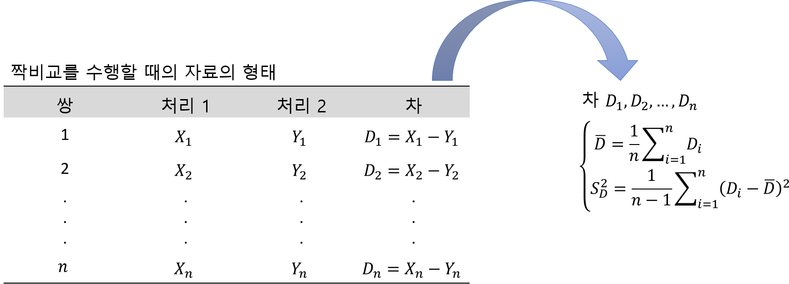

```{r setup, include=FALSE}
knitr::opts_chunk$set(echo = TRUE, warning = FALSE, message = FALSE)
options(width=200)
```


```{css, echo=FALSE}

p, ul, li{
text-align: justify
}

```

- **참고**
    - **통계학: R을 이용한 분석, 인하대학교 통계학과 저**
    
    
# **1. 서론**

> 이전 장에서는 하나의 모집단에 대한 추론의 방법을 공부하였는데, 하나의 모집단에 관한 것뿐 아니라 두 모집단 간의 차이가 관심의 대상이 되는 경우도 많이 있다. 예를 들어, 기존의 치료약과 새롭게 개발된 치료약의 효능을 비교한다든지, 두 종류의 강의방법에 의한 학습효과를 비교한다든지, 시판되는 다이어트 상품의 효과를 알아보기 위해 사용 전후의 체중을 비교한다든지 하는 일들이 이와 같은 경우에 해당한다. 두 모집단의 비교를 위한 추론과정은 데이터를 어떻게 수집하느냐에 따라 추론방법이 달라지게 된다. 실험의 대상인 실험단위를 임의로 두 그룹으로 나누어 한 그룹에는 처리 1을, 다른 그룹에는 처리 2를 배정하는 경우 각 그룹에서 얻어지는 반응값들은 서로 영향을 주지 않고 독립이다. 따라서, 두 그룹에서 얻어진 반응값들은 두 개의 모집단으로부터 얻어진 두 개의 독립인 표본데이터라고 생각할 수 있다. 이와 같은 경우를 "독립인 두 표본으로부터 두 모집단을 비교"하는 경우라고 한다. 이에 반해, 하나의 실험단위에 처리 1과 2를 모두 배정하는 경우 얻어지는 반응값들은 서로 독립이라고 할 수 없다. 이와 같은 경우를 "짝비교"라고 한다. 이 장에서는 두 경우의 모평균 차에 대한 통계적 가설 검정 방법을 살펴보고자 한다.


-------------------

# **2. 독립 표본에 대한 모평균 검정**

> 독립인 두 개의 표본으로부터 두 모집단, 혹은 두 가지의 처리효과를 비교하는 통계추론의 방법을 살펴본다.

-------------------

## **2-1. 표본의 크기가 큰 경우**


- 여기서 우리의 관심사는 두 모집단의 평균 반응값의 차이다.
    - 즉, 모수 $\mu_1-\mu_2$에 대한 추론이다.
        - 여기서 $\mu_1$은 확률변수 $X$의 모평균, $\mu_2$는 확률변수 $Y$의 모평균이라고 한다.
- 두 모평균의 차 $\mu_1-\mu_2$에 대한 추론을 위해서는 두 표본평균의 차 $\bar{X}-\bar{Y}$를 이용하는 것이 보통이다.
- 두 표본의 크기 $n_1, n_2$가 모두 큰 경우(30 이상)에는 중심극한정리에 의해 $\bar{X}$와 $\bar{Y}$는 다음과 같이 근사적으로 정규분포를 따른다.
$$
\begin{align*}
\bar{X} \sim N \left(\mu_1, \frac{\sigma_1^2}{n_1}\right),\;\; \bar{Y} \sim N\left(\mu_2, \frac{\sigma_2^2}{n_2}\right).
\end{align*}
$$
    - 두 개의 확률변수 $U,\; V$가 서로 독립이고 $U \sim N(\mu_U, \sigma_U^2),\; V \sim N(\mu_V, \sigma_V^2)$일 때 두 변수의 합과 차는 각각 정규분포를 따른다.
        - 두 변수의 합 $U+V\sim N(\mu_U+\mu_V, \sigma^2_U+\sigma^2_V)$
        - 두 변수의 차 $U-V\sim N(\mu_U-\mu_V, \sigma^2_U+\sigma^2_V)$
- 두 표본은 서로 독립이므로 두 표본평균의 차인 $\bar{X}-\bar{Y}$도 다음과 같은 정규분포를 따른다.
$$
\begin{align*}
\bar{X}-\bar{Y} \sim N \left(\mu_1-\mu_2, \frac{\sigma_1^2}{n_1}+\frac{\sigma_2^2}{n_2}\right).
\end{align*}
$$
- 따라서, 표준화된 확률변수 $\{(\bar{X}-\bar{Y})-(\mu_1-\mu_2)\}/\sqrt{\sigma^2_1/n_1+\sigma^2_2/n_2}$는 표준정규분포 $N(0,1)$를 따르고, 모분산을 모를 때에는 이를 표본분산으로 대체하여도 다음과 같이 근사적으로 표준정규분포를 따른다.
$$
\begin{align*}
Z=\frac{(\bar{X}-\bar{Y})-(\mu_1-\mu_2)}{\sqrt{\frac{S_1^2}{n_1}+\frac{S_2^2}{n_2}}} \sim N(0, 1).
\end{align*}
$$
- 표준정규분포를 바탕으로 $\mu_1-\mu_2$에 대한 $100\times(1-\alpha)\%$신뢰구간은 다음과 같이 정리된다.
$$
\begin{align*}
\left( (\bar{X}-\bar{Y})-z_{\alpha/2}\times\sqrt{ \frac{S_1^2}{n_1}+\frac{S_2^2}{n_2}}, (\bar{X}-\bar{Y})+z_{\alpha/2}\times\sqrt{ \frac{S_1^2}{n_1}+\frac{S_2^2}{n_2}}          \right).
\end{align*}
$$
    - 여기서 $z_{\alpha/2}$는 상위 $\alpha/2$ 확률에 해당하는 값, 즉, $P(Z\ge z_{\alpha/2})=\alpha/2$인 값이다.
- 표본의 크기 $n_1$과 $n_2$가 모두 30이상일 때, 두 모평균의 차에 대한 검정($H_0 : \mu_1-\mu_2=\delta_0$)의 검정통계량은 다음과 같다. 
$$
\begin{align*}
Z=\frac{(\bar{X}-\bar{Y})-\delta_0}{\sqrt{\frac{S_1^2}{n_1}+\frac{S_2^2}{n_2}}}.
\end{align*}
$$
    - 귀무가설 $H_0$이 참인 가정 하에서 검정통계량 $Z$는 표준정규분포를 다른다.
- 각 대립가설에 대하여 유의수준 $\alpha$를 갖는 기각역은 다음과 같다.


--------------------

## **2-2. 표본의 크기가 작은 경우**

- 표본의 크기가 크면 중심극한정리에 의해 표본평균은 근사적으로 정규분포를 따르기 때문에, 두 표본평균의 차도 정규분포를 따른다는 것을 소개했다.
    - 이때 두 모집단의 모분산을 표본분산으로 대체하여도 여전히 두 표본평균의 차는 근사적으로 정규분포를 따른다.
- 하지만, 표본의 크기가 작으면 어떻게 할까?    


- 표본의 크기가 작을 때는 두 모집단에 대하여 `정규분포 가정`이 필요하다.
    - 두 모집단에 대하여 정규분포를 가정하면, 표본평균 역시 정규분포를 따른다.
        - 즉, $\bar{X} \sim N(\mu_1, \sigma^2_1/n_1),\; \bar{Y} \sim N(\mu_2, \sigma^2_2/n_2)$.
- 또한, `두 모집단의 분산에 대한 가정`이 필요한데, 하나는 두 모집단의 분산이 같다($\sigma_1^2=\sigma_2^2$)고 가정하는 경우이고 다른 하나는 다르다($\sigma_1^2\ne\sigma_2^2$)고 가정하는 경우이다.
- 두 경우에 따라 사용하게 되는 통계량과 그 분포는 달라지게 되므로 적절한 가정을 적용해야 한다.
- 그래서, 두 모집단의 모평균 차에 대한 검정을 수행하기 전에 두 모집단의 분산이 같은지(즉, $\sigma^2_1=\sigma^2_2$)에 대한 동일성 검정을 수행할 수 있다.
    - 두 모분산의 동일성 검정을 위한 다음과 같은 가설에 대해
$$
\begin{align*}
H_0 : \sigma^2_1=\sigma^2_2 \;\;\text{vs}\;\; H_1 : \sigma^2_1 \ne \sigma^2_2
\end{align*}
$$    
    - 검정통계량은 $F=S^2_1/S^2_2$이고 이 검정통계량은 귀무가설 $H_0$이 참이라는 가정 하에서 $F$ 분포를 따른다.
        - 이때 $F$ 분포의 자유도는 $(n_1-1, n_2-1)$이다.
    - 기각역은 $R : f\le F_{1-\alpha/2}(n_1-1, n_2-1)=1/F_{\alpha/2}(n_2-1, n_1-1)$ 또는 $R : f\ge F_{\alpha/2}(n_1-1, n_2-1)$이다.
        - 여기서 $F_{\alpha/2}(n_1-1, n_2-1)$는 상위 $\alpha/2$ 확률에 해당하는 값, 즉, $P(F\ge F_{\alpha/2})=\alpha/2$을 의미한다.
        
--------------------------

### **2-2-1. 모분산이 동일할 때**

- 가정 : 두 모집단이 정규분포를 따르면서 두 모집단의 분산이 동일하다 
- 두 모집단은 정규분포를 따르므로 두 표본평균은 각각 정규분포를 따른다. 
- 따라서 두 표본평균의 차 $\bar{X}-\bar{Y}$도 다음과 같이 정규분포를 따른다.
$$
\begin{align*}
\bar{X}-\bar{Y} \sim N \left(\mu_1-\mu_2, \sigma^2 \left(\frac{1}{n_1}+\frac{1}{n_2}\right)\right).
\end{align*}
$$
- 두 모집단의 `공통분산인` $\sigma^2$`을 아는 경우에는 정규분포를 이용하여 추론`을 할 수 있으나 대부분의 경우 공통분산 $\sigma^2$을 모르므로 이를 추정하여야 한다.
- 공통분산 $\sigma^2$에 대한 정보는 각 표본의 편차제곱합인 $\sum_i(X_i-\bar{X})^2,\;\sum_i(Y_i-\bar{Y})^2$ 모두에 들어 있다.
- 따라서, 이 두 제곱합을 더하여 각각의 자유도인 $n_1-1$과 $n_2-1$의 합인 $n_1+n_2-2$로 나누어서 공통분산 $\sigma^2$의 추정량 $S_p^2$으로 사용하게 된다. 
- $S_p^2$을 공통분산 $\sigma^2$의 합동추정량(Pooled Estimator)이라고 하고, 정리하면 다음과 같다.
$$
\begin{align*}
S_p^2=\frac{\sum_{i=1}^{n_1} (X_i-\bar{X})^2 + \sum_{i=1}^{n_2}(Y_i-\bar{Y})^2}{n_1+n_2-2} = \frac{(n_1-1)S_1^2+(n_2-1)S^2_2}{n_1+n_2-2}.
\end{align*}
$$
- 위의 합동추졍량 $S_p^2$을 이용하여 다음과 같이 $\mu_1-\mu_2$에 대한 추론에 이용되는 표준화된 확률변수를 얻을 수 있다.
$$
\begin{align*}
T=\frac{(\bar{X}-\bar{Y}) - (\mu_1-\mu_2) }{S_p\sqrt{\frac{1}{n_1}+\frac{1}{n_2}}} \sim t(n_1+n_2-2)
\end{align*}
$$
    - 두 정규모집단에서 독립적으로 추출된 두 표본으로부터 얻게 되는 표준화된 확률변수는 자유도가 $n_1+n_2-2$인 $t$ 분포를 따른다.
- 이 분포를 바탕으로 $\mu_1-\mu_2$에 대한 $100\times(1-\alpha)\%$신뢰구간은 다음과 같이 정리된다.
$$
\begin{align*}
\left( (\bar{X}-\bar{Y})-t_{\alpha/2}(n_1+n_2-2)\times S_p\sqrt{\frac{1}{n_1}+\frac{1}{n_2}}, (\bar{X}-\bar{Y})+t_{\alpha/2}(n_1+n_2-2)\times S_p\sqrt{\frac{1}{n_1}+\frac{1}{n_2}}         \right).
\end{align*}
$$
    - 여기서 $t_{\alpha/2}(n_1+n_2-2)$는 상위 $\alpha/2$ 확률에 해당하는 값, 즉, $P(T\ge t_{\alpha/2})=\alpha/2$인 값이다.
- 두 모집단이 모두 정규분포를 따르고 두 모집단의 모분산이 동일할 때 모평균의 차에 대한 검정($H_0 : \mu_1-\mu_2=\delta_0$)의 검정통계량은 다음과 같다. 
$$
\begin{align*}
T=\frac{(\bar{X}-\bar{Y}) -\delta_0}{S_p\sqrt{\frac{1}{n_1}+\frac{1}{n_2}}}.
\end{align*}
$$
    - 귀무가설 $H_0$이 참인 가정 하에서 검정통계량 $T$는 자유도가 $n_1+n_2-2$인 $t$ 분포를 따른다.
- 각 대립가설에 대하여 유의수준 $\alpha$를 갖는 기각역은 다음과 같다.


--------------------------

### **2-2-2. 모분산이 동일하지 않을 때**

- 두 모집단의 분산이 동일하지 않다(즉, $\sigma^2_1\ne\sigma^2_2$)고 판단하였을 때 검정통계량은 다음과 같다.
$$
\begin{align*}
T=\frac{(\bar{X}-\bar{Y})-(\mu_1-\mu_2)}{\sqrt{\frac{S_1^2}{n_1}+\frac{S_2^2}{n_2}}} \overset{\underset{\mathrm{.}}{}}{\sim} t(r).
\end{align*}
$$
    - 검정통계량 $T$는 `근사적`으로 자유도가 $r=\frac{(S_1^2/n_1+S^2_2/n_2)^2}{\frac{(S_1^2/n_1)^2}{n_1-1}+\frac{(S_2^2/n_2)^2}{n_2-1}}$인 $t$ 분포를 따른다.
- 이 분포를 바탕으로 $\mu_1-\mu_2$에 대한 $100\times(1-\alpha)\%$신뢰구간은 `근사적`으로 다음과 같이 정리된다.
$$
\begin{align*}
\left( (\bar{X}-\bar{Y})-t_{\alpha/2}(r)\times \sqrt{\frac{S_1^2}{n_1}+\frac{S_2^2}{n_2}}, (\bar{X}-\bar{Y})+t_{\alpha/2}(r)\times \sqrt{\frac{S_1^2}{n_1}+\frac{S_2^2}{n_2}}        \right).
\end{align*}
$$
    - 여기서 $t_{\alpha/2}(r)$는 상위 $\alpha/2$ 확률에 해당하는 값, 즉, $P(T\ge t_{\alpha/2})=\alpha/2$인 값이며, $r=\frac{(S_1^2/n_1+S^2_2/n_2)^2}{\frac{(S_1^2/n_1)^2}{n_1-1}+\frac{(S_2^2/n_2)^2}{n_2-1}}$이다.
- 두 모집단이 모두 정규분포를 따르고 두 모집단의 모분산이 동일하지 않을 때 모평균의 차에 대한 검정($H_0 : \mu_1-\mu_2=\delta_0$)의 검정통계량은 다음과 같다. 
$$
\begin{align*}
T=\frac{(\bar{X}-\bar{Y})-\delta_0}{\sqrt{\frac{S_1^2}{n_1}+\frac{S_2^2}{n_2}}}.
\end{align*}
$$
    - 귀무가설 $H_0$이 참인 가정 하에서 검정통계량 $T$는 `근사적`으로 자유도가 $r=\frac{(S_1^2/n_1+S^2_2/n_2)^2}{\frac{(S_1^2/n_1)^2}{n_1-1}+\frac{(S_2^2/n_2)^2}{n_2-1}}$인 $t$ 분포를 따른다.
- 각 대립가설에 대하여 유의수준 $\alpha$를 갖는 기각역은 다음과 같다.


--------------------------

## **2-3. 예제**

- R에서 두 독립 표본에 대한 모평균 검정을 수행하기 위해서는 함수 `t.test()`를 이용할 수 있다.

```{r, eval = FALSE}
t.test(x, y, var.equal = FALSE, mu = 0, alternative = c("two.sided", "less", "greater"), conf.level,...)
```

- `x` : 두 모집단의 모평균에 차이가 있는지를 검정하고자 하는 두 변수 중 하나의 변수
- `y` : 두 모집단의 모평균에 차이가 있는지를 검정하고자 하는 두 변수 중 옵션 `x`에서 지정하지 않은 변수
- `var.equal` : 두 모집단의 모분산이 동일한지 아니면 동일하지 않은지를 지정하는 논리값
    - 만약 두 모분산이 동일하다면 `var.equal = TRUE`, 동일하지 않다면 `var.equal = FALSE`를 지정
- `mu` : 귀무가설 $H_0:\mu_1-\mu_2=\delta_0$에서의 $\delta_0$값
    - 즉, 검정하고자 하는 모평균 차이의 값
- `alternative` : 검정하고자 하는 대립가설의 종류
    - `two.sided` : 양측검정 $H_1 : \mu_1-\mu_2 \ne \delta_0$
    - `less` : 좌단측검정 $H_1 : \mu_1-\mu_2 < \delta_0$
    - `greater` : 우단측검정 $H_1 : \mu_1-\mu_2 > \delta_0$
- `conf.level` : 신뢰구간의 신뢰수준
    - `0.95` : 95% 신뢰구간을 제공

--------------------------

`Caution!` 두 모집단의 모분산이 동일한 지 검정을 수행하기 위해 함수 `var.test()`를 이용할 수 있다.

```{r, eval = FALSE}
var.test(x, y,  ratio = 1, alternative = c("two.sided", "less", "greater"), conf.level,...)
```

- `x` : 두 모집단의 모분산에 차이가 있는지를 검정하고자 하는 두 변수 중 하나의 변수
- `y` : 두 모집단의 모분산에 차이가 있는지를 검정하고자 하는 두 변수 중 옵션 `x`에서 지정하지 않은 변수
- `ratio` : 귀무가설 $H_0:\sigma^2_1/\sigma^2_2=\delta_0$에서의 $\delta_0$값
    - 즉, 검정하고자 하는 모분산 비율의 값
    - $\sigma_1^2$은 옵션 `x`의 모분산, $\sigma^2_2$는 옵션 `y`의 모분산에 해당
- `alternative` : 검정하고자 하는 대립가설의 종류
    - `two.sided` : 양측검정 $H_1 : \sigma^2_1/\sigma^2_2\ne \delta_0$
    - `less` : 좌단측검정 $H_1 : \sigma^2_1/\sigma^2_2 < \delta_0$
    - `greater` : 우단측검정 $H_1 : \sigma^2_1/\sigma^2_2 > \delta_0$
- `conf.level` : 신뢰구간의 신뢰수준
    - `0.95` : 95% 신뢰구간을 제공

--------------------------

### **예제 1**

> 목초의 종류에 따른 우유생산량의 차이를 알아보기 위해서 25마리의 젖소를 대상으로 3주 동안 임의로 추출된 12마리의 젖소에게는 인공적으로 건조시킨 목초를 주고, 13마리의 젖소에게는 들판에서 말린 목초를 주었다. 각 젖소의 일일 평균 우유생산량이 다음과 같이 주어졌다고 할 때 들판에서 자연적으로 말린 목초로 사육하는 젖소가 인공적으로 말린 목초로 사육하는 젖소보다 우유생산량이 많다고 할 수 있겠는가? 유의수준 0.05로 검정하라.

|||
|:-----------------|:----|:----|:----|:----|:----|:----|:----|:----|:----|:----|:----|:----|:----|
|들판에서 말린 목초|44|44|56|46|47|38|58|53|49|35|46|30|41|
|인공적으로 말린 목초|35|47|55|29|40|39|32|41|42|57|51|39||
|||

※ 예제에서 두 집단은 정규분포를 따른다고 가정한다. 즉, 들판에서 말린 목초를 준 젖소의 우유생산량 $X\sim N(\mu_1, \sigma^2_1)$, 인공적으로 말린 목초를 준 젖소의 우유생산량 $Y\sim N(\mu_2, \sigma^2_2)$라고 가정한다.


```{r}
x <- c(44, 44, 56, 46, 47, 38, 58, 53, 49, 35, 46, 30, 41)
y <- c(35, 47, 55, 29, 40, 39, 32, 41, 42, 57, 51, 39)


var.test(x, y, ratio = 1, alternative = "two.sided")
```

`Result!` 먼저, 두 모집단의 모분산이 동일한지 검정하기 위해 함수 `var.test()`를 수행하였다. 귀무가설은 $H_0 : \sigma^2_1/\sigma^2_2=1$, 대립가설은 $H_1 : \sigma^2_1/\sigma^2_2\ne 1$일 때, 귀무가설 $H_0$가 참이라는 가정 하에서 검정통계량 $F=S^2_1/S^2_2$는 $F(12, 11)$를 따른다. 관측된 데이터에 의해 계산된 검정통계량 값은 $f=0.83751$이며, 유의확률 $p$-값은 0.7621이다. 이에 근거하여, 유의수준 5%에서 $p$-값이 0.05보다 크기 때문에 귀무가설 $H_0$을 기각할 수 없다. 즉, 주어진 두 집단의 데이터의 모분산은 동일하다. 

```{r}
# t.test
t.test(x, y, var.equal = TRUE, mu = 0, alternative = "greater")
```

`Caution!` 예제에서 귀무가설은 $H_0 : \mu_1-\mu_2 \le 0$, 대립가설은 $H_1 : \mu_1-\mu_2 > 0$이다. $H_0$이 참이라는 가정 하에서 검정통계량은 $T=\frac{(\bar{X}-\bar{Y}) }{8.361252\sqrt{\frac{1}{13}+\frac{1}{12}}}\sim t(23)$이다.  
`Result!` 관측된 데이터에 의해 계산된 각 집단의 표본평균은 45.15385, 42.25이기 때문에 검정통계량 값은 $t=\frac{45.15385-42.25}{8.361252\sqrt{\frac{1}{13}+\frac{1}{12}}}=0.86755$이며, 유의확률 $p$-값은 0.1973이다. 이에 근거하여, 유의수준 5%에서 $p$-값이 0.05보다 크기 때문에 귀무가설 $H_0 : \mu_1-\mu_2 \le 0$을 기각할 수 없다. 즉, 들판에서 말린 목초가 인공적으로 말린 목초보다 우유를 더 많이 생산하게 하는 사료라고 말할 수 없다.


---------------------------

### **예제 2**


> 공장 노동자들이 숙련작업을 수행하기 위해 교육받는 2개의 프로그램을 비교하기 위해 20명의 노동자들이 실험에 임하였다. 그들 중 10명을 임의로 뽑아서 방법 1에 의해 교육을 받게 하고 나머지 10명은 방법 2에 의해 교육을 받게 하였다. 교육을 끝내고 난 후 모든 노동자들을 대상으로 숙련작업 수행에 필요한 시간을 측정하여 다음과 같은 자료를 얻었을 때, 방법 1의 교육을 받은 후의 평균 작업 시간이 방법 2보다 적다고 할 수 있는가? 유의수준 0.05에서 검정하라.

|||
|:-----------------|:----|:----|:----|:----|:----|:----|:----|:----|:----|:----|
|방법 1|15|20|11|23|16|21|18|16|27|24|
|방법 2|23|31|13|19|23|17|28|16|25|28|
|||

※ 예제에서 두 집단은 정규분포를 따른다고 가정한다. 즉,  방법 1의 교육을 받은 후의 작업 시간 $X\sim N(\mu_1, \sigma^2_1)$, 방법 2의 교육을 받은 후의 작업 시간 $Y\sim N(\mu_2, \sigma^2_2)$라고 가정한다.


```{r}
x <- c(15, 20, 11, 23, 16, 21, 18, 16, 27, 24)
y <- c(23, 31, 13, 19, 23, 17, 28, 16, 25, 28)


var.test(x, y, ratio = 1, alternative = "two.sided")
```

`Result!` 먼저, 두 모집단의 모분산이 동일한지 검정하기 위해 함수 `var.test()`를 수행하였다. 귀무가설은 $H_0 : \sigma^2_1/\sigma^2_2=1$, 대립가설은 $H_1 : \sigma^2_1/\sigma^2_2\ne 1$일 때, 귀무가설 $H_0$가 참이라는 가정 하에서 검정통계량 $F=S^2_1/S^2_2$는 $F(9, 9)$를 따른다. 관측된 데이터에 의해 계산된 검정통계량 값은 $f=0.66507$이며, 유의확률 $p$-값은 0.5531이다. 이에 근거하여, 유의수준 5%에서 $p$-값이 0.05보다 크기 때문에 귀무가설 $H_0$을 기각할 수 없다. 즉, 주어진 두 집단의 데이터의 모분산은 동일하다. 

```{r}
# t.test
t.test(x, y, var.equal = TRUE, mu = 0, alternative = "less")
```

`Caution!` 예제에서 귀무가설은 $H_0 : \mu_1-\mu_2 \ge 0$, 대립가설은 $H_1 : \mu_1-\mu_2 < 0$이다. $H_0$이 참이라는 가정 하에서 검정통계량은 $T=\frac{(\bar{X}-\bar{Y}) }{5.390321\sqrt{\frac{1}{10}+\frac{1}{10}}}\sim t(18)$이다.  
`Result!` 관측된 데이터에 의해 계산된 각 집단의 표본평균은 19.1, 22.3이기 때문에 검정통계량 값은 $t=\frac{19.1-22.3}{5.390321\sqrt{\frac{1}{10}+\frac{1}{10}}}=-1.3275$이며, 유의확률 $p$-값은 0.1005이다. 이에 근거하여, 유의수준 5%에서 $p$-값이 0.05보다 크기 때문에 귀무가설 $H_0 : \mu_1-\mu_2 \ge 0$을 기각할 수 없다. 즉, 방법 1의 교육을 받은 후의 평균 작업 시간이 방법 2보다 적다고 할 수 없다.

--------------------------------

### **예제 3**

> 표준 비료에 특별한 화학 첨가물을 사용하는 것이 식물의 성장을 촉진시키는가를 알아보기 위해서 실험을 하고자 한다. 실험을 할 10곳의 위치가 선정되었다. 각 위치에서 근접한 두 그루의 식물을 대상으로 실험을 수행하는데, 한 그루에는 표준 비료만을 사용하고 다른 한 그루에는 표준비료에 특별한 화학 첨가물을 사용해서 실험을 하고자 한다. 4주 후에 그동안 식물이 자란 길이(cm)를 재어보았다. 아래의 자료는 표준 비료에 특별한 화학 첨가물을 사용하는 것이 식물의 성장을 촉진시킨다는 주장을 뒷받침하는가? 유의수준 0.05에서 검정하라.

|||
|:-----------------|:----|:----|:----|:----|:----|:----|:----|:----|:----|:----|
|첨가하지 않은 경우|20|31|16|22|19|32|25|18|20|19|
|첨가한 경우|23|34|15|21|22|31|29|20|24|23|
|||

※ 예제에서 두 집단은 정규분포를 따른다고 가정한다. 즉,  특별한 화학 첨가물을 사용하지 않은 경우의 식물 성장 $X\sim N(\mu_1, \sigma^2_1)$, 특별한 화학 첨가물을 사용한 경우의 식물 성장 $Y\sim N(\mu_2, \sigma^2_2)$라고 가정한다.


```{r}
x <- c(20, 31, 16, 22, 19, 32, 25, 18, 20, 19)
y <- c(23, 34, 15, 21, 22, 31, 29, 20, 24, 23)

var.test(x, y, ratio = 1, alternative = "two.sided")
```

`Result!` 먼저, 두 모집단의 모분산이 동일한지 검정하기 위해 함수 `var.test()`를 수행하였다. 귀무가설은 $H_0 : \sigma^2_1/\sigma^2_2=1$, 대립가설은 $H_1 : \sigma^2_1/\sigma^2_2\ne 1$일 때, 귀무가설 $H_0$가 참이라는 가정 하에서 검정통계량 $F=S^2_1/S^2_2$는 $F(9, 9)$를 따른다. 관측된 데이터에 의해 계산된 검정통계량 값은 $f=0.93697$이며, 유의확률 $p$-값은 0.9243이다. 이에 근거하여, 유의수준 5%에서 $p$-값이 0.05보다 크기 때문에 귀무가설 $H_0$을 기각할 수 없다. 즉, 주어진 두 집단의 데이터의 모분산은 동일하다. 

```{r}
# t.test
t.test(x, y, var.equal = TRUE, mu = 0, alternative = "less")
```

`Caution!` 예제에서 귀무가설은 $H_0 : \mu_1-\mu_2 \ge 0$, 대립가설은 $H_1 : \mu_1-\mu_2 < 0$이다. $H_0$이 참이라는 가정 하에서 검정통계량은 $T=\frac{(\bar{X}-\bar{Y}) }{5.543765\sqrt{\frac{1}{10}+\frac{1}{10}}}\sim t(18)$이다.  
`Result!` 관측된 데이터에 의해 계산된 각 집단의 표본평균은 22.2, 24.2이기 때문에 검정통계량 값은 $t=\frac{22.2-24.2}{5.543765\sqrt{\frac{1}{10}+\frac{1}{10}}}=-0.8067$이며, 유의확률 $p$-값은 0.2152이다. 이에 근거하여, 유의수준 5%에서 $p$-값이 0.05보다 크기 때문에 귀무가설 $H_0 : \mu_1-\mu_2 \ge 0$을 기각할 수 없다. 즉, 표준 비료에 특별한 화학 첨가물을 사용하는 것이 식물의 성장을 촉진시킨다고 할 수 없다.

----------------------

### **예제 4**

> 어느 택배회사는 한 물류센터에서 다른 물류센터까지 상품을 운송하는데 두 개의 노선 중 하나를 선택하려고 한다. 주요 관심사는 운송시간이다. 이때 12명의 기사 중에서 임의로 6명을 뽑아서 노선 A를, 나머지 6명은 노선 B를 운행하도록 하여 아래의 자료를 얻었을 때 두 노선 간의 운송시간에 차이가 있는가? 유의수준 0.05에서 검정하라.

|||
|:-----------------|:----|:----|:----|:----|:----|:----|
|노선 A|1.8|2.4|3.0|2.1|3.2|1.5|
|노선 B|2.2|2.9|3.4|2.5|3.5|1.6|
|||


※ 예제에서 두 집단은 정규분포를 따른다고 가정한다. 즉, 노선 A의 운송시간 $X\sim N(\mu_1, \sigma^2_1)$, 노선 B의 운송시간 $Y\sim N(\mu_2, \sigma^2_2)$라고 가정한다.


```{r}
x <- c(1.8, 2.4, 3.0, 2.1, 3.2, 1.5)
y <- c(2.2, 2.9, 3.4, 2.5, 3.5, 1.6)

var.test(x, y, ratio = 1, alternative = "two.sided")
```

`Result!` 먼저, 두 모집단의 모분산이 동일한지 검정하기 위해 함수 `var.test()`를 수행하였다. 귀무가설은 $H_0 : \sigma^2_1/\sigma^2_2=1$, 대립가설은 $H_1 : \sigma^2_1/\sigma^2_2\ne 1$일 때, 귀무가설 $H_0$가 참이라는 가정 하에서 검정통계량 $F=S^2_1/S^2_2$는 $F(5, 5)$를 따른다. 관측된 데이터에 의해 계산된 검정통계량 값은 $f=0.83698$이며, 유의확률 $p$-값은 0.8499이다. 이에 근거하여, 유의수준 5%에서 $p$-값이 0.05보다 크기 때문에 귀무가설 $H_0$을 기각할 수 없다. 즉, 주어진 두 집단의 데이터의 모분산은 동일하다. 

```{r}
# t.test
t.test(x, y, var.equal = TRUE, mu = 0, alternative = "two.sided")
```

`Caution!` 예제에서 귀무가설은 $H_0 : \mu_1-\mu_2 = 0$, 대립가설은 $H_1 : \mu_1-\mu_2 \ne 0$이다. $H_0$이 참이라는 가정 하에서 검정통계량은 $T=\frac{(\bar{X}-\bar{Y}) }{0.700119\sqrt{\frac{1}{6}+\frac{1}{6}}}\sim t(10)$이다.  
`Result!` 관측된 데이터에 의해 계산된 각 집단의 표본평균은 2.333, 2.683이기 때문에 검정통계량 값은 $t=\frac{2.333-2.683}{0.700119\sqrt{\frac{1}{6}+\frac{1}{6}}}=-0.86588$이며, 유의확률 $p$-값은 0.4069이다. 이에 근거하여, 유의수준 5%에서 $p$-값이 0.05보다 크기 때문에 귀무가설 $H_0 : \mu_1-\mu_2 = 0$을 기각할 수 없다. 즉, 두 노선 간의 운송시간에 차이가 없다.

-----------------------

# **3. 대응 표본에 대한 모평균 검정**

- 두 종류의 처리효과를 비교할 때, 반응값들의 차이가 처리효과의 차이에 의해서만 발생하도록 하기 위해서는 실험 대상이 되는 실험단위들이 비슷한 조건을 갖는 것이 이상적이다.
- 만약 실험단위들이 여러 조건에 있어서 차이가 많다면 반응값에서도 많은 차이를 나타낼 것이고, 따라서 처리효과의 차이를 구별해 내기 어려울 것이다.
- 그러나, 실험단위들이 비슷해야 한다는 조건은 실제로 만족시키기 어려운 경우가 많다.
    - 예를 들어, 두 진통제의 효과를 비교하기 위해서 성별, 나이, 건강 상태 등이 같은 환자들을 동시에 여러 명 찾기란 거의 불가능한 일이다.
- 또한, 실제적으로 가능, 불가능의 문제를 떠나서 비교 대상이 되는 범위를 한정하는 것은 적절하지 않을 수 있다.
    - 예를 들어, 나이 20세의 건강한 여자를 대상으로만 두 진통제를 비교하는 것보다는 다양한 조건의 사람들을 대상으로 그 효과를 비교하는 것이 바람직하다는 것이다.
- 이와 같이 실험단위들이 비슷해야 한다는 것과 다양한 실험단위들을 대상으로 비교해야 한다는 서로 상충하는 상황에서 절충안으로 제시되는 것이 자료를 짝지워서 비교하는 방법이다.
- 우선 실험단위들을 짝지워서 각각의 쌍으로 만드는 방법은 같은 쌍의 실험단위들은 서로 비슷하고, 다른 쌍의 실험단위들과는 서로 다른 조건을 갖도록 하는 것이다.
- 각 쌍에서 하나의 실험단위를 임의로 선택해서 처리 1을 시행하고, 나머지에는 처리 2를 시행하여 각 쌍에서 이들을 비교하는 것이다.
- 이 방법은 각 쌍에서 처리효과를 비교함으로써 실험단위들이 비슷해야 한다는 조건을 만족시킬 뿐 아니라 각 쌍들 간의 조건을 다르게 함으로써 다양한 조건의 실험단위를 대상으로 비교해야 한다는 조건을 만족시킨다.
- 이와 같은 방법을 `짝비교(Matched Pair Comparisons)`라고 한다.
    - 예를 들어, 서로 다른 환경에 의한 학습능력의 차이를 비교하고자 할 때 학생들의 유전적인 차이를 배제하고 비교하기 위해서는 일란성 쌍둥이를 대상으로 짝비교하는 것이 이상적일 것이다.
    - 또 다른 예로는 두 치료제의 효과를 비교하고자 하는데 두 치료제 모두 나이에 따라 치료효과의 차이가 많다고 할 때 비슷한 나이끼리 서로 짝을 지워 비교하는 것이다.
        - 각 쌍의 나이가 서로 비슷하기 때문에 나이에 의한 차이를 어느 정도 제거할 수 있고, 따라서 두 치료제의 치료효과의 차이를 쉽게 얻어낼 수 있다.
- 특히, 짝비교는 실험 이전의 집단과 실험 이후의 집단이 동일한 집단인 경우, 한 개인이 서로 다른 두 처리에서 짝을 지어 연구대상이 되는 경우에 사용된다.
    - 예를 들어, 특정 약이 사용자의 혈압을 저하시키는지를 알아보고자 할 때 한 개인의 약 복용 전과 후 혈압을 재어 비교하는 것이 이상적이다.
        



- 위에서 각 쌍 $(X_i, Y_i)$는 서로 독립이나 각 쌍 내에서 $X_i$와 $Y_i$는 서로 독립이 아니다.
- 이와 같이 순수한 처리효과의 차이를 설명하는 $D_i=X_i-Y_i$를 평균이 $\delta$이고 분산이 $\sigma^2_D$인 모집으로부터 추출한 표본이라고 가정하자.
    - 그러면 $\delta$는 두 처리효과의 차, 혹은 $X$와 $Y$의 모평균 차라고 할 수 있다.
        - 즉, $\delta=\mu_X-\mu_Y$.
    - 따라서 $\delta=0$이면 두 처리효과는 차이가 없는 것(즉, $\mu_X=\mu_Y$)이고, $\delta>0$이면 처리 1의 평균이 처리 2의 평균보다 더 크다(즉, $\mu_X>\mu_Y$)고 할 수 있다.
- $D_1, \ldots, D_n$을 모집단에서의 단일 확률표본으로 생각하면, 모평균 $\delta$에 관한 추론은 `일표본에 대한 검정`과 동일하다. 
    - 표본의 크기가 큰 경우(30 이상)에는 `모집단의 분포가 정규분포라는 가정 없이도 중심극한정리`에 의해서 정규분포를 이용하여 추론할 수 있다.
        - 즉, $(\bar{D}-\delta)/\sqrt{S_D^2/n}$은 근사적으로 표준정규분포 $N(0,1)$을 따른다.
    - 표본의 크기가 작은 경우에는 `모집단이 정규분포라는 가정`하에 $t$ 분포를 이용하여야 하며, $t$ 분포를 이용하여 추론하는 방법은 다음과 같다.
        


-------------------------------

## **3-1. 예제**

- R에서 대응 표본에 대한 모평균 검정을 수행하기 위해서는 함수 `t.test()`를 이용할 수 있다.

```{r, eval = FALSE}
t.test(x, y, paired = TRUE, mu = 0, alternative = c("two.sided", "less", "greater"), conf.level,...)
```

- `x` : 짝표본으로 주어진 경우 모평균 검정을 하고자 하는 두 변수 중 하나의 변수
- `y` : 짝표본으로 주어진 경우 모평균 검정을 하고자 하는 두 변수 중 옵션 `x`에 지정하지 않은 변수
- `paired` : 짝표본에 대한 $t$ 검정을 수행할 것인지 여부
- `mu` : 귀무가설 $H_0: \delta=\delta_0$에서의 $\delta_0$값
    - 즉, 검정하고자 하는 모평균 차이의 값
- `alternative` : 검정하고자 하는 대립가설의 종류
    - `two.sided` : 양측검정 $H_1 : \delta \ne \delta_0$
    - `less` : 좌단측검정 $H_1 : \delta< \delta_0$
    - `greater` : 우단측검정 $H_1 : \delta > \delta_0$
- `conf.level` : 신뢰구간의 신뢰수준
    - `0.95` : 95% 신뢰구간을 제공

--------------------------

### **예제 1**

> 어떤 약의 부작용으로 혈압강하의 효과가 있는지 알아보기 위해서 15명의 환자를 대상으로 약의 복용 전후의 이완기 혈압을 측정하였더니 그 결과가 다음과 같다. 해당 자료로부터 약이 혈압을 내린다는 주장을 할 수 있겠는가? 유의수준 0.05에서 검정하라.

|||
|:-----------------|:----|:----|:----|:----|:----|:----|:----|:----|:----|:----|:----|:----|:----|:----|:----|
|환자|1|2|3|4|5|6|7|8|9|10|11|12|13|14|15
|전 |70|80|72|76|76|76|72|78|82|64|74|92|74|68|84|
|후 |68|72|62|70|58|66|68|52|64|72|74|60|74|72|74
|||


※ 예제에서 두 집단은 정규분포를 따른다고 가정한다. 즉, 약의 복용 전 이완기 혈압 $X\sim N(\mu_1, \sigma^2_1)$,  약의 복용 후 이완기 혈압 $Y\sim N(\mu_2, \sigma^2_2)$라고 가정한다.


```{r}
x <- c(70, 80, 72, 76 ,76 ,76 ,72, 78, 82, 64, 74, 92, 74, 68, 84)
y <- c(68, 72, 62, 70, 58, 66, 68, 52, 64, 72, 74, 60, 74, 72, 74)

t.test(x, y, paired = TRUE, mu = 0, alternative = "greater")
```

`Caution!` 예제에서 귀무가설은 $H_0 : \mu_1-\mu_2 = \delta \le 0$, 대립가설은 $H_1 : \mu_1-\mu_2=\delta > 0$이다. $H_0$이 참이라는 가정 하에서 검정통계량은 $T=\frac{\bar{D} }{10.9753\sqrt{\frac{1}{15}}} \sim t(14)$이다.  
`Result!` 관측된 데이터에 의해 계산된 두 반응값의 차 $D$의 표본평균은 8.8이기 때문에 검정통계량 값은 $t=\frac{8.8}{10.9753\sqrt{\frac{1}{15}}}=3.1054$이며, 유의확률 $p$-값은 0.003875이다. 이에 근거하여, 유의수준 5%에서 $p$-값이 0.05보다 작기 때문에 귀무가설 $H_0 : \mu_1-\mu_2=\delta \le  0$을 기각할 수 있다. 즉, 약이 혈압을 내린다고 주장할 수 있다.

---------------


### **예제 2**

> 어떤 산업안전 프로그램이 공장에서 일어나는 사건으로 인한 작업시간의 손실을 줄이는 데 효과적이라고 주장하고 있다. 다음의 자료는 6곳의 공장에서 산업 안전 프로그램 실시 전과 후의 사고로 인한 주당 작업시간의 손실을 기록한 것이다. 해당 자료로부터 그 주장이 맞다고 결론을 내릴 수 있겠는가? 유의수준 0.05에서 검정하라.

|||
|:-----------------|:----|:----|:----|:----|:----|:----|
|공장|1|2|3|4|5|6|
|실시 전|12|29|16|37|28|15|
|실시 후|10|28|17|35|25|16|
|||

※ 예제에서 두 집단은 정규분포를 따른다고 가정한다. 즉, 산업 안전 프로그램 실시 전 사고로 인한 주당 작업시간의 손실 $X\sim N(\mu_1, \sigma^2_1)$,  산업 안전 프로그램 실시 후 사고로 인한 주당 작업시간의 손실 $Y\sim N(\mu_2, \sigma^2_2)$라고 가정한다.


```{r}
x <- c(12, 29, 16, 37, 28, 15)
y <- c(10, 28, 17, 35, 25, 16)

t.test(x, y, paired = TRUE, mu = 0, alternative = "greater")
```

`Caution!` 예제에서 귀무가설은 $H_0 : \mu_1-\mu_2 = \delta \le 0$, 대립가설은 $H_1 : \mu_1-\mu_2=\delta > 0$이다. $H_0$이 참이라는 가정 하에서 검정통계량은 $T=\frac{\bar{D} }{1.67332\sqrt{\frac{1}{6}}} \sim t(5)$이다.  
`Result!` 관측된 데이터에 의해 계산된 두 반응값의 차 $D$의 표본평균은 1이기 때문에 검정통계량 값은 $t=\frac{1}{1.67332\sqrt{\frac{1}{6}}}=1.4639$이며, 유의확률 $p$-값은 0.1016이다. 이에 근거하여, 유의수준 5%에서 $p$-값이 0.05보다 크기 때문에 귀무가설 $H_0 : \mu_1-\mu_2=\delta \le  0$을 기각할 수 없다. 즉, 산업 안전 프로그램이 공장에서 일어나는 사건으로 인한 작업시간의 손실을 줄이는 데 효과적이라고 주장할 수 없다.


--------------------

### **예제 3**

> 어떤 영양학자는 사이크로트롭스(PC)라고 불리는 일종의 박테리아를 넣은 탈지유와 PC를 넣지 않은 탈지유로 만들어진 요구르트 질에 차이가 있는지를 연구하고자 한다. 탈지유의 표본을 7곳의 우유 농장에서 채취한 후, 각각 절반의 우유에는 PC를 주입하고 나머지 절반의 우유에는 PC를 주입하지 않았다. 이렇게 얻어진 우유로 요구르트를 만들어 각각 응고된 정도를 측정하여 기록하였더니 결과가 다음과 같았다. 수치가 큰 것이 응고 정도가 강함을 나타낸다고 하자. 해당 자료로부터 PC가 주입된 우유로 만든 요구르트의 응고 정도가 더 강하다고 결론을 내릴 수 있겠는가? 유의수준 0.05에서 검정하라.

|||
|:-----------------|:----|:----|:----|:----|:----|:----|:----|
|농장|A|B|C|D|E|F|G|
|PC 첨가 안함|61|69|64|76|52|38|68|
|PC 첨가|68|75|62|86|52|46|72|
|||

※ 예제에서 두 집단은 정규분포를 따른다고 가정한다. 즉, PC가 주입되지 않은 우유로 만든 요구르트 응고 정도 $X\sim N(\mu_1, \sigma^2_1)$,  PC가 주입된 우유로 만든 요구르트 응고 정도 $Y\sim N(\mu_2, \sigma^2_2)$라고 가정한다.


```{r}
x <- c(61, 69, 64, 76, 52, 38, 68)
y <- c(68, 75, 62, 86, 52, 46, 72)

t.test(x, y, paired = TRUE, mu = 0, alternative = "less")
```

`Caution!` 예제에서 귀무가설은 $H_0 : \mu_1-\mu_2 = \delta \ge 0$, 대립가설은 $H_1 : \mu_1-\mu_2=\delta < 0$이다. $H_0$이 참이라는 가정 하에서 검정통계량은 $T=\frac{\bar{D} }{4.347961\sqrt{\frac{1}{7}}} \sim t(6)$이다.  
`Result!` 관측된 데이터에 의해 계산된 두 반응값의 차 $D$의 표본평균은 -4.714286이기 때문에 검정통계량 값은 $t=\frac{-4.714286}{4.347961\sqrt{\frac{1}{7}}}=-2.8687$이며, 유의확률 $p$-값은 0.01424이다. 이에 근거하여, 유의수준 5%에서 $p$-값이 0.05보다 작기 때문에 귀무가설 $H_0 : \mu_1-\mu_2=\delta \ge  0$을 기각할 수 있다. 즉, PC가 주입된 우유로 만든 요구르트의 응고 정도가 더 강하다고 결론을 내릴 수 있다.

-------------------

### **예제 4**

> 통조림 공장에서 통조림을 제조하기 전에 많은 양의 끓는 물로 채소를 세척하고 있다. 그런데 새로 개발된 방법인 증기를 이용한 세척방법(SBP)을 사용하면 채소에 들어 있는 비타민과 미네랄이 기존의 방법보다 적게 손실된다고 한다. 10곳의 농장에서 얻은 10다발의 콩을 가지고 SBP 방법과 기존의 방법을 비교하고자 한다. 각 다발의 콩 중에서 반은 기존의 방법으로, 나머지 반은 SBP 방법으로 처리한 후 통조림 된 콩에서 450g 당 비타민의 양을 측정하였다. 해당 자료로부터 기존의 방법보다 SBP 방법이 비타민 손실을 더 적게 한다고 할 수 있겠는가? 유의수준 0.05에서 검정하라.

|||
|:-----------------|:----|:----|:----|:----|:----|:----|:----|:----|:----|:----|
|공장|1|2|3|4|5|6|7|8|9|10|
|기존의 방법|33|40|55|41|62|54|40|35|59|56|
|SBP 방법|35|48|65|33|61|54|49|37|58|65|
|||

※ 예제에서 두 집단은 정규분포를 따른다고 가정한다. 즉, 기존의 방법으로 처리한 후 통조림 된 콩에서 450g 당 비타민의 양 $X\sim N(\mu_1, \sigma^2_1)$,  SBP 방법으로 처리한 후 통조림 된 콩에서 450g 당 비타민의 양 $Y\sim N(\mu_2, \sigma^2_2)$라고 가정한다.


```{r}
x <- c(33, 40, 55, 41, 62, 54, 40, 35, 59, 56)
y <- c(35, 48, 65, 33, 61, 54, 49, 37, 58, 65)

t.test(x, y, paired = TRUE, mu = 0, alternative = "less")
```

`Caution!` 예제에서 귀무가설은 $H_0 : \mu_1-\mu_2 = \delta \ge 0$, 대립가설은 $H_1 : \mu_1-\mu_2=\delta < 0$이다. $H_0$이 참이라는 가정 하에서 검정통계량은 $T=\frac{\bar{D} }{5.868939\sqrt{\frac{1}{10}}} \sim t(9)$이다.  
`Result!` 관측된 데이터에 의해 계산된 두 반응값의 차 $D$의 표본평균은 -3이기 때문에 검정통계량 값은 $t=\frac{-3}{5.868939\sqrt{\frac{1}{10}}}=-1.6164$이며, 유의확률 $p$-값은 0.07023이다. 이에 근거하여, 유의수준 5%에서 $p$-값이 0.05보다 크기 때문에 귀무가설 $H_0 : \mu_1-\mu_2=\delta \ge  0$을 기각할 수 없다. 즉, SBP 방법이 비타민 손실을 더 적게 한다고 할 수 없다.
