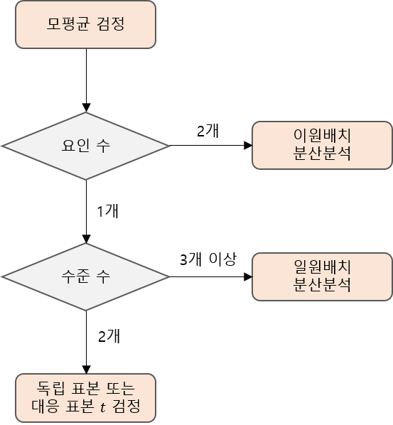
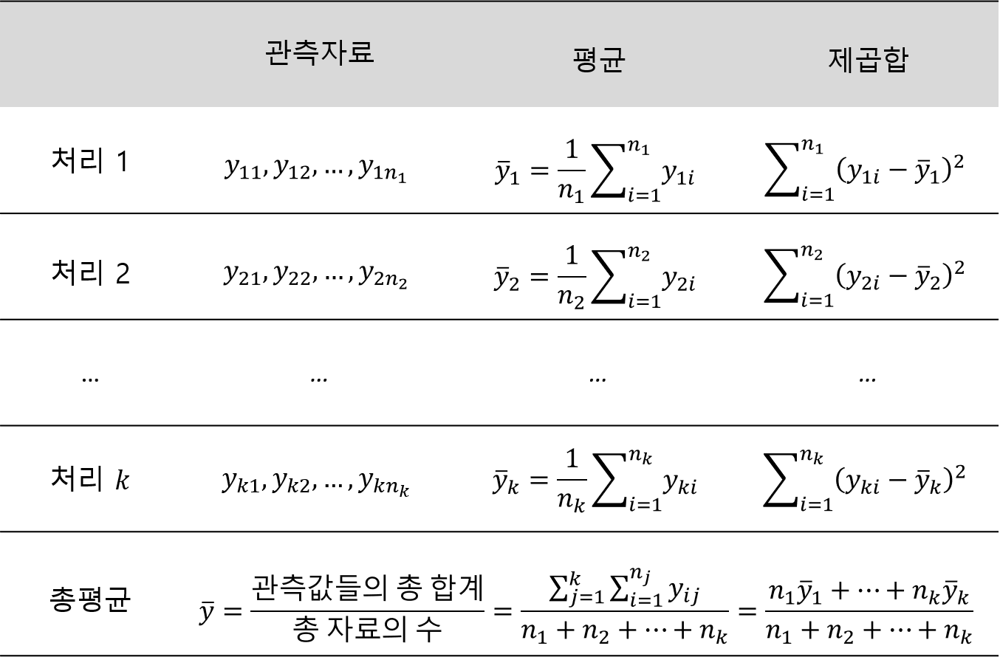
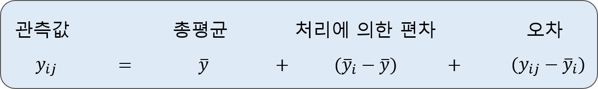
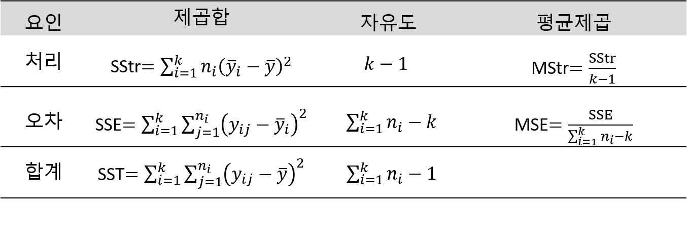
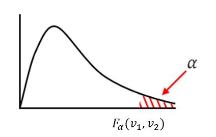
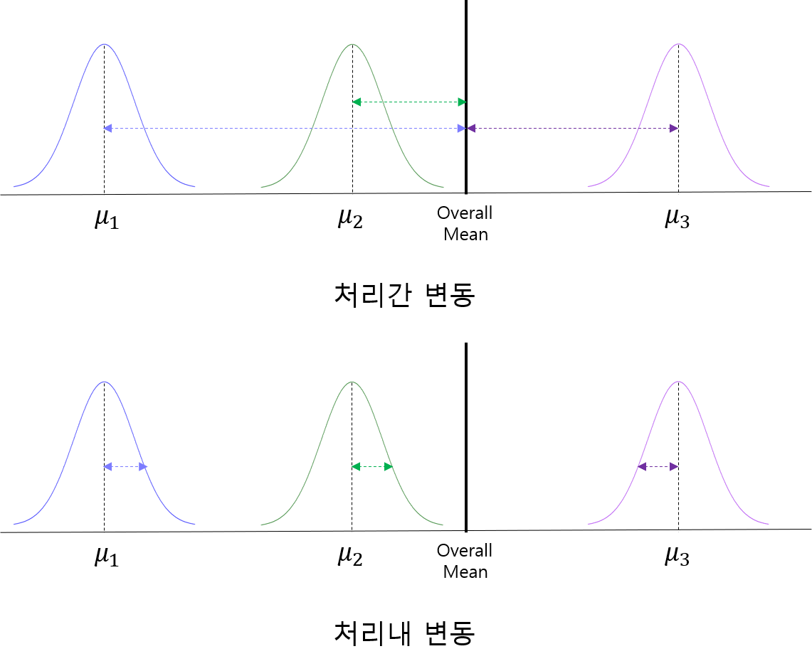
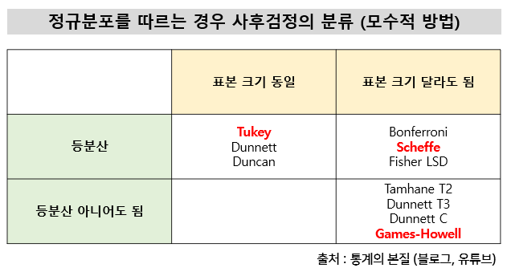

```{r setup, include=FALSE}
knitr::opts_chunk$set(echo = TRUE, warning = FALSE, message = FALSE)
options(width=200)
```


```{css, echo=FALSE}

p, ul, li{
text-align: justify
}

```

- **참고**
    - **통계학: R을 이용한 분석, 인하대학교 통계학과 저**
    
# **1. 서론**

> 이 장에서 공부하게 될 내용은 두 모집단뿐 아니라 `셋 이상의 모집단 간의 평균을 비교`하는 방법으로서 널리 사용되는 `분산분석(Analysis of Variance, ANOVA)`이라는 통계분석 기법이다. 분산분석은 여러 모집단에서의 관측자료를 효과적으로 분석하고 해석하게 해 주는 아주 유용한 분석방법이다. 실제 부딪히게 되는 통계자료의 많은 부분이 분산분석 기법을 필요로 하고 있다. 예를 들어, 소비자 단체에서는 여러 종류의 건전지 중에서 어느 건전지의 수명이 오래가는지 또는 어느 농업 연구가는 여러 품종의 볍씨 중 어느 종의 수확량이 가장 높은지 등에 관심이 있을 수 있다. 여기서 "건전지"와 "볍씨"는 "요인"으로 실험에서 관측값에 영향을 준다고 생각되는 원인이며, 실험을 하기 위한 요인의 조건을 "수준"이라고 한다. 이와 같은 문제를 해결하기 위한 첫 단계에서 바로 분산분석의 기법이 쓰이게 된다.  
분산분석은 관측한 자료값들이 다양하게 나타나는 것을 체계적으로 설명하려는 하나의 통계기법이라고 할 수 있다. 즉, 관측값들이 달라지는 것을 여러 요인으로 나누어 각 요인들이 얼마나 변화의 정도에 기여하였는가를 분석하는 것이다. 분산분석의 기법은 실제로 상당히 복잡한 문제에도 적용할 수 있으나 이 장에서는 `세 집단 이상의 모평균을 비교`하기 위하여 전체의 변동을 두 가지 변동 요인, 즉, 모집단 간의 변동과 모집단 내의 변동으로만 나누어 분석하는 방법만을 공부해 보기로 한다. 



------------------

# **2. 일원배치 분산분석법(One-way ANOVA)**

- 비교하고자 하는 여러 가지의 처리(또는 집단)가 있을 때 이를 두 처리씩 여러 번 비교하는 것보다 동시에 비교하는 것이 시간이나 비용을 고려할 때 더 편리한 것이 보통이다.
- 전체 $n=n_1+n_2+\ldots+n_k$개의 실험단위 중 $n_1$개의 실험단위는 처리 1에 배치하고, $n_2$개의 실험단위는 처리 2에 배치하며, 이와 같이 계속하여 마지막 남은 $n_k$개의 실험단위는 처리 $k$에 배치한다. 
    - 이것의 특별한 경우, 즉, $k=2$인 경우가 바로 앞서 다룬 두 모집단의 비교이다.
- 원칙적으로 전체 $n$개의 실험단위에서 `자료를 얻는 순서는 완전 랜덤`하게 한다.
    - 예를 들어, 각 실험단위에 번호를 부여하고 난수표 등을 이용하여 먼저 나오는 번호 순서대로 실험을 진행하면 자료를 얻는 순서는 랜덤적이다.
- 다음 표는 $k$개의 처리가 있을 때 측정한 반응치들로 이루어진 자료의 구조를 보여준다.




</br>

----------------------

## **2-1. 가정**

- 분산분석은 세 가지의 기본 가정이 있으며, 이 기본 가정이 충족된다는 전체조건 하에서 분산분석을 수행해야 한다.
    1. 정규성 : 자료의 모집단 분포는 정규분포를 따른다.
    2. 독립성 : 자료의 추출은 독립적으로 이루어진다.
    3. 등분산성 : 모든 처리의 모분산은 동일하다.
- 분산분석은 처리 사이에 표본크기가 크게 차이가 나지 않는다면, 정규성 가정이나 등분산 가정을 충족하지 못하여도 결과에 큰 차이를 주지 않는 것으로 알려져 있다.


---------------------

### **2-1-1. 정규성**

- 각 처리에 있는 데이터는 정규분포의 형태를 따라야 한다.


- 처리 간의 데이터 수가 아주 많은 경우에는 정규성 가정을 가지지 않아도 된다.
- 하지만, 저리 사이에 표본크기가 일정하지 않고 정규성 가정이 위배된다면 비모수검정을 수행하여야 한다.

---------------------

### **2-1-2. 독립성**

- 각 처리에 대해서 관찰은 서로 독립적이어서 처리간에 서로 영향을 주지 않아야 한다.
- 만약 같은 개체를 대상으로 여러 시점에서 반복적으로 반응변수를 측정한 경우에는 반복측정 분산분석 등을 이용할 수 있다.


---------------------

### **2-1-3. 등분산성**

- 각 처리의 분산은 서로 동일해야 한다.


- 분산분석은 처리 사이에 표본크기가 크게 차이가 나지 않는다면, 등분산 가정을 충족하지 못하여도 결과에 큰 차이를 주지 않는 것으로 알려져 있다.
    - 하지만, 저리 사이에 표본크기가 일정하지 않고 등분산성 가정이 위배된다면 Robust ANOVA를 수행하여야 한다.

----------------------

## **2-2. 제곱합**

> 예제. 안경의 표면 손상을 방지하려고 A, B, C, D 네 종류의 코팅처리에 대하여 표면보호에 얼마나 효과가 있는지를 비교하여 보았다. 다음의 표는 네 종류로 코팅처리된 안경에서 표면의 마모도를 측정한 자료이다.


`Caution!` 이 자료로부터 네 종류 코팅처리의 평균 마모도에 차이가 있다고 할 수 있는가?

------------------------

- 우선 관측값을 변동의 근원에 따라 분할한다.
- 총평균으로부터 각 관측값의 편차는 $y_{ij}-\bar{y}$로 표시되는데, 이 편차에서 일부는 처리에 따른 편차로 볼 수 있고 또 다른 일부는 측정에 따른 임의변동으로 볼 수 있다.



- 만약 네 가지의 코팅에서 얻어진 평균 마모도에 차이가 없다면, $(\bar{y}_i-\bar{y})$로 표현된 처리효과의 값들이 거의 0에 가까워야만 할 것이다.
    - 왜냐하면, 평균 마모도에 차이가 없다면 $\bar{y}_1, \ldots, \bar{y}_4$의 값에 차이가 없다는 것을 의미하기 때문이다.
- 전체 처리효과들의 변동은 $(\bar{y}_i-\bar{y})$의 제곱합으로 측정하며, 이러한 값을 처리제곱합(Treatment Sum of Squares, SStr)이라고 한다.
$$
\begin{align*}
\text{처리제곱합}=\sum_{i=1}^4 n_i(\bar{y}_i-\bar{y})^2.
\end{align*}
$$
- $(y_{ij}-\bar{y}_i)$는 각 관측값과 그 관측값이 속한 처리평균과의 편차를 나타낸다.
    - 이러한 편차들은 실험재료, 측정도구 등에서 생격나는 실험에서 조절할 수 없는 변동을 반영하므로 이를 잔차 또는 랜덤오차라고도 한다.
- 이러한 랜덤오차에 의한 변동들은 모든 랜덤오차들의 제곱합으로 측정하며, 이러한 값을 오차제곱합(Error Sum of Squares, SSE) 또는 잔차제곱합이라고 한다.
$$
\begin{align*}
\text{오차제곱합}=\sum_{i=1}^4\sum_{j=1}^{n_i} (y_{ij}-\bar{y}_i)^2.
\end{align*}
$$
    - 즉, 오차제곱합은 각 처리마다 잔차의 제곱합을 구한 후 모든 처리에서 그 값을 합한 것이다.
- 끝으로 이 자료에서 나타난 총변동은 개개의 관측값의 총평균에 대한 편차 $(y_{ij}-\bar{y})$의 제곱합으로 측정되며 이러한 값을 총제곱합(Total Sum of Squares, SST)이라고 한다.
$$
\begin{align*}
\text{총제곱합}=\sum_{i=1}^4\sum_{j=1}^{n_i} (y_{ij}-\bar{y})^2.
\end{align*}
$$
    - 총제곱합의 값은 처리제곱합에 오차제곱합을 더한 값이 된다.
        - 즉, SST = SStr + SSE.
        
--------------------

## **2-3. 자유도**

- 이제 제곱합의 분할에 대한 또 하나의 성질로써 제곱합에 관련되는 자유도를 알아야 한다.


- 위의 예제의 경우 처리제곱합은 4개 항의 합으로 되어 있고 각 항들은 다음의 한가지 제약조건을 만족한다.
$$
\begin{align*}
n_1(\bar{y}_1-\bar{y}) + n_2(\bar{y}_2-\bar{y}) + n_3(\bar{y}_3-\bar{y}) + n_4(\bar{y}_4-\bar{y})=0.
\end{align*}
$$
    - 위 식에서 총평균 $\bar{y}$는 처리평균들의 가중평균, 즉, $\bar{y}=\frac{n_1\bar{y}_1+n_2\bar{y}_2+n_3\bar{y}_3+n_4\bar{y}_4}{n_1+n_2+n_3+n_4}$이므로 제약조건의 등호가 성립하게 된다. 
- 결과적으로 처리제곱합의 자유도는 $4-1=3$이 된다.
- 오차제곱합의 자유도는 $\sum_j(y_{ij}-\bar{y}_i)=0$이므로 처리의 개수인 4개의 선형 제약조건이 있게 된다.
    - 따라서, 오차제곱합의 자유도는 $(n_1+n_2+n_3+n_4)-4=22-4=18$이 된다.
- 끝으로 총제곱합의 자유도는 $\sum\sum(y_{ij}-\bar{y}_i)=0$이라는 선형 제약조건이 있으므로 $(n_1+n_2+n_3+n_4)-1=22-1=21$이 된다.
- 자유도에서도 총제곱합의 자유도가 처리제곱합의 자유도와 오차제곱합의 자유도를 더한 값이 됨을 알 수 있다.

-------------------------

## **2-4. 분산분석표**

- 이제 $k$개의 처리를 비교하기 위한 일반적인 분산분석 모형을 이용하여 보자.
- 다음의 기본적인 분해로부터 
$$
\begin{align*}
(y_{ij}-\bar{y})=(\bar{y}_i-\bar{y}) + (y_{ij}-\bar{y}_i)
\end{align*}
$$
양변을 제곱하면 다음을 얻는다.
$$
\begin{align*}
(y_{ij}-\bar{y})^2=(\bar{y}_i-\bar{y})^2 + (y_{ij}-\bar{y}_i)^2+2(\bar{y}_i-\bar{y})(y_{ij}-\bar{y}_i)
\end{align*}
$$

- 위 식을 $j=1, \ldots, n_i$에 대하여 더해 주면 오른쪽 세 번째 항이 $\sum_{j=1}^{n_i} (y_{ij}-\bar{y}_i)=0$이라는 조건 때문에 0이 된다. 
- 따라서, 양변을 모두 $j=1,\ldots, n_i$와 $i=1, \ldots, k$에 대하여 더해 주면 제곱합의 분해가 다음과 같이 완성된다.


- 이와 같이 제곱합과 자유도를 분해한 것을 통상적으로 표의 형태로 정리하는데 이러한 표를 분산분석표(ANOVA Table)이라고 한다.
- 이 분산분석표는 보통 평균제곱(Mean Square)이라는 항목이 추가되어 있는데 이는 다음과 같이 정의된다.
$$
\begin{align*}
\text{평균제곱}=\frac{\text{제곱합}}{\text{자유도}}
\end{align*}
$$
    - 처리제곱합을 자유도로 나눈것을 평균처리제곱(MStr)이라고 하고 오차제곱합을 해당 자유도로 나눈 것을 평균오차제곱(MSE)이라고 한다.
- 다음의 표는 $k$개의 처리를 비교하기 위한 분산분석표이다.



--------------------

# **3. 일원배치 분산분석모형에서의 추론**

- 처리 효과들 사이에 차이가 있는지를 통계적으로 검정하려면 실험 모집단에 대한 모형이 있어야 한다.
- 이를 위하여 $i$번째 처리에서의 관찰값을 모평균이 $\mu_i$이고 공통분산이 $\sigma^2$인 정규모집단에서의 임의표본으로 가정하고 추출된 표본들은 서로 독립이라고 가정한다.


---------------------

## **3-1. $F$ 분포**

- $k$개의 모집단의 모평균이 차이가 없다는 귀무가설을 식으로 나타내면 다음과 같다.
$$
\begin{align*}
H_0 : \mu_1=\mu_2=\ldots=\mu_k
\end{align*}
$$
    - 이때 대립가설은 "적어도 하나 이상의 $\mu_i$는 같지 않다."가 될 것이다.
- 만약 귀무가설 $H_0$이 맞다면, 즉, 모집단의 평균들이 모두 동일하다면 $(\bar{y}_i-\bar{y})$의 값들이 작아질 것이고, 따라서 이것의 함수인 평균처리제곱 $\text{MStr}=\sum n_i(\bar{y}_i-\bar{y})^2/(k-1)$도 작아지리라 예상할 수 있을 것이다.
- 반대로 모집단의 모평균들이 서로 상당히 다르다면 평균처리제곱도 커질 것이다. 
- 따라서, 평균처리제곱의 크고 작음에 따라 귀무가설 $H_0$의 기각 여부를 결정하여야 하는데, 그 기준으로 공통분산 $\sigma^2$의 추정치인 평균오차제곱 ($\text{MSE}=s^2$)이 쓰인다.
    - 즉, 평균오차제곱에 대한 평균처리제곱의 비율(MStr/MSE)의 크고 작음에 따라 귀무가설 $H_0$의 기각 여부가 결정된다.
- 따라서, 이 비율 $\frac{\text{MStr}}{\text{MSE}}$이 검정통계량이 된다.
- 이 검정통계량의 분포는 통계이론에 따르면 모든 모평균이 동일하다는 귀무가설 $H_0$ 하에서 자유도가 $(k-1, n-k)$인 $F$ 분포를 따른다.
    - 이를 기호로 표현하면 $F(k-1, n-k)$가 된다.
        - 이때 $n=n_1+n_2+\ldots+n_k$이다.
- 즉, 귀무가설 $H_0$ 하에서 다음이 성립한다.
$$
\begin{align*}
F=\frac{\text{평균처리제곱(MStr)}}{\text{평균오차제곱(MSE)}}=\frac{\text{SStr}/(k-1)}{\text{SSE}/(n-k)}  \sim F(k-1, n-k)
\end{align*}
$$
- $F$ 분포는 이를 제안한 통계학자 피셔(R.A. Fisher)의 첫 글자를 따서 이름 지어졌다.
- $F$ 분포는 카이제곱분포와 마찬가지로 양수의 구간에서만 확률값을 갖는 분이고 모양도 대칭이 아니다.
    - 분포의 모양은 카이제곱과는 달리 분자와 분모 두 개의 자유도에 의하여 결정이 된다.

    
    
- $F$ 분포에서 분자의 자유도는 $v_1$, 분모의 자유도는 $v_2$로 표기한다.
- 따라서, $F_\alpha(v_1, v_2)$는 자유도가 $(v_1, v_2)$인 $F$ 분포에서 상위 $\alpha$의 확률을 주는 경계점을 의미한다.

 

- $F$ 분포는 0보다 큰 양수값만을 가지며 대칭이 아니므로 하위 $\alpha$의 확률을 구하려면 $F$ 분포에 관한 다음의 관계식을 이용해야 한다.
$$
\begin{align*}
F_{1-\alpha}(v_1, v_2)=\frac{1}{F_\alpha (v_2, v_1)}.
\end{align*}
$$
    - 예를 들어, 분자의 자유도가 15, 분모의 자유도가 7일 때 하위 0.05(상위 0.95)의 확률을 주는 경계값은 위 식을 이용하면 $F_{0.95}(15, 7)=1/F_{0.05}(7, 15)$를 얻을 수 있다.


- 검정통계량 $F$ 값이 클수록 귀무가설을 기각할 확률이 높다.
    - 처리간 변동(분자)이 클수록 또는 처리내 변동(분모)가 작을수록 검정통계량 $F$ 값이 커진다.




- 위의 그림을 통해 다음과 같은 사실을 알 수 있다. 
    1. 처리간 변동이 동일(1번과 3번)할 때 처리내 변동이 작을수록 검정통계량 $F$ 값이 커지기 때문에 처리간 평균에 차이가 있음을 확실히 알 수 있다.
    2. 처리내 변동이 동일(2번과 3번)할 때 처리간 변동이 클수록 검정통계량 $F$ 값이 커지기 때문에 처리간 평균에 차이가 있음을 확실히 알 수 있다.
    
-------------------------

# **4. 예제**

- R에서 일원배치 분산분석을 수행하기 위해서는 함수 `oneway.test()`를 이용할 수 있다.
    
```{r, eval=FALSE}
oneway.test(formula, data, var.equal = FALSE)
```

- `formula` : 분산분석을 수행하려 하는 형태로 `반응변수 ~ 처리(집단)변수` 형식으로 입력 
- `data` : 반응변수와 처리변수가 들어있는 데이터 프레임
- `var.equal` : 처리간 분산이 동일한지를 나타내는 논리값으로 처리간 분산이 동일하면 `var.equal = TRUE`, 동일하지 않으면 `var.equal = FALSE`를 지정

----------------------------

`Caution!` R에서 분산분석은 함수 `aov()`를 통해서도 수행할 수 있으며, 이 함수는 요인을 구성하는 처리들의 분산이 동일하다는 가정 하에서 분석을 수행한다.

```{r, eval=FALSE}
aov(formula, data)
```

- `formula` : 분산분석을 수행하려 하는 형태로 `반응변수 ~ 처리(집단)변수` 형식으로 입력 
- `data` : 반응변수와 처리변수가 들어있는 데이터 프레임

----------------------------

## **예제 1**

> 다음 표에 나타난 자료에 대하여 분산분석을 수행하라.

|||
|:----------|:------------------------|
|처리| 관측치|
|1| 35, 24, 28, 21|
|2| 19, 14, 14, 13|
|3|21, 16, 21, 14|
|||


```{r}
# 데이터
x1 <- c(35, 24, 28, 21)
x2 <- c(19, 14, 14, 13)
x3 <- c(21, 16, 21, 14)

df <- data.frame(x1, x2, x3)
df

df1 <- stack(df)             # df의 열을 하나의 열로 바꿈
df1

# 정규성 검정
shapiro.test(df1$values)
shapiro.test(df$x1)
shapiro.test(df$x2)
shapiro.test(df$x3)
```

`Caution!` 분산분석은 정규성을 가정하기 때문에 함수 `shapiro.test()`를 통해 Shapiro-Wilk 검정을 수행할 수 있다. Shapiro-Wilk 검정의 귀무가설 $H_0$은 "주어진 데이터는 정규분포를 따른다."이고, 대립가설 $H_1$은 "주어진 데이터는 정규분포를 따르지 않는다."이다.  
`Result!` 유의수준 0.05에서 모든 $p$-값이 0.05보다 크기 때문에 귀무가설을 기각하지 못한다. 즉, 주어진 데이터는 정규분포를 따른다.

----------------------

```{r}
# 등분산 검정
bartlett.test(df1$values,   # 관측값
              df1$ind)      # 처리(집단)변수

pacman::p_load("car")
leveneTest(values ~ ind,    # 관측값 ~ 처리(집단)변수 
           data = df1)
```

`Caution!` 분산분석은 등분산성을 가정하기 때문에 함수 `bartlett.test()`와 `leveneTest()`를 통해 등분산 검정을 수행할 수 있다. 두 함수의 귀무가설 $H_0$은 "모든 집단의 분산은 동일하다."이고, 대립가설 $H_1$은 "적어도 하나 이상의 집단의 분산은 동일하지 않다."이다.  
`Result!` 유의수준 0.05에서 모든 $p$-값이 0.05보다 크기 때문에 귀무가설을 기각하지 못한다. 즉, 모든 집단의 분산은 동일하다.

--------------------

```{r}
# ANOVA 검정 1
fit <- oneway.test(values ~ ind,    # 관측값 ~ 처리(집단)변수 
                   data = df1,
                   var.equal = TRUE)
fit
```

`Caution!` 위의 예제에서 귀무가설 $H_0$은 $\mu_1=\mu_2=\mu_3$, 즉, 모든 처리의 모평균은 동일하다이며, 대립가설은 적어도 하나 이상의 처리에 평균 차이가 있다는 것이다.  
`Result!` 검정통계량 $F$ 값이 8.2588이며, $p$-값이 0.00919이다. 이에 근거하여, 유의수준 0.05에서 $p$-값이 0.05보다 작기 때문에 귀무가설을 기각할 수 있다. 즉, 적어도 하나 이상의 처리에 평균 차이가 있다.

---------------------

```{r}
# ANOVA 검정 2
fit <-aov(values ~ ind,    # 관측값 ~ 처리(집단)변수 
          data = df1)
summary(fit)
```

`Caution!` 함수 `aov()`를 이용하면 함수 `summary()`를 통해 분산분석표를 출력할 수 있다.

---------------------

```{r}
# 잔차 그림
par(mfrow=c(2,2))
plot(fit)
```

`Caution!` 함수 `plot()`은 잔차에 대한 여러 그림을 제공한다.  
`Result!` 첫 번째 그림은 각 처리의 평균 대비 잔차의 그래프를 보여준다. 각 처리의 평균이 처리 2 $<$ 처리 3 $<$ 처리 1이므로 가로축을 기준으로 처리 2, 처리 3, 처리 1의 찬자를 보여준다. 잔차가 0을 기준으로 대칭적으로 분포하고 있으나 처리 1의 잔차가 두 처리의 잔차보다 더 넓게 퍼져있으므로 등분산성 가정을 의심해봐야 한다. 두 번째 그림은 잔차의 정규성을 파악할 수 있는데, 점들이 직선과 가까우면 잔차의 정규성은 만족한다. 세 번째 그림은 처리별로 표준화된 잔차의 절대값에 제곱근을 취한 값의 분포를 보여준다. 평균잔차선을 나타내는 빨간색 선은 등분산을 만족하면 직선의 형태를 가진다. 네 번째 그림도 처리별로 표준화된 잔차를 보여준다. 0을 기준으로 각 처리별로 점의 분포가 동일하면 등분산성을 만족하며, -2와 2사이에 점들이 있으면 정규성을 만족한다.

---------------------------

`Caution!` 만약 분산분석에서 적어도 하나 이상의 처리에서 평균 차이가 있을 때 사후검정(다중비교)을 수행할 수 있다. 사후검정이란 분산분석을 통해 처리간에 평균 차이가 있다고 결론이 났을 때, 어느 처리간에 차이가 있는 것인지 알아보기 위해 두 처리씩 짝을 지어서 처리간 검정을 수행한다. 즉, 귀무가설 $H_0$은 $\mu_i=\mu_j$이고 대립가설 $H_1$은 $\mu_i\ne \mu_j$이다. R에서 사후분석을 수행하기 위해 Package `agricolae`를 이용하였다. Package `agricolae`은 사후분석을 위해 다양한 함수를 제공하고 있으며 [여기](https://myaseen208.com/agricolae/articles/MultipleComparisons.html)에서 참고할 수 있다. 위의 예제에는 함수 `scheffe.test()`를 이용하였다. 



```{r}
pacman::p_load("agricolae")

scheffe <- scheffe.test(fit,                  # ANOVA 결과를 저장한 객체 
                        "ind",                # 처리(집단)변수
                        group = TRUE,         # 사후분석 결과 그룹 출력 여부
                        console = TRUE)       # 결과 출력
scheffe
```

`Result!` 출력된 결과에서 마지막 표를 보면, 처리 1은 "a" 그룹, 처리 2와 3은 "b" 그룹으로 분리되었다. 이것은 처리 1은 처리 2, 3과 모평균에 차이가 있기 때문에 다른 그룹으로 분리되었으며, 처리 2와 3은 모평균에 차이가 없기 때문에 같은 그룹으로 묶였다.

```{r}
plot(scheffe)
```

----------------------------

## **예제 2**

> 어느 공장에서 열처리 온도에 따라서 제품의 강도가 차이가 보이는지 조사하기 위해 열처리 온도를 아래와 같이 설정하고 다음의 자료를 얻었다. 해당 자료를 이용하여 분산분석을 수행하라. 

|||
|:----------|:------------------------|
|온도| 제품의 강도|
|125℃| 23, 27, 24, 25, 29, 30|
|150℃| 35, 32, 38, 36, 32, 33|
|175℃|36, 41, 38, 39, 40, 38|
|200℃| 32, 30, 37, 34, 35, 34|
|||

```{r}
# 데이터
x1 <- c(23, 27, 24, 25, 29, 30)
x2 <- c(35, 32, 38, 36, 32, 33)
x3 <- c(36, 41, 38, 39, 40, 38)
x4 <- c(32, 30, 37, 34, 35, 34)


df <- data.frame(x1, x2, x3, x4)
df

df1 <- stack(df)             # df의 열을 하나의 열로 바꿈
df1

# 정규성 검정
shapiro.test(df1$values)
shapiro.test(df$x1)
shapiro.test(df$x2)
shapiro.test(df$x3)
shapiro.test(df$x4)
```

`Caution!` 분산분석은 정규성을 가정하기 때문에 함수 `shapiro.test()`를 통해 Shapiro-Wilk 검정을 수행할 수 있다. Shapiro-Wilk 검정의 귀무가설 $H_0$은 "주어진 데이터는 정규분포를 따른다."이고, 대립가설 $H_1$은 "주어진 데이터는 정규분포를 따르지 않는다."이다.  
`Result!` 유의수준 0.05에서 모든 $p$-값이 0.05보다 크기 때문에 귀무가설을 기각하지 못한다. 즉, 주어진 데이터는 정규분포를 따른다.

----------------------

```{r}
# 등분산 검정
bartlett.test(df1$values,   # 관측값
              df1$ind)      # 처리(집단)변수

pacman::p_load("car")
leveneTest(values ~ ind,    # 관측값 ~ 처리(집단)변수 
           data = df1)
```

`Caution!` 분산분석은 등분산성을 가정하기 때문에 함수 `bartlett.test()`와 `leveneTest()`를 통해 등분산 검정을 수행할 수 있다. 두 함수의 귀무가설 $H_0$은 "모든 집단의 분산은 동일하다."이고, 대립가설 $H_1$은 "적어도 하나 이상의 집단의 분산은 동일하지 않다."이다.  
`Result!` 유의수준 0.05에서 모든 $p$-값이 0.05보다 크기 때문에 귀무가설을 기각하지 못한다. 즉, 모든 집단의 분산은 동일하다.

--------------------

```{r}
# ANOVA 검정 1
fit <- oneway.test(values ~ ind,    # 관측값 ~ 처리(집단)변수 
                   data = df1,
                   var.equal = TRUE)
fit
```

`Caution!` 위의 예제에서 귀무가설 $H_0$은 $\mu_1=\mu_2=\mu_3=\mu_4$, 즉, 모든 처리의 모평균은 동일하다이며, 대립가설은 적어도 하나 이상의 처리에 평균 차이가 있다는 것이다.  
`Result!` 검정통계량 $F$ 값이 27.716이며, $p$-값이 0에 가깝다. 이에 근거하여, 유의수준 0.05에서 $p$-값이 0.05보다 작기 때문에 귀무가설을 기각할 수 있다. 즉, 적어도 하나 이상의 처리에 평균 차이가 있다.

---------------------

```{r}
# ANOVA 검정 2
fit <-aov(values ~ ind,    # 관측값 ~ 처리(집단)변수 
          data = df1)
summary(fit)
```

`Caution!` 함수 `aov()`를 이용하면 함수 `summary()`를 통해 분산분석표를 출력할 수 있다.

---------------------

```{r}
# 잔차 그림
par(mfrow=c(2,2))
plot(fit)
```

`Caution!` 함수 `plot()`은 잔차에 대한 여러 그림을 제공한다.  
`Result!` 첫 번째 그림은 각 처리의 평균 대비 잔차의 그래프를 보여준다. 각 처리의 평균이 125℃ $<$ 200℃$<$ 150℃$<$ 175℃이므로 가로축을 기준으로 125℃, 200℃, 150℃, 175℃의 찬자를 보여준다. 두 번째 그림은 잔차의 정규성을 파악할 수 있는데, 점들이 직선과 가까우면 잔차의 정규성은 만족한다. 세 번째 그림은 처리별로 표준화된 잔차의 절대값에 제곱근을 취한 값의 분포를 보여준다. 평균잔차선을 나타내는 빨간색 선은 등분산을 만족하면 직선의 형태를 가진다. 네 번째 그림도 처리별로 표준화된 잔차를 보여준다. 0을 기준으로 각 처리별로 점의 분포가 동일하면 등분산성을 만족하며, -2와 2사이에 점들이 있으면 정규성을 만족한다.

---------------------------

```{r}
# 사후분석
pacman::p_load("agricolae")

duncan <- duncan.test(fit,                  # ANOVA 결과를 저장한 객체 
                      "ind",                # 처리(집단)변수
                      group = TRUE,         # 사후분석 결과 그룹 출력 여부
                      console = TRUE)       # 결과 출력
duncan
```

`Result!` 출력된 결과에서 마지막 표를 보면, 175℃가 "a"그룹, 200℃와 150℃가 "b" 그룹,  125℃가 "c" 그룹으로 분리되었다. 이는 같은 그룹끼리는 모평균에 차이가 없음을 의미하며, 다른 그룹들 간에는 모평균에 차이가 있음을 의미한다.

```{r}
plot(duncan)
```

----------------------------

## **예제 3**

> 4가지 교육방법의 효과를 비교분석하기 위하여 4조로 나누어 다음과 같은 점수를 얻었다. 해당 자료를 이용하여 분산분석을 수행하라.

|||
|:----------|:------------------------|
|교육방법| 기말고사 성적|
|1| 65, 87, 73, 79, 81, 69|
|2| 75, 69, 83, 81, 72, 79, 90|
|3| 59, 78, 67, 62, 83, 76|
|4| 94, 89, 80, 88|
|||


```{r}
# 데이터
x1 <- c(65, 87, 73, 79, 81, 69)
x2 <- c(75, 69, 83, 81, 72, 79, 90)
x3 <- c(59, 78, 67, 62, 83, 76)
x4 <- c(94, 89, 80, 88)

df1  <- data.frame("values" = c(x1, x2, x3, x4),                            # 관측값
                   "ind" = rep(c("x1", "x2", "x3", "x4"), c(6, 7, 6, 4)))   # 처리(집단)변수
df1$ind <- as.factor(df1$ind)                                               # 범주형 변환
df1

# 정규성 검정
shapiro.test(df1$values)
shapiro.test(x1)
shapiro.test(x2)
shapiro.test(x3)
shapiro.test(x4)
```

`Caution!` 분산분석은 정규성을 가정하기 때문에 함수 `shapiro.test()`를 통해 Shapiro-Wilk 검정을 수행할 수 있다. Shapiro-Wilk 검정의 귀무가설 $H_0$은 "주어진 데이터는 정규분포를 따른다."이고, 대립가설 $H_1$은 "주어진 데이터는 정규분포를 따르지 않는다."이다.  
`Result!` 유의수준 0.05에서 모든 $p$-값이 0.05보다 크기 때문에 귀무가설을 기각하지 못한다. 즉, 주어진 데이터는 정규분포를 따른다.

----------------------

```{r}
# 등분산 검정
bartlett.test(df1$values,   # 관측값
              df1$ind)      # 처리(집단)변수

pacman::p_load("car")
leveneTest(values ~ ind,    # 관측값 ~ 처리(집단)변수 
           data = df1)
```

`Caution!` 분산분석은 등분산성을 가정하기 때문에 함수 `bartlett.test()`와 `leveneTest()`를 통해 등분산 검정을 수행할 수 있다. 두 함수의 귀무가설 $H_0$은 "모든 집단의 분산은 동일하다."이고, 대립가설 $H_1$은 "적어도 하나 이상의 집단의 분산은 동일하지 않다."이다.  
`Result!` 유의수준 0.05에서 모든 $p$-값이 0.05보다 크기 때문에 귀무가설을 기각하지 못한다. 즉, 모든 집단의 분산은 동일하다.

--------------------

```{r}
# ANOVA 검정 1
fit <- oneway.test(values ~ ind,    # 관측값 ~ 처리(집단)변수 
                   data = df1,
                   var.equal = TRUE)
fit
```

`Caution!` 위의 예제에서 귀무가설 $H_0$은 $\mu_1=\mu_2=\mu_3=\mu_4$, 즉, 모든 처리의 모평균은 동일하다이며, 대립가설은 적어도 하나 이상의 처리에 평균 차이가 있다는 것이다.  
`Result!` 검정통계량 $F$ 값이 3.7715이며, $p$-값이 0.02804이다. 이에 근거하여, 유의수준 0.05에서 $p$-값이 0.05보다 작기 때문에 귀무가설을 기각할 수 있다. 즉, 적어도 하나 이상의 처리에 평균 차이가 있다.

---------------------

```{r}
# ANOVA 검정 2
fit <-aov(values ~ ind,    # 관측값 ~ 처리(집단)변수 
          data = df1)
summary(fit)
```

`Caution!` 함수 `aov()`를 이용하면 함수 `summary()`를 통해 분산분석표를 출력할 수 있다.

---------------------

```{r}
# 잔차 그림
par(mfrow=c(2,2))
plot(fit)
```

`Caution!` 함수 `plot()`은 잔차에 대한 여러 그림을 제공한다.  
`Result!` 첫 번째 그림은 각 처리의 평균 대비 잔차의 그래프를 보여준다. 각 처리의 평균이 교육방법 3 $<$ 교육방법 1 $<$ 교육방법 2 $<$ 교육방법 4이므로 가로축을 기준으로 교육방법 3,교육방법 1, 교육방법 2, 교육방법 4의 찬자를 보여준다. 잔차가 0을 기준으로 대칭적으로 분포하고 있으나 처리 1의 잔차가 두 처리의 잔차보다 더 넓게 퍼져있으므로 등분산성 가정을 의심해봐야 한다. 두 번째 그림은 잔차의 정규성을 파악할 수 있는데, 점들이 직선과 가까우면 잔차의 정규성은 만족한다. 세 번째 그림은 처리별로 표준화된 잔차의 절대값에 제곱근을 취한 값의 분포를 보여준다. 평균잔차선을 나타내는 빨간색 선은 등분산을 만족하면 직선의 형태를 가진다. 네 번째 그림도 처리별로 표준화된 잔차를 보여준다. 0을 기준으로 각 처리별로 점의 분포가 동일하면 등분산성을 만족하며, -2와 2사이에 점들이 있으면 정규성을 만족한다.

---------------------------

```{r}
# 사후분석
pacman::p_load("agricolae")

scheffe <- scheffe.test(fit,                  # ANOVA 결과를 저장한 객체 
                        "ind",                # 처리(집단)변수
                        group = TRUE,         # 사후분석 결과 그룹 출력 여부
                        console = TRUE)       # 결과 출력
scheffe
```

`Result!` 출력된 결과에서 마지막 표를 보면, 교육방법 1, 2, 4가 "a" 그룹, 교육방법 2, 1, 3이 "b" 그룹으로 분리되었다. 이는 같은 그룹끼리는 모평균에 차이가 없으며, 다른 그룹끼리는 모평균에 차이가 있음을 나타낸다.

```{r}
plot(scheffe)
```

