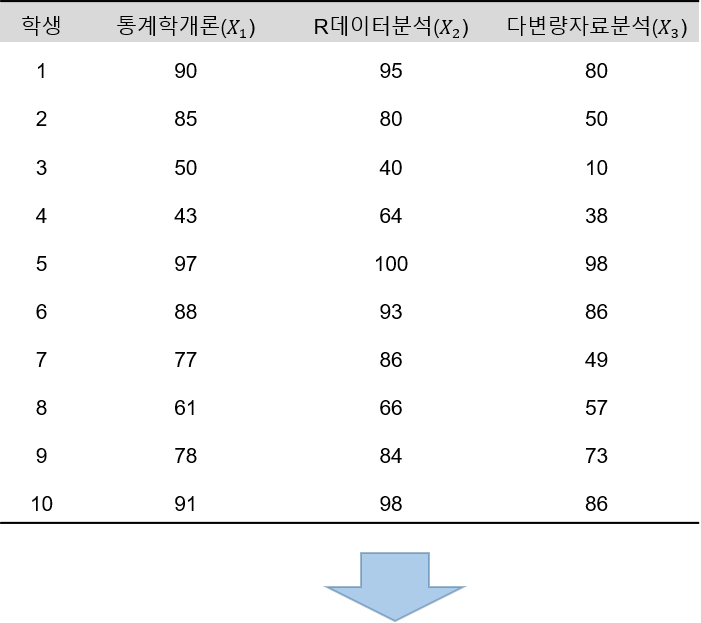

```{r setup, include=FALSE}
knitr::opts_chunk$set(echo = TRUE, warning = FALSE, message = FALSE)
options(width=200)
```


```{css, echo=FALSE}

p, ul, li{
text-align: justify
}

```


----------------------

# **1. 기초 행렬 대수**

- 다변량 분석방법을 이해하는데 필수적인 행렬 대수(Matrix Algebra)의 기본적 개념에 대해 알아보고자 한다.

----------------------

## **1-1. 행렬의 정의**

- 행렬(Matrix) : 숫자를 행과 열에 맞추어 직사각형 또는 정사각형 모양으로 정렬한 배열
    - 배열된 수를 그 행렬의 성분(Entries)이라고 한다.
$$
\mathbf{X}_{n\times p} =  \begin{pmatrix}
x_{11} & x_{12} & \ldots & x_{1p}\\
x_{21} & x_{22} & \ldots & x_{2p}\\
\vdots & \vdots & \vdots & \vdots \\
x_{n1} & x_{n2} & \ldots & x_{np}\\
\end{pmatrix} 
$$
- 행렬은 열벡터 또는 행벡터로 구성된다.
    - 열벡터 : 한 개의 열로만 이루어진 행렬
$$
\mathbf{X}_{n\times 1} =  \begin{pmatrix}
x_{1}\\
x_{2} \\
\vdots  \\
x_{n} \\
\end{pmatrix} 
$$    
    - 행벡터 : 한 개의 행으로만 이루어진 행렬
$$
\begin{align}
\mathbf{X}_{1\times n} = \left(x_{1} \ldots x_{n}\right)
\end{align}
$$
- R에서 행렬을 생성하기 위해서는 함수 `matrix(성분, nrow, byrow = FALSE)`를 이용한다.
    - `성분` : 행렬의 성분
    -  `nrow` : 행의 수
    - `byrow` : 성분을 행으로 나열할 것인지를 나타내는 논리값
    
```{r}
# 예제 1
## 행렬 성분
entries <- c(1, 5, 10, 3, 2, 9, 5, 14, 38, 18, 26, 5)

## 행렬 생성
matrix(entries, nrow = 3, byrow = FALSE)
matrix(entries, nrow = 3, byrow = TRUE)
```


```{r}
# 예제 2
## 행렬 성분
entries <- 1:30

## 행렬 생성
matrix(entries, nrow = 6, byrow = FALSE)
matrix(entries, nrow = 6, byrow = TRUE)
```


-----------------------

- R에서 기본적으로 제공하는 주요 행렬연산함수는 다음과 같다.

</br>
<center>
{width=70%}
</center>

-----------------------

### **1-1-1. 특정 형태를 갖는 행렬**

#### **정방행렬**

- 정방행렬(Square Matrix) : 행과 열의 크기가 같은 정사각형꼴의 행렬
$$
\mathbf{X}_{n\times n} =  \begin{pmatrix}
x_{11} & x_{12} & \ldots & x_{1n}\\
x_{21} & x_{22} & \ldots & x_{2n}\\
\vdots & \vdots & \vdots & \vdots \\
x_{n1} & x_{n2} & \ldots & x_{nn}\\
\end{pmatrix} 
$$

```{r}
entries <- c(1, 10, 4, 3, 9, 16, 8, 14, 7)
matrix(entries, nrow = 3)
```

```{r}
entries <- 1:16
matrix(entries, nrow = 4)
```


-----------------------

#### **대각행렬**

- 대각행렬(Diagonal Matrix) : 대각선이 아닌 곳에서는 0을 성분으로 갖는 정방행렬
$$
\mathbf{D}_{p\times p} =  \begin{pmatrix}
x_{11} & 0 & \ldots & 0\\
0 & x_{22} & \ldots & 0\\
\vdots & \vdots & \vdots & \vdots \\
0 & 0 & \ldots & x_{pp}\\
\end{pmatrix} 
$$
    - R에서 함수 `diag(벡터)`를 통해 대각행렬을 생성할 수 있다.

```{r}
# 예제 1
diag(c(10, 13, 8, 1, 3))
```

```{r}
# 예제 2
diag(1:10)
```

-----------------------

#### **항등행렬**

- 항등행렬(Identity Matrix) : 대각성분은 1이고, 나머지는 0을 성분으로 갖는 정방행렬
    - 보통 $\mathbf{I}$로 표기한다.
$$
\mathbf{I}_{p\times p} =  \begin{pmatrix}
1 & 0 & \ldots & 0\\
0 & 1 & \ldots & 0\\
\vdots & \vdots & \vdots & \vdots \\
0 & 0 & \ldots & 1\\
\end{pmatrix} 
$$
    - R에서 함수 `diag(정수)`를 통해 항등행렬을 생성할 수 있다.

```{r}
# 예제 1
diag(5)
```

```{r}
# 예제 2
diag(10)
```

-----------------------

#### **전치행렬**

- 전치행렬(Transpose Matrix) : 행렬 내의 성분을 대각선 기준으로 서로 위치를 바꾼 행렬
    - 행렬 $\mathbf{X}$의 전치행렬을 $\mathbf{X}^{T}$로 표기한다.
$$
\mathbf{X} =  \begin{pmatrix}
x_{11} & x_{12} & \ldots & x_{1p}\\
x_{21} & x_{22} & \ldots & x_{2p}\\
\vdots & \vdots & \vdots & \vdots \\
x_{n1} & x_{n2} & \ldots & x_{np}\\
\end{pmatrix} \to 
\mathbf{X}^{T} =  \begin{pmatrix}
x_{11} & x_{21} & \ldots & x_{n1}\\
x_{12} & x_{22} & \ldots & x_{n2}\\
\vdots & \vdots & \vdots & \vdots \\
x_{1p} & x_{2p} & \ldots & x_{np}\\
\end{pmatrix} 
$$
    - R에서 함수 `t(행렬)`을 이용하여 전치행렬을 생성할 수 있다.

```{r}
# 예제 1
X <- matrix(c(1, 5, 10, 3, 2, 9, 5, 14, 38, 18, 26, 5), nrow = 4)
X

# 전치행렬
t(X)
```


```{r}
# 예제 2
X <- matrix(1:10, nrow = 2)
X

# 전치행렬
t(X)
```

-----------------------

#### **대칭행렬**

- 대칭행렬(Symmetric Matrix) : 정방행렬에서 대각선 기준으로 대칭인 두 성분이 같은 행렬
    - 즉, $x_{ij} = x_{ji}$

$$
\mathbf{X} =  \begin{pmatrix}
x_{11} & x_{12} & \ldots & x_{1p}\\
x_{12} & x_{22} & \ldots & x_{2p}\\
\vdots & \vdots & \vdots & \vdots \\
x_{1p} & x_{2p} & \ldots & x_{pp}\\
\end{pmatrix} 
$$

```{r}
# 예제 1
X <- matrix(c(8, 1, 4, 1, 3, 7, 4, 7, 6), nrow = 3, byrow = TRUE)
X
```

```{r}
# 예제 2
X <- matrix(c(1, 2, 0, 0, 2, 0, 1, 1, 0, 1, 1, 1, 0, 1, 1, 0), nrow = 4, byrow = TRUE)
X
```


-----------------------

## **1-2. 행렬의 연산**

------------------------

### **1-2-1. 합과 차**

- 두 행렬 $\mathbf{A}$와 $\mathbf{B}$이 각각 다음과 같다고 가정하자.
$$
\mathbf{A} =  \begin{pmatrix}
a_{11} & a_{12} & \ldots & a_{1p}\\
\vdots & \vdots & \vdots & \vdots \\
a_{n1} & a_{n2} & \ldots & a_{np}\\
\end{pmatrix},\;\;\; \mathbf{B} = \begin{pmatrix}
b_{12} & b_{12} & \ldots & b_{1p}\\
\vdots & \vdots & \vdots & \vdots \\
b_{np} & b_{np} & \ldots & b_{np}\\
\end{pmatrix}
$$
 
- 행렬의 합 $\mathbf{A}+\mathbf{B}$는 대응되는 성분들끼리 더한 행렬과 같다.
 
$$
\mathbf{A}+\mathbf{B} =  \begin{pmatrix}
a_{11} + b_{11} & a_{12} + b_{12}& \ldots & a_{1p}+ b_{1p}\\
\vdots & \vdots & \vdots & \vdots \\
a_{n1}+ b_{n1} & a_{n2} + b_{n2}& \ldots & a_{np}+ b_{np}\\
\end{pmatrix}
$$


- 행렬의 차 $\mathbf{A}-\mathbf{B}$는 대응되는 성분들끼리 뺀 행렬과 같다.

$$
\mathbf{A}-\mathbf{B} =  \begin{pmatrix}
a_{11} - b_{11} & a_{12} - b_{12}& \ldots & a_{1p}- b_{1p}\\
\vdots & \vdots & \vdots & \vdots \\
a_{n1}- b_{n1} & a_{n2} - b_{n2}& \ldots & a_{np}- b_{np}\\
\end{pmatrix}
$$


```{r}
# 예제 1
## 행렬 A
A <- matrix(c(1, 5, 10, 12, 8, 17, 11, 2), nrow = 2)
A

## 행렬 B
B <- matrix(c(18, 12, 10, 9, 1, 4, 3, 7), nrow = 2)
B

## 행렬 더하기
A+B

## 행렬의 차
A-B
```


```{r}
# 예제 2
## 행렬 A
A <- matrix(1:10, nrow = 5)
A

## 행렬 B
B <- matrix(21:30, nrow = 5)
B

## 행렬 더하기
A+B

## 행렬의 차
A-B
```

-------------------

### **1-2-2. 곱**

- 두 행렬 $\mathbf{A}$와 $\mathbf{B}$이 각각 다음과 같다고 가정하자.

$$
\mathbf{A} =  \begin{pmatrix}
a_{11} & a_{12} & \ldots & a_{1k}\\
\vdots & \vdots & \vdots & \vdots \\
a_{n1} & a_{n2} & \ldots & a_{nk}\\
\end{pmatrix},\;\;\; \mathbf{B} = \begin{pmatrix}
b_{11} & b_{12} & \ldots & b_{1p}\\
\vdots & \vdots & \vdots & \vdots \\
b_{k1} & b_{k2} & \ldots & b_{kp}\\
\end{pmatrix}
$$

- 그러면, 행렬의 곱 $\mathbf{A}\mathbf{B}$은 다음과 같다.

$$
\mathbf{AB} =  \begin{pmatrix}
a_{11} & a_{12} & \ldots & a_{1k}\\
\vdots & \vdots & \vdots & \vdots \\
a_{n1} & a_{n2} & \ldots & a_{nk}\\
\end{pmatrix}\begin{pmatrix}
b_{11} & b_{12} & \ldots & b_{1p}\\
\vdots & \vdots & \vdots & \vdots \\
b_{k1} & b_{k2} & \ldots & b_{kp}\\
\end{pmatrix} = \begin{pmatrix}
\sum_{i=1}^{k} a_{1i}b_{i1} & \sum_{i=1}^{k} a_{1i}b_{i2} & \ldots & \sum_{i=1}^{k} a_{1i}b_{ip}\\
\vdots & \vdots & \vdots & \vdots \\
\sum_{i=1}^{k} a_{ni}b_{i1} & \sum_{i=1}^{k} a_{ni}b_{i2} & \ldots & \sum_{i=1}^{k} a_{ni}b_{ip}\\
\end{pmatrix}
$$

- R에서 연산자 `%*%`를 통해 행렬곱을 계산할 수 있다.

```{r}
# 예제 1
## 행렬 A
A <- matrix(c(1, 5, 10, 12, 8, 17, 11, 2), nrow = 2)
A

## 행렬 B
B <- matrix(c(18, 12, 10, 9, 1, 4, 3, 7), nrow = 4)
B

## 행렬의 곱
A%*%B

# 예제 2
## 행렬 A
A <- matrix(1:10, nrow = 5)
A

## 행렬 B
B <- matrix(21:30, nrow = 2)
B

## 행렬의 곱
A%*%B
```

-------------------

## **1-3. 직교행렬**

- $\mathbf{Q}\mathbf{Q}^{T}=\mathbf{Q}^{T}\mathbf{Q}=\mathbf{I}$을 만족하는 정방행렬 $\mathbf{Q}$를 `직교행렬(Orthogonal Matrix)`이라고 한다.

```{r}
# 예제 1
Q <-matrix(c(3/5, -4/5, 4/5, 3/5), nrow = 2, byrow = TRUE)
Q

Q %*% t(Q)
t(Q) %*% Q

# 예제 2
Q <- matrix(c(0, 0, 1, 1, 0, 0, 0, 1, 0), nrow = 3, byrow = TRUE)
Q

Q %*% t(Q)
t(Q) %*% Q
```

-------------------

## **1-4. 행렬식**

- 정방행렬 $\mathbf{A}$에 대한 행렬식을 $|\mathbf{A}|$ 또는 det$(\mathbf{A})$로 표기한다.
- $2\times 2$ 행렬 $\mathbf{A}$에 대한 행렬식 계산은 다음과 같다.
$$
\text{det}(\mathbf{A}) =  \text{det}\begin{pmatrix}
a_{11} & a_{12}\\
a_{21} &a_{22}
\end{pmatrix} = \begin{vmatrix}
a_{11} & a_{12}\\
a_{21} &a_{22}
\end{vmatrix}={a_{11}a_{22}-a_{12}a_{21}}
$$

- $3\times 3$ 행렬 $\mathbf{A}$에 대한 행렬식 계산은 다음과 같다.
$$
\text{det}(\mathbf{A}) =  \text{det}\begin{pmatrix}
a_{11} & a_{12} & a_{13}\\
a_{21} & a_{22} & a_{23} \\
a_{31} & a_{32} & a_{33}\\
\end{pmatrix} = a_{11}a_{22}a_{33}+a_{12}a_{23}a_{31}+a_{13}a_{21}a_{32}-(a_{11}a_{23}a_{32}+a_{12}a_{21}a_{33}+a_{13}a_{22}a_{31})
$$

- $4\times 4$부터 행렬식 계산은 어려워지는 단점이 있다.
- R에서 함수 `det()`를 이용하면 쉽게 행렬식을 얻을 수 있다.

```{r}
# 예제 1
## 행렬 A
A <- matrix(c(1, 5, 10, 12), nrow = 2)
A
det(A)

# 예제 2
## 행렬 B
B <- matrix(c(18, 12, 10, 9, 1, 4, 3, 7, 16), nrow = 3)
B
det(B)

# 예제 3
## 행렬 M
M <- matrix(c(2, 5, 7, 9, 4, 10, 18, 19, 12, 13, 16, 11, 22, 29, 24, 20), nrow = 4)
M
det(M)
```

-------------------

## **1-5. 역행렬**

- 정방행렬 $\mathbf{A}$에 대해 역행렬(Inverse Matrix) $\mathbf{A}^{-1}$는 유일하게 존재하며, 다음을 만족한다.
$$
\begin{align*}
\mathbf{A}\mathbf{A}^{-1}=\mathbf{A}^{-1}\mathbf{A}=\mathbf{I}
\end{align*}
$$
    - 만약 이와같은 역행렬이 존재하지 않으면, 행렬 $\mathbf{A}$를 `특이행렬(Singular Matrix)`이라고 한다.
- $2\times 2$ 행렬 $\mathbf{A}$에 대한 역행렬 $\mathbf{A}^{-1}$은 다음과 같다.
$$
\mathbf{A}^{-1} =  \begin{pmatrix}
a_{11} & a_{12}\\
a_{21} &a_{22}
\end{pmatrix}^{-1} = \frac{1}{a_{11}a_{22}-a_{12}a_{21}}\begin{pmatrix}
a_{22} & -a_{12}\\
-a_{21} &a_{11}
\end{pmatrix}
$$

- $3\times 3$ 행렬 $\mathbf{A}$에 대한 역행렬 $\mathbf{A}^{-1}$은 다음과 같다.
$$
\mathbf{A}^{-1} =  \begin{pmatrix}
a_{11} & a_{12} & a_{13}\\
a_{21} & a_{22} & a_{23}\\
a_{31} & a_{32} & a_{33}
\end{pmatrix}^{-1} = \frac{1}{|A|}\begin{pmatrix}
\begin{vmatrix}
a_{22} & a_{23}\\
a_{32} & a_{33}
\end{vmatrix} & -\begin{vmatrix}
a_{12} & a_{13}\\
a_{32} & a_{33}
\end{vmatrix} & \begin{vmatrix}
a_{12} & a_{13}\\
a_{22} & a_{23}
\end{vmatrix}\\
-\begin{vmatrix}
a_{21} & a_{23}\\
a_{31} & a_{33}
\end{vmatrix} & \begin{vmatrix}
a_{11} & a_{13}\\
a_{31} & a_{33}
\end{vmatrix} & -\begin{vmatrix}
a_{11} & a_{13}\\
a_{21} & a_{23}
\end{vmatrix}\\
\begin{vmatrix}
a_{21} & a_{22}\\
a_{31} & a_{32}
\end{vmatrix} & -\begin{vmatrix}
a_{11} & a_{12}\\
a_{31} & a_{32}
\end{vmatrix} & \begin{vmatrix}
a_{11} & a_{12}\\
a_{21} & a_{22}
\end{vmatrix}
\end{pmatrix}
$$

- $4\times 4$부터 역행렬 계산은 어려워지는 단점이 있다.
- R에서 함수 `solve()`를 이용하면 쉽게 역행렬을 얻을 수 있다.


```{r}
# 예제 1
## 행렬 A
A <- matrix(c(1, 5, 10, 12), nrow = 2)
A
solve(A)

# 예제 2
## 행렬 B
B <- matrix(c(18, 12, 10, 9, 1, 4, 3, 7, 16), nrow = 3)
B
solve(B)

# 예제 3
## 행렬 M
M <- matrix(c(2, 5, 7, 9, 4, 10, 18, 19, 12, 13, 16, 11, 22, 29, 24, 20), nrow = 4)
M
solve(M)
```

-------------------

## **1-6. 고유값과 고유벡터**

- $p\times p$인 정방행렬 $\mathbf{A}$는 $p$개의 고유값(Eigenvalue) $\lambda_1, \lambda_2, \ldots, \lambda_p$와 각 고유값에 해당하는 고유벡터(Eigenvector) $\mathbf{x}_{1}, \mathbf{x}_{2}, \ldots, \mathbf{x}_{p}$를 가진다.
- 이때 동치관계인 명제들은 다음과 같다.
    1. $\mathbf{A}\mathbf{x}=\bf{\lambda}\mathbf{x}$
    2. $|\mathbf{A}-\bf{\lambda}\mathbf{I}|=0$ 
        - 이를 이용하여 고유값을 계산
    3. $(\mathbf{A}-\bf{\lambda}\mathbf{I})\mathbf{x}=0$
        - 이를 이용하여 고유벡터를 계산    
    4. $tr(\mathbf{A})=\sum_{i=1}^p\lambda_i$
        - $tr(\mathbf{A})=\sum_{i=1}^{p} a_{ii}$ → 대각선 성분의 합
    5. $|\mathbf{A}|=\prod_{i=1}^{p}\lambda_i$
    6. $|\mathbf{I}+\mathbf{A}|=\prod_{i=1}^{p}(1+\lambda_i)$
- 고유값에 관한 중요한 성질 : 
    1. 행렬 $\mathbf{A}$의 대각성분의 합과 고유값의 합은 같다.
    2. 행렬 $\mathbf{A}$의 행렬식과 고유값의 곱은 같다.
    3. 행렬 $\mathbf{A}$의 고유값이 $\lambda_1, \lambda_2, \ldots, \lambda_p$이고 각 고유값에 해당하는 고유벡터가 $\mathbf{x}_{1}, \mathbf{x}_{2}, \ldots, \mathbf{x}_{p}$일 때, $\mathbf{A}^2$의 고유값은 $\lambda_1^2, \lambda_2^2, \ldots, \lambda_p^2$이고 각 고유값에 해당하는 고유벡터는 $\mathbf{x}_{1}, \mathbf{x}_{2}, \ldots, \mathbf{x}_{p}$이다.
    4. 행렬 $\mathbf{A}$는 고유값 $\bf{\lambda}$을 갖고, 행렬 $\mathbf{B}$는 고유값 $\bf{\mu}$를 가질 때, 두 행렬의 곱 $\mathbf{AB}$의 고유값은 $\bf{\lambda\mu}$이 아니다.
    5. 행렬 $\mathbf{A}$와 행렬 $\mathbf{B}$가 같은 차원의 정방행렬이면 행렬의 곱 $\mathbf{AB}$와 $\mathbf{BA}$의 고유벡터는 다르지만 고유값은 같다.
    6. $n\times p$ 행렬 $\mathbf{A}$와 $p\times n$ 행렬 $\mathbf{B}$에 대해 행렬의 곱 $\mathbf{AB}$와 $\mathbf{BA}$의 고유값을 구하면 0이 아닌 고유값은 같고 고유벡터는 다르다.
- 단위 고유벡터(Unit Eigenvector)는 $\mathbf{e}=\frac{\mathbf{x}}{\sqrt{\mathbf{x}^T\mathbf{x}}}$로 해당 벡터의 길이로 나누어 구하며 단위 고유벡터의 길이는 1이 된다.
- R에서 함수 `eigen(행렬)`을 통해 고유값과 고유벡터를 계산할 수 있다.
    - 고유벡터는 단위 고유벡터로 출력된다.

```{r}
# 예제 1
## 행렬 A
A <- matrix(c(4, -5, 2, -3), nrow = 2)
A
eigen(A)
```

`Result!` 첫 번째 고유값 2에 해당하는 단위 고유벡터는 $\mathbf{e}_{1}$=(0.7071068, -0.7071068)이고, 두 번째 고유값 -1에 해당하는 단위 고유벡터는 $\mathbf{e}_{2}$=(-0.3713907, 0.9284767)이다.

```{r}
# 명제 1번
eigen(A)$values[1]%*%eigen(A)$vectors[,1]
A%*%eigen(A)$vectors[,1]

eigen(A)$values[2]%*%eigen(A)$vectors[,2]
A%*%eigen(A)$vectors[,2]
```

`Result!` 명제 1번이 각 고유값과 고유벡터에 대해 성립한다.

```{r}
# 예제 2
## 행렬 B
B <- matrix(c(18, 12, 10, 9, 1, 4, 3, 7, 16), nrow = 3)
B
eigen(B)
```

`Result!` 첫 번째 고유값 27.852064에 해당하는 단위 고유벡터는 $\mathbf{e}_{1}=$(-0.6059151, -0.4430289, -0.6607513)이고, 두 번째 고유값 11.047791에 해당하는 단위 고유벡터는 $\mathbf{e}_{2}$=(-0.46301456, 0.06295986. 0.88411174), 세 번째 고유값 -3.899855에 해당하는 단위 고유벡터는 $\mathbf{e}_{3}$=(0.380749873, -0.924661892, -0.005469948)이다.

```{r}
# 명제 1번
eigen(B)$values[1]%*%eigen(B)$vectors[,1]
B%*%eigen(B)$vectors[,1]

eigen(B)$values[2]%*%eigen(B)$vectors[,2]
B%*%eigen(B)$vectors[,2]

eigen(B)$values[3]%*%eigen(B)$vectors[,3]
B%*%eigen(B)$vectors[,3]
```

`Result!` 명제 1번이 각 고유값과 고유벡터에 대해 성립한다.

```{r}
# 예제 3
## 행렬 M
M <- matrix(c(2, 5, 7, 9, 4, 10, 18, 19, 12, 13, 16, 11, 22, 29, 24, 20), nrow = 4)
M
eigen(M)
```

`Result!` 첫 번째 고유값 57.598788에 해당하는 단위 고유벡터는 $\mathbf{e}_{1}=$(-0.3664508, -0.5116579, -0.5808906, -0.5162229), 두 번째 고유값 -11.949017에 해당하는 단위 고유벡터는 $\mathbf{e}_{2}$=(0.6898760, 0.5352728. -0.1097305, -0.4748825), 세 번째 고유값 1.175114+0.761975i에 해당하는 단위 고유벡터는 $\mathbf{e}_{3}$=(-0.6983444+0.0000000i, 0.3877508+0.0529904i, -0.4664879-0.2869434i, 0.2101321+0.1226926i), 네 번째 고유값 1.175114-0.761975i에 해당하는 단위 고유벡터는 $\mathbf{e}_{4}$=(-0.6983444+0.0000000i, 0.3877508-0.0529904i, -0.4664879+0.2869434i, 0.2101321-0.1226926i)이다.

```{r}
# 명제 1번
eigen(M)$values[1]%*%eigen(M)$vectors[,1]
M%*%eigen(M)$vectors[,1]

eigen(M)$values[2]%*%eigen(M)$vectors[,2]
M%*%eigen(M)$vectors[,2]

eigen(M)$values[3]%*%eigen(M)$vectors[,3]
M%*%eigen(M)$vectors[,3]

eigen(M)$values[4]%*%eigen(M)$vectors[,4]
M%*%eigen(M)$vectors[,4]
```

`Result!` 명제 1번이 각 고유값과 고유벡터에 대해 성립한다.

----------------------------------------------------------------

## **1-7. 스펙트럼분해**

- $p\times p$ 대칭행렬 $\mathbf{A}$는 다음과 같이 스펙트럼분해 또는 분광분해된다.
$$
\begin{align*}
\mathbf{A} = \mathbf{P}\Lambda \mathbf{P}^{T} = \sum_{i=1}^p \lambda_{i}\mathbf{e}_i \mathbf{e}^T_i
\end{align*}
$$
    - $\Lambda=diag(\lambda_1, \ldots, \lambda_p)$ : 행렬 $\mathbf{A}$의 고유값들로 이루어진 대각행렬
    - $\mathbf{P}=(\mathbf{e}_1, \ldots, \mathbf{e}_p)$ : 각 고유값에 대응하는 단위 고유벡터들로 이루어진 직교행렬
        - 즉, $\mathbf{P}\mathbf{P}^T=\mathbf{P}^T\mathbf{P}=\mathbf{I}$

-----------------------------------------------------------------

# **2. 다변량 분석이란?**

- 다변량 데이터(Multivariate Data) : 하나의 개체에 대해 `두 가지 이상의 특성(변수)`을 측정하여 얻어진 관측값들로 이루어진 데이터
    - 둘 이상의 서로 상관되어 있는 확률적 변수에 대해 얻어진 데이터를 의미한다.
    
<center>
{width=60%}
</center>    
    
- 다변량 분석(Multivariate Analysis) : 다변량 데이터를 이용하여 `변수들 간의 관계성을 동시에 분석`하는 통계적 분석
    - 각 변수에 대한 개별적인 일변량 분석을 개선한 분석
- 다변량 분석의 초기에는 다변량 방법의 응용에 포함된 방대한 계산량의 부담으로 그 적용에 많은 제한을 받아왔으며, 주로 선형대수학을 비롯한 수학적인 개발에 치중되었다.
- 그러나, 20세기 후반 컴퓨터의 급속한 발전은 기존의 다변량 분석의 실제적인 응용과 새로운 기법의 발전을 가져왔다.
- 21세기 초반에 이르러 컴퓨터의 능력이 매우 강력해져 대용량의 자료에 대한 처리가 가능해졌으며, 다변량 분석은 유전학, 영상, 천문학 등에서 발생하는 매우 방대한 데이터셋에 대해서도 적용될 수 있게 되었다.
- 대용량의 데이터를 처리하는 기법인 데이터마이닝의 영역에서도 다변량 분석기법들이 매우 중요한 역할을 담당하고 있다.

-----------------------------------------------------------------

## **2-1. 다변량 분석의 목적**

1. 다변량 데이터 탐색을 통해 분포와 구조에 대한 정보는 얻는 것
2. 적절한 분석방법을 적용하여 데이터가 발생한 시스템 또는 모집단에 대해 의미 있는 결과를 도출하는 것
    - 변수들 간의 인과관계 : 회귀분석, 분산분석
    - 변수들 간의 상관관계를 분석하여 데이터 차원 축약 : 주성분분석, 인자분석
    - 개체들의 유사성에 의해 개체들을 분류 : 군집분석, 판별분석
3. 통계분석 결과들로 얻어진 통계량과 그래프 등 분석 결과들을 이용하여 적절한 해석으로 그 분야의 현상에 대해 알아내는 것

-----------------------------------------------------------------

## **2-2. 다변량 데이터의 구조**

- 데이터 행렬 : $p(\ge2)$개의 변수에 대해 $n$개의 개체로부터 얻어진 다변량 데이터를 행렬로 표현한 것
    - 데이터 행렬을 $\mathbf{X}_{n\times p}$라고 할 때, 
        - 행의 수 = 개체의 수
        - 열의 수 = 변수의 수
$$
\mathbf{X}_{n\times p} =  \begin{pmatrix}
       & 변수1 & 변수2 & \ldots & 변수j & \ldots & 변수p \\
개체 1 & x_{11}& x_{12}& \ldots & x_{1j}& \ldots & x_{1p} \\
개체 2 & x_{21}& x_{22}& \ldots & x_{2j}& \ldots & x_{2p}\\
\vdots & \vdots& \vdots& \vdots & \vdots& \vdots & \vdots\\
개체 i & x_{i1}& x_{i2}& \ldots & x_{ij}& \ldots & x_{ip}\\
\vdots & \vdots& \vdots& \vdots & \vdots& \vdots & \vdots\\
개체 n & x_{n1}& x_{n2}& \ldots & x_{nj}& \ldots & x_{np}
\end{pmatrix} 
$$          
        - $x_{ij}$ : $i$번째 개체에 대한 $j$번째 변수의 관측값
        - $i$번째 행은 $i$번째 개체에 대한 관측값들로 이루어진 행벡터
        - $j$번째 열은 $j$번째 변수에 대한 개체들의 관측값으로 이루어진 열벡터 
            - 만약 변수들의 변이성이나 군집성 혹은 그들 간의 연관성 등에 관심이 있다면, 이는 곧 데이터 행렬의 열을 중심으로 살펴본다는 것을 의미한다.
            - 이런 관점에서 데이터 행렬은 $p$개의 열벡터 $\mathbf{X}_{j}=\left(x_{1j}, x_{2j}, \ldots, x_{ij}, \ldots, x_{nj}\right)^T,\; j=1, \ldots, p$를 이용하여 $\mathbf{X}_{n\times p} = (\mathbf{X}_{1}, \ldots, \mathbf{X}_{j}, \ldots, \mathbf{X}_{p})$로 표현할 수 있다.
    - 예를 들어, 10명의 학생들이 수강한 통계학개론($X_1$), R데이터분석($X_2$), 다변량자료분석($X_3$)의 중간고사 점수를 데이터 행렬 $\mathbf{X}$로 표현하면 다음과 같다.

<center>
{width=70%}
</center>

$$
\;\;\;\;\;\;\;\;\;\;\;\;\;\;\;X_{1}\;\;\;\;X_{2}\;\;\;X_{3}\\
\mathbf{X}_{10\times 3} =  \begin{pmatrix}
90 & 95 & 80\\
85 & 80 & 50\\
50 & 40 & 10\\
43 & 64 & 38\\
97 & 100 & 98\\
88 & 93 & 86\\
77 & 86 & 49\\
61 & 66 & 57 \\
78 & 84 & 73\\
91 & 98 & 86
\end{pmatrix} \tag{1}
$$

-----------------------------------------------------------------

## **2-3. 다변량 데이터의 요약**

- 데이터 행렬로부터 각 변수에 대한 기초적인 정보를 주는 기술통계량(Descriptive Statistics)을 계산할 수 있다.
    - 기술통계량의 예 : 평균, 분산, 공분산, 상관계수 등

-----------------------------------------------------------------

### **2-3-1. 표본평균**

- $j$번째 변수의 표본평균 :
$$
\begin{align*}
\bar{{x}}_{j} = \frac{1}{n}\sum_{i=1}^n x_{ij},\;\; j = 1, \ldots, p
\end{align*}
$$
    - $p$개의 표본평균들을 모아 하나의 벡터로 표현한 것을 표본평균벡터 $\bar{\mathbf{x}}=(\bar{{x}}_{1}, \ldots, \bar{{x}}_{j}, \ldots, \bar{{x}}_{p})^{T}=\frac{1}{n}\mathbf{X}^{T}\mathbf{1}$라고 한다.
    - 표본평균벡터는 $n$개 개체들의 중심으로 생각할 수 있다.
- 예를 들어, 데이터 행렬 (1)의 표본평균벡터는 $\bar{\mathbf{x}}=(76.0, 80.6, 62.7)^T= \begin{pmatrix}76.0\\80.6\\62.7\end{pmatrix}$.

```{r}
# 10명의 학생들이 수강한 통계학개론, R데이터분석, 다변량자료분석의 중간고사 점수 
x <- c(90, 95, 80, 85, 80, 50, 50, 40, 10, 43, 64, 38, 97, 100, 98, 88, 93, 86, 77, 86, 49, 61, 66, 57, 78, 84, 73, 91, 98, 86)
mat.x <- matrix(x, nrow = 10, byrow = TRUE)
mat.x

apply(mat.x, 2, mean)
```

`Caution!` 함수 `apply()`는 주어진 함수를 특정 단위별로 쉽게 적용할 수 있도록 도움을 주는 함수이다. 첫 번째 인자로는 함수를 적용할 행렬 또는 데이터 프레임이 인자로 들어가고, 두 번째 인자로는 함수를 적용할 단위를 지정한다. 이때 "1"은 행 단위로 함수를 적용하고, "2"는 열 단위로 함수를 적용한다. 세 번째 인자는 적용할 함수를 지정하면 된다. 위의 코드 마지막 줄 `apply(mat.x, 2, mean)`은 행렬 "mat.x"의 열 단위로 평균을 적용하라는 의미이다.

-----------------------------------------------------------------

### **2-3-2. 표본분산**

- $j$번째 변수의 표본분산 :
$$
\begin{align*}
s_{j}^{2} = \frac{1}{n-1}\sum_{i=1}^n (x_{ij}-\bar{x}_{j})^2,\;\; j = 1, \ldots, p
\end{align*}
$$
    - 표본분산은 데이터 값들의 변동정도로서 데이터 값들이 평균으로부터 얼마나 떨어져 있는 지를 측정하는 측도이다.
    - 표본분산은 제곱의 합이기 때문에 측정단위도 원래의 측정단위의 제곱이 된다.
- 예를 들어, 데이터 행렬 (1)의 표본분산벡터는 $(342.4, 357.6, 722.9)^T=\begin{pmatrix}342.4\\357.6\\722.9\end{pmatrix}$.


```{r}
# 10명의 학생들이 수강한 통계학개론, R데이터분석, 다변량자료분석의 중간고사 점수 
x <- c(90, 95, 80, 85, 80, 50, 50, 40, 10, 43, 64, 38, 97, 100, 98, 88, 93, 86, 77, 86, 49, 61, 66, 57, 78, 84, 73, 91, 98, 86)
mat.x <- matrix(x, nrow = 10, byrow = TRUE)
mat.x

apply(mat.x, 2, var)
```

-----------------------------------------------------------------

### **2-3-3. 표본표준편차**

- $j$번째 변수의 표본표준편차 :
$$
\begin{align*}
s_{j}=\sqrt{s_{j}^2} = \sqrt{\frac{1}{n-1}\sum_{i=1}^n (x_{ij}-\bar{x}_{j})^2},\;\; j = 1, \ldots, p
\end{align*}
$$
    - 표본표준편차는 표본분산 $s_j^2$에 제곱근을 취해 원래의 측정단위와 같도록 만든 측도이다.
- 예를 들어, 데이터 행렬 (1)의 표본표준편차벡터는 $(18.5, 18.9, 26.9)^T=\begin{pmatrix}18.5\\18.9\\26.9\end{pmatrix}$.


```{r}
# 10명의 학생들이 수강한 통계학개론, R데이터분석, 다변량자료분석의 중간고사 점수 
x <- c(90, 95, 80, 85, 80, 50, 50, 40, 10, 43, 64, 38, 97, 100, 98, 88, 93, 86, 77, 86, 49, 61, 66, 57, 78, 84, 73, 91, 98, 86)
mat.x <- matrix(x, nrow = 10, byrow = TRUE)
mat.x

apply(mat.x, 2, sd)
```

-----------------------------------------------------------------

### **2-3-4. 표본공분산**

- $j$번째 변수와 $k$번째 변수의 표본공분산 :
$$
\begin{align*}
s_{jk} = s_{kj}=\frac{1}{n-1}\sum_{i=1}^n (x_{ij}-\bar{x}_{j})(x_{ik}-\bar{x}_{k}),\;\; j = 1, \ldots, p, \;\;, k= 1, \ldots, p
\end{align*}
$$
    - 표본공분산은 두 변수 사이의 선형적 연관성을 측정한다.
        - 즉, $j$번째 변수에 대한 값의 증가에 따른 $k$번째 변수에 대한 값의 증가 또는 감소의 경향을 나타내는 측도이다.
        - $s_{jk}$가 큰 양의 값을 가지면 $j$번째 변수에 대한 값이 증가(감소)할 때 $k$번째 변수에 대한 값도 증가(감소)하는 경향이 있다.
        - $s_{jk}$가 큰 음의 값을 가지면 $j$번째 변수에 대한 값이 증가(감소)할 때 $k$번째 변수에 대한 값은 감소(증가)하는 경향이 있다.
        - $s_{jk}$가 0에 가까우면 두 변수의 증감은 서로 체계적인 경향이 없다는 것을 나타낸다.
            - 두 변수가 독립이면 $s_{jk} = 0$.
            - 하지만, $s_{jk} = 0$이라고 두 변수가 독립인 것은 아니다.
    - 표본공분산을 $p$개의 변수에 대한 행렬로 나타낸 표본공분산행렬은 다음과 같다.
$$
\mathbf{S}_{p\times p} =  \begin{pmatrix}
s_{11} = s_1^2& s_{12}& \ldots & s_{1j}& \ldots & s_{1p} \\
s_{21}& s_{22} = s_2^2& \ldots & s_{2j}& \ldots & s_{2p}\\
\vdots& \vdots& \vdots & \vdots& \vdots & \vdots\\
s_{p1}& s_{p2}& \ldots & s_{pj}& \ldots & s_{pp} = s_p^2
\end{pmatrix} 
$$  
        - $s_{jk}=s_{kj}$이기 때문에 표본공분산행렬은 대칭행렬이다.
        - 대각성분은 각 변수들의 표준분산이다.
- R에서 표본공분산행렬은 함수 `cov()`를 이용하여 얻을 수 있다. 

```{r}
# 10명의 학생들이 수강한 통계학개론, R데이터분석, 다변량자료분석의 중간고사 점수 
x <- c(90, 95, 80, 85, 80, 50, 50, 40, 10, 43, 64, 38, 97, 100, 98, 88, 93, 86, 77, 86, 49, 61, 66, 57, 78, 84, 73, 91, 98, 86)
mat.x <- matrix(x, nrow = 10, byrow = TRUE)
mat.x

# 표본공분산행렬
cov(mat.x)
```

`Result!` 생성된 표본공분산행렬은 대칭행렬이며, 대각성분은 [2-3-2. 표본분산][**2-3-2. 표본분산**]에서 계산된 분산과 같다.

-----------------------------------------------------------------

### **2-3-5. 표본상관계수**

- $j$번째 변수와 $k$번째 변수의 표본상관계수 :
$$
\begin{align*}
r_{jk} = r_{kj}= \frac{s_{jk}}{s_js_k}= \frac{\sum_{i=1}^n (x_{ij}-\bar{x}_{j})(x_{ik}-\bar{x}_{k})}{\sqrt{\sum_{i=1}^n (x_{ij}-\bar{x}_{j})^2}\sqrt{\sum_{i=1}^n (x_{ik}-\bar{x}_{k})^2}},\;\; j = 1, \ldots, p, \;\;, k= 1, \ldots, p
\end{align*}
$$
    - 표본상관계수는 두 변수 사이의 선형성의 강도를 나타내는 측도로 흔히 사용된다.
    - 표본상관계수는 표본공분산을 표준화한 것과 같다.
        - 표본공분산은 변수들의 측정단위에 의존하며 그 값의 범위가 제한되어 있지 않아 크기를 상대비교하기가 어렵다.
        - 반면, 표본상관계수는 측정단위에 무관하고 $-1\le r_{jk} \le 1$이기 때문에 $1$ 또는 $-1$에 가까울수록 선형성의 강도가 큰 것을 의미한다.
            - $0 <r_{jk}\le 1$이면, $j$번째 변수에 대한 값이 증가(감소)할 때 $k$번째 변수에 대한 값도 증가(감소)하는 경향이 있으며, $1$에 가까울수록 강한 선형성을 보인다.
            - $-1 <r_{jk}< 0$이면, $j$번째 변수에 대한 값이 증가(감소)할 때 $k$번째 변수에 대한 값은 감소(증가)하는 경향이 있으며, $-1$에 가까울수록 강한 선형성을 보인다.
            - $r_{jk}=0$이면, 두 변수 사이의 선형관계는 존재하지 않는다.
    - 표본상관계수는 위치변환이나 척도변환 후에도 변하지 않는다.
    - 표본상관계수를 $p$개의 변수에 대한 행렬로 나타낸 표본상관행렬은 다음과 같다.
$$
\mathbf{R}_{p\times p} =  \begin{pmatrix}
1& r_{12}& \ldots & r_{1j}& \ldots & r_{1p} \\
r_{21}& 1& \ldots & r_{2j}& \ldots & r_{2p}\\
\vdots& \vdots& \vdots & \vdots& \vdots & \vdots\\
r_{p1}& r_{p2}& \ldots & r_{pj}& \ldots & 1
\end{pmatrix} 
$$  
        - $r_{jk}=r_{kj}$이기 때문에 표본공분산행렬은 대칭행렬이다.
        - 대각성분은 1이다.
- R에서 표본상관행렬은 함수 `cor()`를 이용하여 얻을 수 있다. 

```{r}
# 10명의 학생들이 수강한 통계학개론, R데이터분석, 다변량자료분석의 중간고사 점수 
x <- c(90, 95, 80, 85, 80, 50, 50, 40, 10, 43, 64, 38, 97, 100, 98, 88, 93, 86, 77, 86, 49, 61, 66, 57, 78, 84, 73, 91, 98, 86)
mat.x <- matrix(x, nrow = 10, byrow = TRUE)
mat.x

# 표본상관행렬
cor(mat.x)
```


