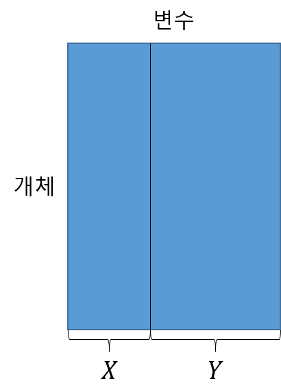

```{r setup, include=FALSE}
knitr::opts_chunk$set(echo = TRUE, warning = FALSE, message = FALSE)
options(width=200)
```


```{css, echo=FALSE}

p, ul, li{
text-align: justify
}

```


- **참고 : R을 활용한 다변량 자료분석 방법론, 강현철 $\cdot$ 연규필 $\cdot$ 한상태 저**

# **1. 서론**

- 정준상관분석(Canonical Correlation Analysis)은 동일한 실험 단위에서 관측된 `두 개의 변수집합` $\mathbf{X}=(X_1, \ldots, X_p)^T$와 $\mathbf{Y}=(Y_1, \ldots, Y_q)^T$ `간의 선형적 연관성을 분석`하는 다변량 데이터 분석기법이다.
    - 예를 들어, 스트레스에 영향을 주는 심리적 상황을 나타내는 변수들(불안도, 집중력의 정도 등)과 육체적 특성을 나타내는 변수들(혈압, 맥박, 심전도 등)이 어떻게 상호작용하는지에 흥미가 있다면, 고려된 변수들을 측정하고 이들 사이의 개별적 또는 동시적 상관관계를 살펴보는 것이 바람직하다.
- 두 변수집합 $\mathbf{X}$와 $\mathbf{Y}$ 간의 선형적 상관관계는 `정준상관계수(Canonical Correlation Coefficient)`라는 측도를 통해 나타낼 수 있다.
    - 정준상관계수는 단순 및 다중상관계수의 개념을 일반화시킨 것으로 생각할 수 있다.
- 정준상관분석은 두 변수집합의 선형결합식 $\boldsymbol{\alpha}^T\mathbf{X}$와 $\boldsymbol{\beta}^T\mathbf{Y}$ 간의 상관계수가 최대가 되도록하는 $\boldsymbol{\alpha}^T$와 $\boldsymbol{\beta}^T$를 찾는 것이 목표이다.
    - 즉, 데이터구조로부터 `두 변수집합 간의 정준상관계수가 최대가 되도록하는 각 변수집합의 선형결합식`을 찾는 것이다.

<center>
{width=30%}
</center>

-----------------------

# **2. 개념**

- 두 변수집합 $\mathbf{X}=(X_1, \ldots, X_p)^T$와 $\mathbf{Y}=(Y_1, \ldots, Y_q)^T$ 각각에 대해 다음과 같은 선형결합을 고려할 때, 
$$
\begin{align}
V &= \boldsymbol{\alpha}^T\mathbf{X} = \alpha_1X_1 + \ldots + \alpha_pX_p,\\
W &= \boldsymbol{\beta}^T\mathbf{Y} = \beta_1Y_1 + \ldots + \beta_qY_q
\end{align}
$$
모든 가능한 선형결합 중 두 변수($V,\;W$) 간 최대상관계수를 갖는 정준변수(Canonical Variable) $V$와 $W$를 도출(즉, $\boldsymbol{\alpha}^T$와 $\boldsymbol{\beta}^T$를 찾음)하고 이들 간의 상관성(정준상관계수)을 통해 두 변수집합 간의 선형적 상관관계를 살펴보려는 것이 `정준상관분석`이다.
    - 이때 모든 가능한 선형결합 $V$와 $W$에 대해 $V$와 $W$ 간의 `최대상관계수`를 "제1정준상관계수"라고 말하고 대응되는 정준변수 $V_1$와 $W_1$를 "제1정준변수"하고 한다.
    - "제2정준상관계수"는 제1정준변수 $V_1$에 직교하는 모든 $V$와 $W_1$에 직교하는 모든 $W$에 대해 $V$와 $W$ 간의 최대상관계수를 말하며, 이때 대응되는 정준변수 $V_2$, $W_2$를 "제2정준변수"라고 한다.
        - 제1정준변수와 제2정준변수는 직교하기 때문에 `서로 독립`이다. 
            - 제$k$정준변수는 다른 $1,\ldots, k-1$개의 정준변수들과 독립이다.
        - 이 과정을 반복하여 최대 $\text{min}(p,q)$개의 정준변수와 정준상관계수를 얻을 수 있다.    

-----------------------

# **3. 대수적 의미**

- 두 확률변수벡터 $\mathbf{X}=(X_1, \ldots, X_p)^T$와 $\mathbf{Y}=(Y_1, \ldots, Y_q)^T$를 각각 $p$개와 $q$개의 공통적 성격을 나타내는 변수들로 구성된 변수집합이라고 할 때 $\mathbf{X}$, $\mathbf{Y}$에 대한 모평균벡터 $\boldsymbol{\mu}_{X}$, $\boldsymbol{\mu}_{Y}$와 모공분산행렬 $\boldsymbol{\Sigma}_{XX}$, $\boldsymbol{\Sigma}_{XY}$, $\boldsymbol{\Sigma}_{YY}$들은 다음과 같다.
$$
\begin{align}
\boldsymbol{\mu}_{X}&=E(\boldsymbol{X})=(\mu_{X_1}, \ldots, \mu_{X_p})^T,\\
\boldsymbol{\mu}_{Y}&=E(\boldsymbol{Y})=(\mu_{Y_1}, \ldots, \mu_{Y_q})^T,\\
\boldsymbol{\Sigma}_{XX}&=E\left[(\boldsymbol{X}-\boldsymbol{\mu}_{X})(\boldsymbol{X}-\boldsymbol{\mu}_{X})^T\right],\\
\boldsymbol{\Sigma}_{XY}&=E\left[(\boldsymbol{X}-\boldsymbol{\mu}_{X})(\boldsymbol{Y}-\boldsymbol{\mu}_{Y})^T\right],\\
\boldsymbol{\Sigma}_{YY}&=E\left[(\boldsymbol{Y}-\boldsymbol{\mu}_{Y})(\boldsymbol{Y}-\boldsymbol{\mu}_{Y})^T\right].\\
\end{align}
$$
- 이를 전체적으로 보면 두 변수집합 ($\mathbf{X},\mathbf{Y}$)은 모평균벡터 $\boldsymbol{\mu}=(\boldsymbol{\mu}_{X},\boldsymbol{\mu}_{Y})^T$와 모공분산행렬 $\boldsymbol{\Sigma}=\begin{pmatrix} \boldsymbol{\Sigma}_{XX} & \boldsymbol{\Sigma}_{XY}\\ \boldsymbol{\Sigma}_{YX} & \boldsymbol{\Sigma}_{YY}  \end{pmatrix}$을 가진 확률벡터로 생각할 수 있다.
    - 여기에서 우리가 관심을 가지고 있는 두 변수집합 간의 상관관계에 관한 정보는 $p \times q$개의 원소들로 구성된 행렬 $\boldsymbol{\Sigma}_{XY}$에 포함되어 있다.
- 만약, `각 집합에 속한 변수들의 개수인` $p$ `혹은` $q$`가 아주 크다면` $\boldsymbol{\Sigma}_{XY}$를 통해 두 변수집합 간의 관계를 일괄적으로 파악하기는 매우 어렵다.
    - 이와 같은 경우, 다변량 집단의 체계를 요약하고 차원축소를 목적으로 많이 사용되는 기법인 `선형결합`을 이용하여 $\mathbf{X}$와 $\mathbf{Y}$에 대해 
$$
\begin{align}
V &= \boldsymbol{\alpha}^T\mathbf{X} = \alpha_1X_1 + \ldots + \alpha_pX_p,\\
W &= \boldsymbol{\beta}^T\mathbf{Y} = \beta_1Y_1 + \ldots + \beta_qY_q \tag{1}
\end{align}
$$
와 같이 `선형결합된 일변량변수 `$V$`와` $W$`의 관계를 고려`하는 것이다.


-------------------------

## **3-1. 정준상관계수와 정준변수**

- 대수적 의미에서 정준상관분석의 목표는 두 변수집합 $\mathbf{X}$와 $\mathbf{Y}$를 각각 일차원으로 요약한 선형결합변수 $V$와 $W$ 사이의 상관계수 $\rho(V,W)$를 최대로 하는 선형결합계수(정준계수) $\boldsymbol{\alpha}$, $\boldsymbol{\beta}$를 찾는 것이라고 할 수 있다.
    - 여기서 선형결합변수 $V$와 $W$ 사이의 상관계수 $\rho(V,W)$는
$$
\begin{align}
\rho(V,W)=\frac{Cov(V, W)}{\sqrt{Var(V)Var(W)}}=\frac{\boldsymbol{\alpha}^T\boldsymbol{\Sigma}_{XY}\boldsymbol{\beta}}{\sqrt{(\boldsymbol{\alpha}^T\boldsymbol{\Sigma}_{XX}\boldsymbol{\alpha})(\boldsymbol{\beta}^T\boldsymbol{\Sigma}_{YY}\boldsymbol{\beta})}}
\end{align}
$$
와 같이 표현할 수 있다.
- $V$와 $W$ 사이의 상관계수 $\rho(V,W)$의 절대값이 최대가 되도록하는 `정준계수벡터` $\boldsymbol{\alpha}_1$와 $\boldsymbol{\beta}_1$는 각각 다음 두 행렬
$$
\begin{align}
\mathbf{A} &= \boldsymbol{\Sigma}_{XX}^{-1}\boldsymbol{\Sigma}_{XY}\boldsymbol{\Sigma}_{YY}^{-1}\boldsymbol{\Sigma}_{YX},\\
\mathbf{B} &= \boldsymbol{\Sigma}_{YY}^{-1}\boldsymbol{\Sigma}_{YX}\boldsymbol{\Sigma}_{XX}^{-1}\boldsymbol{\Sigma}_{XY}\\
\end{align}
$$
의 `첫 번째 고유벡터`를 이용하여 얻을 수 있다.
    - 또한, 행렬 $\mathbf{A}$와 $\mathbf{B}$의 첫 번째 고유값은 $\lambda_1$로 같고, $\lambda_1$의 제곱근, 즉, $\sqrt{\lambda_{1}}$이 $V$와 $W$ 사이의 최대상관계수인 `제1정준상관계수` $\rho_1$이 된다.
    - 제1정준상관계수 $\rho_1$에 대응되는 정준변수는 $V_1= \boldsymbol{\alpha}_1^T\mathbf{X}$와 $W_1= \boldsymbol{\beta}_1^T\mathbf{Y}$이다.
        - 즉, 두 정준변수 $V_1$와 $W_1$의 상관계수는 $\rho_1$이다.
- 이미 얻은 첫 번째 정준변수($V_1$, $W_1$)와 독립이라는 조건 하에 모든 가능한 선형결합들 중 $\rho(V,W)$의 절대값이 최대가 되도록하는 정준계수벡터 $\boldsymbol{\alpha}_2$와 $\boldsymbol{\beta}_2$는 각각 행렬 $\mathbf{A}$와 $\mathbf{B}$의 두 번째 고유벡터를 통해 얻을 수 있다.
    - 이때 행렬 $\mathbf{A}$와 $\mathbf{B}$의 두 번째 고유값도 $\lambda_2(\le \lambda_1)$로 같으며, $\lambda_2$의 제곱근, 즉, $\sqrt{\lambda_{2}}$이 $V$와 $W$ 사이의 두 번째 최대상관계수인 `제2정준상관계수` $\rho_2$가 된다.
    - 제2정준상관계수 $\rho_2$에 대응되는 정준변수는 $V_2= \boldsymbol{\alpha}_2^T\mathbf{X}$와 $W_2= \boldsymbol{\beta}_2^T\mathbf{Y}$이다.
        - 즉, 두 정준변수 $V_2$와 $W_2$의 상관계수는 $\rho_2$이다.
- 요약하자면, 두 행렬 $\mathbf{A}$와 $\mathbf{B}$의 `고유벡터`를 이용하여 `정준계수벡터` $\boldsymbol{\alpha}$와 $\boldsymbol{\beta}$를 얻을 수 있으며, `고유값의 제곱근`은 `정준상관계수`가 된다.  
    - 이때 `고유값`은 크기 순서대로 `정준상관계수`가 되고, 각 `고유값`에 대응되는 `고유벡터`로부터 `정준계수벡터`가 얻어진다.
- 위의 과정은 최대로 $s=\text{min}(p, q)$번 반복할 수 있는데, 이를 통해 유도된 정준변수들은 다음과 같은 성질을 가진다.
    1. $Var(V_k)=Var(W_k)=1, \; k=1, \ldots, s$
    2. $Cov(V_k, W_k)=Corr(V_k, W_k)=\rho_k,$ (단, $\rho_1 \ge \rho_2 \ge \ldots \ge \rho_s$)
        - 성질 1에 의해 분산이 1이기 때문에 공분산이 상관계수가 된다.
    3. $Cov(V_k, W_j)=Corr(V_k, W_j)=0,\; k\ne j=1, \ldots, s$  
        - 즉, 서로 다른 정준변수들은 서로 독립이다.
- 이러한 모집단 정준상관의 성질들은 표본 정준상관의 경우에도 거의 그대로 성립된다.
    - 즉, 모평균벡터 $\boldsymbol{\mu}$와 모공분산행렬 $\boldsymbol{\Sigma}$를 가진 ($p+q$)-변량 모집단으로부터 얻은 크기 $n$인 랜덤표본 $(\mathbf{X}_1, \mathbf{Y}_1), \ldots, (\mathbf{X}_n, \mathbf{Y}_n)$에 기초한 경우, $k(=1, \ldots, s)$번째 표본 정준변수와 그에 대응되는 정준상관계수 $r_k$는 앞에서의 내용 중 모공분산행렬 $\boldsymbol{\Sigma}$을 표본공분산행렬 $\boldsymbol{S}$로 대치함으로써 얻을 수 있다.
    
---------------------------

## **3-2. 표준화된 정준상관계수**

- 정준상관계수들은 일종의 상관계수이므로 위치 및 척도 불변성을 가지기 때문에 공분산행렬이나 상관행렬 중 어느 것으로부터 유도해도 동일한 결과, 즉, 동일한 정준상관계수를 얻는다.
- 그러나, 정준변수를 구하기 위해 사용되는 정준계수는 공분산행렬에 기초하여 유도한 것이냐, 혹은 각 변수들을 표준화시킨 것들의 공분산행렬인 상관행렬에 기초한 것이냐에 따라 다르게 된다.
    - 공분산행렬에 기초하여 유도된 정준계수는 [3-1. 정준상관계수와 정준변수][**3-1. 정준상관계수와 정준변수**]의 두 행렬 $\mathbf{A}$, $\mathbf{B}$의 고유벡터로부터 얻어지며, 상관행렬에 기초하여 유도되는 정준계수는 두 행렬 $\mathbf{A}$, $\mathbf{B}$의 공분산행렬 대신 상관행렬을 대입한 다음과 같은 행렬의 고유벡터를 통해 얻을 수 있다.
$$
\begin{align}
\mathbf{A}_{R} &= \boldsymbol{R}_{XX}^{-1}\boldsymbol{R}_{XY}\boldsymbol{R}_{YY}^{-1}\boldsymbol{R}_{YX},\\
\mathbf{B}_{R} &= \boldsymbol{R}_{YY}^{-1}\boldsymbol{R}_{YX}\boldsymbol{R}_{XX}^{-1}\boldsymbol{R}_{XY}.
\end{align}
$$
- 공분산행렬로부터 유도한 $k$번째 정준계수벡터를 $\boldsymbol{\alpha}_k=(\alpha_{k1}, \ldots, \alpha_{kp})^T$와 $\boldsymbol{\beta}_k=(\beta_{k1}, \ldots, \beta_{kq})^T$라고 하고, 상관행렬로부터 얻은 표준화된 계수벡터를 $\boldsymbol{\alpha}^0_k=(\alpha^0_{k1}, \ldots, \alpha^0_{kp})^T$와 $\boldsymbol{\beta}^0_k=(\beta^0_{k1}, \ldots, \beta^0_{kq})^T$라고 할 때, 이들 사이에는 다음과 같은 관계가 있다.
$$
\begin{align}
\alpha_{ki}^0=\alpha_{ki}\times s_{X_i}, \;\;i=1, \ldots, p\\
\beta{kj}^0=\beta_{kj}\times s_{Y_j}, \;\;j=1, \ldots, q,
\end{align}
$$
    - 여기서 $s_{X_i}$와 $s_{Y_j}$는 각각 변수집합 $\mathbf{X}$의 $i$번째 변수 $X_i$와 $\mathbf{Y}$의 $j$번째 변수 $Y_j$의 표준편차이다.

---------------------------

# **4. 정준점수**

- 정준점수(Canonical Score)는 정준변수에 각 개체들로부터 관측된 관측벡터를 대입하여 얻어진 값을 의미한다.
    - 즉, 각 개체의 프로파일을 정준변수의 차원에서 고려했을 때 얻어지는 점수이다.
- $i$번째 개체에 대한 $j$번째 정준변수들의 점수는 다음과 같다.
$$
\begin{align}
\hat{v}_{ij} = \alpha_{1j}x_{i1} + \ldots + \alpha_{pj}x_{ip},\\
\hat{w}_{ij} = \beta_{1j}y_{i1} + \ldots + \beta_{qj}y_{iq},
\end{align}
$$
    - 여기서 $\boldsymbol{\alpha}_{j}=(\alpha_{1j}, \ldots, \alpha_{pj})^T$와 $\boldsymbol{\beta}_{j}=(\beta_{1j}, \ldots, \beta_{qj})^T$는 $j$번째 정준상관계수에 대응되는 정준계수벡터이며, $\boldsymbol{x}_{i}=(x_{i1}, \ldots, x_{ip})^T$와 $\boldsymbol{y}_{i}=(y_{i1}, \ldots, y_{iq})^T$는 $i$번째 개체의 두 변수집합에 대한 관측벡터이다.

---------------------------

# **5. 정준적재와 교차적재**

- 정준변수가 나타내는 의미를 해당 정준변수가 어느 한 관찰변수를 얼마나 잘 반영하느냐에 둔다면, 그 반영도는 그들 간의 단순상관계수를 이용하여 재는 것도 한 방법이 될 것이다.

--------------------------

## **5-1. 정준적재**

- 정준적재(Canonical Loading)는 어느 한 변수와 그에 대응되는 정준변수와의 단순상관계수를 의미한다.
- 단순상관계수를 통한 인과의 정도에 기초하여 정준변수의 의미를 식별함에는 여러 가지 주의를 요하나, 이는 실제적 측면에서 정준상관구조의 파악을 위해 많은 연구자에 의해 이용되고 있는 지표이다.
- 먼저, 두 변수집합에 대응되는 $s=\text{min}(p, q)$개의 정준변수들을 모아 다음과 같이 표기한다.
$$
\begin{align}
\mathbf{V}&=(V_1, V_2, \ldots, V_s)^T=\mathbf{X}^T(\boldsymbol{\alpha}_1, \ldots, \boldsymbol{\alpha}_s)=\mathbf{X}^T\mathbf{C}_{X},\\
\mathbf{W}&=(W_1, W_2, \ldots, W_s)^T=\mathbf{Y}^T(\boldsymbol{\beta}_1, \ldots, \boldsymbol{\beta}_s)=\mathbf{Y}^T\mathbf{C}_{Y},\\
\end{align}
$$
    - 여기서 $\mathbf{C}_{X}$와 $\mathbf{C}_{Y}$는 각각 두 변수집합에 대응되는 정준계수행렬이다.
- 이때 $(\mathbf{X}, \mathbf{V})$와 $(\mathbf{Y}, \mathbf{W})$의 정준적재행렬은 다음과 같은 공식을 통해 구해질 수 있다.
$$
\begin{align}
\text{Corr}(\mathbf{X}, \mathbf{V})&= \mathbf{D}_{X}^{-1/2}\boldsymbol{\Sigma}_{XX}\mathbf{C}_{X},\\
\text{Corr}(\mathbf{Y}, \mathbf{W})&= \mathbf{D}_{Y}^{-1/2}\boldsymbol{\Sigma}_{YY}\mathbf{C}_{Y},\\
\end{align}
$$
    - 여기서 $\mathbf{D}_{X}^{-1/2}=\text{diag}(1/\sigma_{X_1}, \ldots, 1/\sigma_{X_p}),\; \mathbf{D}_{Y}^{-1/2}=\text{diag}(1/\sigma_{Y_1}, \ldots, 1/\sigma_{Y_q})$이다.

-----------------------------

## **5-2. 교차적재**

- 교차적재(Cross Loading)는 한 관찰변수 $Y_i$(혹은 $X_i$)와 다른 변수집합으로부터 유도되는 정준변수 $V_i$(혹은 $W_i$)의 단순상관계수로로서, 이는 어느 한 관찰변수가 다른 집합의 변수들을 대표하는 정준변수에 의해 얼마나 설명되는가를 의미한다.
- 교차적재행렬은 다음과 같은 공식을 통해 구해질 수 있다.
$$
\begin{align}
\text{Corr}(\mathbf{X}, \mathbf{W})&= \mathbf{D}_{X}^{-1/2}\boldsymbol{\Sigma}_{XX}\mathbf{C}_{Y},\\
\text{Corr}(\mathbf{Y}, \mathbf{V})&= \mathbf{D}_{Y}^{-1/2}\boldsymbol{\Sigma}_{YY}\mathbf{C}_{X},\\
\end{align}
$$
    - 여기서 $\mathbf{D}_{X}^{-1/2}=\text{diag}(1/\sigma_{X_1}, \ldots, 1/\sigma_{X_p}),\; \mathbf{D}_{Y}^{-1/2}=\text{diag}(1/\sigma_{Y_1}, \ldots, 1/\sigma_{Y_q})$이다.


-----------------------------

# **6. 정준변수들의 공헌도**

- 정준변수가 두 변수집합 간의 상관관계를 요약하는 것이라면, 이들에 의해 원래 변수집합이 가지는 변이가 얼마나 설명되는지를 알아보는 것도 관심의 대상이 된다.
- 이는 곧 정준변수가 두 개의 다변량 시스템이 가지고 있는 전체변이를 설명하는 데 얼마나 큰 공헌도를 가지느냐 하는 문제가 된다.
    - 여기서 "변이(Variation)"는 일반적으로 "분산(Variance)"의 항목으로 잰 변화의 정도를 의미한다.
- 표준화된 데이터에서 변수집합 $\mathbf{X}$와 $\mathbf{Y}$의 상관행렬 $\boldsymbol{R}_{XX}$, $\boldsymbol{R}_{YY}$에서 각각의 전체 표본변이는 $tr(\boldsymbol{R}_{XX})=p$, $tr(\boldsymbol{R}_{YY})=q$이다.
    - 전체 표본변이는 대각성분의 합과 같다.
    - 표준화된 데이터가 아닐 경우, 공분산행렬 $\boldsymbol{\Sigma}_{XX}$, $\boldsymbol{\Sigma}_{YY}$에서 각각의 전체 표본변이는 $tr(\boldsymbol{\Sigma}_{XX})$, $tr(\boldsymbol{\Sigma}_{YY})$이다.
- 그러면, 전체 표본변이 중에서 $k$번째 정준변수 $V_{k}$, $W_k$에 의한 공헌도를 각각 다음과 같이 정의할 수 있다.
$$
\begin{align}
\text{CV}_{k}&= \sum_{i=1}^p r^2(X_i, \hat{V}_k)/p,\\
\text{CW}_{k}&= \sum_{j=1}^q r^2(Y_j, \hat{W}_k)/q,
\end{align}
$$
    - 여기서 $r(X_i, \hat{V}_k)$와 $r(Y_j, \hat{W}_k)$는 정준적재를 나타낸다.
- 따라서, 전체 표본변이 중 첫 $m(\le s)$개의 정준변수에 의해 설명되는 비율은 각각 다음과 같다.
$$
\begin{align}
\text{CV}(m)&= \sum_{k=1}^m {CV}_{k},\\
\text{CW}(m)&= \sum_{k=1}^m {CW}_{k}.
\end{align}
$$
- 이는 정준변수들이 그들에 대응되는 원래 변수집합을 얼마나 잘 대표하는지를 나타내는 기술적 측도로서 정준변수의 개수를 결정하기 위해 이용될 수 있다.

-------------------------------

# **7. 두 변수집합 간의 독립성 검정**

- 정준상관계수에 관한 통계적 검정은 두 변수집합 사이의 포괄적인 연관성의 유무를 탐색한다는 점에서 중요한 의미를 가진다고 할 수 있다.
- 특히, 유의적인 정준상관계수들의 개수는 보유되어야 할 필요가 있는 정준변수들의 개수를 결정하는 데에 유용한 지표로서 이용될 수 있다.
- 그러나, 많은 다변량 검정의 경우에서와 같이 여기에서 설명하는 기법도 다변량 정규성이 기본적으로 요구되며, 표본의 크기가 상당히 클 경우에 한해 적용할 수 있는 대표본 추론에 근거하고 있다.
- 더욱이, 대표본 추론에 따라 검증을 수행한 결과 또한 다변량 정규성의 작은 이탈에 대해 매우 민감하다는 점 등을 고려할 때, 여기에서 얻어진 결과는 매우 조심스럽게 서술되어야 할 필요가 있다.
- 먼저, 첫 번째 정준상관계수 $\rho_1$에 대해 $H_0 : \rho_1=0$ vs $H_1 : \rho_1\ne0$을 검정하는 경우를 살펴보자.
    - 위의 가설은 $H_0 : \boldsymbol{\Sigma}_{XY}=0$ vs $H_1 : \boldsymbol{\Sigma}_{XY}\ne0$로 표현하는 것과 같다.
        - 왜냐하면 정준상관계수는 순서화되어 있기 때문에 $\rho_1=0$은 $\boldsymbol{\Sigma}_{XY}=\mathbf{0}$, 즉, $\rho_1=\rho_2=\ldots=\rho_s=0$임을 의미한다.
- 이와 같은 가설은 다음과 같은 우도비 검정통계량 Wilks's $\Lambda$를 이용하여 검정할 수 있다.
$$
\begin{align}
\Lambda = \frac{|\boldsymbol{S}|}{|\boldsymbol{S}_{XX}||\boldsymbol{S}_{XY}|}=\prod_{k=1}^s (1-r_k^2)
\end{align}
$$
    - 이를 이용하여 카이제곱 검정통계량
$$
\begin{align}
\chi^2 = -[(n-2)-(p+q+1)/2] \ln{\left[\prod_{k=1}^s (1-r_k^2)\right]}
\end{align}
$$
은 귀무가설 하에서 근사적으로 자유도 $pq$인 카이제곱분포를 따른다.
    - 따라서, $\chi^2>\chi^2_{pq}(1-\alpha)$이면 유의수준 $\alpha$ 하에서 $H_0$를 기각한다.

-------------------------------

# **8. 다른 분석과의 관계**

1. 정준상관분석은 상관분석을 다변량 데이터로 확장한 분석이다.
2. 정준상관분석은 종속변수(혹은 변수집합)의 변이를 가장 잘 설명하는 예측변수들의 최적 선형결합을 찾는다는 점에서 회귀분석과 유사성을 지닌다. 그러나, 정준상관분석에는 인과의 방향성이 없다는 것이 특징이라고 할 수 있다.
3. 종속변수가 집단을 분류시키는 범주형 분류변수이고 예측변수들의 집단이 통상적인 판별변수일 경우, 정준상관분석은 판별분석에 대응된다.
4. 정준상관분석은 두 변수집합 사이의 어떤 상황을 분석하는 외부적인 형식을 가지는 데 비해, 주성분분석이나 인자분석은 한 변수집합 내의 관계를 분석하는 내부적인 측면을 가진다는 차이를 볼 수 있다. 그러나, 이들 모두가 어떤 판정기준이 최적화되도록 유도한 서로 독립적인 인공변수들을 통해 다변량분석의 일반에 걸쳐 기본적 목표가 되는 데이터의 축약 및 차원의 축소를 기한다는 점에서는 크게 다를 바가 없다.
 
 
--------------------------------

# **9. 예제**

- R에서 정준상관분석을 위한 대표적인 함수로는 다음이 있다.
    1. Package `stats`에 내장되어 있는 함수 `cancor()`
    2. Package `CCA`에 내장되어 있는 함수 `cc()`
        - 같은 패키지에 내장되어있는 함수 `rcc()`는 변수 개수가 관측 개수보다 많아서 상관행렬이 정칙행렬이 아닌 경우에도 사용할 수 있다.
    3. Package `yacca`에 내장되어 있는 함수 `cca()` 
- 위의 함수들은 입력 데이터로 데이터행렬 자체를 사용하며, 공분산행렬이나 상관행렬 등을 직접 입력 데이터로 사용할 수 없다.

※ 여기서는 2번 Package `CCA`에 내장되어 있는 함수 `cc()`를 이용하여 예제 데이터들을 분석한다.

----------------------------------

## **9-1. job 데이터**

- [자유아카데미](http://www.freeaca.com/new/library/BoardFileList.aspx?page=1&sword=%eb%8b%a4%eb%b3%80%eb%9f%89&stype=title&area=2)에서 출판한 책 **R을 활용한 다변량 자료분석 방법론**의 데이터 파일 중 "job.csv"를 활용한다.
- 이 데이터는 3개의 "업무특성"에 관한 변수집합($x_1, x_2, x_3$)과 3개의 "만족도"에 관한 변수집합($y_1,y_2,y_3$)으로 이루어져 있다.
    - $x_1$ (다양성) : 담당하는 업무에 있어서 다양성의 정도(%)
    - $x_2$ (피드백) : 업무수행에 필요한 피드백(%)
    - $x_3$ (자율성) : 업무수행에 필요한 자율성의 정도(%)
    - $y_1$ (경력) : 현재의 업무가 미래의 경력에 도움이 되는지에 대한 만족도(%)
    - $y_2$ (관계) : 상사 및 관리자와의 관계에 대한 만족도(%)
    - $y_3$ (보수) : 급여 등 보수적인 측면의 만족도(1~10)

```{r}
# 데이터 불러오기
job <- read.csv("C:/Users/User/Desktop/job.csv")
job
```

-------------------------------------

```{r}
# 두 변수집합으로 나누기
job.X <- job[,c("x1", "x2", "x3")]
job.Y <- job[,c("y1", "y2", "y3")]
job.X
job.Y
```

---------------------------------------

```{r}
# 상관행렬
pacman::p_load("CCA")
matcor(job.X, job.Y)
```

`Caution!` Package `CCA`에 내장되어 있는 함수 `matcor()`를 이용하면 각 변수집합에 대한 상관행렬 뿐만 아니라 두 변수집합에 대한 상관행렬도 출력할 수 있다.  
`Result!` 상관행렬 중 특히 두 변수집합간 상관행렬을 살펴보면, 변수 $y_1$과 변수 $x_2$, $x_3$ 사이의 상관계수는 0.5 이상의 높은 양의 상관관계를 가진다. 또한, 변수 $y_2$와 변수 $x_2$, $x_3$ 사이에서도 0.5 이상의 높은 양의 상관계수를 보인다. 반면, $x_1$과 $y_3$는 다른 집합의 변수들과 상대적으로 낮은 상관계수를 가지고 있다.

---------------------------------------

```{r}
# 상관행렬 시각화
img.matcor(matcor(job.X, job.Y), type = 1)
img.matcor(matcor(job.X, job.Y), type = 2)
```

`Caution!` Package `CCA`에 내장되어 있는 함수 `img.matcor()`를 이용하면 상관행렬을 시각화할 수 있으며, 색상이 모두 초록색이면 변수 간의 상관계수가 거의 0에 가까우므로 정준상관분석을 중단한다.

------------------------------------------

```{r}
# 정준상관분석 수행
pacman::p_load("CCA")

job.cc <- cc(job.X, job.Y)              # cc(X 변수집합의 데이터행렬, Y 변수집합의 데이터행렬)
job.cc
```

----------------------------

```{r}
# 정준상관계수
job.cc$cor
```

`Result!` 제1정준상관계수가 0.919이며, 이는 "업무특성" 변수집합의 선형결합과 "만족도" 변수집합의 선형결합 사이에 매우 높은 상관성이 있음을 나타낸다.

------------------------------

```{r}
# 정준상관계수 그래프
barplot(job.cc$cor,                               # 정준상관계수
        xlab = "Dimension",                       # x축 라벨 이름
        ylab = "Canonical Correlations",          # y축 라벨 이름
        names.arg = 1:3,                          # 막대 라벨 이름
        ylim = c(0, 1))                           # y축 범위
```

-------------------------------

```{r}
# 정준계수
job.cc$xcoef                            # a_1X_1+...+a_pX_p의 a값
job.cc$ycoef                            # b_1Y_1+...+b_qY_q의 b값
```

`Caution!` 총 3개의 정준계수벡터가 출력되었는데 이는 $s=\text{min}(3,3)=3$에 의해 결정되었다.  
`Result!` "업무특성" 변수집합에서 제1정준계수벡터 (0.004, -0.020, -0.053)에 대응되는 제1정준변수는 $\hat{V}_1=0.004X_1-0.020X_2-0.053X_3$이고, "만족도" 변수집합에서 제1정준계수벡터 (-0.015, -0.025, -0.024)에 대응되는 제1정준변수는 $\hat{W}_1=-0.015Y_1-0.025Y_2-0.024Y_3$이다. 이 두 정준변수의 상관계수가 위에서 출력된 제1정준상관계수 0.919이다. 또한, 정준계수에 대한 해석은 회귀계수에 대한 해석과 유사하다. 즉, 변수 $x_1$ (다양성)의 경우 $x_1$ (다양성)의 값이 1 단위 증가할 때 "업무특성" 변수집합의 제1정준변수 $\hat{V}_1$의 값은 0.004 증가한다.

-------------------------------

```{r}
# 표준화된 정준계수
job.cc$xcoef*apply(job.X, 2, sd)  
job.cc$ycoef*apply(job.Y, 2, sd)   
```

`Caution!` 위에서 출력된 정준계수를 해석할 때 유의해야할 점은 변수들의 단위가 다를 수 있다는 점이다. 변수들의 단위가 다르면 정준계수를 이용하여 변수들의 영향력을 비교할 수 없다. 그래서, 단위를 일치시킨 표준화 정준계수벡터를 이용하여 변수들의 영향력을 비교한다. 표준화된 정준계수벡터는 [3-2. 표준화된 정준상관계수][**3-2. 표준화된 정준상관계수**]에서 봤듯이 공분산행렬에 의해 유도된 정준계수에 각 변수의 표준편차를 곱한 것이다. 여기서 각 변수의 표본표준편차를 계산하기 위해 함수 `apply()`를 이용하였다. 함수 `apply()`는 주어진 함수를 행렬 또는 데이터프레임에 반복적으로 적용하는 데 사용하는 함수로 첫 번째 인자는 행렬 또는 데이터프레임, 두 번째 인자는 "1"이면 행별, "2"이면 열별로 작업하라는 의미이다. 세 번째 인자는 적용할 함수를 명시한다.  
`Result!` "업무특성" 변수집합에서 표준화된 제1정준계수벡터 (0.111, -0.552, -0.840)에 대응되는 표준화된 제1정준변수는 $\hat{V}_1=0.111Z_{X_1}-0.552Z_{X_2}-0.840Z_{X_3}$이고, "만족도" 변수집합에서 제1정준계수벡터 (-0.303, -0.785, -0.054)에 대응되는 제1정준변수는 $\hat{W}_1=-0.303Z_{Y_1}-0.785Z_{Y_2}-0.054Z_{Y_3}$이다. 여기서 $Z_{X_i}$와 $Z_{Y_i}$은 표준화된 관찰변수(평균이 0이고 분산이 1인 관찰변수)를 의미한다. 이 두 정준변수의 상관계수는 공분산행렬을 이용하여 계산된 제1정준상관계수와 동일하다. 즉, 0.919이다. 변수들의 영향력을 살펴보면 "업무특성" 변수집합의 제1정준변수에는 변수 $x_3$ (자율성)와 $x_2$ (피드백)가 상대적으로 큰 기여를 하고 있으며, "만족도" 변수집합의 제1정준변수에는 변수 $y_2$  (관계)와 $y_1$ (경력)이 상대적으로 큰 기여를 하고 있음을 알 수 있다. 또한, 표준화 정준계수에 대한 해석은 표준화 회귀계수에 대한 해석과 유사하다. 예를 들어, 변수 $x_3$ (자율성)의 경우 $x_3$의 값이 1 표준편차 증가할 때 "업무특성" 변수집합의 제1정준변수 $\hat{V}_1$의 값은 0.840*표준편차 감소한다. 


---------------------------

```{r}
# 정준점수
job.cc$scores$xscores
job.cc$scores$yscores
```

`Caution!` 정준점수는 표준화된 정준변수를 이용하여 각 개체에 대한 정준점수를 계산한다.  
`Result!` "업무특성" 변수집합에서 표준화된 제1정준변수 $\hat{V}_1=0.111Z_{X_1}-0.552Z_{X_2}-0.840Z_{X_3}$의 $Z_{X_i}(i=1,2,3)$에 개체에 의해 관찰된 값을 표준화하여 대입하면 "job.cc\$scores\$xscores"의 1열에 대한 결과가 출력된다.

--------------------------------

```{r}
# 정준점수 그래프
score <- cbind(job.cc$scores$xscores,
               job.cc$scores$yscores)
colnames(score) <- c("v1", "v2", "v3", "w1", "w2", "w3")
rownames(score) <- job[,1]

plot(score[,c(1,4)], pch = 1, col = "blue", xlab = expression(hat(V)[1]), ylab = expression(hat(W)[1]))
abline(v = 0, h = 0, lty = 2)
text(score[,c(1,4)], labels = rownames(score), pos = 4, col = "red")
```

`Result!` 제3사분면에 있는 "job"이 "E", "D", "M"인 개체들은 제1정준변수 $\hat{V}_1$과 $\hat{W}_1$의 값이 음수이면서 높다는 것을 의미한다. 즉, $\hat{V}_1$의 값이 높은 음수값을 가질려면 음수이면서 큰 영향을 미치는 변수  $x_3$ (자율성)와 $x_2$ (피드백)의 값이 높다는 것이고 $\hat{W}_1$의 값이 높은 음수값을 가지려면 마찬가지로 변수 $y_2$  (관계)의 값이 높다는 것을 의미한다. 그렇기 때문에, 제3사분면에 있는 "E", "D", "M" 개체들은 자율성과 피드백 측면의 "업무특성"에 대해 느끼는 정도가 높으며, 관계 측면의 "만족도"도 높은 그룹이다.

--------------------------------

```{r}
# 정준적재
job.cc$scores$corr.X.xscores
job.cc$scores$corr.Y.yscores
```

`Result!` "업무특성" 변수집합의 정준적재("job.cc\$scores\$corr.X.xscores")를 살펴보면, 제1정준변수 $\hat{V}_1$은 그의 관찰변수들과 대체로 높은 상관계수를 가지고 있으며, 특히 $x_3$가 가장 큰 연관성을 가지고 있음을 알 수 있다. 즉, $r(x_3, \hat{V}_1)=-0.8459$. 한편, "만족도" 변수집합의 정준적재(job.cc\$scores\$corr.Y.yscores)를 살펴보면, $y_2$가 제1정준변수 $\hat{W}_1$과 매우 높은 상관성을 가지고 있다는 것을 알 수 있다. 즉, $r(y_2, \hat{W}_1)=-0.9644$.

------------------------------

```{r}
# 정준적재 그래프
load <- rbind(job.cc$scores$corr.X.xscores,
              job.cc$scores$corr.Y.yscores)
plot(load[,1:2], pch = 1, col = "blue", xlab = "제1정준변수와의 정준적재", ylab = "제2정준변수와의 정준적재",
     xlim = c(-1, 1), ylim = c(-1, 1))
abline(v = 0, h = 0, lty = 2)
text(load[,1:2], labels = rownames(load), pos = 4, col = "red")
```

---------------------------------

```{r}
# 교차적재
job.cc$scores$corr.X.yscores
job.cc$scores$corr.Y.xscores
```

`Result!` "업무특성" 변수집합의 교차적재("job.cc\$scores\$corr.X.yscores")를 살펴보면, "만족도" 변수집합으로부터 유도된 제1정준변수 $\hat{W}_1$과 $x_3$은 가장 큰 연관성을 가지고 있음을 알 수 있다. 즉, $r(x_3, \hat{W}_1)=-0.7778$. 즉, $\hat{W}_1$은 $x_3$를 가장 많이 설명하고 있다는 것이다. "만족도" 변수집합의 교차적재("job.cc\$scores\$corr.Y.xscores")를 살펴보면, "업무특성" 변수집합으로부터 유도된 제1정준변수 $\hat{V}_1$과 $y_2$는 $r(y_2, \hat{V}_1)=-0.8867$로 매우 높은 연관성을 가지고 있으며, 이는 $\hat{V}_1$은 $y_2$를 가장 많이 설명하고 있다는 것을 의미한다.

-----------------------

```{r}
# X 변수집합의 변이에 대한 정준변수들의 공헌도
cxx <- job.cc$scores$corr.X.xscores
cv  <- colSums(cxx^2)/nrow(cxx)        
cum.cv <- cumsum(cv)

cbind(cv, cum.cv)
```

`Result!` "업무특성" 변수집합에 의해 유도된 정준변수들의 공헌도를 살펴보면, 제1정준변수는 전체변이 중 약 44.6%로 가장 높은 설명력을 가졌다. 게다가, 두 개의 정준변수들로 전체 표본변이 중 약 75.6%가 설명됨을 알 수 있다.

---------------------------

```{r}
# Y 변수집합의 변이에 대한 정준변수들의 공헌도
cyy <- job.cc$scores$corr.Y.yscores
cw  <- colSums(cyy^2)/nrow(cyy)        
cum.cw <- cumsum(cw)

cbind(cw, cum.cw)
```

`Result!` "만족도" 변수집합에 의해 유도된 정준변수들의 공헌도를 살펴보면, 제1정준변수는 전체변이 중 약 52.5%로 가장 높은 설명력을 가졌다. 게다가, 두 개의 정준변수들로 전체 표본변이 중 약 80.5%가 설명됨을 알 수 있다.

------------------------------

```{r}
# 독립성 검정
pacman::p_load("CCP")

rho <- job.cc$cor                 # 정준상관계수


N <- nrow(job)                    # 전체 개체 개수


p <- ncol(job.X)                  # X 변수집합의 변수 개수
q <- ncol(job.Y)                  # Y 변수집합의 변수 개수

# 정준상관계수에 대한 유의성 검정
p.asym(rho,                       # 정준상관계수
       N,                         # 각 변수들에 대한 관측 개수
       p,                         # 독립변수 개수
       q,                         # 종속변수 개수
       tstat = "Wilks")           # 검정통계량, "Wilks" / "Hotelling" / "Pillai" / "Roy"
```

`Caution!` Package `CCP`에 내장되어 있는 함수 `p.asym()`을 통해 정준상관계수의 유의성 검정을 수행할 수 있다.  
`Result!` 분석 결과를 살펴보면, 먼저 제1정준상관계수에 대한 가설에 대해 검정통계량 값은 $\chi^2=0.1259$이고 이에 대응되는 $p$-값은 0.0223이다. 이에 근거하여, 유의수준 5%에서 $p$-값은 유의수준 $\alpha=0.05$보다 작기 때문에 귀무가설을 기각할 수 있다. 즉, 제1정준상관계수는 통계적으로 유의한 의미를 가진다. 제2정준상관계수에 대한 가설에 대해 검정통계량 값은 $\chi^2=0.8141$이고 이에 대응되는 $p$-값은 0.7450이다. 이에 근거하여, 유의수준 5%에서 $p$-값은 유의수준 $\alpha=0.05$보다 크기 때문에 귀무가설을 기각할 수 없다. 즉, 제2정준상관계수는 통계적으로 유의한 의미를 가지지 않는다.

----------------------------------

## **9-2. LifeCycleSavings 데이터**

- R에 내장되어 있는 데이터 "LifeCycleSavings"는 1960~1970년에 60개 국가별 생애 저축에 관한 자료이다.
- 이 데이터는 2개의 "인구특성"에 관한 변수집합("pop15"과 "pop75")과 3개의 "저축"에 관한 변수집합("sr", "dpi", "ddpi")으로 이루어져 있다.
    - pop15 ($X_1$) : 15세 이하의 인구 비율(%)
    - pop75 ($X_2$) : 75세 이상의 인구 비율(%)
    - sr ($Y_1$) : 저축비로 개인 저축 총액을 실직 소득으로 나눈 값
    - dpi ($Y_2$) : 개인별 실질 소득
    - ddpi ($Y_3$) : dpi의 성장률(%)

```{r}
# 데이터 불러오기
data(LifeCycleSavings)

sav <- LifeCycleSavings
sav
```

-------------------------------------

```{r}
# 두 변수집합으로 나누기
sav.X <- sav[,c("pop15", "pop75")]
sav.Y <- sav[,c("sr", "dpi", "ddpi")]
sav.X
sav.Y
```

---------------------------------------

```{r}
# 상관행렬
pacman::p_load("CCA")
matcor(sav.X, sav.Y)
```

`Result!` 상관행렬 중 특히 두 변수집합간 상관행렬을 살펴보면, 변수 "dpi"는 변수 "pop15"와 "pop75"와 0.7 이상이 높은 상관관계를 보인다. 반면, 변수 "ddpi"는  "pop15"와 "pop75"와 매우 낮은 상관성을 가지는 것으로 나타났다.  

---------------------------------------

```{r}
# 상관행렬 시각화
img.matcor(matcor(sav.X, sav.Y), type = 1)
img.matcor(matcor(sav.X, sav.Y), type = 2)
```

------------------------------------------

```{r}
# 정준상관분석 수행
sav.cc <- cc(sav.X, sav.Y)              # cc(X 변수집합의 데이터행렬, Y 변수집합의 데이터행렬)
sav.cc
```

----------------------------

```{r}
# 정준상관계수
sav.cc$cor
```

`Result!` 제1정준상관계수가 0.825이며, 이는 "인구특성" 변수집합의 선형결합과 "저축" 변수집합의 선형결합 사이에 매우 높은 상관성이 있음을 나타낸다.

------------------------------

```{r}
# 정준상관계수 그래프
barplot(sav.cc$cor,                               # 정준상관계수
        xlab = "Dimension",                       # x축 라벨 이름
        ylab = "Canonical Correlations",          # y축 라벨 이름
        names.arg = 1:2,                          # 막대 라벨 이름
        ylim = c(0, 1))                           # y축 범위
```

-------------------------------

```{r}
# 정준계수
sav.cc$xcoef                            # a_1X_1+...+a_pX_p의 a값
sav.cc$ycoef                            # b_1Y_1+...+b_qY_q의 b값
```

`Caution!` 총 2개의 정준계수벡터가 출력되었는데 이는 $s=\text{min}(2,3)=2$에 의해 결정되었다.  
`Result!` "인구특성" 변수집합에서 제1정준계수벡터 (0.064, -0.341)에 대응되는 제1정준변수는 $\hat{V}_1=0.064X_1-0.341X_2$이고, "저축" 변수집합에서 제1정준계수벡터 (-0.059, -0.001, -0.029)에 대응되는 제1정준변수는 $\hat{W}_1=-0.059Y_1-0.001Y_2-0.029Y_3$이다. 이 두 정준변수의 상관계수가 위에서 출력된 제1정준상관계수 0.825이다. 또한, 변수 "pop75"의 값이 1 단위 증가할 때 "인구특성" 변수집합의 제1정준변수 $\hat{V}_1$의 값은 0.341 감소한다.

-------------------------------

```{r}
# 표준화된 정준계수
sav.cc$xcoef*apply(sav.X, 2, sd)        
sav.cc$ycoef*apply(sav.Y, 2, sd)    
```

`Result!` "인구특성" 변수집합에서 표준화된 제1정준계수벡터 (0.584, -0.440)에 대응되는 표준화된 제1정준변수는 $\hat{V}_1=0.584Z_{X_1}-0.440Z_{X_2}$이고, "저축" 변수집합에서 제1정준계수벡터 (-0.266, -0.907, -0.084)에 대응되는 제1정준변수는 $\hat{W}_1=-0.266Z_{Y_1}-0.907Z_{Y_2}-0.084Z_{Y_3}$이다. 여기서 $Z_{X_i}$와 $Z_{Y_i}$은 표준화된 관찰변수(관찰값에 평균을 빼고 표준편차로 나눔)를 의미한다. 이 두 정준변수의 상관계수는 공분산행렬을 이용하여 계산된 제1정준상관계수와 동일하다. 즉, 0.825이다. 변수들의 영향력을 살펴보면 "인구특성" 변수집합의 제1정준변수에는 변수 "pop15"와 "pop75" 둘 다 상대적으로 큰 기여를 하고 있으며, "저축" 변수집합의 제1정준변수에는 변수 "dpi"가 상대적으로 큰 기여를 하고 있음을 알 수 있다. 

---------------------------

```{r}
# 정준점수
sav.cc$scores$xscores
sav.cc$scores$yscores
```

`Result!` "인구특성" 변수집합에서 표준화된 제1정준변수 $\hat{V}_1=0.584Z_{X_1}-0.440Z_{X_2}$의 $Z_{X_i}(i=1,2)$에 개체에 의해 관찰된 값을 표준화하여 대입하면 "sav.cc\$scores\$xscores"의 1열에 대한 결과가 출력된다.

--------------------------------

```{r}
# 정준점수 그래프
score <- cbind(sav.cc$scores$xscores,
               sav.cc$scores$yscores)
colnames(score) <- c("v1", "v2", "w1", "w2")
rownames(score) <- rownames(score)

plot(score[,c(1,3)], pch = 1, col = "blue", xlab = expression(hat(V)[1]), ylab = expression(hat(W)[1]))
abline(v = 0, h = 0, lty = 2)
text(score[,c(1,3)], labels = rownames(score), pos = 4, col = "red")
```

`Result!` 제3사분면에 있는 국가 "Sweden", "Denmark", "Belgium", "Luxembourg"들은 제1정준변수 $\hat{V}_1$과 $\hat{W}_1$의 값이 음수이면서 높다는 것을 의미한다. 즉, $\hat{V}_1$의 값이 높은 음수값을 가질려면 음수이면서 큰 영향을 미치는 변수 "pop75"의 값이 높다는 것이고 $\hat{W}_1$의 값이 높은 음수값을 가지려면 마찬가지로 변수 "dpi"의 값이 높다는 것을 의미한다. 

--------------------------------

```{r}
# 정준적재
sav.cc$scores$corr.X.xscores
sav.cc$scores$corr.Y.yscores
```

`Result!` "인구특성" 변수집합의 정준적재("sav.cc\$scores\$corr.X.xscores")를 살펴보면, 제1정준변수 $\hat{V}_1$은 그의 관찰변수들과 0.9 이상의 높은 상관계수를 가지고 있음을 알 수 있다. 한편, "저축" 변수집합의 정준적재(sav.cc\$scores\$corr.Y.yscores)를 살펴보면, 변수 "dpi"가 제1정준변수 $\hat{W}_1$과 매우 높은 상관성을 가지고 있다는 것을 알 수 있다. 즉, $r(Y_2, \hat{W}_1)=-0.9545$.

------------------------------

```{r}
# 정준적재 그래프
load <- rbind(sav.cc$scores$corr.X.xscores,
              sav.cc$scores$corr.Y.yscores)
plot(load[,1:2], pch = 1, col = "blue", xlab = "제1정준변수와의 정준적재", ylab = "제2정준변수와의 정준적재",
     xlim = c(-1, 1), ylim = c(-1, 1))
abline(v = 0, h = 0, lty = 2)
text(load[,1:2], labels = rownames(load), pos = 4, col = "red")
```

---------------------------------

```{r}
# 교차적재
sav.cc$scores$corr.X.yscores
sav.cc$scores$corr.Y.xscores
```

`Result!` "인구특성" 변수집합의 교차적재("sav.cc\$scores\$corr.X.yscores")를 살펴보면, "저축" 변수집합으로부터 유도된 제1정준변수 $\hat{W}_1$과 변수 "pop15", "pop75"는 큰 연관성을 가지고 있음을 알 수 있다. "저축" 변수집합의 교차적재("sav.cc\$scores\$corr.Y.xscores")를 살펴보면, "인구특성" 변수집합으로부터 유도된 제1정준변수 $\hat{V}_1$과 변수 "dpi"는 $r(Y_2, \hat{V}_1)=-0.787$로 매우 높은 연관성을 가지고 있으며, 이는 $\hat{V}_1$은 변수 "dpi"를 가장 많이 설명하고 있다는 것을 의미한다.

-----------------------

```{r}
# X 변수집합의 변이에 대한 정준변수들의 공헌도
cxx <- sav.cc$scores$corr.X.xscores
cv  <- colSums(cxx^2)/nrow(cxx)        
cum.cv <- cumsum(cv)

cbind(cv, cum.cv)
```

`Result!` "인구특성" 변수집합에 의해 유도된 정준변수들의 공헌도를 살펴보면, 제1정준변수는 전체변이 중 약 95.3%로 가장 높은 설명력을 가졌다. 

---------------------------

```{r}
# Y 변수집합의 변이에 대한 정준변수들의 공헌도
cyy <- sav.cc$scores$corr.Y.yscores
cw  <- colSums(cyy^2)/nrow(cyy)        
cum.cw <- cumsum(cw)

cbind(cw, cum.cw)
```

`Caution!` "저축" 변수집합에는 3개의 변수들이 포함되어 있으나, 유도된 정준변수는 2개로 1개가 적다. 그렇기 때문에, 누적 설명력은 1이 되지 않는다.  
`Result!` "저축" 변수집합에 의해 유도된 정준변수들의 공헌도를 살펴보면, 제1정준변수는 전체변이 중 약 38.5%로 가장 높은 설명력을 가졌다. 게다가, 두 개의 정준변수들로 전체 표본변이 중 약 65.9%가 설명됨을 알 수 있다.

------------------------------

```{r}
# 독립성 검정
pacman::p_load("CCP")

rho <- sav.cc$cor                 # 정준상관계수


N <- nrow(sav)                    # 전체 개체 개수


p <- ncol(sav.X)                  # X 변수집합의 변수 개수
q <- ncol(sav.Y)                  # Y 변수집합의 변수 개수

# 정준상관계수에 대한 유의성 검정
p.asym(rho,                       # 정준상관계수
       N,                         # 각 변수들에 대한 관측 개수
       p,                         # 독립변수 개수
       q,                         # 종속변수 개수
       tstat = "Wilks")           # 검정통계량, "Wilks" / "Hotelling" / "Pillai" / "Roy"
```

`Result!` 분석 결과를 살펴보면, 먼저 제1정준상관계수에 대한 가설에 대해 검정통계량 값은 $\chi^2=0.277$이고 이에 대응되는 $p$-값은 7.300349e-11이다. 이에 근거하여, 유의수준 5%에서 $p$-값은 유의수준 $\alpha=0.05$보다 작기 때문에 귀무가설을 기각할 수 있다. 즉, 제1정준상관계수는 통계적으로 유의한 의미를 가진다. 제2정준상관계수에 대한 가설에 대해 검정통계량 값은 $\chi^2=0.867$이고 이에 대응되는 $p$-값은 3.711268e-02이다. 이에 근거하여, 유의수준 5%에서 $p$-값은 유의수준 $\alpha=0.05$보다 작기 때문에 귀무가설을 기각할 수 있다. 즉, 제2정준상관계수는 통계적으로 유의한 의미를 가진다.
