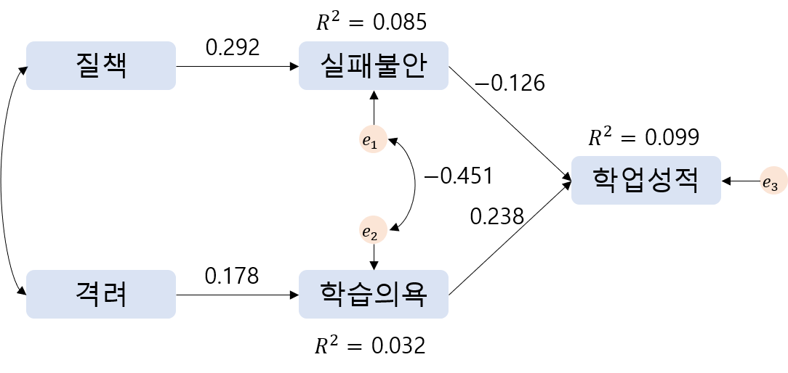

```{r setup, include=FALSE}
knitr::opts_chunk$set(echo = TRUE, warning = FALSE, message = FALSE)
options(width=200)
```


```{css, echo=FALSE}

p, ul, li{
text-align: justify
}

```

- **참고 : 이론부터 실무 활용까지 R로 하는 다변량 데이터 분석, 카와하시 잇코 $\cdot$ 이와마 노리카즈 $\cdot$ 스즈키 마사유키 저/권기태 역 **

# **1. 데이터**

- 경로분석을 수행하기 위해 사용한 데이터는 한빛아카데미에서 출판된 책 [**이론부터 실무 활용까지 R로 하는 다변량 데이터 분석**](https://www.hanbit.co.kr/store/books/look.php?p_code=B8404138031)의 예제소스 "실패.csv"이다.
- 이 데이터는 "자녀의 실패에 대한 부모의 대처 방법이 자녀의 학업 성적에 미치는 영향"을 살펴보기 위해 초등학생 500명과 그 어머니를 대상으로 조사를 실시하여 얻은 데이터이다.  
    - 어머니를 대상으로 하는 조사에서는 "질책"과 "격려"의 두 가지 측면에 대해서, 아이를 대상으로 하는 조사에서는 "실패에 대한 불안"과 "학습의욕"에 대해서 심리척도를 이용하여 측정하였다.
- 데이터의 변수는 다음과 같다.
    1. `질책` : 시험 점수가 낮을 때, 부모가 질책하는 정도를 점수화
    2. `격려` : 시험 점수가 낮을 때, 부모가 격려하는 정도를 점수화
    3. `실패불안` : 실패에 대한 자녀의 불안 정도를 점수화
    4. `학습의욕` : 학습에 대한 자녀의 의욕 정도를 점수화
    5. `학업성적` : 자녀의 국어 및 수학 시험 평균 점수
- 모형의 가설은 다음과 같다.
    - 경험적으로, 자녀를 너무 질책하면 안 된다는 것과 격려하는 것이 중요하다는 것을 알고 있다.
    - 하지만, 꾸짖는 것이 학업 성적을 떨어뜨리는 직접적인 요인이 된다고 생각하기 어렵고, 마찬가지로 격려만 한다고 해서 학업 성적이 오른다고 생각하기도 어렵다.
        - 바꾸어 말해, 질책 $\cdot$ 격려와 학업 성적 사이에는 직접적인 인과관계가 없다고 생각된다.
        - 그런데도 왜 질책은 삼가고 격려하는 것이 중요하다고 말하는 걸까?
    - 다른 가능성은 자녀가 부모에게 야단을 맞으면 '또 실패하면 어쩌나?'라는 실패에 대한 불안이 높아져 학습에 집중하기 어려울 수 있다.
    - 반면, 아이가 부모에게 격려의 말을 들으면 '다음에 좋은 성적을 받을 수 있도록 노력하자.'라는 다짐을 하게 되고 학습 의욕이 높아져 학업 성적 향상으로 이어질 수 있다.
- 위의 가설을 모형화한 것이 `경로도`이며, 아래의 그림과 같다.


- 단방향 화살표(→)는 인과관계를 나타낸다.
    - 예를 들어, "질책"은 "실패불안"의 원인이며, "실패불안"은 "질책"의 결과이다.
- 양방향 화살표(↔)는 상관관계를 나타낸다.
- $e_1, e_2, e_3$는 오차변수로 회귀분석의 오차에 해당한다.
    - 예를 들어, $e_1$은 "실패불안"의 오차변수로, "질책"으로는 설명할 수 없는 "실패불안" 부분을 나타낸다.
    

```{r}
# 데이터 불러오기
data <- read.csv("C:/Users/User/Desktop/실패.csv")

head(data)

# 데이터 구조
str(data)
```


----------------------

# **2. 경로분석**

> 경로분석은 Package `lavaan`을 통해 수행할 수 있다.

## **2-1. 모형 기술**

- 경로분석을 할 때는 먼저 어떤 모형에 대해 검토하는지를 기술한다.
    - 예를 들어, "실패불안"은 "질책"으로부터, "학습의욕"은 "격려"로부터, "학업성적"은 "실패불안"과 "학습의욕" 두 가지 변수로부터 경로를 받는다.
- 모형을 나타내는 부분은 작은따옴표 `''`로 표시하며, 각 변수가 어떤 변수로부터 경로를 받을지는 `~`을 사용해서 표현한다.  
    - `~`의 왼쪽에는 경로를 받는 변수(결과변수, 종속변수), 오른쪽에는 경로를 보내는 변수(원인변수, 독립변수)를 명시한다.
        - 예를 들어, `실패불안 ~ 질책`은 `질책 → 실패불안`이라는 경로를 표현한다.
        - 어떤 하나의 변수가 2개 이상의 변수로부터 경로를 받을 때는 `+`로 변수를 연결한다.
- 위의 경로도를 보면 "질책"과 "격려" 사이에 상관이 있음을 나타내고 있지만, Package `lavaan`에서는 이것을 모형 기술 시에 명시하지 않아도 외생변수(화살표를 받지 않는 변수) 간에 상관이 있는 것을 자동으로 지정해준다.
    - 하지만, 오차변수 사이에 상관이 있는 것은 자동으로 지정되지 않기 때문에 필요시 분석하는 사람이 따로 지정해야 한다.

```{r}
# 모형 기술
model <- '
 실패불안 ~ 질책                  
 학습의욕 ~ 격려
 학업성적 ~ 실패불안 + 학습의욕
'
```
  
----------------------

## **2-2. 모수 추정**

- 모형을 기술한 후에서는 Package `lavaan`에서 제공하는 함수 `sem()`을 이용해 모수를 추정한다.
    - 함수 `sem()`의 자세한 옵션은 [여기](https://www.rdocumentation.org/packages/lavaan/versions/0.6-11/topics/sem)를 참고한다.

```{r}
# 모수 추정
pacman::p_load("lavaan")

fit <- sem(model,                     # 기술한 모형을 대입한 객체
           data = data)               # 데이터

# 분석 결과 출력
summary(fit,                          # 분석 결과를 저장하고 있는 객체
        standardized = TRUE,          # 표준화 추정값의 출력 여부
        rsquare = TRUE)               # 결정계수의 출력 여부
```

`Caution!` 결과 출력은 함수 `summary()`를 이용하여 수행하며, 그 결과는 다음과 같다.  
1. "Estimator"는 모수의 추정방법으로서 "ML"은 최대우도추정법을 의미한다.  
2. "Model Test User Model"은 기술한 모형에 대한 모형 적합도로서 귀무가설 $H_0$은 "설정한 모형에 대한 공분산행렬과 표본에 의해 계산된 표본공분산행렬이 동일하다."이며, 대립가설 $H_1$은 "설정한 모형에 대한 공분산행렬과 표본에 의해 계산된 표본공분산행렬이 동일하지 않다."이다. 다시 말해, 귀무가설 $H_0$은 "설정한 모형은 데이터에 적합하다."이며, 대립가설 $H_1$은 "설정한 모형은 데이터에 적합하지 않다."이다.  
3. "Regression"과 "Variance"는 모수 추정에 대한 결과이다. "Estimate"는 비표준화 추정값, "Std.Err"는 표준오차, "z-value"와 "P(>|z|)"는 귀무가설 $H_0$ : "해당 경로계수는 0이다."와 대립가설 $H_1$ : "해당 경로계수는 0이 아니다."에 대한 검정통계량의 $z$ 값과 $p$-값이다. "Std.lv"는 잠재적인 구조변수의 분산만 1로 했을 때의 표준화 추정값을 나타내며, "Std.all"은 오차변수를 제외한 변수의 분산을 1로 했을 때의 표준화 추정값을 나타낸다. 이 모형에서는 잠재적인 구조가 없기 때문에 "Std.lv"값과 "Estimate"값이 동일하다.  
4. "R-Square"은 결정계수 $R^2$을 의미한다. 결정계수는 0과 1사이의 값으로 1에 가까울수록 데이터의 변동을 적합된 모형이 잘 설명하고 있다고 할 수 있다.  
`Result!` "Regression" 부분에는 경로계수에 대한 추정 결과가 출력되어 있다. 예를 들어, `실패불안 ~ 질책` 행을 보면, `질책 → 실패불안` 경로계수 $\beta_1$의 비표준화 추정값은 1.628(표준화 추정값은 0.297)로, $p$-값이 0이므로 경로계수가 유의한 의미를 가지고 있다고 볼 수 있다. 따라서, 추정값이 양수이기 때문에 시험에서 실패했을 때 질책을 받는 경험이 많은 자녀일수록 실패불안이 높은 경향을 보인다고 할 수 있다. 추정된 비표준화 경로계수에 의한 경로도는 다음과 같다.


</br>

"Variance" 부분은 오차변수의 분산 추정값을 나타낸다. 예를 들어, `.실패불안` 행은 `실패불안`의 오차변수 $e_1$의 분산을 의미한다.  
"R-Square"은 결정계수를 나타낸다. 예를 들어, `실패불안`은 `질책`으로부터 경로를 받았기 때문에 `실패불안` 중에 `질책`으로 설명할 수 있는 부분이 8.8%라고 해석할 수 있다. 이 점은 반대로 `질책`으로 설명할 수 없는 부분이 91.2%만큼 있다는 것을 의미하며, 이러한 부분은 오차변수 $e_1$으로 표현되어 있다. 그래서, 실제로 91.2%는 `실패불안`에서 오차 분산의 표준화 추정값("Std.all")과 동일하다.


-----------------------

```{r}
summary(fit,                          # 분석 결과를 저장하고 있는 객체
        standardized = TRUE,          # 표준화 추정값의 출력 여부
        rsquare = TRUE,               # 결정계수의 출력 여부
        ci = TRUE)                    # 신뢰구간 출력 여부
```

`Caution!` 함수 `summary()`에 옵션 `ci = TRUE`를 지정함으로서 추정값의 신뢰구간을 출력할 수 있다.

-----------------------

## **2-3. 모형 평가와 수정**


### **2-3-1. 모형 평가**

- 경로분석에서는 변수 간의 관계를 분석가가 유연하게 모형화할 수 있기 때문에 모형이 적절했는지를 평가하는 것이 중요하다.
- "모형이 데이터에 적합한가?"라는 관점에서 모형을 평가하기 위한 지표로서 "적합도 지표"가 있다.
- 적합도 지표는 함수 `summary()`로 결과를 출력할 때 옵션 `fit.measures = TRUE`를 추가하면 출력할 수 있다.
- 출력되는 적합도 지표는 다음과 같다.
    - Comparative Fit Index (CFI)와 Tucker-Lewis Index (TLI) : 기준이 되는 모형과 비교하여 평가하고 싶은 모형의 적합이 어느 정도 좋은지를 지표화한 것이다. `1에 가까울수록 모형 적합이 잘 수행`되었다는 것을 의미한다.
    - Akaike (AIC)와 Bayesian (BIC) : 모형이 복잡해질수록 패널티를 부여하는 적합도 지표이며, `값이 작을수록 모형 적합이 잘 수행`되었다는 것을 의미한다.
    - Root Mean Square Error of Approximation (RMSEA) : 표본공분산행렬과 모형에 기초한 공분산구조의 차이를 자유도로 나눈값으로, 모형에 복잡도가 미치는 영향을 제거하고 차이의 크기를 파악하려는 지표이다. `0에 가까울수록 모형 적합이 잘 수행`되었다는 것을 의미한다.
    - Standardized Root Mean Square Residual (SRMR) : Root Mean Square Residual (RMR)은 회귀분석의 오차에 해당하는 것으로, 데이터를 바탕으로 계산되는 표본공분산행렬과 모형을 통해 추정되는 공분산구조의 요소별 차이의 크기에 대한 평균이다. `0에 가까울수록 모형 적합이 잘 수행`되었다는 것을 의미하며, 데이터와 모형이 완전히 일치하면 0이 된다. 다만, RMR은 단위의 영향을 받기 때문에 일반적인 단위로 표준화한 지표 SRMR이 이용된다.

```{r}
summary(fit,                          # 분석 결과를 저장하고 있는 객체
        standardized = TRUE,          # 표준화 추정값의 출력 여부
        rsquare = TRUE,               # 결정계수의 출력 여부
        ci = TRUE,                    # 신뢰구간 출력 여부
        fit.measures = TRUE)          # 적합도 평가 출력 여부
```

`Caution!` "CFI"와 "TLI"은 0.95 이상, "RMSEA"는 0.06 이하, "SRMR"은 0.08 이하면 모형 적합이 잘 이루어졌다고 판단할 수 있다. 하지만, 이러한 기준은 어디까지나 경험적인 것이기 때문에 기계적으로 판단할 수 없다는 점에 주의해야 한다. 

-------------------------

```{r}
# 모든 적합도 지표 출력
fitmeasures(fit)
```

`Caution!` 함수 `fitmeasures()`를 이용하면 Package `lavaan`에서 계산된 모든 적합도 지표를 출력할 수 있다.

-------------------------

### **2-3-2. 모형 수정**

- 경로분석에서는 분석가의 판단으로 모형을 설정할 수 있지만, 이것이 마음대로 모형을 설정해도 된다는 의미는 아니다.
- 무조건 모형을 설정하는 게 아니라 변수의 관계성에 관한 실질적이고 과학적인 이론을 바탕으로 모형을 설정하는 것이 중요하다.
- 그러나, 이론에 근거했다고 해도 처음 생각한 모형이 항상 잘 들어맞는 것은 아니며, 이러한 경우에 모형을 수정할 수 있다.
- 모형을 수정할 때 참고가 되는 지표로 "수정 지표"가 있으며, 수정 지표는 모형에 경로를 추가하여 모형이 어느 정도 개선되는지를 나타낸다.
- 구체적으로 표현하자면, 새롭게 경로를 추가했을 경우 $\chi^2$ 값 변화의 기댓값을 보는 것이다.
    - 수정 지표는 어디까지나 통계적인 근거를 바탕으로 산출되는 것이지, 이론적인 근거를 바탕으로 산출되는 것은 아니다.
    - 따라서, 수정 지표를 참고하여 경로를 추가할 때는 그 경로를 추가하는 데 이론적 근거가 있는지를 생각해야 한다.
    - 경로를 추가한 이유를 논리적으로 충분히 설명할 수 없다면 수정 지표에 근거한 모형 수정은 의미가 없다는 점을 분명히 알아둬야 한다.
- 또한, 추가된 경로에서 경로계수의 추정값이 얼마가 되는지를 나타내는 예측값은 "변화 기댓값"이라고 부른다.
- 수정 지표와 추정값의 변화 기대값은 함수 `modindices()`를 통해 출력할 수 있다.

```{r}
# 수정 지표 출력
modindices(fit)
```

`Caution!` 출력 결과에서 "mi" 값은 수정 지표, "epc"는 추가된 경로계수 추정값의 변화 기댓값, "sepc.lv"는 잠재적인 구조변수의 분산만 1로 했을 때의 변화 기댓값, "sepc.all"은 오차변수를 제외한 변수의 분산을 1로 했을 때의 변화 기댓값, "sepc.nox"는 외생변수를 제외한 변수의 분산을 1로 했을 때의 변화 기댓값이다. `~~`는 변수 간의 공분산(상관, ↔)을 나타낸다.  
`Result!` 예를 들어, `11 실패불안 ~~ 학습의욕` 행은 `실패불안`의 오차변수와 `학습의욕`의 오차변수 사이에 상관관계(즉, $e_1$ ↔ $e_2$)를 두면, 모형의 $\chi^2$ 값이 101.086 작아지는 것을 의미한다. 또한, `실패불안`과 `학습의욕` 사이의 공분산 기댓값은 -19.525, 상관계수의 기대값("sepc.all")은 -0.450로 나타났다. 그리고 `14 실패불안 ~ 학습의욕` 행은 `학습의욕 → 실패불안`이라는 경로를 추가했을 때의 수정 지표("mi")와 `학습의욕 → 실패불안`의 경로계수 추정값의 변화 기댓값에 관한 정보를 나타내고 있다.  
수정 지표("mi")를 살펴보면, `11 실패불안 ~~ 학습의욕` 행의 "mi" 값이 가장 높으며, 이는 `실패불안`의 오차변수와 `학습의욕`의 오차변수 사이에 공분산(상관)을 두는 것으로 모형 적합도가 개선되는 것을 알 수 있다. 오차변수 사이에 상관을 가정한다는 것은 "변수 `질책`과 `격려` 외에 `실패불안`과 `학습의욕`에 공통되는 변수(즉, 두 변수와 각각 상관을 갖는 변수)가 있다는 것을 가정한다."는 의미이다. 예를 들어, 학업에 자신 있는 학습자일수록 실패에 대한 불안감이 낮고 학습 의욕은 높다고 생각할 수 있다. 이와 같이 본인의 자신감이라는 요인이 오차 간 상관을 생성하고 있을 가능성이 있기 때문에 오차 간에 상관을 가정하는 것은 합리적이라고 할 수 있다. 따라서, `실패불안`의 오차변수와 `학습의욕`의 오차변수 사이에 상관을 가정하는 것으로 수정한 후 다시 분석을 한다. 수정 후 모형은 다음과 같은 경로도로 나타낼 수 있다.


-----------------------

```{r}
# 오차변수 사이에 상관을 가정한 모형 기술
model2 <- '
 실패불안 ~ 질책                  
 학습의욕 ~ 격려
 학업성적 ~ 실패불안 + 학습의욕
 실패불안 ~~ 학습의욕
'
```

`Caution!` `~~`는 변수 간의 상관관계(↔)를 나타낸다. `실패불안 ~~ 학습의욕`에 있는 내생변수 "실패불안"과 "학습의욕"은 사실 해당 변수에 관한 오차를 의미한다. 즉, `실패불안 ~~ 학습의욕`는 `실패불안`과 `학습의욕` 사이에 상관을 설정하는 것이 아니라, `실패불안`의 오차변수와 `학습의욕`의 오차변수 사이에 상관을 설정하는 것이다.

-----------------------

```{r}
# 모수 추정
pacman::p_load("lavaan")

fit2 <- sem(model2,                   # 기술한 모형을 대입한 객체
            data = data)              # 데이터

# 분석 결과 출력
summary(fit2,                         # 분석 결과를 저장하고 있는 객체
        standardized = TRUE,          # 표준화 추정값의 출력 여부
        rsquare = TRUE,               # 결정계수의 출력 여부
        ci = TRUE,                    # 신뢰구간 출력 여부
        fit.measures = TRUE)          # 적합도 평가 출력 여부
```

`Result!` 우선 모형 적합도("Model Test User Model")를 확인해보면, 가설 $H_0$ : "설정한 모형은 데이터에 적합하다." vs $H_1$ : "설정한 모형은 데이터에 적합하지 않다."의 검정통계량 $\chi^2$ 값은 4.330이고 $p$-값은 0.363이다. 이에 근거하여 유의수준 5%에서 $p$-값이 0.05보다 크기 때문에 귀무가설 $H_0$은 기각하지 않는다. 즉, 설정한 모형은 관측된 데이터에 적합하다.  
적합도 지표 중 "CFI", "TLI", "RMSEA", "SRMR"을 살펴봤을 때 데이터에 대한 모형 적합도는 양호하다고 할 수 있다. 게다가, "AIC"와 "BIC"의 관점에서 첫 번째 모형("model")은 각각 10620.003, 10649.505이었으나 현재 모형("model2")에서는 10508.692, 10542.409로 첫 번째 모형에 비해 줄어들었다. 이러한 결과를 볼 때, 오차변수 사이에 상관을 가정하지 않은 모형보다 상관을 가정한 모형이 더 적절하다는 것을 알 수 있다.  
경로에 관한 추정값의 관점은 첫 번째 모형 때와 같지만 공분산(상관계수)에 관한 추정값이 "Covariances" 부분에 출력되었다. "Estimate"는 공분산, "Std.all"은 상관계수 값을 나타낸다. 따라서, `실패불안`의 오차변수와 `학습의욕`의 오차변수 사이의 공분산은 -19.582, 상관계수는 -0.451이 된다. 추정된 표준화 경로계수에 의한 경로도는 다음과 같다.



------------------------------


```{r}
# 경로도
pacman::p_load("semPlot")

# semPaths(fit2, 'std', layout = 'tree2')

 semPlot::semPaths(fit2,                      # 분석 결과를 저장하고 있는 객체
                   whatLabels = "std",        # 라벨로 나타낼 값 (est : 비표준화 추정값, std : 표준화 추정값)
                   intercepts = FALSE,        # 절편 출력 여부
                   style = "lisrel",          # 스타일
                   nCharNodes = 0,            # 노드에 출력할 문자 개수, 0 : 모든 문자 출력
                   rotation = 2,              # 외생변수 위치 
                   edge.label.position = 0.5, # 화살표에서 경로계수의 위치
                   edge.label.cex = 1,        # 경로계수 크기
                   curveAdjacent = TRUE,      # 화살표를 곡선으로 할 것인지 여부
                   title = TRUE,              
                   layout = "tree2",          # 경로도의 모양
                   curvePivot = TRUE,         # 화살표의 가장자리를 곡선으로 할 것인지 여부
                   pastel = TRUE,             # 파스텔 컬러로부터 색깔을 선택할 것인지 여부
                   groups = "manlat")         # 동일한 색깔을 부여할 그룹 노드 
```

`Caution!` Package `semPlot`에서 제공하는 함수 `semPaths()`를 이용하여 분석 결과에 대한 경로도를 작성할 수 있다. 함수 `semPaths()`의 옵션은 [여기](https://www.rdocumentation.org/packages/semPlot/versions/1.1.6/topics/semPaths)를 참고한다.
