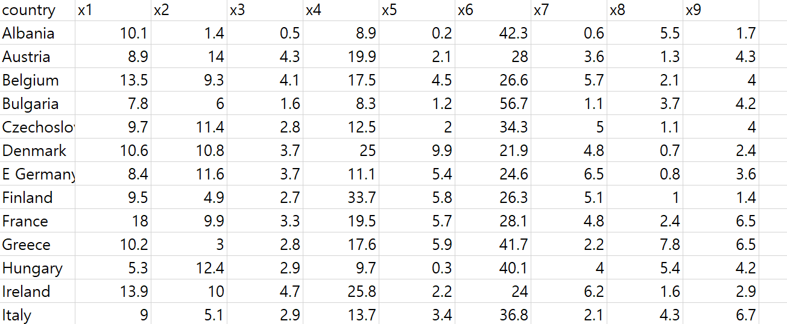
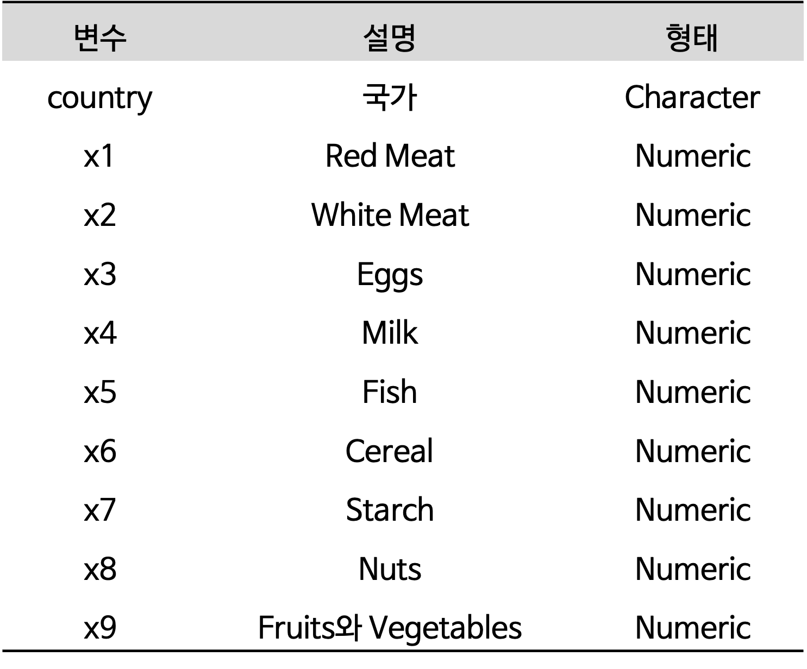
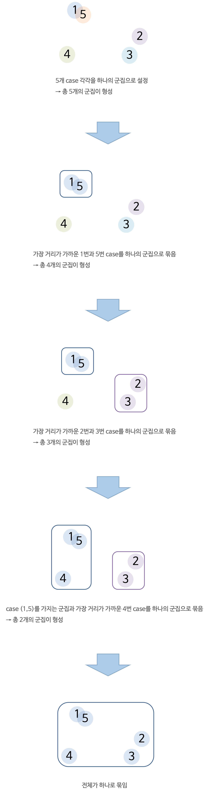
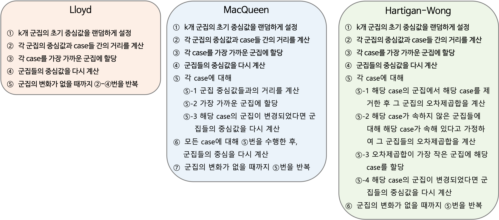

```{r setup, include=FALSE}
knitr::opts_chunk$set(echo = TRUE, warning = FALSE, message = FALSE)
options(width=200)
```


```{css, echo=FALSE}

p, ul, li{
text-align: justify
}

```


 > 실습 자료 : 25개 유럽 국가들에 대해 9개의 식품에서 섭취하는 단백질의 양을 조사한 자료(출처 : R을 활용한 다변량 자료분석 방법론)로 총 10개의 변수를 포함한다.

<center></center>

<br />

<center>{width=50%}</center>

<br />

----------


# **1. 데이터 불러오기**

```{r, eval=F}
pacman::p_load("data.table", 
               "tidyverse", 
               "dplyr",
               "caret",
               "GGally",                                       # For ggpairs
               "factoextra",                                   # For fviz_dend, fviz_nbclust
               "NbClust")                                      # For NbClust


protein <- fread(".../protein.csv")                            # 데이터 불러오기

protein %>%
  as_tibble
```

```{r, echo=F}
pacman::p_load("data.table", 
               "tidyverse", 
               "dplyr",
               "caret",
               "GGally",                                       # For ggpairs
               "factoextra",                                   # For fviz_dend, fviz_nbclust
               "NbClust")                                      # For NbClust

protein <- fread(paste(getwd(),  "protein.csv", sep = "/"))    # 데이터 불러오기

protein %>%
  as_tibble
```

----------

# **2. 데이터 전처리 I**

```{r}
protein.df <- protein %>%
  data.frame %>%                                            # Data Frame 형태로 변환
  select(-country)                                          # 변수 "country" 제거

rownames(protein.df) <- protein$country                     # 행 이름 변경

protein.df %>%
  head()                                                    # 처음 6개 case 확인
```

---------

# **3. 데이터 탐색**

```{r}
ggpairs(protein.df,
        upper = list(continuous = "density"),
        lower = list(continuous = wrap("points", size = 0.5)),
        diag = list(continuous = "densityDiag")) +
  theme_bw()
```


```{r}
# 상관계수 그래프
ggcorr(protein.df,              # 데이터
       label = TRUE,            # 라벨 명시 여부
       label_round = 3,         # 상관계수 소숫점 이하 자릿수
       label_size = 3,          # 상관계수 글자 크기
       low = "steelblue",       # 상관계수가 음수일 때 색깔
       mid = "white",           # 상관계수가 0에 가까울 때 색깔
       high = "darkred")        # 상관계수가 양수일 때 색깔
```

----------

# **4. 데이터 분할**

```{r}
# Partition (Training Dataset : Test Dataset = 7:3)
set.seed(200)
ind <- sample(1:nrow(protein.df), 0.7*nrow(protein.df))     # Index를 이용하여 7:3로 분할

protein.trd <- protein.df[ind,]                             # Training Dataset
protein.ted <- protein.df[-ind,]                            # Test Dataset
```

----------

# **5. 데이터 전처리 II**

```{r}
# Standardization
preProcValues <- preProcess(protein.trd,
                            method = c("center", "scale"))  # Standardization 정의 -> Training Dataset에 대한 평균과 표준편차 계산 

protein.trd <- predict(preProcValues, protein.trd)          # Standardization for Training Dataset
protein.ted <- predict(preProcValues, protein.ted)          # Standardization for Test Dataset

glimpse(protein.trd)                                        # 데이터 구조 확인
glimpse(protein.ted)                                        # 데이터 구조 확인
```

----------

# **6. 계층적 군집분석**

- 계층적 군집분석은 거리가 가까운 군집을 하나씩 묶어가면서 군집을 형성하는 방법이다.
    - 예를 들어, $n$개의 case가 있을 때 거리가 가장 가까운 두 개의 case를 묶어서 하나의 군집을 형성하고, 나머지 $n-2$개의 case는 각각이 하나의 군집을 이루도록 한다.
    - 그리고나서, $n-1$개의 군집 중에서 거리가 가장 가까운 두 개의 군집을 묶어 $n-2$개의 군집을 형성한다.
    - 이와 같은 과정은 최종적으로 $n$개의 case를 모두 묶어 하나의 군집을 형성할 때까지 반복한다.
   
<center>
{width=50%}
</center> 

</br>    
    
- 계층적 군집분석은 덴드로그램(Dendrogram)을 이용하여 시각적으로 군집 형성 과정을 볼 수 있으며, 이것은 전체 군집들 간의 구조적 관계를 살펴보는데 매우 유용하다.
- 계층적 군집분석은 case의 개수가 비교적 작을 때 유용하다.
    - case의 개수가 많으면 거리행렬을 계산하는 데 매우 많은 시간과 컴퓨터 용량이 필요하므로 적용에 제약이 따른다.
- 계층적 군집분석은 군집 간의 case 이동이 불가능하다는 단점이 있다.

---------------------------

## **6-1. 거리행렬 계산**

- 계층적 군집분석을 수행하기 전에 case 간의 거리를 계산하여 거리행렬을 생성한다.
- 거리행렬을 생성하기 위해 함수 `dist()`를 이용하며, 거리를 계산하는 방법은 옵션 `method`에 지정할 수 있다.
    - 함수 `dist()`의 자세한 옵션은 [여기](https://www.rdocumentation.org/packages/stats/versions/3.6.2/topics/dist)를 참고한다.

```{r}
protein.X.eucl <- dist(protein.trd,                       
                       method = "euclidean")                # 유클리드 거리 
protein.X.eucl


protein.X.manh <- dist(protein.trd,                       
                       method = "manhattan")                # 맨해튼 거리
protein.X.manh


protein.X.canb <- dist(protein.trd,                    
                       method = "canberra")                 # 캔버라 거리
protein.X.canb


protein.X.mink <- dist(protein.trd,                         
                       method = "minkowski")                # 민코우스키 거리
protein.X.mink
```

`Caution!` 모든 거리행렬을 이용하여 분석을 수행하면 시간이 오래 걸리기 때문에 본 예제에서는 유클리드 거리에 기반한 거리행렬만 이용한다.

------------------------------

## **6-2. 계층적 군집분석**

- 계층적 군집분석은 함수 `hclust()`를 이용하여 수행할 수 있으며, 옵션 `method`에 군집 간 거리를 정의하는 방법을 지정할 수 있다.
    - `"single"` : 최단 연결법
        - 두 군집에 속한 case들의 최단 거리를 군집 간 거리로 정의
    - `"complete"` : 최장 연결법
        - 두 군집에 속한 case들의 최장 거리를 군집 간 거리로 정의
    - `"average"` : 평균 연결법
        - 두 군집에 속한 모든 case 간의 거리 평균을 군집 간 거리로 정의
    - `"ward.D"` : Ward의 방법
        - 군집 내 제곱합과 군집 간 제곱합을 고려   
    - `"mcquitty"` : McQuitty의 평균 연결법
    - `"centroid"` : 중심 연결법
    - `"median"` : 중위수 연결법

</br>

`Caution!` 옵션 `method`에 지정한 방법에 따라 군집 형성의 결과가 다르다.

```{r}

protein.X.sing <- hclust(protein.X.eucl,                     # 유클리드 거리에 기반한 거리행렬
                         method = "single")                  # 최단 연결법
protein.X.sing


protein.X.comp <- hclust(protein.X.eucl,                     # 유클리드 거리에 기반한 거리행렬
                         method = "complete")                # 최장 연결법
protein.X.comp


protein.X.aver <- hclust(protein.X.eucl,                     # 유클리드 거리에 기반한 거리행렬
                         method = "average")                 # 평균 연결법
protein.X.aver


protein.X.ward <- hclust(protein.X.eucl,                     # 유클리드 거리에 기반한 거리행렬
                           method = "ward.D")                # Ward 방법
protein.X.ward
```

-----------

`Caution!` 함수 `cutree()`는 case별 군집 번호를 생성하는 함수이다. 옵션 `k`에 형성하고자 하는 군집 개수를 입력하면 계층적 군집분석의 결과를 이용하여 각 case의 군집 번호를 출력해준다. 

```{r}
# Training Dataset의 case별 군집 번호 생성
hcluster <- cutree(protein.X.ward,                          # Ward 방법을 이용한 계층적 군집분석           
                   k = 3)                                   # 형성하고자 하는 군집 개수
hcluster

# Training Dataset과 군집 번호 결합
protein.X.hclust <- data.frame(protein.trd, hcluster)
protein.X.hclust
```


---------------------------

## **6-3. 덴드로그램**

- 계층적 군집분석의 장점은 덴드로그램을 쉽게 얻을 수 있다는 것이며, 덴드로그램을 통해 case의 군집 형성 과정을 한 눈에 살펴볼 수 있다.

```{r}
# 최단 연결법을 이용한 계층적 군집분석의 덴드로그램
plot(protein.X.sing, 
     main = "최단 연결법",                                 # 제목
     xlab = "")                                            # x축 라벨 이름

# 덴드로그램에 군집 구분 상자 추가
rect.hclust(protein.X.sing,                                
            k = 3,                                         # 형성하고자 하는 군집 개수
            border = "red")                                # 상자 색깔
```


`Result!` 덴드로그램을 살펴보면, 가장 아래쪽에 있는(=Height가 가장 짧은=군집 간 거리가 가장 짧은) "Romania"와 "Yugoslavia"가 제일 처음으로 묶여 군집을 형성하였다. 그리고, Height가 두 번째로 짧은 "W Germany"와 "Netherlands"가 묶여 군집을 형성하였다. 세 번째로는 군집 ("W Germany", "Netherlands")과 "Belgium"이 묶여 군집을 형성했다는 것을 알 수 있다.

```{r}
# 최장 연결법을 이용한 계층적 군집분석의 덴드로그램
plot(protein.X.comp,                          
     main = "최장 연결법",                                 # 제목
     xlab = "")                                            # x축 라벨 이름

# 덴드로그램에 군집 구분 상자 추가
rect.hclust(protein.X.comp,                                
            k = 3,                                         # 형성하고자 하는 군집 개수
            border = "red")                                # 상자 색깔

# 평균 연결법을 이용한 계층적 군집분석의 덴드로그램
plot(protein.X.aver,                          
     main = "평균 연결법",                                 # 제목
     xlab = "")                                            # x축 라벨 이름

# 덴드로그램에 군집 구분 상자 추가
rect.hclust(protein.X.aver,                                
            k = 3,                                         # 형성하고자 하는 군집 개수
            border = "red")                                # 상자 색깔


# Ward 방법을 이용한 계층적 군집분석의 덴드로그램
plot(protein.X.ward,                          
     main = "Ward",                                        # 제목
     xlab = "")                                            # x축 라벨 이름

# 덴드로그램에 군집 구분 상자 추가
rect.hclust(protein.X.ward,                                
            k = 3,                                         # 형성하고자 하는 군집 개수
            border = "red")                                # 상자 색깔
```

--------------------------

`Caution!` Package `"factoextra"`에서 제공하는 함수 `fviz_dend()`를 이용하면 덴드로그램의 시각화 옵션을 다양하게 변경할 수 있다.

```{r}
protein.X.ward %>%
  fviz_dend(cex = 1,                                       # 라벨 크기
            k = 3,                                         # 형성하고자 하는 군집 개수
            palette = "jco")                               # 군집 색깔


protein.X.ward %>%
  fviz_dend(cex = 1,                                       # 라벨 크기
            k = 3,                                         # 형성하고자 하는 군집 개수
            palette = "jco",                               # 군집 색깔
            # 덴드로그램에 군집 구분 상자 추가
            rect = TRUE,                                   # 상자 표시 여부
            rect_border = "jco",                           # 상자 색깔
            rect_fill = TRUE)                              # 상자 색깔 채우기 여부 / FALSE : 선만 표시


protein.X.ward %>%
  fviz_dend(cex = 1,                                       # 라벨 크기
            k = 3,                                         # 형성하고자 하는 군집 개수
            palette = "jco",                               # 군집 색깔
            # 덴드로그램에 군집 구분 상자 추가
            rect = TRUE,                                   # 상자 표시 여부
            rect_border = "jco",                           # 상자 색깔
            rect_fill = TRUE,
            horiz = TRUE)                                  # 가로로 회전
```


--------------------------------

## **6-4. 거리행렬만 주어진 경우**

- Dataset의 예측 변수 값은 주어지지 않았으며, 거리행렬만 알고 있는 경우 계층적 군집분석을 수행하는 절차는 다음과 같다.
    1. 주어진 거리행렬을 함수 `as.dist()`를 이용하여 "dist" 객체로 변환
    2. 함수 `hclust()`를 이용하여 계층적 군집분석 수행  

```{r}
# 거리행렬
exam71 <- c(0, 1, 7, 9, 1, 0, 3, 6, 7, 3, 0, 5, 9, 6, 5, 0)   
exam71.matrix <- matrix(exam71, nrow = 4)
exam71.matrix


exam71.dist <- as.dist(exam71.matrix)                       # "dist" 객체로 변환
exam71.dist

exam71.sing <- hclust(exam71.dist,                          
                      method = "single")                    # 최단 연결법

# 덴드로그램 Ver.1
plot(exam71.sing,                                           
     main = "최단 연결법",                                  # 제목
     xlab = "")                                             # x축 라벨 이름

# 덴드로그램 Ver.2
exam71.sing %>%
  fviz_dend(cex = 1,                                       # 라벨 크기
            k = 3,                                         # 형성하고자 하는 군집 개수
            palette = "jco",                               # 군집 색깔
            # 덴드로그램에 군집 구분 상자 추가
            rect = TRUE,                                   # 상자 표시 여부
            rect_border = "jco",                           # 상자 색깔
            rect_fill = TRUE)                              # 상자 색깔 채우기 여부 / FALSE : 선만 표시

exam71.comp <- hclust(exam71.dist,                         
                      method = "complete")                  # 최장 연결법

# 덴드로그램 Ver.1
plot(exam71.comp,
     main = "최장 연결법",                                  # 제목
     xlab = "")                                             # x축 라벨 이름

# 덴드로그램 Ver.2
exam71.comp %>%
  fviz_dend(cex = 1,                                       # 라벨 크기
            k = 3,                                         # 형성하고자 하는 군집 개수
            palette = "jco",                               # 군집 색깔
            # 덴드로그램에 군집 구분 상자 추가
            rect = TRUE,                                   # 상자 표시 여부
            rect_border = "jco",                           # 상자 색깔
            rect_fill = TRUE)                              # 상자 색깔 채우기 여부 / FALSE : 선만 표시
```

-----------------------

# **7. 군집 개수 결정**

- 군집 개수를 결정하는 것은 쉽지 않은 문제이며, 여러 가지 지표들을 이용하여 적절한 군집 개수를 찾는 것이 바람직하다.
- 계층적 군집분석은 자료의 계층적 구조에 주된 관심이 있으며, 덴드로그램을 통해 적절한 군집 개수를 결정할 수 있다.
    - 예를 들어, 군집 형성 과정에서 거리의 측도 또는 어떤 지표의 값이 상대적으로 큰 변화를 보일 경우 이를 검토할 필요가 있다.
    - 특히, Ward 방법을 이용하는 경우 군집의 개수에 따른 Error Sum of Squares (ESS)의 증분을 검토하여 급격한 변화가 일어나는 위치에 대응하는 군집 개수를 최적의 군집 개수로 결정하기도 한다.
- 자료의 모분포에 대한 적절한 가정 하에서 통계적 가설검정를 통해 군집의 개수를 알아보는 방법들도 있으나, 이들도 일반적으로 만족할 만한 타당성을 제공하지 않는다.

--------------------

## **7-1. "fviz_nbclust"**

- Package `"factoextra"`에서 제공하는 함수 `fviz_nbclust()`를 이용하여 군집 개수에 따른 특정 통계량의 변화를 알 수 있다.
    - 옵션 `method`에는 다음과 같은 통계량을 지정할 수 있다.
        1. `"wss"` (군집 내 제곱합, Within-Cluster Sum of Square) : 군집 내 변동의 합계를 의미하며, 해당 값이 작을수록 군집화가 잘 되었음을 나타낸다. 군집의 개수가 증가함에 따라 wss가 작아지게 되는데, `wss가 급격히 감소하다가 감소량이 완만하게 되는 지점`이 최적의 군집 개수에 대한 후보가 될 수 있다.
        2. `"silhouette"` (실루엣 계수, Silhouette Coefficient) : 각 case가 해당 군집에 얼마나 잘 위치하고 있는 지를 측정하는 계수이며, 해당 값이 클 때 군집화가 잘 되었음을 나타낸다. 일반적으로 `평균 실루엣 계수가 가장 큰 지점`의 군집 개수를 최적의 군집 개수로 선택한다.
- 함수 `fviz_nbclust()`의 자세한 옵션은 [여기](https://www.rdocumentation.org/packages/factoextra/versions/1.0.7/topics/fviz_nbclust)를 참고한다.
  

```{r}
# Method = "wss"
fviz_nbclust(protein.trd,                                    
             kmeans,                                        # 군집분석에 사용할 함수
             method = "wss",                                # 탐색할 통계량 
             k.max = 10)                                    # 탐색할 최대 군집 개수
```

`Result!` 군집의 개수가 2-5개일 때, 통계량 wss의 감소량이 완만하게 되기 때문에, 최적의 군집 개수를 2-5개로 선택할 수 있다.

--------------

```{r}
# Method = "silhouette"
fviz_nbclust(protein.trd,                              
             kmeans,                                        # 군집분석에 사용할 함수
             method = "silhouette",                         # 탐색할 통계량 
             k.max = 10)                                    # 탐색할 최대 군집 개수
```

`Result!` 군집의 개수가 2개일 때, 평균 실루엣 계수가 가장 높으므로 최적의 군집 개수를 2개로 선택할 수 있다.

-----------------------------

## **7-2. "NbClust"**

- Package `"NbClust"`에서 제공하는 함수 `NbClust()`는 앞에서 설명한 통계량(`"wss"`, `"silhouette"`)을 포함하여 30개의 통계량에 의해 군집의 개수를 결정할 수 있다.
- 함수 `NbClust()`의 자세한 옵션은 [여기](https://www.rdocumentation.org/packages/NbClust/versions/3.0.1/topics/NbClust)를 참고한다.

```{r}
nc <- NbClust(data = protein.trd,                         
              distance = "euclidean",                       # 거리를 계산할 측도
              min.nc = 2,                                   # 탐색할 최소 군집 개수
              max.nc = 8,                                   # 탐색할 최대 군집 개수
              method = "kmeans")                            # 군집분석 방법
nc
```

`Caution!` "\$All.index"에서는 군집 개수에 따른 각 통계량의 측정값을 볼 수 있으며, "\$Best.nc"에서는 각 통계량에 대해 최적의 군집 개수를 보여준다. "\$Best.partition"에서는 최적의 군집 개수에 대한 case별 군집 번호를 보여준다.  
`Result!` "\$Best.nc"를 살펴보면, 10개의 통계량에서 최적의 군집 개수로 "2"개를 추천하고 있으며, 5개의 통계량에서 최적의 군집 개수를 "3"개로 추천하고 있다. 대다수의 통계량이 최적의 군집 개수로 "2"개를 추천하고 있으며, 이를 기반으로 나눠진 각 case의 군집 번호는 "\$Best.partition"에서 볼 수 있다.

-------------------

```{r}
# 여러 통계량의 최적의 군집 개수에 대한 막대 그래프
barplot(table(nc$Best.n[1,]),                               # 군집 개수에 대한 도수분포표
        xlab = "Number of Clusters",
        ylab = "Number of Criteria")
```

-------------------

`Caution!` 옵션 `index`에 특정 통계량의 이름을 지정하면, 해당 통계량에 대한 결과를 자세히 볼 수 있다. 

```{r}
# Cubic Clustering Criterion 통계량에 대한 최적의 군집 개수
NbClust(data = protein.trd,                         
        distance = "euclidean",                             # 거리를 계산할 측도
        min.nc = 2,                                         # 탐색할 최소 군집 개수
        max.nc = 8,                                         # 탐색할 최대 군집 개수
        method = "kmeans",                                  # 군집분석 방법
        index = "ccc")                                      # Cubic Clustering Criterion 통계량
```

------------------------------

# **8. 비계층적 군집분석(k-means)**

> k-means의 장점
 
- 안정적인 결과를 찾을 때까지 각 반복마다 군집 간에 case 이동이 가능하다.
- 예측 변수가 많은 경우, 다른 군집분석 알고리듬에 비해 수행하는 시간이 적게 걸린다.
- 알고리듬 구현이 매우 간단하다.

</br>

> k-means의 단점

- 범주형 예측 변수는 거리 계산을 할 수 없으므로 분석에 사용할 수 없다.
- 군집의 개수를 미리 결정해야 한다.
- 예측 변수들의 scale을 동일하게 설정해야 한다.
- 이상치에 민감하다.
- 초기 중심값 선택에 매우 민감하다.
- 비구형 군집에는 잘 작동하지 않는다.

</br>

> k-means를 수행하기 위해 사용할 알고리듬

<center></center>

</br>

`Caution!` [7. 군집 개수 결정][**7. 군집 개수 결정**]에서 다양한 통계량을 이용하여 결정된 최적의 군집 개수 "2"개를 기반으로 k-means를 수행한다.

```{r}
# k-means에서 함수 predict()를 사용하기 위해 Package 설치
pacman::p_load("twidlr")                                       # For predict of "kmeans"
# devtools::install_github("drsimonj/twidlr")                  # Install Package "twidlr"
```


------------------------------

## **8-1. Lloyd**

### **8-1-1. 모형 훈련**

```{r}
set.seed(200)
protein.Lloyd <- kmeans(protein.trd, 
                        centers = 2,                         # 형성하고자 하는 군집 개수
                        nstart = 10,                         # 수행 횟수
                        iter.max = 100,                      # 최대 반복 수
                        algorithm = "Lloyd")
protein.Lloyd
```

`Caution!` k-means는 초기 중심값을 랜덤하게 선택하기 때문에 이 과정에서 다양한 결과가 나타날 수 있다. 그래서 `nstart`를 이용하여 수행 횟수를 늘려 최대한 다양한 초기 중심값에 대해 k-means를 수행하고 최적의 결과를 찾을 수 있다.  
`Result!` 각 군집에 속한 case 수는 11, 6이며, "Within cluster sum of squares by cluster"를 살펴보면 42.6%의 변동이 2개의 군집으로 설명되고 있다.

------------------------------

### **8-1-2. 예측**

```{r}
# Test Dataset에 대한 군집 번호 예측
pred.Lloyd <- predict(protein.Lloyd,
                      protein.ted)
pred.Lloyd %>%
  as_tibble
```


```{r}
# Test Dataset과 예측한 군집 번호 결합
pred.protein.ted <- data.frame(protein.ted, pred.Lloyd) %>%
  mutate(pred.Lloyd = factor(pred.Lloyd))                   # 군집 번호를 범주형으로 변환

pred.protein.ted %>%
  as_tibble

ggpairs(pred.protein.ted,                             
        aes(colour = pred.Lloyd, alpha = 0.8),              # 군집에 따라 색깔을 다르게 표현
        upper = list(continuous = "density")) +
  scale_colour_manual(values = c("purple","cyan4")) +       # 특정 색깔 지정
  scale_fill_manual(values = c("purple","cyan4")) +         # 특정 색깔 지정
  theme_bw()
```

------------------------------

## **8-2. MacQueen**

### **8-2-1. 모형 훈련**

```{r}
set.seed(200)
protein.MacQ <- kmeans(protein.trd, 
                       centers = 2,                         # 형성하고자 하는 군집 개수
                       nstart = 10,                         # 수행 횟수
                       iter.max = 100,                      # 최대 반복 수
                       algorithm = "MacQueen")
protein.MacQ
```

`Result!` 각 군집에 속한 case 수는 11, 6이며, "Within cluster sum of squares by cluster"를 살펴보면 42.6%의 변동이 2개의 군집으로 설명되고 있다.

------------------------------

### **8-2-2. 예측**

```{r}
# Test Dataset에 대한 군집 번호 예측
pred.MacQ <- predict(protein.MacQ,
                     protein.ted)
pred.MacQ %>%
  as_tibble
```


```{r}
# Test Dataset과 예측한 군집 번호 결합
pred.protein.ted <- data.frame(protein.ted, pred.MacQ) %>%
  mutate(pred.MacQ = factor(pred.MacQ))                     # 군집 번호를 범주형으로 변환

pred.protein.ted %>%
  as_tibble

ggpairs(pred.protein.ted,                             
        aes(colour = pred.MacQ, alpha = 0.8),               # 군집에 따라 색깔을 다르게 표현
        upper = list(continuous = "density")) +
  scale_colour_manual(values = c("#483DBB","#FFB400")) +    # 특정 색깔 지정
  scale_fill_manual(values = c("#483DBB","#FFB400")) +      # 특정 색깔 지정
  theme_bw()
```


------------------------------

## **8-3. Hartigan-Wong**

### **8-3-1. 모형 훈련**

```{r}
set.seed(200)
protein.HW <- kmeans(protein.trd, 
                     centers = 2,                            # 형성하고자 하는 군집 개수
                     nstart = 10,                            # 수행 횟수
                     iter.max = 100,                         # 최대 반복 수
                     algorithm = "Hartigan-Wong")
protein.HW
```

`Result!` 각 군집에 속한 case 수는 11, 6이며, "Within cluster sum of squares by cluster"를 살펴보면 42.6%의 변동이 2개의 군집으로 설명되고 있다.

------------------------------

### **8-3-2. 예측**

```{r}
# Test Dataset에 대한 군집 번호 예측
pred.HW <- predict(protein.HW,
                   protein.ted)
pred.HW %>%
  as_tibble
```


```{r}
# Test Dataset과 예측한 군집 번호 결합
pred.protein.ted <- data.frame(protein.ted, pred.HW) %>%
  mutate(pred.HW = factor(pred.HW))                         # 군집 번호를 범주형으로 변환

pred.protein.ted %>%
  as_tibble

ggpairs(pred.protein.ted,                             
        aes(colour = pred.HW, alpha = 0.8),                 # 군집에 따라 색깔을 다르게 표현
  upper = list(continuous = "density")) +
  scale_colour_manual(values = c("#0064FF","#FF9614")) +    # 특정 색깔 지정
  scale_fill_manual(values = c("#0064FF","#FF9614")) +      # 특정 색깔 지정
  theme_bw()
```


