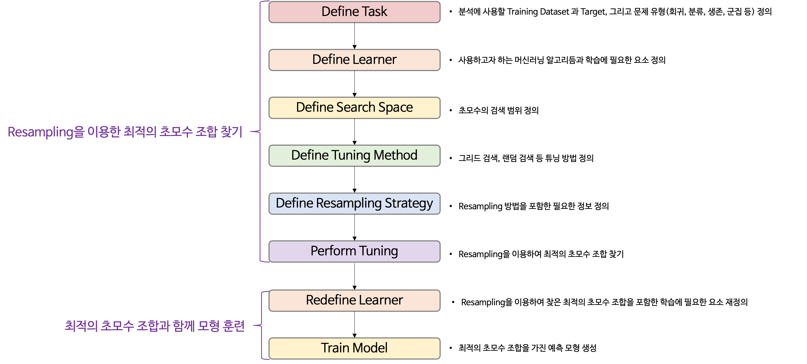

```{r setup, include=FALSE}
knitr::opts_chunk$set(echo = TRUE, warning = FALSE, message = FALSE)
options(width=200)
```


```{css, echo=FALSE}

p, ul, li{
text-align: justify
}

```


> k-means의 장점
 
- 안정적인 결과를 찾을 때까지 각 반복마다 군집 간에 case 이동이 가능하다.
- 예측 변수가 많은 경우, 다른 군집분석 알고리듬에 비해 수행하는 시간이 적게 걸린다.
- 알고리듬 구현이 매우 간단하다.

</br>

> k-means의 단점

- 범주형 예측 변수는 거리 계산을 할 수 없으므로 분석에 사용할 수 없다.
- 군집의 개수를 미리 결정해야 한다.
- 예측 변수들의 scale을 동일하게 설정해야 한다.
- 이상치에 민감하다.
- 초기 중심값 선택에 매우 민감하다.
- 비구형 군집에는 잘 작동하지 않는다.
 
 > 실습 자료 : "USArrests" 데이터셋은 1973년 미국의 50개 주별로 살인(Murder), 폭행(Assault) 그리고 강간(Rape) 범죄의 10만명당 체포 건수와 도시 인구 비율을 포함하고 있다.

</br>

<center>{width=50%}</center>

</br>

<center>{width=50%}</center>

</br>

----------


> # **Contents**

- [데이터 불러오기][**1. 데이터 불러오기**]
- [데이터 탐색][**2. 데이터 탐색**]
- [데이터 분할][**3. 데이터 분할**]
- [데이터 전처리][**4. 데이터 전처리**]
- [모형 훈련][**5. 모형 훈련**]
- [예측][**6. 예측**] 
 
----------


# **1. 데이터 불러오기**

```{r}
pacman::p_load("data.table", 
               "tidyverse", 
               "dplyr",
               "caret",
               "GGally",                       # For ggpairs
               "mlr",
               "clue",
               "parallelMap",                  # For parallelStartSocket
               "parallel")                     # For detectCores

data("USArrests")                              # 데이터 불러오기

USArrests %>%
  as_tibble
```

----------

# **2. 데이터 탐색**

```{r}
ggpairs(USArrests,
        upper = list(continuous = "density"),
        lower = list(continuous = wrap("points", size = 0.5)),
        diag = list(continuous = "densityDiag")) +
  theme_bw()
```

```{r}
# 상관계수 그래프
ggcorr(USArrests,               # 데이터
       label = TRUE,            # 라벨 명시 여부
       label_round = 3,         # 상관계수 소숫점 이하 자릿수
       label_size = 3,          # 상관계수 글자 크기
       low = "steelblue",       # 상관계수가 음수일 때 색깔
       mid = "white",           # 상관계수가 0에 가까울 때 색깔
       high = "darkred")        # 상관계수가 양수일 때 색깔
```


----------

# **3. 데이터 분할**

```{r}
# Partition (Training Dataset : Test Dataset = 8:2)
set.seed(200)
ind <- sample(1:nrow(USArrests), 0.8*nrow(USArrests))       # Index를 이용하여 8:2로 분할

USArrests.trd <- USArrests[ind,]                            # Training Dataset
USArrests.ted <- USArrests[-ind,]                           # Test Dataset
```

----------

# **4. 데이터 전처리**

```{r}
# Standardization
preProcValues <- preProcess(USArrests.trd,
                            method = c("center", "scale"))  # Standardization 정의 -> Training Dataset에 대한 평균과 표준편차 계산 

USArrests.trd <- predict(preProcValues, USArrests.trd)      # Standardization for Training Dataset
USArrests.ted <- predict(preProcValues, USArrests.ted)      # Standardization for Test Dataset

glimpse(USArrests.trd)                                      # 데이터 구조 확인
glimpse(USArrests.ted)                                      # 데이터 구조 확인
```


----------

# **5. 모형 훈련**

<center></center>

----------

## **5-1. Resampling을 이용한 최적의 초모수 조합 찾기**

### **5-1-1. Define Task**

- 문제 유형에 따라 Task를 정의하는 데 사용하는 함수는 다음과 같다.

|||
|:-----------------|:----|
|문제 유형                      |함수                | 
|회귀 문제                      |`makeRegrTask()`      | 
|이진 또는 다중 클래스 분류 문제|`makeClassifTask()`   | 
|생존분석                       |`makeSurvTask()`      |
|군집분석                       |`makeClusterTask()`   |
|다중 라벨 분류 문제            |`makeMultilabelTask()`|
|비용 민감 분류 문제            |`makeCostSensTask()`  |  
|||


```{r}
## k-means : 군집분석
USArrests.Task <- makeClusterTask(data = USArrests.trd)   # Training Dataset
USArrests.Task
```

--------

### **5-1-2. Define Learner**

- 학습자(Learner)는 함수 `makeLearner()`를 이용하여 정의한다.
- 함수 `makeLearner()`의 첫 번째 인자 `cl`에는 사용하고자 하는 머신러닝 알고리듬을 `문제 유형.알고리듬과 관련된 R 함수 이름` 형태로 입력한다.
    - 예를 들어,
        - 회귀 문제 : `"regr.알고리듬과 관련된 R 함수 이름"` 
        - 클래스 분류 문제 : `"classif.알고리듬과 관련된 R 함수 이름"`
        - 생존분석 : `"surv.알고리듬과 관련된 R 함수 이름"`
        - 군집분석 : `"cluster.알고리듬과 관련된 R 함수 이름"`
        - 다중 라벨 문제 : `"multilabel.알고리듬과 관련된 R 함수 이름"`
    - Package `"mlr"`에서 사용할 수 있는 알고리듬은 [여기](https://mlr.mlr-org.com/articles/tutorial/integrated_learners.html)를 통해서 확인할 수 있다.
    
```{r}
# 초모수 집합
getParamSet("cluster.kmeans")  # cluster.kmeans : Clustering based on "kmeans" function
```

`Caution!` 특정 머신러닝 알고리듬이 가지고 있는 초모수는 함수 `getParamSet()`를 이용하여 확인할 수 있다.

-----------

```{r}
USArrests.Learner <- makeLearner(cl = "cluster.kmeans",                # 함수 kmeans를 이용하여 군집분석 수행
                                 par.vals = list(iter.max = 100,       # 최대 반복 수
                                                 nstart = 25))         # 수행 횟수
USArrests.Learner
```

`Caution!` 함수 `makeLearner()`의 인자 `par.vals`에 함수 `kmeans()`의 옵션을 입력할 수 있다. `iter.max`에는 최대 반복 수를, `nstart`에는 k-means 수행 횟수를 지정할 수 있다. k-means는 초기 중심값을 랜덤하게 선택하기 때문에 이 과정에서 다양한 결과가 나타날 수 있다. 그래서 옵션 `nstart`를 이용하여 수행 횟수를 늘려 최대한 다양한 초기 중심값에 대해 k-means를 수행하고 최적의 결과를 찾을 수 있다.

--------------

### **5-1-3. Define Search Space**

- 함수 ` makeDiscreteParam()` 또는 `makeNumericParam()`을 이용하여 초모수의 검색 범위를 정의한다. 
    - 함수 `makeDiscreteParam()` : 검색 범위를 특정값으로 정의하는 경우 사용
    - 함수 `makeNumericParam()` : 검색 범위를 구간으로 정의하는 경우 사용
- 그러고나서, 함수 `makeParamSet()`를 이용하여 정의한 검색 범위을 `ParamSet` 객체로 만든다.

```{r}
# 초모수 "centers" (군집 수)와 알고리듬의 검색 범위 정의 
tune.hyper <- makeParamSet( 
  makeDiscreteParam("centers",                                         # 군집 수 
                    values = 3:7),                                     # 군집 수에 대한 검색 범위
  makeDiscreteParam("algorithm",                                       # k-means 알고리듬
                    values = c("Lloyd", "MacQueen", "Hartigan-Wong"))) # 알고리듬에 대한 검색 범위
tune.hyper
```

`Caution!` k-means를 수행하기 위해 "Lloyd", "MacQueen" 그리고 "Hartigan-Wong" 알고리듬을 검색 범위로 정의하였다. 각 알고리듬의 수행 절차는 다음과 같다.

<center></center>

------------

### **5-1-4. Define Tuning Method**

- 정의한 검색 범위 내에서 후보 초모수 조합을 찾는다.
- 가장 많이 사용하는 방법은 그리드 검색(Grid Search)과 랜덤 검색(Random Search)이며, 각각 함수 `makeTuneControlGrid()`와 `makeTuneControlRandom()`을 이용하여 정의할 수 있다.

```{r}
gridSearch <- makeTuneControlGrid()                                    # 그리드 검색               
gridSearch
```

`Result!` 함수 `makeTuneControlGrid()`를 이용하여 위에서 정의한 초모수 "centers"와 알고리듬의 검색 범위에 해당하는 모든 조합을 후보 초모수 조합으로 설정한다.

---------

### **5-1-5. Define Resampling Strategy**

```{r}
kFold <- makeResampleDesc("CV", iters = 5)                             # 5-Fold Cross Validation
kFold
```

-----------

### **5-1-6. Perform Tuning**

- 최적의 초모수 조합을 찾기 위해 함수 `tuneParams()`를 이용한다.

```{r}
parallelStartSocket(cpus = detectCores())                              # 병렬 처리

set.seed(100)
tunedK <- tuneParams(task = USArrests.Task,                            # Defined Task in 5-1-1
                     learner = USArrests.Learner,                      # Defined Learner in 5-1-2
                     par.set = tune.hyper,                             # Defined Search Space in 5-1-3
                     control = gridSearch,                             # Defined Tuning Method in 5-1-4
                     resampling = kFold,                               # Defined Resampling Strategy in 5-1-5
                     measures = list(silhouette))                      # Silhouette Index

tunedK
```

`Result!` 최적의 초모수 조합을 찾기 위해 "Silhouette Index"를 사용하였다. "Silhouette Index"는 다른 군집과 비교하여 case가 현재 속한 군집과 얼마나 유사한지를 나타내는 척도로 값이 높을수록 군집화가 잘 되었다는 것을 의미한다.

```{r}
tunedK$x$centers                                                       # 최적의 군집 수
tunedK$x$algorithm                                                     # 최적의 알고리듬
```

```{r}
# 튜닝 과정 시각화
kMeansTuningData <- generateHyperParsEffectData(tunedK)                # Extract Hyperparameter Effect from Tuning Result
kMeansTuningData$data

# 데이터 구조 변환
TuningData <- pivot_longer(kMeansTuningData$data,
                           cols = -c(centers, iteration, algorithm, exec.time),
                           names_to = "Metric",
                           values_to = "Value")

TuningData %>%
  as_tibble

ggplot(TuningData, aes(centers, Value, col = algorithm)) +
  facet_wrap(~ Metric, scales = "free_y") +
  geom_line() +
  geom_point() +
  theme_bw()
```

`Result!` 초모수 "centers = 4"이고 알고리듬이 "Lloyd"일 때 "Silhouette Index"값이 가장 높다는 것을 알 수 있다.

---------


## **5-2. 최적의 초모수 조합과 함께 모형 훈련**

### **5-2-1. Redefine Learner**

```{r}
# Redefine Learner with 최적의 초모수 조합
tunedKMeans <- setHyperPars(USArrests.Learner,                               # Defined Learner in 5-1-2
                            par.vals = list(centers = tunedK$x$centers,      # 최적의 군집 수
                                            algorithm = tunedK$x$algorithm)) # 최적의 알고리듬
tunedKMeans
```

---------------

### **5-2-2. Train Model**

```{r}
tunedKMeansModel <- train(tunedKMeans,                                       # Defined Learner in 5-2-1
                          USArrests.Task)                                    # Defined Task in 5-1-1
tunedKMeansModel
```

```{r}
kMeanModel <- getLearnerModel(tunedKMeansModel)                              # 예측 모형 추출
kMeanModel
```

```{r}
# Training Dataset의 각 군집별 특징 시각화
USArrests.trd.clus <- mutate(USArrests.trd,
                             kMeansCluster = as.factor(kMeanModel$cluster))  # 예측 모형에 의한 군집 결과
USArrests.trd.clus %>%
  as_tibble

ggpairs(USArrests.trd.clus, aes(col = kMeansCluster),
        upper = list(continuous = "density")) +
  theme_bw()
```

--------

# **6. 예측**

```{r}
# 예측 군집 생성
Pred <- predict(tunedKMeansModel, 
                newdata = USArrests.ted)         # predict(Trained Model, Test Dataset)
Pred %>%
  as_tibble
```

