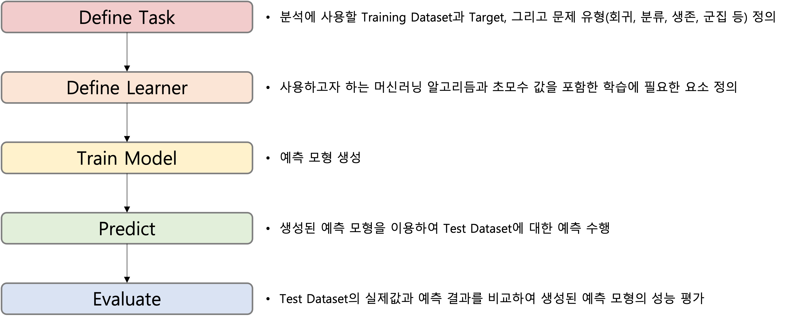

```{r setup, include=FALSE}
knitr::opts_chunk$set(echo = TRUE, warning = FALSE, message = FALSE)
options(width=200)
```


```{css, echo=FALSE}

p, ul, li{
text-align: justify
}

```

> Naive Bayes의 장점
 
- 연속형과 범주형 예측 변수 모두 가능하다.
- 튜닝(Tuning)해야 하는 초모수(Hyperparameter)가 없다.
- Topic 분류 문제에 잘 작동한다.


</br>

 > Naive Bayes의 단점
 
- 연속형 예측 변수는 정규 분포를 가정한다.
- 예측 변수들은 서로 독립이어야 한다.

<br />

---------------

# **1. 패키지 불러오기**

```{r}
# Install mlr Package
# install.packages("mlr", dependencies = TRUE) # could take several minutes

# Package Loading
pacman::p_load("mlr", 
               "tidyverse")
```

-------

# **2. 데이터 불러오기**

- 분석을 위해 사용할 데이터셋은 Package `"mlbench"`에서 제공하는 `HouseVotes84` 데이터셋이다.
- 해당 데이터셋은 미국 하원 의원들이 CQA(Congressional Quarterly Almanac)에서 식별한 16개의 주요 표결에 대해 투표한 내용이 포함되어 있다. 
    1. `Class` : 투표한 의원의 정당 이름으로 "democrat"와 "republican"로 구분되어 있다. 
    2. 16개의 주요 표결에 대한 투표 결과로 찬성은 "y", 반대는 "n"으로 구분되어 있다.

```{r}
data(HouseVotes84, package = "mlbench")   # Data Loading

votesTib <- HouseVotes84 %>%
  as_tibble                               # Tibble 형태로 변환

votesTib

glimpse(votesTib)                         # 데이터 구조 확인
summary(votesTib)                         # 데이터 요약

```

------

# **3. 변수들 특성 확인**

```{r}
map_dbl(votesTib, ~ sum(is.na(.)))
```

```{r}
votesUntidy <- gather(votesTib, "Variable", "Value", -Class)      # pivot_longer

ggplot(votesUntidy, aes(Class, fill = Value)) +
  facet_wrap(~ Variable, scales = "free_y") +
  geom_bar(position = "fill") +
  theme_bw()
```


------

# **4. 데이터 분할**

```{r}
# Partition (Training Dataset : Test Dataset = 7:3)
pacman::p_load("caret")                                         # For createDataPartition

y <- votesTib$Class                                             # Target

set.seed(200)
ind       <- createDataPartition(y, p = 0.7, list = T)          # Index를 이용하여 7:3으로 분할
votes.trd <- votesTib[ind$Resample1,]                           # Training Dataset
votes.ted <- votesTib[-ind$Resample1,]                          # Test Dataset

detach(package:caret)
```

------

# **5. 모델링**

<center>

</center>
</br>

-------

## **5-1. Define Task**

- 문제 유형에 따라 Task를 정의하는 데 사용하는 함수는 다음과 같다.

|||
|:-----------------|:----|
|문제 유형                      |함수                | 
|회귀 문제                      |`makeRegrTask`      | 
|이진 또는 다중 클래스 분류 문제|`makeClassifTask`   | 
|생존 분석                      |`makeSurvTask`      |
|군집 분석                      |`makeClusterTask`   |
|다중 라벨 분류 문제            |`makeMultilabelTask`|
|비용 민감 분류 문제            |`makeCostSensTask`  |  
|||

```{r}
# Naive Bayes : 이진 클래스 분류 문제
votesTask <- makeClassifTask(data = votes.trd,        # Training Dataset
                             target = "Class")        # Target

votesTask
```

`Caution!` 클래스 분류 문제에서 Target은 범주형이어야 한다. 특히, 이진 클래스 분류 문제에서, 함수 `makeClassifTask`는 Target의 첫 번째 "level"을 관심 클래스로 인식한다. 만약 두 번째 "level"이 관심 클래스라면, 인자 `positive`에 두 번째 "level"을 지정해야 한다.

-----------------

## **5-2. Define Learner**

- 학습자(Learner)는 함수 `makeLearner`를 이용하여 정의한다.
- 함수 `makeLearner`의 첫 번째 인자 `cl`에는 사용하고자 하는 머신러닝 알고리듬을 `문제 유형.알고리듬과 관련된 R 함수 이름` 형태로 입력한다.
    - 예를 들어,
        - 회귀 문제 : `"regr.알고리듬과 관련된 R 함수 이름"` 
        - 클래스 분류 문제 : `"classif.알고리듬과 관련된 R 함수 이름"`
        - 생존 분석 : `"surv.알고리듬과 관련된 R 함수 이름"`
        - 군집 분석 : `"cluster.알고리듬과 관련된 R 함수 이름"`
        - 다중 라벨 문제 : `"multilabel.알고리듬과 관련된 R 함수 이름"`
    - Package `"mlr"`에서 사용할 수 있는 알고리듬은 [여기](https://mlr.mlr-org.com/articles/tutorial/integrated_learners.html)를 통해서 확인할 수 있다.

```{r}
# Check Hyperparameter Set
getParamSet("classif.naiveBayes")              
```

`Result!` 특정 머신러닝 알고리듬이 가지고 있는 초모수는 함수 `getParamSet`을 이용하여 확인할 수 있다.

```{r}
# Define Naive Bayes Learner 
bayes <- makeLearner(cl = "classif.naiveBayes",
                     predict.type = "prob")                      # For 예측 확률과 class 생성

bayes
```

`Caution!` 함수 `makeLearner`의 옵션 `predict.type = "prob"`를 지정하면 예측 확률과 class를 함께 생성할 수 있다. 하지만 `"classif.knn"`과 같이 예측 확률을 생성할 수 없는 알고리듬이 있기 때문에 옵션을 항상 이용할 수는 없다.

---------------

## **5-3. Train Model**


```{r}
bayesModel <- train(bayes, votesTask)                   # train(Defined Learner in 5-2, Defined Task in 5-1)

bayesModel

getLearnerModel(bayesModel)                             # Extract Trained Model
```

---------------

## **5-4. Predict**

```{r}
# 예측 확률과 class 생성
bayesPred <- predict(bayesModel, newdata = votes.ted)    # predict(Trained Model, Test Dataset)

bayesPred      

getPredictionProbabilities(bayesPred,                    # Extract 예측 확률 for Test Dataset
                           cl = c("democrat", "republican"))   
getPredictionResponse(bayesPred)                         # Extract 예측 class for Test Dataset
```

-----------------

## **5-5. Evaluate**

```{r}
# ConfusionMatrix
calculateConfusionMatrix(bayesPred,                     # 함수 predict의 결과
                         relative = TRUE)               # 비율도 함께 출력 
```


```{r}
# Performance Measure
performance(bayesPred,                                  # 함수 predict의 결과
            measures = list(mmce, acc))                 # mmce : 평균 오분류율, acc : 정확도
```

`Caution!` 함수 `performance`의 인자 `measures`에 사용할 수 있는 평가척도는 [여기](https://mlr.mlr-org.com/articles/tutorial/measures.html)를 참고한다.

```{r}
# ROC 곡선
df <- generateThreshVsPerfData(bayesPred, measures = list(fpr, tpr))

plotROCCurves(df) +
  theme_bw()

# AUC
performance(bayesPred,                                   # 함수 predict의 결과
            auc) 
```
