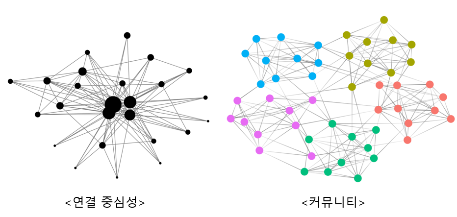
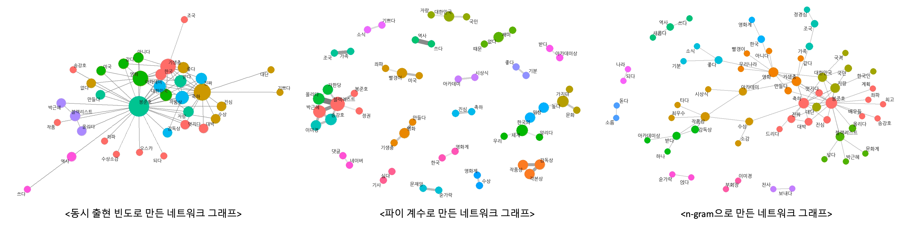

```{r setup, include=FALSE}
knitr::opts_chunk$set(echo = TRUE, warning = FALSE, message = FALSE)
options(width=200)
```


```{css, echo=FALSE}

p, ul, li{
text-align: justify
}

```

- **참고 : Do it! 쉽게 배우는 R 텍스트 마이닝**

----------

> # **의미망 분석 (Semantic Network Analysis)**

- 의미망 분석 : 의미망을 이용해 단어들의 관계를 분석하는 방법
    - 단어의 의미는 문장에 함께 사용한 단어에 따라 달라지며, 단어의 빈도를 분석하면 중요한 단어가 무엇인지는 알 수 있지만 단어가 어떤 맥락에서 사용됐는지는 알 수 없다. 
    - 텍스트의 맥락을 이해하려면 단어의 관계를 이용해 의미망을 만들고 단어들이 어떻게 연결되는지 살펴봐야 한다.
    

<center>
{width=100%}
</center>
</br>

-----------

# **패키지 설치**

```{r}
pacman::p_load("readr",
               "dplyr", "tidyr",
               "stringr",
               "tidytext",
               "textclean",
               "KoNLP",
               "widyr",
               "ggplot2",
               "tidygraph", "ggraph",
               "showtext")
```

-----------

# **1. 동시 출현 단어 분석**

- 동시 출현 단어 분석(Co-occurrence Analysis) : 단어 간의 관계를 살펴보는 분석 방법
    - "손-장갑", "머리-모자"처럼 관계가 있는 단어를 파악한다.
    - 단어의 관계를 표현하는 의미망을 만드는데 활용된다.
- 동시 출현 단어를 이용해 텍스트에 어떤 단어가 함께 사용되었는지 살펴보고 네트워크 그래프를 만드는 방법을 알아본다.

----------

## **1-1. 데이터 불러오기**

- 분석 자료 “news_comment_parasite.csv” : 2020년 2월 10일 영화 “기생충”의 아카데미상 수상 소식을 다룬 기사에 달린 댓글이 들어있는 데이터


```{r, eval=F}
# 데이터 불러오기
raw_news_comment <- read_csv(".../news_comment_parasite.csv")

raw_news_comment
```

```{r, echo=F}
# 데이터 불러오기
raw_news_comment <- read_csv("C:/Users/User/Desktop/쉽게 배우는 R 텍스트 마이닝/Data/news_comment_parasite.csv")

raw_news_comment
```

--------------

## **1-2. 전처리**

```{r}
# 전처리
news_comment <- raw_news_comment %>%
  select(reply) %>%                                       # 변수 reply 선택 -> 댓글만 추출
  mutate(reply = str_replace_all(reply, "[^가-힣]", " "), # 한글을 제외한 모든 문자는 공백으로 변경
         reply = str_squish(reply),                       # 연속된 공백 제거
         id = row_number())                               # 변수 id 추가 -> 행 번호(row_number)를 값으로 입력

news_comment
```

---------

## **1-3. 토큰화**

`Caution!` 명사의 의미는 문장에 함께 사용한 형용사와 동사에 따라 달라진다. 동시 출현 단어 분석은 단어가 사용된 맥락을 살펴보는 게 중요하므로 명사뿐만 아니라 형용사와 동사도 함께 추출해야 한다.

-----------

### **1-3-1. 형태소 분석기를 이용한 품사 구분**

- 이전까지는 토큰화 과정에서 명사를 추출하는데 Package `"KoNLP"`의 함수 `extractNoun()`를 사용했다.
- 하지만, 여기서는 다른 품사도 함께 추출해야 하므로 함수 `SimplePos22()`를 사용한다.
    - 함수 `SimplePos22()` : 문장의 단어를 22개의 품사로 구분
    - 아래의 그림은 함수 `SimplePos22()`를 이용하여 구분할 수 있는 22개의 품사 종류를 보여준다.   

<center>
{width=100%}
</center>
</br>


```{r}
# 토큰화
comment_pos <- news_comment %>%                # 전처리를 수행한 결과가 저장되어 있는 객체 in 1-2
  unnest_tokens(input = reply,                 # 토큰화를 수행할 텍스트가 포함된 변수명
                output = word,                 # 출력 변수명
                token = SimplePos22,           # 22개의 품사 기준으로 토큰화
                drop = F)                      # 원문 제거 X

comment_pos %>% 
  select(word, reply)                          # 변수 word와 reply 선택
```

`Result!` 변수 `word`를 살펴보면 단어 뒤에 `"/nc"`와 `"/pv"` 같이 품사를 나타내는 태그가 붙여져 있다. 태그를 이용하면 원하는 품사의 단어를 추출할 수 있다.  

-----------

### **1-3-2. 품사 분리**

- 형태소 분석기를 이용하여 품사를 구분한 결과를 보면 "집/nc+에/jc"와 같이 한 행에 여러 품사가 존재할 수 있다.
- 원하는 품사만 추출하기 쉽도록 한 행이 한 품사로 구성되게 수정할 필요가 있다.
- Package `"tidyr"`의 함수 `separate_rows(data, ..., sep)` : 입력한 정규 표현식에 따라 텍스트를 여러 행으로 나누는 함수
    - `data` : 데이터 프레임(Data Frame)
    - `...` : 여러 행으로 나누고자 하는 변수명
    - `sep` : 구분자

```{r}
# 한 행이 한 품사로 구성되게 품사를 분리
comment_pos <- comment_pos %>%                 # 품사를 구분한 결과가 저장되어 있는 객체 in 1-3-1
  separate_rows(word, sep = "[+]")             # 변수 word를 "+" 기준으로 행 분리 

comment_pos %>% 
  select(word, reply)                          # 변수 word와 reply 선택
```

`Result!` 위의 코드에서는 `sep = "[+]"`를 입력함으로써 `"+"`가 등장할 때마다 행을 분리하여 한 행에 한 품사만 존재하도록 한다.

-------------

### **1-3-3. 품사 추출**

① 명사 추출

- 명사는 태그 `"/n"`를 이용하여 추출한다.
    1. 함수 `str_detect()`를 이용해 태그 `"/n"`가 붙어 있는 단어를 추출한다.
    2. 함수 `str_remove()`를 이용해 "/"로 시작하는 모든 문자를 제거한다.
        - 즉, 태그를 제거한다.

```{r}
# 1. 명사 추출
noun <- comment_pos %>%                        # 품사를 분리한 결과가 저장되어 있는 객체 in 1-3-2
  filter(str_detect(word, "/n")) %>%           # 변수 word에서 "/n"를 포함하는 행만 추출
  mutate(word = str_remove(word, "/.*$"))      # "/"로 시작하는 모든 문자 제거 -> 태그를 제거하기 위해 

noun %>%
  select(word, reply)                          # 변수 word와 reply 선택

noun %>%
  count(word,                                  # 단어별 빈도 계산
        sort = T)                              # 빈도를 내림차순으로 정렬
```

`Result!` 함수 `count()`를 이용하여 댓글에 어떤 명사가 많이 사용되었는지 알 수 있다. 기생충의 아카데미상 수상 소식을 다룬 기사에 달린 댓글에서는 "영화"가 463번으로 가장 많이 사용되었으며, 그 다음으로 "기생충"과 "봉준호"가 많이 사용되었다.

-----------

② 동사와 형용사 추출

- 동사와 형용사는 각각 태그 `"/pv"`와 `"/pa"`를 이용하여 추출한다.
    1. 함수 `str_detect()`를 이용해 태그 `"/pv"`와 `"/pa"`가 붙어 있는 단어를 추출한다.
        - 함수 `str_detect()`에 여러 문자를 입력할 때는 "|"로 구분해야 하므로 `"/pv|/pa"`를 입력한다.
    2. 함수 `str_replace()`를 이용해 "/"로 시작하는 모든 문자를 "다"로 변경한다.
        - 즉, 태그를 "다"로 변경하여 단어를 이해하기 쉽도록 만든다(예 : "받" → "받다", "멋지" → "멋지다").

```{r}
# 2. 동사와 형용사 추출
pvpa <- comment_pos %>%                           # 품사를 분리한 결과가 저장되어 있는 객체 in 1-3-2
  filter(str_detect(word, "/pv|/pa")) %>%         # 변수 word에서 "/pv"와 "/pa"를 포함하는 행만 추출
  mutate(word = str_replace(word, "/.*$", "다"))  # "/"로 시작하는 모든 문자를 "다"로 변경 -> 태그를 "다"로 변경

pvpa %>%
  select(word, reply)                             # 변수 word와 reply 선택

pvpa %>%
  count(word,                                     # 단어별 빈도 계산
        sort = T)                                 # 빈도를 내림차순으로 정렬
```

`Result!` "축하드리다"가 가장 많이 사용되었으며, 그 다음으로 "받다"와 "좋다"가 많이 사용되었다.

-----------

```{r}
# 3. 추출한 데이터셋 결합 
comment <- bind_rows(noun, pvpa) %>%              # bind_rows : 행 기준으로 "noun"과 "pvpa" 결합
  filter(str_count(word) >= 2) %>%                # 두 글자 이상 단어만 추출
  arrange(id)                                     # 변수 id를 기준으로 오름차순 정렬

comment %>%                                       # 명사, 동사, 그리고 형용사인 단어만 포함된 데이터셋
  select(word, reply)                             # 변수 word와 reply 선택
```

-------------

```{r}
# ※ 명사, 동사, 그리고 형용사를 한 번에 추출 
comment_new <- comment_pos %>%                             # 품사를 분리한 결과가 저장되어 있는 객체 in 1-3-2
  filter(str_detect(word, "/n|/pv|/pa")) %>%               # 변수 word에서 "/n" (명사), "/pv" (동사)와 "/pa" (형용사)를 포함하는 행만 추출
  mutate(word = ifelse(str_detect(word, "/pv|/pa"),          
                       str_replace(word, "/.*$", "다"),    # "/pv" (동사)와 "/pa" (형용사)인 경우 "/"로 시작하는 모든 문자를 "다"로 변경 -> 태그를 "다"로 변경
                       str_remove(word, "/.*$"))) %>%      # "/n" (명사)인 경우 "/"로 시작하는 모든 문자 제거 -> 태그 제거
  filter(str_count(word) >= 2) %>%                         # 두 글자 이상의 단어만 추출
  arrange(id)                                              # 변수 id를 기준으로 오름차순 정렬

comment_new
```

`Caution!` 이 방법을 사용하면 결과는 같지만 단어 정렬 순서가 달라진다. 품사별로 따로 처리해 결합하는 방법을 사용하면 변수 `id`별로 위쪽에는 명사, 아래쪽에는 동사와 형용사를 나열한다. 반면, 이 방법은 문장에 사용된 순서에 따라 단어를 나열한다.

------------

## **1-4. 단어 동시 출현 빈도 계산**

- Package `"widyr"`의 함수 `pairwise_count(item, feature, sort = T)`를 이용하여 토큰화한 텍스트에 대해 단어 동시 출현 빈도를 계산할 수 있다.
    - `item` : 단어가 입력되어 있는 변수명  
    - `feature` : 텍스트 구분 기준
    - `sort = T` : 빈도를 내림차순으로 정렬
    
```{r}
pair <- comment %>%                    # 명사, 동사, 그리고 형용사인 단어만 추출한 결과가 저장되어 있는 객체 in 1-3-3
  pairwise_count(item = word,          # 단어가 입력되어 있는 변수명                    
                 feature = id,         # 텍스트 구분 기준
                 sort = T)             # 빈도를 내림차순으로 정렬
pair
```

`Result!` 출력 결과를 보면 두 단어가 함께 몇 번씩 사용되었는지 알 수 있다. 예를 들어, 첫 번째 행을 보면 "영화"와 "기생충"이 111번 함께 사용되었고, 전체 댓글에서 가장 많이 사용된 단어쌍임을 알 수 있다.  
`Caution!` 함수 `pairwise_count()`는 한 단어를 기준으로 함께 사용한 모든 단어의 빈도를 계산하기 때문에 출력 결과에 "영화-기생충", "기생충-영화"와 같이 동일한 단어쌍이 2번 등장한다.

```{r}
# 특정 단어와 자주 함께 사용된 단어 살펴보기
pair %>% 
  filter(item1 == "영화")            # "영화"와 함께 자주 사용한 단어 추출
 
pair %>% 
  filter(item1 == "봉준호")          # "봉준호"와 함께 자주 사용한 단어 추출
```

`Result!` 함수 `filter()`를 이용하면 특정 단어와 자주 함께 사용된 단어가 무엇인지 알 수 있다. "영화"는 "기생충"과 가장 많이 함께 사용되었으며, "봉준호"는 "감독"과 가장 많이 함께 사용되었다.

-----------

# **2. 동시 출현 네트워크**

- 동시 출현 네트워크(Co-occurrence Network) : [동시 출현 빈도][**1-4. 단어 동시 출현 빈도 계산**]를 이용해 단어의 관계를 네트워크 형태로 표현한 것
    - 동시 출현 네트워크를 이용하면 단어들이 어떤 맥락에서 함께 사용되었는지 이해할 수 있다.

-----------

## **2-1. 네트워크 그래프 데이터로 변환**

- 동시 출현 네트워크를 만들려면 동시 출현 빈도 데이터를 `네트워크 그래프 데이터`로 변환해야 한다.
    - Package `"tidygraph"`의 함수 `as_tbl_graph()`를 이용하면 네트워크 그래프 데이터로 변환할 수 있다.

```{r}
graph_comment <- pair %>%            # 동시 출현 빈도가 저장되어 있는 객체 in 1-4
  filter(n >= 25) %>%                # 25회 이상 함께 사용된 단어쌍만 추출 -> 네트워크의 복잡성 방지
  as_tbl_graph()                     # 네트워크 그래프 데이터로 변환

graph_comment
```

`Result!` 단어를 나타내는 노드(Node, 꼭짓점) 30개와 단어를 연결하는 엣지(Edge, 선) 108개로 구성되어 있음을 알 수 있다 (`A tbl_graph: 30 nodes and 108 edges`). 그래프를 만들 때 이 값들을 활용한다.  
`Caution!` 분석 결과를 확인하기 전에는 빈도가 몇 이상인 단어를 추출하는 게 적당한지 알 수 없다. 빈도를 조절하며 그래프를 여러 번 만들어 보면서 적당한 값을 찾아야 한다.

-----------

## **2-2. 네트워크 그래프**

- Package `"ggraph"`를 이용하면 네트워크 그래프를 만들 수 있다.
    1. 함수 `ggraph()`에 네트워크 그래프 데이터 `graph_comment`를 입력한 다음 함수 `geom_edge_link()`를 추가해 단어를 엣지(선)로 연결한다.
    2. 함수 `geom_node_point()`를 추가해 단어를 노드로 구성한다.
    3. 함수 `geom_node_text()`에 `aes(label = name)`을 입력해 노드에 단어를 표시한다.

```{r}
ggraph(graph_comment) +              # 네트워크 그래프 데이터 in 2-1
  geom_edge_link() +                 # 단어들을 엣지(선)로 연결
  geom_node_point() +                # 단어를 노드로 구성
  geom_node_text(aes(label = name))  # 노드에 단어 표시
```

`Caution!` 네트워크 그래프는 큰 이미지로 봐야 전체 구성을 파악할 수 있다. Plots 창의 Zoom 아이콘을 클릭해 큰 화면에서 그래프를 살펴볼 수 있다. 또는 이미지 출력 창을 별도로 열면 큰 화면에서 그래프를 살펴볼 수 있다. 윈도우에서는 함수 `windows()`, macOS에서는 함수 `x11()`을 실행해 창을 크게 만든 다음 그래프를 출력할 수도 있다.

----------

```{r}
# 그래프 다듬기 
# 나눔바른 고딕 폰트 불러오기
font_add_google(name = "Nanum Gothic",      # 구글 폰트에서 사용하고자 하는 폰트 이름 
                family = "nanumgothic")     # R에서 사용할 폰트 이름 -> 사용자 지정
showtext_auto()
```

`Caution!` 함수의 옵션을 이용해 엣지와 노드의 색깔, 크기, 텍스트 위치 등을 수정할 수 있다. 함수 `ggraph()`의 옵션 `layout`은 네트워크의 형태를 정하는 기능을 한다. 하지만, 옵션 `layout`을 지정하면 난수를 이용해 그래프를 만들기 때문에 `set.seed`로 난수를 고정하여 항상 같은 모양의 그래프를 만들도록 해야 한다. 옵션 `layout`에 따라 네트워크가 어떻게 달라지는지 궁금하다면 [여기](https://www.data-imaginist.com/2017/ggraph-introduction-layouts)를 참고한다.  
게다가, 노드 텍스트의 폰트는 함수 `geom_node_text()`의 옵션 `family`를 이용해 별도로 설정해야 한다. 함수 `theme()`으로 그래프 전체의 폰트를 바꾸더라도 노드 텍스트에는 적용되지 않는다.

```{r}
set.seed(1234)                              # Seed 고정 -> 항상 동일한 모양의 그래프 출력
ggraph(graph_comment, 
       layout = "fr") +                     # 네트워크 형태  
  geom_edge_link(color = "gray50",          # 엣지(선) 색깔
                 alpha = 0.5) +             # 엣지(선) 명암
  geom_node_point(color = "lightcoral",     # 노드 색깔
                  size = 5) +               # 노드 크기
  geom_node_text(aes(label = name),         # 노드에 단어 표시
                 repel = T,                 # 단어 위치 -> 노드 밖에 표시
                 size = 5,                  # 단어 크기
                 family = "nanumgothic") +  # 폰트
  theme_graph()                             # 배경 삭제
```

```{r}
# 동일한 코드 반복을 방지하기 위해 네트워크 그래프를 만드는 함수 생성
word_network <- function(x) {
  ggraph(x,                                   # 네트워크 그래프 데이터 형태의 객체
         layout = "fr") +                     # 네트워크 형태 
    geom_edge_link(color = "gray50",          # 엣지(선) 색깔
                   alpha = 0.5) +             # 엣지(선) 명암
    geom_node_point(color = "lightcoral",     # 노드 색깔
                    size = 5) +               # 노드 크기
    geom_node_text(aes(label = name),         # 노드에 단어 표시
                   repel = T,                 # 단어 위치 -> 노드 밖에 표시
                   size = 5,                  # 단어 크기
                   family = "nanumgothic") +  # 폰트
    theme_graph()                             # 배경 삭제
}
```

```{r}
# 예시
set.seed(1234)                                # Seed 고정 -> 항상 동일한 모양의 그래프 출력
word_network(graph_comment)
```

`Result!` 함수 `as_tbl_graph()`로 만든 네트워크 그래프 데이터를 함수 `word_network()`에 적용하면 네트워크 그래프를 출력한다.

-----------

## **2-3. 유의어 처리**

- 유의어(Synonyms) : 표현은 다르지만 의미가 비슷한 단어
    - 위에서 출력한 그래프를 보면 "감독", "봉감독", "봉준호감독"처럼 의미가 비슷한 단어가 개별 노드로 되어 있어 복잡하고 해석하기 어렵다.
    - 유의어를 한 단어로 통일하면 네트워크 구조가 간결해지고 단어의 관계가 좀 더 분명하게 드러난다.
    
```{r}
# 1. 유의어 처리
comment <- comment %>%                                  # 명사, 동사, 그리고 형용사인 단어만 추출한 결과가 저장되어 있는 객체 in 1-3-3
  mutate(# "감독상"을 제외하고 "감독"을 포함하는 모든 단어는 "봉준호"로 통일
         word = ifelse(str_detect(word, "감독") & !str_detect(word, "감독상"),   
                       "봉준호", word), 
         # "오르다"는 "올리다"로 변경
         word = ifelse(word == "오르다", "올리다", word),
         # "축하"를 포함하는 모든 단어는 "축하"로 통일
         word = ifelse(str_detect(word, "축하"), "축하", word))

comment
```
    
----------

```{r}
# 2. 단어 동시 출현 빈도 계산
pair <- comment %>%                    # 유의어를 처리한 객체 
  pairwise_count(item = word,          # 단어가 입력되어 있는 변수명                    
                 feature = id,         # 텍스트 구분 기준
                 sort = T)             # 빈도를 내림차순으로 정렬
pair
```

----------
```{r}
# 3. 네트워크 그래프 데이터로 변경
graph_comment <- pair %>%            # 동시 출현 빈도가 저장되어 있는 객체
  filter(n >= 25) %>%                # 25회 이상 함께 사용된 단어쌍만 추출 -> 네트워크의 복잡성 방지
  as_tbl_graph()                     # 네트워크 그래프 데이터로 변환

graph_comment
```

----------

```{r}
# 4. 네트워크 그래프 만들기
set.seed(1234)                        # Seed 고정 -> 항상 동일한 모양의 그래프 출력
word_network(graph_comment)
```

`Result!` 네트워크 구조가 [유의어를 처리하기 전][**2-2. 네트워크 그래프**]보다 간결해졌음을 알 수 있다.

-----------

## **2-4. 연결 중심성과 커뮤니티**

- 네트워크 그래프는 수많은 단어를 노드로 표현하기 때문에 어떤 단어를 중심으로 해석해야 할지 판단하기가 어렵다.
- 그래프에 연결 중심성(Degree Centrality)과 커뮤니티(Community)를 표현하면 단어의 관계를 더 분명하게 파악할 수 있다.
    - 연결 중심성 : 특정 노드가 다른 노드들과 얼마나 밀접하게 연결되어 있는지를 나타낸 척도
        - 내향 중심성(In-degree Centrality) : 노드로 들어오는 엣지의 수
        - 외향 중심성(Out-degree Centrality) : 노드에서 나가는 엣지의 수
        - 네트워크 분석에서 기본적인 개념으로, 노드의 연결을 기반으로 그 "중심성" 또는 "중요성"을 나타낸다.
        - 한 노드가 얼마나 많은 노드들과 관계를 맺고 있는지를 파악할 수 있다.
        - 연결 중심성으로 노드 크기를 조정하면 어떤 단어를 눈여겨봐야 할지 판단하기 쉽다.
            - 다른 노드와 밀접하게(빈번하게) 연결될수록 노드의 크기가 크며, 이는 해당 노드가 중요한 노드임을 나타낸다.
        - Package `"tidygraph"`의 함수 `centrality_degree()`를 이용하여 연결 중심성을 계산할 수 있다.
    - 커뮤니티 : 단어 간의 관계가 가까워 빈번하게 연결된 노드 집단
        - 노드를 커뮤니티별로 구분 지어 서로 다른 색으로 표현하면 네트워크 구조를 이해하기 쉽다.
            - 관계가 가까운 노드는 같은 색으로 표현한다.
        - Package `"tidygraph"`의 함수 `group_infomap()`를 이용하여 커뮤니티를 찾을 수 있다.
            - 함수 `group_infomap()`는 Infomap 알고리듬을 사용하여 커뮤니티를 탐지한다.
                - 해당 알고리듬은 네트워크 내 정보 흐름 개념에 기반하며, 특히 크고 복잡한 네트워크에서 커뮤니티를 탐지하는 데 유용하다. 

<center>
{width=80%}
</center>
</br>    

-----------

### **2-4-1. 연결 중심성과 커뮤니티 변수 추가**

- 연결 중심성과 커뮤니티를 나타내는 변수는 네트워크 그래프 데이터에 추가한다.
    1. 네트워크 그래프 만들기 : 단어 동시 출현 빈도를 포함한 `pair` (참고. [2-3. 유의어 처리][**2-3. 유의어 처리**])에서 25회 이상 함께 사용된 단어만 추출한 다음 함수 `as_tbl_graph()`를 이용해 네트워크 그래프 데이터를 만든다.
        - 함수 `as_tbl_graph()`에서 옵션 `directed = F`를 입력해 방향성이 없도록 설정한다.
            - 뒤이어 활용할 함수 `group_infomap()`은 방향성 없는 네트워크 그래프 데이터에서만 커뮤니티를 찾아주기 때문
    2. 연결 중심성과 커뮤니티 변수 추가 : Package `"tidygraph"`의 함수 `centrality_degree()`는 노드의 연결 중심성을 구하고, 함수 `group_infomap()`는 커뮤니티를 찾는 기능을 한다.
        - 함수 `group_infomap()`는 커뮤니티를 정수형 숫자로 출력한다. 
            - 변수가 수치형인 상태로 그래프를 만들면 노드가 그룹에 따라 다른 색으로 표현되는 게 아니라 숫자 크기에 따라 농도가 다른 그라데이션으로 표현되기 때문에 함수 `as_factor()`를 이용해 수치형을 범주형으로 변환하여 이러한 현상을 피해야 한다.
        - 두 함수를 함수 `mutate()`에 적용해 연결 중심성과 커뮤니티를 나타낸 변수를 추가한다.
        
```{r}
set.seed(1234)                                    # Seed 고정 -> For group_infomap()
graph_comment <- pair %>%                         # 단어 동시 출현 빈도의 결과가 저장되어 있는 객체 in 2-3
  filter(n >= 25) %>%                             # 25회 이상 함께 사용된 단어만 추출 -> 네트워크의 복잡성 방지
  as_tbl_graph(directed = F) %>%                  # 네트워크 그래프 데이터로 변환 / directed = F : 그래프에 방향 표시 X
  mutate(centrality = centrality_degree(),        # centrality_degree : 연결 중심성 계산
         group = as.factor(group_infomap()))      # group_infomap : 커뮤니티를 찾음 / as.factor : Factor로 변환 -> 그룹에 따라 다른 색으로 표현하기 위해

graph_comment
```

`Caution!` 함수 `group_infomap()`는 난수를 이용하여 그룹을 생성하기 때문에 `set.seed`를 사용해 항상 동일한 결과를 출력하도록 한다. 게다가, Package `"tidygraph"`에는 함수 `centrality_degree()`와 함수 `group_infomap()`외에 연결 중심성과 커뮤니티를 구하는 다양한 함수가 있다. (참고. [Introducing tidygraph](https://www.data-imaginist.com/2017/introducing-tidygraph/))

---------------

### **2-4-2. 연결 중심성과 커뮤니티 표현**

- 네트워크 그래프 데이터 `graph_comment`(참고. [2-4-1. 연결 중심성과 커뮤니티 변수 추가][**2-4-1. 연결 중심성과 커뮤니티 변수 추가**])를 이용해 연결 중심성과 커뮤니티를 표현한 네트워크 그래프를 만들 수 있다.
    1. 함수 `geom_node_point()`에 `aes()`를 추가하고, 연결 중심성에 따라 노드 크기를 정하도록 `size = centrality`를 입력한다.
        - `centrality` : 연결 중심성에 대한 값이 포함된 변수
    2. 커뮤니티별로 노드 색깔을 다르게 정하도록 `aes()`에 `color = group`을 입력한다.
        - `group` : 커뮤니티가 정수형 숫자로 표현된 변수
    3. 범례를 표현하지 않도록 함수 `geom_node_point()`에 `show.legend = F`를 입력한다.
    4. 노드 크기를 연결 중심성에 따라 결정하면 너무 크거나 너무 작아서 알아보기 불편하기 때문에 노드 크기를 5~15 범위로 유지하도록 `scale_size(range = c(5, 15))`를 추가한다.

```{r}
set.seed(1234)                                    # Seed 고정 -> 항상 동일한 모양의 그래프 출력
ggraph(graph_comment, 
       layout = "fr") +                           # 네트워크 형태 
  geom_edge_link(color = "gray50",                # 엣지(선) 색깔
                 alpha = 0.5) +                   # 엣지(선) 명암
  geom_node_point(aes(size = centrality,          # 노드 크기 -> 연결 중심성에 따라 노드 크기를 다르게 표현
                      color = group),             # 노드 색깔 -> 커뮤니티별로 노드 색깔을 다르게 표현
                  show.legend = F) +              # 범례 삭제
  scale_size(range = c(5, 15)) +                  # 노드 크기 범위
  geom_node_text(aes(label = name),               # 노드에 단어 표시
                 repel = T,                       # 단어 위치 -> 노드 밖에 표시
                 size = 5,                        # 단어 크기
                 family = "nanumgothic") +        # 폰트 -> 2-2에서 정의한 나눔바른 고딕 폰트
  theme_graph()                                   # 배경 삭제
```

`Result!` 노드의 크기가 클수록 다른 노드들과 밀접하게 연결되어 있다는 것을 의미하며, 같은 색깔로 분류된 노드들은 관계가 가깝다는 것을 의미한다. 예를 들어, 노드 크기가 가장 큰 "봉준호"는 다른 단어들과 가장 밀접하게 연결되어 있기 때문에 연결 중심성이 크며, 중요한 단어라는 것을 알 수 있다. 

----------------

### **2-4-3. 네트워크의 주요 단어 확인**

```{r}
graph_comment %>%                                 # 연결 중심성과 커뮤니티 결과가 저장되어 있는 객체 in 2-4-1
  filter(name == "봉준호")                        # "봉준호"만 추출
```

`Result!` 노드 크기가 가장 큰 "봉준호"는 4번 커뮤니티(`group`)로 분류되어 있다.

```{r}
# "봉준호"와 같은 커뮤니티로 분류된 단어 살펴보기
graph_comment %>%                                 # 연결 중심성과 커뮤니티 결과가 저장되어 있는 객체 in 2-4-1
  filter(group == 4) %>%                          # 4번 커뮤니티 단어들만 추출
  arrange(-centrality) %>%                        # 연결 중심성을 기준으로 내림차순 정렬
  data.frame()                                    # Data Frame 형태로 변환
```

---------------

```{r}
# 연결 중심성이 높은 주요 단어 살펴보기
graph_comment %>%                                 # 연결 중심성과 커뮤니티 결과가 저장되어 있는 객체 in 2-4-1
  arrange(-centrality)                            # 연결 중심성을 기준으로 내림차순 정렬
```

`Result!` 연결 중심성이 높은 단어순으로 출력하면 어떤 단어를 눈여겨봐야 할지 알 수 있다. 출력 결과를 보면 "봉준호" 다음으로 "축하"의 연결 중심성이 높으며, 2번 커뮤니티(`group`)로 분류되었음을 알 수 있다.

```{r}
# "축하"와 같은 커뮤니티로 분류된 단어 살펴보기
graph_comment %>%                                 # 연결 중심성과 커뮤니티 결과가 저장되어 있는 객체 in 2-4-1
  filter(group == 2) %>%                          # 2번 커뮤니티 단어들만 추출
  arrange(-centrality) %>%                        # 연결 중심성을 기준으로 내림차순 정렬
  data.frame()                                    # Data Frame 형태로 변환
```

`Result!` 2번 커뮤니티로 분류된 단어를 살펴보면 주로 봉준호 감독의 수상을 축하하는 내용임을 알 수 있다.

---------------

## **2-5. 주요 단어가 사용된 원문 추출**

- 네트워크에 표현된 단어만 봐서는 맥락을 구체적으로 이해하기 어렵기 때문에 단어가 사용된 텍스트 원문을 살펴본다.

```{r}
news_comment %>%                                  # 전처리를 수행한 결과가 저장되어 있는 객체 in 1-2
  filter(str_detect(reply, "봉준호") &            # "봉준호"와 "대박"이 함께 사용된 댓글 추출
           str_detect(reply, "대박")) %>%
  select(reply)                                   # 변수 reply 선택 -> 댓글만 추출

news_comment %>%                                  # 전처리를 수행한 결과가 저장되어 있는 객체 in 1-2
  filter(str_detect(reply, "박근혜") &            # "박근혜"와 "블랙리스트"가 함께 사용된 댓글 추출
           str_detect(reply, "블랙리스트")) %>%
  select(reply)                                   # 변수 reply 선택 -> 댓글만 추출

news_comment %>%                                  # 전처리를 수행한 결과가 저장되어 있는 객체 in 1-2
  filter(str_detect(reply, "기생충") &            # "기생충"과 "조국"이 함께 사용된 댓글 추출
           str_detect(reply, "조국")) %>%
  select(reply)                                   # 변수 reply 선택 -> 댓글만 추출
```

---------------

# **3. 단어 간 상관분석**

- [동시 출현 빈도][**1-4. 단어 동시 출현 빈도 계산**]의 한계는 대부분의 단어와 자주 함께 사용되는 단어쌍이 많다는 것이다.
    - 예를 들어, "영화"와 "기생충"은 댓글에 가장 빈번히 함께 사용된 단어쌍이지만 이 단어들은 대부분의 단어와도 자주 함께 사용되기 때문에 텍스트를 이해하는 데 별다른 도움이 되지 않는다.
- 대안적으로, 두 단어가 각각 사용되는 경우와 함께 사용되는 경우를 비교하여 단어 간의 상관관계를 조사할 수 있다.

--------------

## **3-1. 파이 계수**

- 파이 계수(Phi Coefficient) : 두 이진 변수(Binary Variable) 간의 상관관계를 측정하는 데 사용되는 방법
    - 텍스트 마이닝에서는 단어의 사용 여부를 이진 변수로 나타내어 파이 계수를 계산할 수 있다.
    - 파이 계수는 텍스트에서 단어 $X$와 $Y$가 둘 다 나타날 확률이 어느 하나만 나타날 확률보다 얼마나 더 높은지를 측정한다.  

--------------

### **3-1-1. 의미**

- $X$와 $Y$ 두 단어가 있을 때, 여러 텍스트에서 두 단어의 사용 여부를 놓고 가능한 모든 경우를 따지면 다음과 같다.
    1. $X$와 $Y$ 모두 있음 (텍스트 개수 : $a$)
    2. $X$만 있음 (텍스트 개수 : $b$)
    3. $Y$만 있음 (텍스트 개수 : $c$)
    4. $X$와 $Y$ 모두 없음 (텍스트 개수 : $d$)

<center>
{width=80%}
</center>
</br>    

- 각각의 경우에 해당하는 텍스트의 빈도를 구해 다음 공식에 적용하면 파이 계수 $\phi$를 계산할 수 있다.
$$
\begin{align*}
\phi = \frac{ad-bc}{\sqrt{(a+b)(c+d)(a+c)(b+d)}}
\end{align*}
$$
    - 파이 계수 $\phi$의 범위는 $-1\le \phi \le 1$
    - +1에 가까울수록 단어 $X$가 나타날 때 단어 $Y$가 나타날 확률이 높다는 것을 의미한다.
    - -1에 가까울수록 단어 $X$가 나타날 때 단어 $Y$가 나타날 확률이 낮다는 것을 의미한다.
    - 0에 가까울수록 두 단어는 상관관계가 거의 없거나 약하다.

----------

### **3-1-2. 파이 계수 계산**

- 형태소로 토큰화하고 유의어 처리를 완료한 `comment` (참고. [2-3. 유의어 처리][**2-3. 유의어 처리**])를 이용해 파이 계수 $\phi$를 구해본다.
    1. 함수 `add_count()`를 이용해 단어 빈도를 추가하고 20회 이상 사용된 단어만 추출한다.
        - 사용 빈도가 낮은 단어는 텍스트의 전반적인 구조를 이해하는데 도움이 되지 않으므로 제거하는 게 좋다.
    2. Package `"widyr"`의 함수 `pairwise_cor(item, feature, sort = T)`를 이용해 파이 계수 $\phi$를 계산한다.
        - `item` : 단어가 입력되어 있는 변수명
        - `feature` : 텍스트 구분 기준
        - `sort = T` : 파이 계수를 내림차순으로 정렬

```{r}
word_cors <- comment %>%                         # 형태소로 토큰화하고 유의어 처리를 수행한 결과가 저장되어 있는 객체 in 2-3
  add_count(word) %>%                            # 단어 빈도 추가
  filter(n >= 20) %>%                            # 20회 이상 사용된 단어만 추출
  # 파이 계수 계산
  pairwise_cor(item = word,                      # 단어가 입력되어 있는 변수명
               feature = id,                     # 텍스트 구분 기준
               sort = T)                         # 파이 계수를 내림순으로 정렬

word_cors
```

`Result!` 변수 `correlation`이 파이 계수 $\phi$를 의미하며, 이를 보고 두 단어의 상관성이 얼마나 큰지 알 수 있다. 출력 결과를 보면 "올리다"와 "블랙리스트"의 파이 계수가 0.478로 가장 높다는 것을 알 수 있으며, 이는 댓글에서 "올리다"가 나타날 때 "블랙리스트"가 나타날 확률이 높다는 것을 의미한다.  
`Caution!` 함수 `count()`를 이용하면 빈도만 남고 원자료가 제거되지만, 함수 `add_count()`를 이용하면 원자료에 빈도를 나타낸 변수를 추가한다.

-----------

`Caution!` 함수 `filter()`를 이용해 특정 단어와 상관성이 큰 단어를 살펴볼 수 있다. 

```{r}
# "대한민국"과 상관관계가 높은 단어
word_cors %>% 
  filter(item1 == "대한민국")                   
```

`Result!` 댓글에서 "대한민국"이 나타날 때 "국민"이 나타날 확률이 높다는 것을 의미한다.

```{r}
# "역사"와 상관관계가 높은 단어
word_cors %>% 
  filter(item1 == "역사")
```

`Result!` 댓글에서 "역사"가 나타날 때 "쓰다"가 나타날 확률이 높다는 것을 의미한다.

-----------

### **3-1-3. 파이 계수에 대한 시각화**

- 파이 계수로 막대 그래프를 만들면 관심 단어가 어떤 단어와 상관성이 높은지 한눈에 살펴볼 수 있다.
    1. 관심 단어별로 파이 계수가 큰 단어 추출하기
        - `target`에 6개의 관심 단어 "대한민국", "역사", "수상소감", "조국", "박근혜", 그리고 "블랙리스트"를 입력한다.
        - 파이 계수가 저장되어 있는 `word_cors` (참고. [3-1-2. 파이 계수 계산][**3-1-2. 파이 계수 계산**])에서 관심 단어별로 파이 계수가 가장 큰 단어를 8개씩 추출한다.
    2. 막대 그래프 만들기
        - 관심 단어별로 파이 계수가 가장 큰 단어들이 저장되어 있는 `top_cors`를 이용해 그래프를 만든다.

```{r}
## 관심 단어 목록
target <- c("대한민국", "역사", "수상소감", "조국", "박근혜", "블랙리스트")

# 1. 관심 단어별로 파이 계수가 큰 단어 추출하기
top_cors <- word_cors %>%                                           # 파이 계수가 저장되어 있는 객체 in 3-1-2
  filter(item1 %in% target) %>%                                     # 변수 item1에서 관심 단어에 해당하는 행만 추출
  group_by(item1) %>%                                               # 변수 item1에 대해 그룹화 -> 관심 단어별로 파이 계수가 높은 8개 단어를 추출하기 위해
  slice_max(correlation, n = 8)                                     # 파이 계수가 높은 8개 단어 추출


top_cors$item1 <- factor(top_cors$item1,                            # Factor 변환  
                         levels = target)                           # levels에 입력한 순서대로 그래프 출력

# 2. 막대 그래프 만들기
ggplot(top_cors, aes(x = reorder_within(item2, correlation, item1), # reorder_within : 관심 단어(item1)별로 파이 계수(correlation)가 높은 순으로 item 2 정렬 
                     y = correlation,
                     fill = item1)) +                               # 관심 단어에 따라 막대 색깔 다르게 표현
  geom_col(show.legend = F) +                                       # 막대 그래프
  facet_wrap(~ item1, scales = "free") +                            # 변수 item1의 항목별로 그래프 작성 -> 관심 단어 각각의 막대 그래프 작성
  coord_flip() +                                                    # 막대를 가로로 회전
  scale_x_reordered() +                                             # 불필요한 단어 제거
  labs(x = NULL) +                                                  # x축 제목 제거 -> 막대를 가로로 회전했기 때문에 y축 제목이 제거됨
  theme(text = element_text(family = "nanumgothic"))                # 폰트 -> 2-2에서 정의한 나눔바른 고딕 폰트
```

----------

### **3-1-4. 파이 계수를 이용하여 네트워크 그래프 만들기**

- [동시 출현 빈도를 이용해 네트워크 그래프][**2-2. 네트워크 그래프**]를 만들 때와 같은 방법을 이용하며, 파이 계수로 네트워크 그래프를 만들면 상관성이 큰 단어 중심으로 텍스트의 맥락을 살펴볼 수 있다.
    1. 네트워크 그래프 데이터 만들기, 연결 중심성과 커뮤니티 추가하기
        - 네트워크가 너무 복잡하지 않고 상관성이 큰 단어 중심으로 만들어지도록 `word_cors` (참고. [3-1-2. 파이 계수 계산][**3-1-2. 파이 계수 계산**])에서 파이 계수 `correlation`가 0.15 이상인 단어쌍만 추출한다.
        - 네트워크 그래프 데이터를 만들고 연결 중심성과 커뮤니티를 추가한다.
    2. 네트워크 그래프 만들기
        - 함수 `geom_edge_link()`에 `aes()`를 추가하고, 단어 간 상관성이 클수록 엣지를 진하게 표현하도록 `edge_alpha = correlation`를 입력한다.
            - `correlation` : 파이 계수
        - 단어 간 상관성이 클수록 엣지를 두껍게 표현하도록 `aes()`에 `edge_width = correlation`를 입력한다.

```{r}
# 1. 파이 계수로 네트워크 그래프 데이터 생성
set.seed(1234)                                    # Seed 고정 -> For group_infomap()
graph_cors <- word_cors %>%                       # 파이 계수가 저장되어 있는 객체 in 3-1-2
  filter(correlation >= 0.15) %>%                 # 파이 계수가 0.15 이상인 단어 쌍만 추출 -> 네트워크 복잡성 방지
  as_tbl_graph(directed = F) %>%                  # 네트워크 그래프 데이터로 변환 / directed = F : 그래프에 방향 표시 X
  mutate(centrality = centrality_degree(),        # centrality_degree : 연결 중심성 계산
         group = as.factor(group_infomap()))      # group_infomap : 커뮤니티를 찾음 / as.factor : Factor로 변환 -> 그룹에 따라 다른 색으로 표현하기 위해


set.seed(1234)                                    # Seed 고정 -> 항상 동일한 모양의 그래프 출력
ggraph(graph_cors, 
      layout = "fr") +                            # 네트워크 형태 
  geom_edge_link(color = "gray50",                # 엣지(선) 색깔
                 aes(edge_alpha = correlation,    # 엣지(선) 명암 -> 파이 계수에 따라 엣지 명암 다르게 표현
                     edge_width = correlation),   # 엣지(선) 두께 -> 파이 계수에 따라 엣지 두께 다르게 표현
                 show.legend = F) +               # 범례 삭제
  scale_edge_width(range = c(1, 4)) +             # 엣지 두께 범위
  geom_node_point(aes(size = centrality,          # 노드 크기 -> 연결 중심성에 따라 노드 크기를 다르게 표현
                      color = group),             # 노드 색깔 -> 커뮤니티별로 노드 색깔을 다르게 표현
                  show.legend = F) +              # 범례 삭제
  scale_size(range = c(5, 10)) +                  # 노드 크기 범위
  geom_node_text(aes(label = name),               # 노드에 단어 표시
                 repel = T,                       # 단어 위치 -> 노드 밖에 표시
                 size = 5,                        # 단어 크기
                 family = "nanumgothic") +        # 폰트 -> 2-2에서 정의한 나눔바른 고딕 폰트
  theme_graph()                                   # 배경 삭제
```

`Result!` 출력한 그래프를 보면 상관성이 큰 단어쌍을 한눈에 알 수 있다. 예를 들어, "올리다"와 "블랙리스트" 사이에는 엣지가 굵기 때문에 파이 계수가 높다는 것을 알 수 있으며, 특히, 노드 크기가 큰 "블랙리스트"는 다른 단어와도 밀접하게 연결되어 있기 때문에 연결 중심성이 크다는 것을 알 수 있다.  
`Caution!` 파이 계수가 얼마 이상인 단어쌍을 추출해야 하는지는 정답이 없다. 추출 기준 값을 바꾸어 가며 여러 번 그래프를 만들어 본 다음 적당한 값을 찾아야 한다.

-----------

## **3-2. 동시 출현 빈도와의 차이점**

- [동시 출현 빈도][**2-2. 네트워크 그래프**]를 이용한 네트워크 그래프
    1. "봉준호", "영화" 처럼 `여러 단어와 자주 함께 사용된 단어쌍` 중심으로 네트워크가 형성된다.
    2. 노드 대부분이 서로 연결되어 구조가 복잡하고 군집이 잘 드러나지 않는다.
    3. 자주 사용된 단어를 파악할 때 활용한다.
- [파이 계수][**3-1-4. 파이 계수를 이용하여 네트워크 그래프 만들기**]를 이용한 네트워크 그래프
    1. `다른 단어에 비해 상대적으로 자주 함께 사용된 단어쌍` 중심으로 네트워크가 형성된다.
    2. 상관성이 큰 단어끼리만 연결되어 단어 군집이 명확하게 드러나는 장점이 있다.
    3. 밀접하게 관련된 단어쌍을 파악할 때 활용한다.

-----------

# **4. 엔그램**

- 어떤 단어는 함께 사용한 단어에 따라 의미가 달라질 수 있다.
    - 예를 들어, "사과를 먹다"와 "사과를 하다"에서 "사과"는 뒤에 오는 단어에 따라 과일이 되기도 하고 미안한 마음을 표현하는 행위가 되기도 한다.
- "감을 잡다" 혹은 "귀가 얇다"처럼 어떤 단어는 다른 단어와 연결되어 새로운 의미를 만들어 내기도 한다.
- [동시 출현 빈도][**1-4. 단어 동시 출현 빈도 계산**]와 [파이 계수][**3-1. 파이 계수**]의 한계는 다음과 같다.
    1. 단어쌍이 함께 사용된 횟수만 고려하기 때문에 단어가 연결될 때 생기는 의미를 무시하게 된다.
    2. 단어들이 텍스트에 함께 사용되기만 하면 관련이 있다고 가정하기 때문에 종종 이해하기 어려운 단어쌍이 등장하는 단점도 있다.
- 단어가 연결될 때 생기는 의미를 고려해 분석하려면 단순히 자주 함께 사용된 단어가 아니라 `자주 연이어 사용된 단어`를 살펴봐야 한다.

----------

## **4-1. 엔그램 토큰화**

- 엔그램(n-gram) : 연이어 사용된 n개의 단어
    - n : 몇 개의 단어가 연속되는지를 의미
        - 두 단어(n=2)가 연속되면 바이그램(Bigram) 또는 2-gram, 세 단어(n=3)가 연속되면 트라이그램(Trigram) 또는 3-gram이라고 한다.
<center>
{width=80%}
</center>
</br>    

- 텍스트를 엔그램으로 토큰화해 분석하면 
    1. 단어 앞뒤에 연이어 사용된 단어를 함께 살펴보기 때문에 단어가 연결될 때 생기는 의미와 맥락을 이해할 수 있다.
    2. 단어가 얼마나 자주 "함께" 사용되었는지가 아니라 얼마나 자주 "연이어" 사용되었는지를 중심으로 분석하기 때문에 대다수의 텍스트에 사용된 평범한 단어쌍이 아니라 분명한 의미를 드러내는 단어쌍을 발견할 수 있다. 

-----------

`Caution!` Package `"tidytext"`의 함수 `unnest_tokens()`를 이용하면 텍스트를 엔그램으로 토큰화할 수 있다. 옵션 `token`에 `"ngrams"`를 입력하고 고려할 연이은 단어 개수를 `n`에 입력하면 된다. `2`를 입력하면 바이그램, `3`을 입력하면 트라이그램이 된다. 게다가, 앞에서 단어를 기준으로 토큰화하는 것은 `n=1`인 유니그램(Unigram)으로 토큰화하는 것과 같다.

```{r}
# 엔그램 토큰화 간단 예제
text <- tibble(value = "대한민국은 민주공화국이다. 대한민국의 주권은 국민에게 있고, 모든 권력은 국민으로부터 나온다.")

# 바이그램 토큰화
text %>%
  unnest_tokens(input = value,                  # 토큰화를 수행할 텍스트가 포함된 변수명 
                output = word,                  # 출력 변수명
                token = "ngrams",               # 엔그램 토큰화
                n = 2)                          # 바이그램

# 트라이그램 토큰화
text %>%
  unnest_tokens(input = value,                  # 토큰화를 수행할 텍스트가 포함된 변수명 
                output = word,                  # 출력 변수명
                token = "ngrams",               # 엔그램 토큰화
                n = 3)                          # 트라이그램
```


```{r}
# 단어 기준 토큰화
text %>%
  unnest_tokens(input = value,                  # 토큰화를 수행할 텍스트가 포함된 변수명 
                output = word,                  # 출력 변수명
                token = "words")                # 단어 기준으로 토큰화

# 유니그램 토큰화
text %>%
  unnest_tokens(input = value,                  # 토큰화를 수행할 텍스트가 포함된 변수명 
                output = word,                  # 출력 변수명
                token = "ngrams",               # 엔그램 토큰화
                n = 1)                          # 유니그램
```

-----------

```{r}
# 분석 데이터 news_comment_parasite에 대한 엔그램 토큰화
## 1. 명사, 동사, 그리고 형용사 추출
comment_new <- comment_pos %>%                            # 품사를 분리한 결과가 저장되어 있는 객체 in 1-3-2
  separate_rows(word, sep = "[+]") %>%                    # "+"를 기준으로 행 분리 
  filter(str_detect(word, "/n|/pv|/pa")) %>%              # 변수 word가"/n" (명사), "/pv" (동사)와 "/pa" (형용사)인 행만 추출
  mutate(word = ifelse(str_detect(word, "/pv|/pa"),       
                       str_replace(word, "/.*$", "다"),   # "/pv" (동사)와 "/pa" (형용사)인 경우 "/"로 시작하는 모든 문자를 "다"로 변경 -> 태그를 "다"로 변경
                       str_remove(word, "/.*$"))) %>%     # "/n" (명사)인 경우 "/"로 시작하는 모든 문자 제거 -> 태그 제거
  filter(str_count(word) >= 2) %>%                        # 두 글자 이상의 단어만 추출
  arrange(id)                                             # 변수 id를 기준으로 오름차순 정렬


comment_new
```

`Result!` 형태소로 토큰화하고 품사별로 행을 분리한 `comment_pos` (참고. [1-3-2. 품사 분리][**1-3-2. 품사 분리**])에서 명사, 동사, 그리고 형용사를 추출한 후 두 글자 이상만 남긴다.  
`Caution!` 텍스트 원문을 엔그램으로 바로 토큰화하면 "하다", "했다", "하며", "하므로"처럼 원형이 같지만 표현만 다른 단어들이 전부 개별 단어로 취급된다. 단어의 표현이 아니라 의미 중심으로 분석해야 하므로 원문에서 형태소를 추출한 다음 엔그램으로 토큰화해야 한다.

```{r}
## 2. 유의처 처리 : 표현은 다르지만 의미가 비슷한 단어를 한 단어로 통일
comment_new <- comment_new %>%                         # 명사, 동사, 그리고 형용사인 단어만 추출한 결과가 저장되어 있는 객체 
  mutate(
    # "감독상"을 제외하고 "감독"을 포함하는 모든 단어는 "봉준호"로 통일
    word = ifelse(str_detect(word, "감독") & !str_detect(word, "감독상"),   
                  "봉준호", word), 
    # "오르다"는 "올리다"로 변경
    word = ifelse(word == "오르다", "올리다", word),
    # "축하"를 포함하는 모든 단어는 "축하"로 통일
    word = ifelse(str_detect(word, "축하"), "축하", word))

comment_new %>%
  select(id, word)                                     # 변수 id와 word만 선택
```

`Result!` 첫 번째 행부터 아홉 번째 행까지 첫 번째 댓글에서 사용된 단어들을 나타내고 있다(`id` = 1). 분석을 위해 한 행에 하나의 댓글에서 사용된 모든 단어들을 나열하도록 변환한다. 즉, 첫 번째 행에 첫 번째 댓글에서 사용된 모든 단어들을 나열하고, 두 번째 행에서는 두 번째 댓글에서 사용된 모든 단어들을 나열한다.

```{r}
## 3. 한 행에 하나의 댓글에서 사용된 모든 단어들을 나열
line_comment <- comment_new %>%                       
  group_by(id) %>%                                    # 변수 id에 대해 그룹화 
  summarise(sentence = paste(word, collapse = " "))   # 변수 id의 항목별로 변수 word에 적힌 단어들을 띄어쓰기 " "로 결합

line_comment
```

`Result!` 첫 번째 행은 첫 번째 댓글에서 사용된 단어들을 나타내고, 두 번째 행은 두 번째 댓글에서 사용된 단어들을 나타낸다.

```{r}
## 4. 바이그램 토큰화
bigram_comment <- line_comment %>%             
  unnest_tokens(input = sentence,               # 토큰화를 수행할 텍스트가 포함된 변수명 
                output = bigram,                # 출력 변수명
                token = "ngrams",               # 엔그램 토큰화
                n = 2)                          # 바이그램

bigram_comment
```

-----------

## **4-2. 연이어 사용된 단어쌍 빈도 계산**

- 댓글에 어떤 단어쌍이 자주 연이어 사용되었는지 알아본다.
    1. 바이그램 분리하기 
        - Package `"tidyr"`의 함수 `separate()`를 이용해서 바이그램을 구성하는 두 단어를 분리해 서로 다른 변수에 할당한다.
    2. 단어쌍 빈도 계산
        - 함수 `count()`로 단어쌍의 빈도를 계산하고, 함수 `na.omit()`를 이용해 결측치가 있는 행을 제거한다.
            - "축하합니다", "멋집니다" 처럼 한 단어로 된 문장은 바이그램으로 토큰화하면 결측치 `NA`가 되기 때문
    3. 단어쌍 살펴보기

```{r}
# 1. 바이그램 분리하기
bigram_seprated <- bigram_comment %>%                  # 바이그램 토큰화를 수행한 결과가 저장되어 있는 객체 in 4-1
  separate(bigram, c("word1", "word2"), sep = " ")     # 변수 bigram에 적힌 두 단어를 변수 word1과 word2으로 분리 

bigram_seprated

# 2. 단어쌍 빈도 계산
pair_bigram <- bigram_seprated %>%                    
  count(word1, word2,                                  # 단어쌍의 빈도 계산
        sort = T) %>%                                  # 빈도를 내림차순으로 정렬 
  na.omit()                                            # 결측치가 있는 행 제거

pair_bigram
```

```{r, eval=FALSE}
# 동시 출현 단어쌍
pair %>%                                               # 단어 동시 출현 빈도의 결과가 저장되어 있는 객체 in 2-3
  filter(item1 == "대한민국")

# 바이그램 단어쌍
pair_bigram %>%                                        # 바이그램 단어쌍 빈도가 계산되어 있는 객체
  filter(word1 == "대한민국")
```

<center>
{width=80%}
</center>
</br>

`Result!` `pair_bigram`는 두 단어가 얼마나 자주 연이어 등장하는 지를 나타낸다. 예를 들어, "대한민국"과 "국민"은 21번 연이어 등장한다.  
`Caution!` 동시 출현 단어쌍은 일반적으로 자주 사용된 단어로 구성되며 단어쌍의 종류가 많고 빈도도 높다. 반면, 바이그램 단어쌍은 의미가 연결되는 단어로 구성되며 단어쌍의 종류가 적고 빈도도 낮다.

```{r}
# 동시 출현 단어쌍
pair %>%                                               # 단어 동시 출현 빈도의 결과가 저장되어 있는 객체 in 2-3
  filter(item1 == "아카데미")

# 바이그램 단어쌍
pair_bigram %>%                                        # 바이그램 단어쌍 빈도가 계산되어 있는 객체
  filter(word1 == "아카데미")
```

`Result!` "아카데미"와 "작품상"은 22번 연이어 등장한다.

-----------

## **4-3. 네트워크 그래프**

- 바이그램 단어쌍의 빈도가 저장되어 있는 `pair_bigram` (참고. [4-2. 연이어 사용된 단어쌍 빈도 계산][**4-2. 연이어 사용된 단어쌍 빈도 계산**])를 이용해 네트워크 그래프 데이터를 만든 다음 함수 `word_network()` (참고. [2-2. 네트워크 그래프][**2-2. 네트워크 그래프**])를 이용해 네트워크 그래프를 만든다.

```{r}
# 1. 네트워크 그래프 데이터 
graph_bigram <- pair_bigram %>%                        # 바이그램 단어쌍 빈도가 계산되어 있는 객체 in 4-2
  filter(n >= 8) %>%                                   # 8회 이상 함께 사용된 단어쌍만 추출
  as_tbl_graph()                                       # 네트워크 그래프 데이터로 변환

# 2. 네트워크 그래프 
set.seed(1234)                                         # Seed 고정 -> 항상 동일한 모양의 그래프 출력
word_network(graph_bigram)                             # 함수 word_network in 2-2
```

`Result!` 출력 그래프를 보면 "대단", "대단하다"처럼 의미가 비슷한 단어가 개별 노드로 되어 있어 네트워크가 복잡하고 이해하기 어렵다. 단어의 관계가 분명하게 드러나도록 유의어를 통일할 필요가 있다.

-----------

### **4-3-1. 유의어 처리**

1. 바이그램 단어쌍이 저장되어 있는 `bigram_seprated` (참고. [4-2. 연이어 사용된 단어쌍 빈도 계산][**4-2. 연이어 사용된 단어쌍 빈도 계산**])에서 비슷한 단어를 통일한다.  
2. 같은 단어가 연속 사용된 단어쌍을 해석하는 것은 의미가 없으므로 제거한다.  
3. 단어쌍 빈도를 구하고 함수 `na.omit()`를 이용해 결측치를 제거한다.


```{r}
# 유의어 처리
bigram_seprated <- bigram_seprated %>%                                      # 바이그램 단어쌍이 저장되어 있는 객체 in 4-2
  mutate(word1 = ifelse(str_detect(word1, "대단"), "대단", word1),          # 변수 word1에서 "대단"을 포함하는 모든 단어는 "대단"으로 변경 
         word2 = ifelse(str_detect(word2, "대단"), "대단", word2),          # 변수 word2에서 "대단"을 포함하는 모든 단어는 "대단"으로 변경 
         word1 = ifelse(str_detect(word1, "자랑"), "자랑", word1),          # 변수 word1에서 "자랑"을 포함하는 모든 단어는 "자랑"으로 변경
         word2 = ifelse(str_detect(word2, "자랑"), "자랑", word2),          # 변수 word2에서 "자랑"을 포함하는 모든 단어는 "자랑"으로 변경
         word1 = ifelse(str_detect(word1, "짝짝짝"), "짝짝짝", word1),      # 변수 word1에서 "짝짝짝"을 포함하는 모든 단어는 "짝짝짝"으로 변경
         word2 = ifelse(str_detect(word2, "짝짝짝"), "짝짝짝", word2)) %>%  # 변수 word2에서 "짝짝짝"을 포함하는 모든 단어는 "짝짝짝"으로 변경
  filter(word1 != word2)                                                    # 같은 단어가 연속 사용된 단어쌍 제거

bigram_seprated

# 단어쌍 빈도 계산
pair_bigram <- bigram_seprated %>%
  count(word1, word2,                        # 단어쌍의 빈도 계산
        sort = T) %>%                        # 빈도를 내림차순으로 정렬 
  na.omit()                                  # 결측치가 있는 행 제거

pair_bigram
```

`Caution!` Package `"dplyr"`의 함수 `mutate_at()`과 `case_when()`을 이용하면 여러 변수의 유의어를 처리하는 코드를 다음과 같이 작성할 수 있다.

```{r}
# ※ 유의어 한 번에 처리
bigram_seprated_new <- bigram_seprated %>%                                  # 바이그램 단어쌍이 저장되어 있는 객체 in 4-2
  mutate_at(vars("word1", "word2"),                                         
            ~ case_when(   
              str_detect(., "대단") ~ "대단",                               # 변수 word1과 word2에 대해 "대단"을 포함하는 모든 단어는 "대단"으로 변경 
              str_detect(., "자랑") ~ "자랑",                               # 변수 word1과 word2에 대해 "자랑"을 포함하는 모든 단어는 "자랑"으로 변경 
              str_detect(., "짝짝짝") ~ "짝짝짝",                           # 변수 word1과 word2에 대해 "짝짝짝"을 포함하는 모든 단어는 "짝짝짝"으로 변경 
              T ~ .)) %>%                                                   # 변수 word1과 word2에 대해 "대단", "자랑", 그리고 "짝짝짝"을 포함하지 않는 단어는 그대로
  filter(word1 != word2)                                                    # 같은 단어가 연속 사용된 단어쌍 제거

bigram_seprated_new
```

----------------

### **4-3-2. 네트워크 그래프**

1. 바이그램 단어쌍의 빈도가 저장되어 있는 `pair_bigram` (참고. [4-2. 연이어 사용된 단어쌍 빈도 계산][**4-2. 연이어 사용된 단어쌍 빈도 계산**])를 이용해 네트워크 그래프 데이터를 다시 만든다.
    - 네트워크가 너무 복잡하지 않도록 8회 이상 사용된 단어쌍만 추출해 네트워크 그래프 데이터를 만든 다음 연결 중심성과 커뮤니티를 추가한다.  
2. 함수 `ggraph()`를 이용해 네트워크 그래프를 만든다.

```{r}
# 1. 네트워크 그래프 데이터 
set.seed(1234)                                # Seed 고정 -> For group_infomap()
graph_bigram <- pair_bigram %>%      
  filter(n >= 8) %>%                          # 8회 이상 함께 사용된 단어쌍만 추출
  as_tbl_graph(directed = F) %>%              # 네트워크 그래프 데이터로 변환 / directed = F : 그래프에 방향 표시 X
  # 연결 중심성과 커뮤니티 변수 추가
  mutate(centrality = centrality_degree(),    # centrality_degree : 연결 중심성 계산
         group = as.factor(group_infomap()))  # group_infomap : 커뮤니티를 찾음 / as.factor : Factor로 변환 -> 그룹에 따라 다른 색으로 표현하기 위해

# 2. 네트워크 그래프 
set.seed(1234)                                # Seed 고정 -> 항상 동일한 모양의 그래프 출력
ggraph(graph_bigram, 
       layout = "fr") +                       # 네트워크 형태  
  geom_edge_link(color = "gray50",            # 엣지(선) 색깔
                 alpha = 0.5) +               # 엣지(선) 명암
  geom_node_point(aes(size = centrality,      # 노드 크기 -> 연결 중심성에 따라 노드 크기를 다르게 표현
                      color = group),         # 노드 색깔 -> 커뮤니티별로 노드 색깔을 다르게 표현
                  show.legend = F) +          # 범례 삭제
  scale_size(range = c(4, 8)) +               # 노드 크기 범위
  geom_node_text(aes(label = name),           # 노드에 단어 표시
                 repel = T,                   # 단어 위치 -> 노드 밖에 표시
                 size = 5,                    # 단어 크기
                 family = "nanumgothic") +    # 폰트 -> 2-2에서 정의한 나눔바른 고딕 폰트
  theme_graph()                               # 배경 삭제
```

`Result!` 출력 그래프를 보면 자주 연이어 사용된 단어쌍 중심으로 네트워크를 형성하기 때문에 단어의 맥락과 의미를 구체적으로 이해할 수 있다. "이미경-부회장", "조국-가족"처럼 개별 단어의 빈도는 낮지만 자주 연이어 사용되고 함께 사용할 때 분명한 의미를 지니는 단어쌍도 발견할 수 있다.

-----------

## **4-4. 파이 계수와 차이점**

- [파이 계수][**3-1-4. 파이 계수를 이용하여 네트워크 그래프 만들기**]를 이용한 네트워크 그래프 
    1. `상관성이 큰 단어쌍` 중심으로 네트워크가 형성되기 때문에 `빈도가 낮아도 상관성이 큰 단어`가 주로 표현된다.
    2. 상관성이 작은 노드들이 연결되지 않아서 단어 군집이 명확하게 드러나지만 단어들의 전반적인 관계를 파악하기는 어렵다.
- [엔그램][**4-3. 네트워크 그래프**]을 이용한 네트워크 그래프
    1. `연이어 자주 사용된 단어쌍` 중심으로 표현되기 때문에 `관련성이 큰 동시에 자주 사용된 단어`가 주로 표현된다.
    2. 노드가 대부분 연결되기 때문에 군집은 덜 명확하지만 단어들이 전반적으로 어떤 관계를 형성하고 있는지 알 수 있다.

-----------

# **5. 네트워크 그래프 정리**

- 지금까지 [동시 출현 빈도][**2-2. 네트워크 그래프**], [파이 계수][**3-1-4. 파이 계수를 이용하여 네트워크 그래프 만들기**], 그리고 [엔그램][**4-3. 네트워크 그래프**]을 이용해 네트워크 그래프를 작성하는 방법에 대해 알아봤다.
    1. 동시 출현 빈도 : 자주 함께 사용된 단어 중심으로 단어들의 관계를 표현하려면 동시 출현 빈도를 이용한다.
    2. 파이 계수 : 단어가 각각 사용되는 경우와 함께 사용되는 경우를 비교하여 단어 간의 상관성에 관심이 있고 단어 군집을 잘 드러내고 싶다면 파이 계수를 이용한다
    3. 엔그램 : 연이어 사용될 때 의미를 지니는 단어쌍에 관심이 있고 단어들이 전반적으로 어떤 관계를 형성하고 있는지 표현하려면 엔그램을 이용한다.


<center>
{width=100%}
</center>
</br>

- 각 방법은 특징이 다르므로 분석 목적에 맞게 선택해야 한다.
- 세 가지 방법을 모두 이용해 분석 결과를 비교하는 것도 텍스트를 다각도로 이해하는 데 도움이 된다.


-----------

# **요약**

```{r}
# 1. 동시 출현 단어 분석
# 1-1. 품사 기준 토큰화
comment_pos <- news_comment %>%                # 전처리를 수행한 결과가 저장되어 있는 객체 in 1-2
  unnest_tokens(input = reply,                 # 토큰화를 수행할 텍스트가 포함된 변수명
                output = word,                 # 출력 변수명
                token = SimplePos22,           # 22개의 품사 기준으로 토큰화
                drop = F)                      # 원문 제거 X

comment_pos

# 1-2. 명사, 동사, 그리고 형용사 추출
comment <- comment_pos %>%
  separate_rows(word, sep = "[+]") %>%                    # "+"를 기준으로 행 분리 
  filter(str_detect(word, "/n|/pv|/pa")) %>%              # 변수 word가"/n" (명사), "/pv" (동사)와 "/pa" (형용사)인 행만 추출
  mutate(word = ifelse(str_detect(word, "/pv|/pa"),       
                       str_replace(word, "/.*$", "다"),   # "/pv" (동사)와 "/pa" (형용사)인 경우 "/"로 시작하는 모든 문자를 "다"로 변경 -> 태그를 "다"로 변경
                       str_remove(word, "/.*$"))) %>%     # "/n" (명사)인 경우 "/"로 시작하는 모든 문자 제거 -> 태그 제거 
  filter(str_count(word) >= 2) %>%                        # 두 글자 이상의 단어만 추출
  arrange(id)                                             # 변수 id를 기준으로 오름차순 정렬

comment

# 1-3. 단어 동시 출현 빈도 계산
pair <- comment %>%
  pairwise_count(item = word,          # 단어가 입력되어 있는 변수명                    
                 feature = id,         # 텍스트 구분 기준
                 sort = T)             # 빈도를 내림차순 정렬

pair

# 2. 단어 간 상관 분석
# 2-1. 파이 계수 계산
word_cors <- comment %>%               # 형태소로 토큰화하고 유의어 처리를 수행한 결과가 저장되어 있는 객체 in 2-3
  add_count(word) %>%                  # 단어 빈도 추가
  filter(n >= 20) %>%                  # 20회 이상 함께 사용된 단어만 추출
  # 파이 계수 계산
  pairwise_cor(item = word,            # 단어가 입력되어 있는 변수명
               feature = id,           # 텍스트 구분 기준
               sort = T)               # 파이 계수를 내림차순으로 정렬

word_cors

# 3. 엔그램
# 3-1. 한 행에 하나의 댓글에서 사용된 모든 단어들을 나열
line_comment <- comment %>%
  group_by(id) %>%                                    # 변수 id에 대해 그룹화 
  summarise(sentence = paste(word, collapse = " "))   # 변수 id의 항목별로 변수 word에 적힌 단어들을 띄어쓰기 " "로 결합

line_comment

# 3-2. 바이그램 토큰화
bigram_comment <- line_comment %>%
  unnest_tokens(input = sentence,                      # 토큰화를 수행할 텍스트가 포함된 변수명 
                output = bigram,                       # 출력 변수명
                token = "ngrams",                      # 엔그램 토큰화
                n = 2)                                 # 바이그램

bigram_comment

# 3-3. 바이그램 분리
bigram_seprated <- bigram_comment %>%
  separate(bigram, c("word1", "word2"), sep = " ")     # 변수 bigram에 적힌 두 단어를 변수 word1과 word2으로 분리 

bigram_seprated

# 3-4. 단어쌍 빈도 계산
pair_bigram <- bigram_seprated %>%                    
  count(word1, word2,                        # 단어쌍의 빈도 계산
        sort = T) %>%                        # 빈도를 내림차순으로 정렬 
  na.omit()                                  # 결측치가 있는 행 제거

pair_bigram

# 4. 네트워크 그래프
# 4-1. 네트워크 그래프 데이터 생성
set.seed(1234)                                  # Seed 고정 -> For group_infomap()
graph_bigram <- pair_bigram %>%      
  filter(n >= 8) %>%                            # 8회 이상 함께 사용된 단어쌍만 추출
  as_tbl_graph(directed = F) %>%                # 네트워크 그래프 데이터로 변환 / directed = F : 그래프에 방향 표시 X
  mutate(centrality = centrality_degree(),      # centrality_degree : 연결 중심성 계산
         group = as.factor(group_infomap()))    # group_infomap : 커뮤니티를 찾음 / as.factor : Factor로 변환 -> 그룹에 따라 다른 색으로 표현하기 위해


# 4-2. 네트워크 그래프 
set.seed(1234)                                  # Seed 고정 -> 항상 동일한 모양의 그래프 출력
ggraph(graph_bigram, 
       layout = "fr") +                         # 네트워크 형태 
  geom_edge_link(color = "gray50",              # 엣지(선) 색깔
                 alpha = 0.5) +                 # 엣지(선) 명암
  geom_node_point(aes(size = centrality,        # 노드 크기 -> 연결 중심성에 따라 노드 크기를 다르게 표현
                      color = group),           # 노드 색깔 -> 커뮤니티별로 노드 색깔을 다르게 표현
                  show.legend = F) +            # 범례 삭제
  scale_size(range = c(4, 8)) +                 # 노드 크기 범위
  geom_node_text(aes(label = name),             # 노드에 단어 표시
                 repel = T,                     # 단어 위치 -> 노드 밖에 표시
                 size = 5,                      # 단어 크기
                 family = "nanumgothic") +      # 폰트 -> 2-2에서 정의한 나눔바른 고딕 폰트
  theme_graph()                                 # 배경 삭제
```

