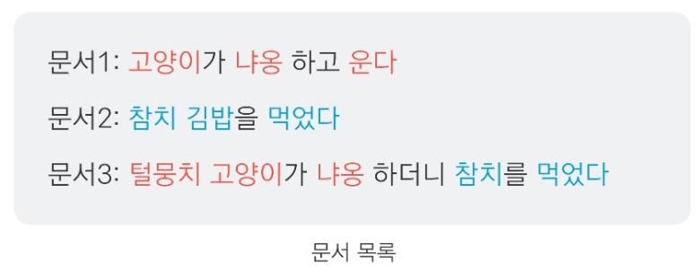
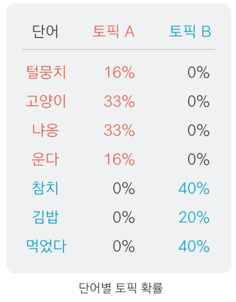

```{r setup, include=FALSE}
knitr::opts_chunk$set(echo = TRUE, warning = FALSE, message = FALSE)
options(width=200)
```


```{css, echo=FALSE}

p, ul, li{
text-align: justify
}

```

- **참고 : Do it! 쉽게 배우는 R 텍스트 마이닝**

----------

> # **토픽 모델링 (Topic Modeling)**

- 토픽 모델링 : 텍스트의 핵심 주제를 찾아 비슷한 내용끼리 분류하는 방법
    - 분석할 텍스트가 많다면 텍스트를 주제별로 분류해 핵심 단어를 살펴보면서 어떤 내용을 담고 있는지 파악해야 하며, 이러한 상황에서 토픽 모델링은 유용하다.


<center>
{width=80%}
</center>
</br>

----------

> # **Contents**

- [토픽 모델링 개념][**1. 토픽 모델링 개념**]
- [LDA 모델 만들기][**2. LDA 모델 만들기**]
- [토픽별 주요 단어 살펴보기][**3. 토픽별 주요 단어 살펴보기**]
- [문서를 토픽별로 분류][**4. 문서를 토픽별로 분류**]
- [토픽 이름 짓기][**5. 토픽 이름 짓기**]
- [최적의 토픽 개수][**6. 최적의 토픽 개수**]

----------

# **패키지 설치**

```{r}
pacman::p_load("readr",
               "dplyr", "tidyr",
               "KoNLP",
               "stringr",
               "tm", "tidytext",
               "topicmodels",
               "ggplot2", "scales", "showtext",
               "textclean",
               "ldatuning")
```

-----------

# **1. 토픽 모델링 개념**

- 토픽 모델링의 개념을 알아본다.
- 토픽 모델에서는 텍스트는 "Document (문서)", 단어는 "Term"으로 표현한다.

----------

## **1-1. 예제**

- 예제로 다음과 같은 3개의 문서를 사용한다.
    - 문서 1 : 고양이 관련 내용
    - 문서 2 : 음식 관련 내용
    - 문서 3 : 고양이와 음식 관련 내용

<center>
{width=50%}
</center>
</br>

- 해당 문서들을 토픽(Topic, 주제)별로 분류하고 각 토픽이 어떤 내용을 담고 있는지 알아보려고 한다.
- 토픽 모델은 문서와 단어의 관계를 이용해 만든다.
- 예제 문서에 대해 토픽의 개수를 2개로 정해 모델을 만들었다고 가정하고 그 결과는 다음과 같다.

<center>
{width=30%}
</center>
</br>

- 표를 보면 토픽 A는 고양이 관련 단어, 토픽 B는 음식 관련 단어가 등장할 확률이 높다.
    - 토픽 모델을 만들면 
        1. 문서에 사용된 단어가 두 토픽 중 어디에 등장할 확률이 더 높은지 알 수 있다.
        2. 단어 등장 확률을 보고 토픽의 핵심 단어를 알 수 있다.
        
        
------------

## **1-2. 문서를 토픽별로 분류**

- 토픽 모델을 이용하면
    1. 문서가 어떤 토픽에 등장할 확률이 높은지 알 수 있다. 
    2. 확률을 이용해 문서를 토픽별로 분류할 수 있다.
    3. 문서가 어떤 주제로 구성되는지 파악할 수 있다.
        - 주제를 찾으면 문서를 비슷한 내용끼리 분류할 수 있기 때문에 다량의 문서를 분석할 때 특히 유용하다.
- 예제 문서에 대해 다음 표를 보면 문서 1과 3은 토픽 A, 문서 2는 토픽 B에 등장할 확률이 높다.
    - 따라서 문서 1과 3은 토픽 A로, 문서 2는 토픽 B로 분류하면 된다.
    
<center>
{width=40%}
</center>
</br>   

------------

## **1-3. LDA 모델**

- LDA (Latent Dirichlet Allocation, 잠재 디리클레 할당) : 가장 널리 사용되는 토픽 모델링 알고리듬
- LDA 모델은 다음과 같은 가정을 하고 토픽과 단어의 관계를 추정한다.
    1. 토픽은 여러 단어의 혼합으로 구성된다.
        - 다음과 같이 "고양이" 토픽과 "음식" 토픽을 예로 들어보자.
<center>
{width=30%}
</center>
            - 한 토픽에 여러 단어가 서로 다른 확률로 포함된다.
                - "고양이" 토픽에는 "털", "모래", "참치"가 등장하고, "음식" 토픽에는 "참치", "김밥", "떡볶이"가 등장한다.
                - 그런데 "고양이" 토픽에서 "털", "모래"는 특히 자주 언급되므로 등장 확률이 높지만, "참치"는 다른 토픽에도 등장하므로 앞선 두 단어에 비해 등장 확률이 낮을 것이다.
            - 같은 단어가 여러 토픽에 서로 다른 확률로 포함된다.
                - "참치"는 고양이가 좋아하는 음식이므로 "고양이" 토픽과 "음식" 토픽 모두에 등장한다.
                - 하지만 "참치"는 사람이 먹는 음식보다는 주로 고양이가 먹는 간식으로 언급되므로, "음식" 토픽보다 "고양이" 토픽에 등장할 확률이 높을 것이다.
    2. 문서는 여러 토픽의 혼합으로 구성된다.
        - 문서에는 여러 토픽의 단어가 서로 다른 비율로 들어 있다.
            - 예를 들어, 문서 1에는 토픽 A의 단어가 90%, 토픽 B의 단어가 10% 들어 있고, 문서 2에는 토픽 A의 단어가 30%, 토픽 B의 단어가 70% 들어있을 수 있다.
        - 다음의 그림에서 왼쪽은 토픽, 오른쪽은 문서를 나타내는데 그림에서 보듯, 문서는 무 자르듯 어느 한 토픽에만 속하는 게 아니라 모든 토픽에 속할 확률이 어느 정도 있다.
        - 다만, 문서를 분류할 때는 단어의 등장 확률이 더 높은 쪽으로 한다.
            - 예를 들어, 문서 1은 토픽 A의 단어가 등장할 확률이 높으니 토픽 A로, 문서 2는 토픽 B의 단어가 등장할 확률이 높으니 토픽 B로 분류한다.
            
<center>
{width=60%}
</center>
</br>  


`Caution!` 앞선 "고양이" 토픽과 "음식" 토픽은 토픽 모델의 의미를 이해하기 쉽도록 가상으로 만든 것이다. 실제로는 같은 문서가 여러 토픽에 등장할 가능성이 있고, 같은 단어도 여러 토픽에 등장할 가능성이 있기 때문에 확률이 0이 되지는 않는다.  
게다가, LDA 모델이 만들어지는 과정을 자세히 알고 싶다면 [Topic Modeling, LDA](https://ratsgo.github.io/from%20frequency%20to%20semantics/2017/06/01/LDA/)를 참고하며, 예문을 이용해 토픽 모델을 설명하는 아이디어는 ["딥 러닝을 이용한 자연어 처리 입문" 블로그](https://wikidocs.net/30708)에서 얻었다.
            

--------------------

# **2. LDA 모델 만들기**

- LDA 모델의 개념을 살펴보았으니 영화 "기생충" 기사 댓글을 이용해 LDA 모델을 만드는 방법을 알아본다.

--------------------

## **2-1. 데이터 불러오기**

- 분석 자료 “news_comment_parasite.csv” : 2020년 2월 10일에 개최된 아카데미 시상식에서 영화 "기생충"의 수상 소식에 대한 기사에 달린 댓글 데이터

```{r, eval=F}
# 데이터 불러오기
raw_news_comment <- read_csv(".../news_comment_parasite.csv") %>%
  mutate(id = row_number())                  # 변수 id 추가 -> 행 번호(row_number)를 값으로 입력

raw_news_comment
```

```{r, echo=F}
# 데이터 불러오기
raw_news_comment <- read_csv("C:/Users/User/Desktop/쉽게 배우는 R 텍스트 마이닝/Data/news_comment_parasite.csv") %>%
  mutate(id = row_number())                  # 변수 id 추가 -> 행 번호(row_number)를 값으로 입력

raw_news_comment
```

`Caution!` [문서를 토픽별로 분류][**4. 문서를 토픽별로 분류**]하는 작업에서는 댓글 원문이 포함된 `raw_news_comment`와 각 문서(댓글)가 등장할 확률이 높은 토픽 번호를 결합하여 토픽별 문서 개수 계산 또는 시각화를 수행한다. 이때 문서(댓글)를 구분하는 기준이 필요하기 때문에 함수 `row_number()`로 문서의 고유 번호를 부여해 두어야 한다.

--------------

## **2-2. 전처리**

### **2-2-1. 기본적인 전처리**

1. 중복 문서 제거하기
    - 중복 문서가 있으면 계산량이 늘어나 모델을 만드는 시간이 오래 걸리고, 한 토픽에 내용이 똑같은 문서가 여러개 들어 있는 문제가 발생한다.
    - 이런 문제를 피하기 위해 Package `"dplyr"`의 함수 `distinct()`를 이용해 중복 문서를 제거한다.
        - 문서(댓글)가 들어 있는 변수 `reply` 외에 다른 변수들도 모두 유지하도록 옵션 `.keep_all = T`을 사용한다.
2. 짧은 문서 제거하기
    - 토픽 모델은 여러 문서에 공통으로 사용된 단어를 이용해 토픽을 찾는 과정을 거쳐 만들어진다.
    - 짧은 문서는 다른 문서와 공통으로 사용된 단어가 적어서 토픽 모델을 만드는 데 적합하지 않다.
    - 짧은 문서를 제거하기 위해 함수 `str_count()`를 이용해 세 단어 이상 사용된 문서만 추출한다.

```{r}
news_comment <- raw_news_comment %>%
  mutate(reply = str_replace_all(reply, "[^가-힣]", " "), # 한글을 제외한 모든 문자는 공백으로 변경
         reply = str_squish(reply)) %>%                   # 연속된 공백 제거
  distinct(reply, .keep_all = T) %>%                      # 중복 문서 제거 / .keep_all = T : 다른 변수들 모두 유지
  filter(str_count(reply, boundary("word")) >= 3)         # 3 단어 이상 사용한 문서만 추출 -> 짧은 문서 제거
```

---------

### **2-2-2. 명사 기준으로 토큰화**

- 문서의 주제는 명사로 결정되기 때문에 토픽 모델을 만들 때는 명사를 추출해 활용하는 경우가 많다.
- 문서에 같은 단어가 여러 번 사용되면 내용과 관계없이 단순히 사용 빈도 때문에 특정 토픽으로 분류될 가능성이 높아진다.
    - 이런 문제를 피하기 위해 각 문서에서 중복 사용된 단어를 제거한다.
    
```{r}
comment <- news_comment %>%                               # 기본적인 전처리를 수행한 결과가 저장되어 있는 객체 in 2-2-1
  unnest_tokens(input = reply,                            # 토큰화를 수행할 텍스트가 포함된 변수명
                output = word,                            # 출력 변수명
                token = extractNoun,                      # 명사 기준으로 토큰화
                drop = F) %>%                             # 원문 제거 X
  filter(str_count(word) > 1) %>%                         # 1 단어 이상 사용한 문서만 추출
  group_by(id) %>%                                        # 변수 id에 대해 그룹화 -> 각 문서에서 중복 사용된 단어를 제거하기 위해
  distinct(word, .keep_all = T) %>%                       # 중복 단어 제거 / .keep_all = T : 다른 변수들 모두 유지
  ungroup() %>%                                           # 그룹화 해제
  select(id, word)                                        # 변수 id와 word만 선택

comment
```

---------

### **2-2-3. 빈도가 높은 단어 제거**

- 빈도가 매우 높은 단어가 포함된 상태로 토픽 모델을 만들면 대부분의 토픽에 똑같은 단어가 주요 단어로 등장해 토픽의 특징을 파악하기 어렵기 때문에 이를 제거해야 한다.
    - 분석 대상이 영화 "기생충" 관련 기사에 달린 댓글이기 때문에 "영화", "기생충" 같은 단어는 거의 모든 댓글에 들어 있어 빈도가 매우 높다.
  
```{r}
count_word <- comment %>%                                 # 토큰화를 수행한 결과가 저장되어 있는 객체 in 2-2-2
  add_count(word) %>%                                     # 단어 빈도 계산
  filter(n <= 200) %>%                                    # 200번 이하로 사용한 단어만 추출
  select(-n)                                              # 단어 빈도가 포함된 변수 n 제거
```

---------

### **2-2-4. 불용어 제거 & 유의어 처리**

① 불용어와 유의어 확인하기

- 불용어(Stop Word) : 분석에 큰 의미가 없는 단어
    - 빈도가 높은 단어를 제거한 `count_word` (참고. [2-2-3. 빈도가 높은 단어 제거][**2-2-3. 빈도가 높은 단어 제거**])에는 "들이", "하다", "하게"처럼 의미를 알 수 없는 단어가 들어 있으며, 이런 단어는 텍스트를 해석하는 데 도움이 되지 않으므로 제거해야 한다.
- 유의어(Synonyms) : 표현은 다르지만 의미가 비슷한 단어

```{r}
# 빈도를 기준으로 내림차순 정렬해 불용어와 유의어 확인
count_word %>%                                            # 빈도가 높은 단어를 제거한 객체 in 2-2-3
  count(word, sort = T) %>%                               # 단어 빈도 계산 / sort = T : 내림차순 정렬
  print(n = 200)                                          # 200개의 단어가 화면에 보이도록 출력 
```

-------------

② 불용어 목록 만들기

- 출력 결과를 토대로 불용어 목록을 만든다.

```{r}
stopword <- c("들이", "하다", "하게", "하면", "해서", "이번", "하네",
              "해요", "이것", "니들", "하기", "하지", "한거", "해주",
              "그것", "어디", "여기", "까지", "이거", "하신", "만큼")
```

-------------

③ 불용어를 제거하고 유의어를 통일하기

- 빈도가 높은 단어를 제거한 `count_word` (참고. [2-2-3. 빈도가 높은 단어 제거][**2-2-3. 빈도가 높은 단어 제거**])에서 불용어를 제거한 다음, Package `"dplyr"`의 함수 `recode()`를 이용해 유의어를 통일한다.
    - 함수 `recode()` : 특정값을 다른 값으로 수정하는 함수
    
```{r}
count_word <- count_word %>%                               # 빈도가 높은 단어를 제거한 객체 in 2-2-3
  filter(!word %in% stopword) %>%                          # 불용어에 포함하지 않은 단어만 추출 -> 불용어 제거
  # 유의어 통일
  mutate(word = recode(word,                        
                       "자랑스럽습니" = "자랑",            # 변수 word에서 "자랑스럽습니" -> "자랑"
                       "자랑스럽" = "자랑",                # 변수 word에서 "자랑스럽" -> "자랑"
                       "자한" = "자유한국당",              # 변수 word에서 "자한" -> "자유한국당"
                       "문재" = "문재인",                  # 변수 word에서 "문재" -> "문재인"
                       "한국의" = "한국",                  # 변수 word에서 "한국의" -> "한국"
                       "그네" = "박근혜",                  # 변수 word에서 "그네" -> "박근혜"
                       "추카" = "축하",                    # 변수 word에서 "추카" -> "축하"
                       "정경" = "정경심",                  # 변수 word에서 "정경" -> "정경심"
                       "방탄" = "방탄소년단"))             # 변수 word에서 "방탄" -> "방탄소년단"
```

-------------

`Caution!` 불용어를 제거하는 작업은 텍스트를 분석할 때마다 반복하기 때문에 자주 등장하는 불용어를 CSV 파일로 저장해두고 필요할 때마다 불러와 활용하면 편리하다.  
영어의 경우 Package `"kableExtra"`의 `data(stop_words)`를 이용하여 불용어 사전을 활용할 수 있으며, 한국어의 경우 [Korean Stopwords](https://www.ranks.nl/stopwords/korean)를 참고하여 불용어를 제거할 수 있다.

```{r, eval = F}
# 불용어 목록 만들기
stopword <- tibble(word = c("들이", "하다", "하게", "하면", "해서", "이번", "하네",
                            "해요", "이것", "니들", "하기", "하지", "한거", "해주",
                            "그것", "어디", "여기", "까지", "이거", "하신", "만큼"))

# 불용어 목록 저장하기
write_csv(stopword, "stopword.csv")

# 불용어 목록 불러오기
stopword <- read_csv("stopword.csv")

# 불용어 제거 Ver.1
count_word <- count_word %>%
  filter(!word %in% stopword$word)           # count_word의 변수 word에서 불용어(stopword$word)에 포함되지 않는 행만 추출 -> 불용어 제거

# 불용어 제거 Ver.2
count_word <- count_word %>%
  anti_join(stopword, by = "word")           # anti_join : 차집합 / count_word의 변수 word에서 불용어(stopword$word)에 포함되지 않는 행만 추출 -> 불용어 제거
```

-------------

## **2-3. LDA 모델**

### **2-3-1. Document-Term Matrix**

- LDA 모델은 DTM (Document-Term Matrix, 문서 단어 행렬)을 이용해 만든다.
    - DTM은 행은 문서, 열은 단어로 구성해 빈도를 나타낸 행렬이다.

-------------

① 문서별 단어 빈도 계산

- DTM을 만들려면 문서별 단어의 빈도를 구해야 한다.

```{r}
# 문서별 단어 빈도 계산
count_word_doc <- count_word %>%                           # 불용어를 제거하고 유의어를 통일한 객체 in 2-2-4
  count(id, word, sort = T)                                # 문서별 단어 빈도 계산 / sort = T : 내림차순 정렬

count_word_doc
```

`Result!` 35번째 문서(댓글)에서 "한국"은 2번 등장한다.

-----------

② DTM 만들기

- Package `"tidytext"`의 함수 `cast_dtm(..., document, term, value)` : 문서별 단어의 빈도를 DTM으로 만드는 함수
    - `document` : 문서 구분 기준
    - `term` : 단어가 포함된 변수명
    - `value` : 단어의 빈도가 포함된 변수명
- 함수 `cast_dtm()`를 사용하려면 Package `"tm"`을 설치해야 한다. 

```{r}
dtm_comment <- count_word_doc %>%                          # 문서별 단어의 빈도를 계산한 결과가 저장되어 있는 객체
  # DTM 생성
  cast_dtm(document = id,                                  # 문서 구분 기준
           term = word,                                    # 단어가 포함된 변수명
           value = n)                                      # 단어의 빈도가 포함된 변수명

dtm_comment
```

`Result!` 출력 결과를 보면 `dtm_comment`는 3,203 문서 X 5,995 단어(`documents: 3203, terms: 5995`)로 구성됨을 알 수 있다.  
`Caution!` 함수 `as.matrix()`를 이용하면 DTM의 내용을 확인할 수 있다. 

```{r}
as.matrix(dtm_comment)[1:8, 1:8]                           # 8개의 문서와 8개의 단어에 대해서만 출력
```

`Result!` 출력 결과에서 `Docs`는 문서 번호, `Terms`는 단어, 숫자는 문서에 단어가 등장한 빈도를 의미한다. 예를 들어, 35번째 문서(댓글)에서 "한국"은 2번 등장한다.

---------

### **2-3-2. LDA 모형 만들기**

- DTM을 Package `"topicmodels"`의 함수 `LDA(..., k, method, control)`에 적용해 LDA 모형을 만들 수 있다.
    - `k` : 토픽 개수 
        - 토픽 개수에는 정해진 정답이 없기 때문에 `k` 값을 바꾸어 가며 여러 모델을 만든 다음, 결과를 비교해 결정한다.
    - `method` : 샘플링 방법
        - 토픽 모델은 샘플링을 반복하여 토픽과 단어의 분포를 추정하는 과정을 거쳐 만들어진다.
        - 여기서는 일반적으로 가장 많이 사용하는 깁스 샘플링(`"Gibbs"`) 방법을 이용한다.
            - 깁스 샘플링 : 완전 조건부확률분포로부터 샘플링하는 방법
    - `control` : 모델링의 제어 변수에 대한 리스트
        - 여기서는 `control = list(seed = 1234)`를 입력해 반복 실행해도 동일한 결과를 출력하도록 한다.

```{r}
lda_model <- LDA(dtm_comment,                              # DTM in 2-3-1
                 k = 8,                                    # 토픽 개수
                 method = "Gibbs",                         # 샘플링 방법 : 깁스 샘플링
                 control = list(seed = 1234))              # Seed 고정 -> 항상 동일한 결과를 출력
lda_model


glimpse(lda_model)                                         # 모델 구조 확인
```

`Result!` `lda_model`에는 "단어가 각 토픽에 등장할 확률 beta($\beta$)"와 "문서가 각 토픽에 등장할 확률 gamma($\gamma$)"가 포함되어 있다. 출력 결과에서 `beta : num [1:8, 1:5995]`는 8개 토픽 각각에 5,995개의 beta 값이 있음을 의미하며, 이는 5,995개 단어로 토픽 모델을 만들었기 때문이다. 또한, `gamma : num [1:3203, 1:8]`는 8개 토픽 각각에 3,203개의 gamma 값이 있음을 의미하며, 이는 3,203개 문서로 토픽 모델을 만들었기 때문이다.  
`Caution!` 깁스 샘플링에 관해 자세히 알고 싶다면 [Topic Modeling, LDA](https://ratsgo.github.io/from%20frequency%20to%20semantics/2017/06/01/LDA/)를 참고한다.

--------------

# **3. 토픽별 주요 단어 살펴보기**

- LDA 모델 `lda_model` (참고. [2-3-2. LDA 모형 만들기][**2-3-2. LDA 모형 만들기**])의 beta($\beta$)는 단어가 각 토픽에 등장할 확률이며, beta 값이 크다는 것은 해당 토픽에 등장할 가능성이 높다는 것을 의미한다.
    - beta 값을 이용하여 각 토픽에 등장할 가능성이 높은 주요 단어를 찾을 수 있다.

---------

## **3-1. 토픽별 단어 확률 beta 추출**

- Package `"tidytext"`의 함수 `tidy()`를 이용하면 `lda_model`에서 beta 값을 추출할 수 있다.
    - 함수 `tidy()`에 `lda_model`을 적용한 다음, 옵션 `matrix = "beta"`를 입력해 beta 값을 추출한다.

```{r}
term_topic <- tidy(lda_model,                              # LDA 모델 in 2-3-2 
                   matrix = "beta")                        # beta 추출

term_topic
```

`Result!` 출력 결과를 보면 5,995개 단어를 이용해 토픽 모델을 만들었으므로 `term_topic`은 토픽별로 5,995행, 즉, 총 8 $\times$ 5,995 = 47,960행으로 구성되어 있다. 변수 `topic`은 토픽 번호를, 변수 `term`은 단어를 의미하며, 이를 토대로 해석하면 "한국"이 토픽 1에 등장할 확률이 0.000405, 토픽 2에 등장할 확률이 0.0000364이다. 게다가, beta는 확률값이므로 한 토픽의 beta 값을 모두 더하면 1이 된다.

```{r}
# 토픽별 단어 개수
term_topic %>%                                             # beta 값이 저장되어 있는 객체
  count(topic)                                             # 토픽별 단어 개수 계산

# 토픽 1의 beta 값 합계
term_topic %>%                                             # beta 값이 저장되어 있는 객체
  filter(topic == 1) %>%                                   # 토픽 1만 추출
  summarise(sum_beta = sum(beta))                          # 변수 beta에 포함된 값의 합 계산
```

---------

`Caution!` 특정 단어를 추출하면 단어가 어떤 토픽에 등장할 확률이 높은지 알 수 있다. 

```{r}
# 특정 단어의 토픽별 등장 확률
term_topic %>%                                             # beta 값이 저장되어 있는 객체
  filter(term == "작품상")                                 # "작품상"에 대한 결과만 추출
```

`Result!` "작품상"은 토픽 6에 등장할 확률이 0.0695로 가장 높다.

---------

## **3-2. 토픽별 주요 단어**

- 토픽에 등장할 확률이 높은 단어, 즉, beta 값이 큰 단어를 살펴보면 토픽의 특징을 이해할 수 있다.

----------

### **3-2-1. 특정 토픽에서 beta 값이 높은 단어**

```{r}
term_topic %>%                                             # beta 값이 저장되어 있는 객체 in 3-1
  filter(topic == 6) %>%                                   # 토픽 6만 추출
  arrange(-beta)                                           # 변수 beta를 기준으로 내림차순 정렬
```

`Result!` 토픽 6을 추출한 다음, 변수 `beta`를 기준으로 내림차순으로 정렬해보면 "작품상", "감독상", "수상" 등의 확률이 높은 것을 알 수 있다. 이러한 결과들은 토픽 6이 영화상 수상과 관련있다는 것을 나타낸다.

---------

### **3-2-2. 토픽별 주요 단어**

- Package `"topicmodels"`의 함수 `terms()`를 이용하면 토픽별로 등장 확률이 높은 단어, 즉, beta 값이 큰 단어를 한눈에 확인할 수 있다.

```{r}
terms(lda_model, 20) %>%                                   # 토픽별로 등장 확률이 높은 20개 단어 추출
  data.frame()                                             # Data Frame으로 변환
```

`Result!` 출력 결과를 보면 토픽 1에는 "작품", "진심", "정치"의 등장 확률이 높으며, 토픽 2에는 "대박", "시상식", "오늘"의 등장 확률이 높다는 것을 알 수 있다.

---------

### **3-2-3. 시각화**

```{r}
# 1. 토픽별로 beta 값이 큰 단어 10개 추출
top_term_topic <- term_topic %>%                           # beta 값이 저장되어 있는 객체 in 3-1
  group_by(topic) %>%                                      # 변수 topic에 대해 그룹화 -> 토픽별로 beta 값이 큰 단어를 추출하기 위해
  slice_max(beta, n = 10)                                  # beta 값이 가장 큰 10개 단어 추출
```

`Caution!` beta 값에 동점이 있으면 추출한 단어가 10개보다 많을 수 있다. 동점을 제외하고 토픽별로 단어 개수를 동일하게 10개로 맞추려면 함수 `slice_max()`에 옵션 `with_ties = F`를 입력하면 된다.

```{r}
# 2. 막대 그래프
## 나눔바른 고딕 폰트 불러오기
font_add_google(name = "Nanum Gothic",                          # 구글 폰트에서 사용하고자 하는 폰트 이름 
                family = "nanumgothic")                         # R에서 사용할 폰트 이름 -> 사용자 지정
showtext_auto()

ggplot(top_term_topic,                                          # 토픽별로 beta 값이 큰 10개의 단어가 저장되어 있는 객체
       aes(x = reorder_within(term, beta, topic),               # reorder_within : 토픽별로 변수 beta를 기준으로 내림차순 정렬 
           y = beta, 
           fill = factor(topic))) +                             # 토픽별로 막대 색깔을 다르게 표현
  geom_col(show.legend = F) +                                   # 막대 그래프
  facet_wrap(~ topic,                                           # 변수 topic의 항목별로 그래프 작성 -> 토픽별로 막대 그래프 작성
             scales = "free", 
             ncol = 4) +                                        # 한 행에 4개의 막대 그래프 작성
  coord_flip() +                                                # 막대를 가로로 회전
  scale_x_reordered() +                                         # 단어 뒤에 토픽 이름 제거
  scale_y_continuous(n.breaks = 4,                              # y축의 눈금을 4개 내외로 제한 -> 막대를 가로로 회전했기 때문에 x축의 눈금이 수정됨
                     labels = number_format(accuracy = .01)) +  # 눈금 숫자를 소수점 셋째 자리에서 반올림
  labs(x = NULL) +                                              # x축 제목 제거 -> 막대를 가로로 회전했기 때문에 y축 제목이 제거됨
  theme(text = element_text(family = "nanumgothic"))            
```

`Result!` 등장 확률이 높은 주요 단어, 즉, beta 값이 큰 주요 단어를 살펴보면 토픽이 어떤 특징을 지니는지 알 수 있다. 예를 들어, 토픽 4의 "역사", "우리나라", "세계"를 보면 해당 토픽이 아카데미상 수상의 역사적 의미와 관련됨을 알 수 있다. 또한, 토픽 7의 "블랙리스트", "박근혜", "자유한국당"을 보면 해당 토픽이 정치 문제와 관련됨을 알 수 있다.  
`Caution!` 함수 `scale_y_continuous()`에 입력한 옵션 `n.breaks = 4`는 축 눈금을 4개 내외로 정하는 기능을 한다. 또한, 옵션 `labels = number_format(accuracy = .01)`은 눈금 숫자를 소수점 셋째 자리에서 반올림하는 기능을 하며, 함수 `number_format()`을 사용하려면 Package `"scales"`를 설치해야 한다.

---------

# **4. 문서를 토픽별로 분류**

- LDA 모델 `lda_model` (참고. [2-3-2. LDA 모형 만들기][**2-3-2. LDA 모형 만들기**])의 gamma($\gamma$)는 문서가 각 토픽에 등장할 확률이며, gamma 값을 이용하면 문서를 토픽별로 분류할 수 있다.
- 문서를 토픽별로 분류하고 주요 단어와 원문을 함께 살펴보면 토픽의 특징을 자세히 이해할 수 있다.

---------

## **4-1. 문서별 토픽 확률 gamma 추출**

- Package `"tidytext"`의 함수 `tidy()`를 이용하면 `lda_model`에서 gamma 값을 추출할 수 있다.
    - 함수 `tidy()`에 `lda_model`을 적용한 다음, 옵션 `matrix = "gamma"`를 입력해 gamma 값을 추출한다.
    
```{r}
doc_topic <- tidy(lda_model,                              # LDA 모델 in 2-3-2 
                  matrix = "gamma")                       # gamma 추출

doc_topic
```

`Result!` 출력 결과를 보면 3,203개 문서를 이용해 토픽 모델을 만들었으므로 `doc_topic`은 토픽별로 3,203행, 즉, 총 8 $\times$ 3,203 = 25,624행으로 구성되어 있다. 변수 `document`은 문서(댓글) 번호를, 변수 `topic`은 토픽 번호를 의미하며, 이를 토대로 해석하면 35번째 문서(댓글)가 토픽 1에 등장할 확률은 0.151, 206번째 문서(댓글)가 토픽 1에 등장할 확률은 0.15이다. 게다가, gamma는 beta와 마찬가지로 확률값이므로 한 문서의 gamma 값을 모두 더하면 1이 된다. 

```{r}
# 토픽별 문서 개수
doc_topic %>%                                             # gamma 값이 저장되어 있는 객체
  count(topic)                                            # 토픽별 문서 개수 계산

# 첫 번째 문서(문서 1)의 gamma 값 합계
doc_topic %>%                                             # gamma 값이 저장되어 있는 객체
  filter(document == 1) %>%                               # 첫 번째 문서(문서 1)만 추출
  summarise(sum_gamma = sum(gamma))                       # 변수 gamma에 포함된 값의 합 계산
```

---------

## **4-2. 문서를 확률이 가장 높은 토픽으로 분류**

`Caution!` 문서별로 gamma 값이 가장 큰 토픽을 추출하면 문서가 어떤 토픽에 등장할 확률이 높은지 알 수 있으며, 이렇게 얻은 값을 이용하면 각 문서를 확률이 높은 토픽으로 분류할 수 있다.

```{r}
# 1. 문서별로 gamma 값이 가장 큰 토픽 추출
doc_class <- doc_topic %>%                                # gamma 값이 저장되어 있는 객체 in 4-1
  group_by(document) %>%                                  # 변수 document에 대해 그룹화 -> 문서별로 gamma 값이 가장 큰 토픽을 추출하기 위해
  slice_max(gamma, n = 1)                                 # gamma 값이 가장 큰 1개 토픽 추출

doc_class
```

`Result!` 첫 번째 문서(댓글)는 토픽 5에 등장할 확률이 0.159로 가장 높으며, 열 번째 문서(댓글)는 토픽 8에 등장할 확률이 0.168로 가장 높다.

---------

```{r}
# 2. 원문에 확률이 가장 높은 토픽 번호 부여 
doc_class$document <- as.integer(doc_class$document)      # 변수 document를 정수형으로 변환

# 원문에 토픽 번호 부여
news_comment_topic <- raw_news_comment %>%                # 원문 in 2-1
  left_join(doc_class, by = c("id" = "document"))         # 원문의 변수 id와 doc_class의 변수 document를 기준으로 원문과 doc_class 결합

news_comment_topic %>%
  select(id, topic)                                       # 변수 id와 topic만 선택
```

`Result!` 첫 번째 문서(댓글)는 토픽 5의 gamma 값이 가장 커 토픽 5로 분류되었다.  
`Caution!` gamma 값이 가장 큰 토픽 번호를 댓글 원문에 부여하기 위해 함수 `left_join()`을 이용하여 댓글 원문이 들어 있는 `raw_news_comment` (참고. [2-1. 데이터 불러오기][**2-1. 데이터 불러오기**])와 `doc_class`를 결합한다. 이때 `raw_news_comment`의 변수 `id`와 `doc_class`의 변수 `document`가 문서(댓글) 번호를 나타내는 고유값이므로 이 변수를 기준(`by = c("id" = "document")`)으로 결합한다.  
게다가, 데이터셋을 결합하려면 기준이 되는 변수의 타입이 같아야 한다. `raw_news_comment`의 변수 `id`는 정수형이고, `doc_class`의 변수 `document`는 문자형이기 때문에 후자를 정수형으로 변환한 다음 결합한다.

------------

```{r}
# 3. 토픽별 문서 개수
news_comment_topic %>%                                    # 원문에 토픽 번호를 부여한 객체
  count(topic)                                            # 토픽별 문서 개수 계산
```

`Result!` 원문에 gamma 값이 가장 큰 토픽 번호를 부여한 `news_comment_topic`를 이용해 토픽별 빈도를 구하면 각 토픽으로 문서가 몇 개씩 분류되었는지 알 수 있다. 출력 결과를 보면 토픽 1에는 660개의 문서(댓글)가, 토픽 2에는 704개의 문서(댓글)가 분류된 것을 알 수 있다.  
`Caution!` 변수 `topic`에서 `NA`가 있는 이유는 빈도가 높은 단어를 제거하는 전처리 작업을 거치지 않은 `raw_news_comment`에 `doc_class`를 결합해 토픽 번호를 부여했기 때문이다. 다시 말해서, `raw_news_comment`는 "빈도가 높은 단어만 있어서 토픽 모델을 만드는 데 사용하지 않은 문서(댓글)"까지 포함하고 있다. 이런 문서(댓글)의 번호는 `doc_class`에 없기 때문에 함수 `left_join()`을 이용해 결합하면 변수 `topic`에 `NA`가 할당된다. 해당 문서(댓글)는 분석에 활용하지 않으므로 함수 `na.omit()`를 이용해 제거한다.

```{r}
# NA 제거
news_comment_topic <- news_comment_topic %>%              # 원문에 토픽 번호를 부여한 객체
  na.omit()                                               # NA 제거
```
 
------------

## **4-3. 문서를 한 토픽으로만 분류**

- 앞에서 만든 `news_comment_topic`을 살펴보면 두 번째 문서(댓글)는 토픽 1, 5, 6으로 분류된 것을 알 수 있다. 
    - 이는 두 번째 문서(댓글)가 3개의 토픽(토픽 1, 5, 6)에서 등장할 확률이 가장 높다는 것을 의미한다.
        - gamma 값이 3개의 토픽(토픽 1, 5, 6)에서 동일하다.

```{r}
doc_topic %>%                                             # gamma 값이 저장되어 있는 객체 in 4-1
  group_by(document) %>%                                  # 변수 document에 대해 그룹화 -> 문서별로 gamma 값이 가장 큰 토픽을 추출하기 위해
  slice_max(gamma, n = 1) %>%                             # gamma 값이 가장 큰 1개 토픽 추출
  count(document) %>%                                     # 문서 빈도 계산
  filter(n >= 2)                                          # 2번 이상 등장한 문서 추출
```

`Result!` 2개 이상의 토픽에서 등장할 확률이 높은 문서(댓글)는 총 1,301개이다. 예를 들어, 1001번째 문서(댓글)는 3개의 토픽에서 등장할 확률이 가장 높으며, 이는 해당 문서는 3개의 토픽으로 분류된다는 것을 의미한다.  
`Caution!` 문서를 한 토픽으로만 분류하려면 함수 `slice_sample()`을 이용해 문서별로 gamma 값이 가장 큰 토픽 중 하나를 무작위 추출하면 된다. 이렇게 하면 gamma 값이 가장 큰 토픽이 하나인 문서는 그대로 남고, gamma 값이 가장 큰 토픽이 둘 이상인 문서는 무작위로 한 개의 토픽을 추출한다. 게다가, 함수 `slice_sample()`는 난수를 이용하여 추출하기 때문에 `set.seed`로 난수를 고정하여 항상 동일한 결과를 출력하도록 해야 한다. 

```{r}
set.seed(1234)                                            # Seed 고정 -> 항상 동일한 결과를 출력
doc_class_unique <- doc_topic %>%                         # gamma 값이 저장되어 있는 객체 in 4-1
  group_by(document) %>%                                  # 변수 document에 대해 그룹화 -> 문서별로 gamma 값이 가장 큰 토픽을 추출하기 위해
  slice_max(gamma, n = 1) %>%                             # gamma 값이 가장 큰 1개 토픽 추출
  slice_sample(n = 1)                                     # gamma 값이 가장 큰 토픽이 2개 이상인 문서에 대해 무작위로 1개의 토픽만 남기기 위해

doc_class_unique
```

```{r}
doc_class_unique %>%
  count(document, sort = T)                               # 문서 빈도 계산 
```

`Result!` 출력 결과를 보면 문서를 한 토픽으로만 분류했기 때문에 모든 문서의 빈도가 1이다.

---------

## **4-4. 시각화**

- 토픽별로 문서 개수와 주요 단어를 막대 그래프로 함께 표현하면 어떤 토픽으로 분류된 문서가 많은지, 토픽의 특징은 어떠한지 한눈에 파악할 수 있다.
    1. 토픽별 주요 단어 목록 만들기
        - 토픽별 단어 확률 `beta`가 포함된 `term_topic` (참고. [3-1. 토픽별 단어 확률 beta 추출][**3-1. 토픽별 단어 확률 beta 추출**])에서 토픽별로 확률이 가장 높은 주요 단어를 6개씩 추출한다.
            - 확률이 동점인 단어는 제외하도록 함수 `slice_max()`에 옵션 `with_ties = F`를 입력한다.
        - 함수 `summarise()`와 `paste()`를 이용해 주요 단어를 한 행으로 결합한다.    
    2. 토픽별 문서 개수 계산하기
        - 원문과 토픽 번호가 포함된 `news_comment_topic` (참고. [4-2. 문서를 확률이 가장 높은 토픽으로 분류][**4-2. 문서를 확률이 가장 높은 토픽으로 분류**])을 이용해 토픽별 문서 개수를 계산한다.
    3. 문서 개수에 주요 단어 결합하기    
        - 토픽별 문서 개수를 포함한 `count_topic`에 1번(토픽별 주요 단어 목록 만들기)의 결과 `top_terms`를 결합한다.
        - 막대 그래프의 x축(가로로 회전한다면 y축)에 `Topic 1`의 형태로 토픽 번호를 표시하기 위해 변수 `topic_name`을 추가한다.
    4. 막대 그래프 만들기    
        - 함수 `geom_text()`를 이용해 막대 끝에 문서 빈도를 표시하고, 막대 안에 토픽의 주요 단어를 표시한다.
    
---------

```{r}
# 1. 토픽별 주요 단어 목록 만들기
top_terms <- term_topic %>%                               # beta 값이 저장되어 있는 객체 in 3-1
  group_by(topic) %>%                                     # 변수 topic에 대해 그룹화 -> 토픽별로 beta 값이 큰 단어 추출하기 위해
  slice_max(beta, n = 6,                                  # beta 값이 가장 큰 단어 6개 추출
            with_ties = F) %>%                            # beta 값이 동일하더라도 옵션에 지정한 개수만큼만 단어 추출
  summarise(term = paste(term, collapse = ", "))          # 변수 term에 단어들을 ", "로 결합

top_terms
```

`Result!` 첫 번째 행은 토픽 1에 대해 beta 값이 가장 큰 6개의 단어이고, 두 번째 행은 토픽 2에 대해 beta 값이 가장 큰 6개의 단어이다.

--------

```{r}
# 2. 토픽별 문서 개수 계산하기 
count_topic <- news_comment_topic %>%                     # 원문에 토픽 번호를 부여한 객체 in 4-2
  count(topic)                                            # 토픽별 문서 개수 계산

count_topic
```

---------

```{r}
# 3. 문서 개수에 주요 단어 결합하기
count_topic_word <- count_topic %>%                       # 토픽별 문서 개수를 포함한 객체
  left_join(top_terms, by = "topic") %>%                  # count_topic과 토픽별 주요 단어를 포함한 top_terms를 변수 topic을 기준으로 결합 
  mutate(topic_name = paste("Topic", topic))              # Topic 1, Topic 2와 같은 값을 가지는 변수 topic_name 추가 

count_topic_word
```

---------

```{r}
# 4. 막대 그래프 만들기
ggplot(count_topic_word,
       aes(x = reorder(topic_name, n),                     # 토픽에 대해 문서 개수를 기준으로 내림차순 정렬
           y = n,
           fill = topic_name)) +
  geom_col(show.legend = F) +                              # 막대 그래프 
  coord_flip() +                                           # 가로로 회전
  geom_text(aes(label = n) ,                               # 문서 빈도 표시
            hjust = -0.2) +                                # 막대 밖에 표시
  geom_text(aes(label = term),                             # 주요 단어 표시
            hjust = 1.03,                                  # 막대 안에 표시
            col = "white",                                 # 단어 색깔
            fontface = "bold",                             # 단어 굵기 : 두껍게
            family = "nanumgothic") +                      # 폰트 -> 3-2-3에서 정의한 나눔바른 고딕 폰트
  scale_y_continuous(expand = c(0, 0),                     # y축 막대 간격 줄이기 -> 막대를 가로로 회전했기 때문에 x축 막대 간격이 수정됨 
                     limits = c(0, 820)) +                 # y축 범위 -> 막대를 가로로 회전했기 때문에 x축 범위가 수정됨
  labs(x = NULL)                                           # x축 제목 제거 -> 막대를 가로로 회전했기 때문에 y축 제목이 제거됨 
```

`Result!` 출력한 그래프를 보면 막대에 주요 단어와 문서 개수가 함께 표현되어 토픽의 특징을 한눈에 파악할 수 있다. 예를 들어, 토픽 5는 708개의 문서(댓글)를 포함하며 "자랑", "우리", "최고"와 같은 단어들이 등장할 확률이 높다.

---------

# **5. 토픽 이름 짓기**

- 토픽의 이름을 지으면 토픽의 특징을 이해하는 데 도움이 된다.
- 주요 문서의 내용을 살펴보고 토픽 이름을 지은 다음, 토픽 이름과 주요 단어를 나타내는 그래프를 만든다.

----------

## **5-1. 토픽별 주요 문서 확인 & 토픽 이름 짓기**

- 토픽별 주요 문서를 추출해 내용을 살펴본 다음, 토픽 이름을 짓는다.

----------

### **5-1-1. 원문 전처리 & gamma 값을 내림차순으로 정렬**

- 댓글 원문을 읽기 편하게 html 특수 문자를 대체한 다음, gamma 값이 큰 주요 문서가 먼저 출력되도록 변수 `gamma`를 기준으로 내림차순 정렬한다.
    - html 특수 문자를 대체하기 위해 함수 `replace_html()`와 `str_squish()`를 이용한다.
        - 함수 `replace_html()` : html 특수 문자를 기호로 대체하는 함수
            - 예를 들어, `&copy;` → (c), `&ne;` → != 
        - 함수 `str_squish()` : 연속된 공백을 제거하고 공백을 하나만 남기는 함수

```{r}
comment_topic <- news_comment_topic %>%                   # 원문에 토픽 번호를 부여한 객체 in 4-2
mutate(reply = str_squish(replace_html(reply))) %>%       # html 특수 문자 대체
  arrange(-gamma)                                         # 변수 gamma를 기준으로 내림차순 정렬

comment_topic %>%
  select(gamma, reply)                                    # 변수 gamma와 reply만 출력
```

----------

### **5-1-2. 주요 단어가 사용된 문서 확인**

- 각 토픽의 주요 단어가 사용된 문서를 살펴보면 토픽이 어떤 내용을 담고 있는지 알 수 있다.
    - 각 토픽의 주요 단어는 `top_term_topic` (참고. [3-2-3. 시각화][**3-2-3. 시각화**]) 또는 `top_terms` (참고. [4-4. 시각화][**4-4. 시각화**])에 포함되어 있다.

```{r}
# 토픽 1 내용 살펴보기
comment_topic %>%                                         # gamma 값이 내림차순으로 정렬된 객체 in 5-1-1
  filter(topic == 1 & str_detect(reply, "작품")) %>%      # 토픽 1로 분류된 문서에서 "작품"을 포함하는 문서만 추출
  head(50) %>%                                            # 처음 50개의 문서만 확인
  pull(reply)                                             # 문서를 벡터 형태로 출력

comment_topic %>%                                         # gamma 값이 내림차순으로 정렬된 객체 in 5-1-1                        
  filter(topic == 1 & str_detect(reply, "진심")) %>%      # 토픽 1로 분류된 문서에서 "진심"을 포함하는 문서만 추출
  head(50) %>%                                            # 처음 50개의 문서만 확인
  pull(reply)                                             # 문서를 벡터 형태로 출력

comment_topic %>%                                         # gamma 값이 내림차순으로 정렬된 객체 in 5-1-1
  filter(topic == 1 & str_detect(reply, "정치")) %>%      # 토픽 1로 분류된 문서에서 "정치"을 포함하는 문서만 추출
  head(50) %>%                                            # 처음 50개의 문서만 확인
  pull(reply)                                             # 문서를 벡터 형태로 출력
```

`Result!` 토픽 1은 주로 작품상 수상을 축하하거나 정치적인 문서(댓글)를 비판하는 내용으로 구성된다는 것을 알 수 있다. 토픽 2~8도 동일한 패턴으로 주요 단어가 사용된 문서(댓글)을 추출해 확인할 수 있다.  
`Caution!` `comment_topic`은 `tibble` 자료형이므로 Console 창 크기에 맞추어 일부만 출력된다. 함수 `pull()`을 이용하면 변수를 벡터 타입으로 추출하므로 전체 내용을 출력할 수 있다.

-----------

```{r}
# 토픽 2 내용 살펴보기
comment_topic %>%                                         # gamma 값이 내림차순으로 정렬된 객체 in 5-1-1
  filter(topic == 2 & str_detect(reply, "대박")) %>%      # 토픽 2로 분류된 문서에서 "대박"을 포함하는 문서만 추출
  head(50) %>%                                            # 처음 50개의 문서만 확인
  pull(reply)                                             # 문서를 벡터 형태로 출력

comment_topic %>%                                         # gamma 값이 내림차순으로 정렬된 객체 in 5-1-1                       
  filter(topic == 2 & str_detect(reply, "시상식")) %>%    # 토픽 2로 분류된 문서에서 "시상식"을 포함하는 문서만 추출
  head(50) %>%                                            # 처음 50개의 문서만 확인
  pull(reply)                                             # 문서를 벡터 형태로 출력

comment_topic %>%                                         # gamma 값이 내림차순으로 정렬된 객체 in 5-1-1
  filter(topic == 2 & str_detect(reply, "오늘")) %>%      # 토픽 2로 분류된 문서에서 "오늘"을 포함하는 문서만 추출
  head(50) %>%                                            # 처음 50개의 문서만 확인
  pull(reply)                                             # 문서를 벡터 형태로 출력
```

-----------

### **5-1-3. 토픽 이름 목록 만들기**

- 문서 내용을 토대로 토픽 번호와 이름으로 구성된 "토픽 이름 목록"을 만든다.

```{r}
name_topic <- tibble(topic = 1:8,                         # 토픽 번호
                     # 토픽 이름
                     name = c("1. 작품상 수상 축하, 정치적 댓글 비판",
                              "2. 수상 축하, 시상식 감상",
                              "3. 조국 가족, 정치적 해석",
                              "4. 새 역사 쓴 세계적인 영화",
                              "5. 자랑스럽고 감사한 마음",
                              "6. 놀라운 4관왕 수상",
                              "7. 문화계 블랙리스트, 보수 정당 비판",
                              "8. 한국의 세계적 위상"))

name_topic
```


------------

## **5-2. 시각화**

- 토픽별 주요 단어가 들어 있는 `top_term_topic` (참고. [3-2-3. 시각화][**3-2-3. 시각화**])에 토픽 이름 목록 `name_topic`을 결합한 다음, 막대 그래프를 만든다.

```{r}
# 토픽별 주요 단어와 토픽 이름 결합
top_term_topic_name <- top_term_topic %>%              # 토픽별 주요 단어가 포함된 객체 in 3-2-3
  left_join(name_topic, name_topic, by = "topic")      # top_term_topic와 토픽 이름 목록 name_topic를 변수 topic을 기준으로 결합

top_term_topic_name
```

```{r}
ggplot(top_term_topic_name,
       aes(x = reorder_within(term, beta, name),             # reorder_within : 토픽별로 변수 beta를 기준으로 내림차순 정렬 
           y = beta,
           fill = factor(topic))) +                          # 토픽별로 막대 색깔을 다르게 표현
  geom_col(show.legend = F) +                                # 막대 그래프
  facet_wrap(~ name,                                         # 변수 name의 항목별로 그래프 작성 -> 토픽별로 막대 그래프 작성
             scales = "free",
             ncol = 2) +                                     # 한 행에 2개의 막대 그래프 출력
  coord_flip() +                                             # 막대를 가로로 회전
  scale_x_reordered() +                                      # 단어 뒤에 토픽 이름 제거
  labs(title = "영화 기생충 아카데미상 수상 기사 댓글 토픽", # 제목
       subtitle = "토픽별 주요 단어 Top 10",                 # 부제목
       x = NULL, y = NULL) +                                 # x축과 y축 이름 제거
  theme_minimal() +
  theme(text = element_text(family = "nanumgothic"),         # 폰트 -> 3-2-3에서 정의한 나눔바른 고딕 폰트
        title = element_text(size = 12),                     # 제목 글자 크기
        axis.text.x = element_blank(),                       # x축 눈금 라벨 제거
        axis.ticks.x = element_blank())                      # x축 눈금 제거
```

`Result!` 출력한 그래프를 보면 토픽 이름과 주요 단어가 함께 표현되어 토픽의 특징을 쉽게 이해할 수 있다.

-------------

# **6. 최적의 토픽 개수**

- 토픽 모델의 구조는 토픽 개수에 따라 달라진다.
    - 토픽 개수가 너무 적으면 대부분의 단어가 한 토픽의 주요 단어가 되어 의미가 불분명해진다.
    - 토픽 개수가 너무 많으면 여러 토픽에 주요 단어가 중복되어 토픽의 개성이 드러나지 않는다.
- 텍스트를 파악하는 데 도움이 되는 모델을 만들려면 적절한 토픽 개수를 정해야 한다.

-----------

## **6-1. 토픽 개수를 정하는 방법**

① 방법 1. 모델의 내용을 보고 해석 가능성을 고려해 토픽 개수 정하기

- 토픽 개수는 정답이 없기 때문에 분석가가 적당한 개수를 정해 모델을 만든 다음, 내용을 보고 판단해야 한다.
    1. 주요 단어가 토픽을 잘 대표하는지
    2. 문서가 비슷한 내용끼리 잘 분류되었는지
    3. 모델이 텍스트를 해석하는 데 도움이 되는지
- 모델의 해석 가능성을 고려해 판단하는 게 토픽 개수를 정하는 가장 일반적인 방법이다.
- 이 방법의 한계는 다음과 같다.
    1. 일일이 모델의 내용을 확인해야 하므로 시간이 많이 소요된다.
    2. 텍스트의 내용에 관한 전문 지식이 없으면 모델이 타당한지 판단하기 어렵다.

-----------

② 방법 2. 여러 모델의 성능 지표를 비교해 토픽 개수 정하기

- 토픽 개수를 바꾸어 가며 여러 모델을 만든 다음, 모델이 텍스트를 설명하는 정도를 나타낸 성능 지표를 비교하면 토픽 개수가 몇 개일 때 성능이 가장 좋은지 알아낼 수 있다.
- 여러 모델의 성능 지표를 비교해 최적값을 찾는 작업을 하이퍼파라미터 튜닝(Hyperparameter Tuning)이라고 한다.
    - 하이퍼파라미터는 모델을 만들 때 분석가가 직접 정하는 값이다.
    - 하이퍼파라미터에 따라 모델의 성능이 달라지기 때문에 성능이 높은 모델을 만들려면 최적값을 찾는 튜닝을 해야 한다.
- 하이퍼파라미터 튜닝을 하면 전문적인 지식이 없어도 적당한 토픽 개수를 정할 수 있는 장점이 있다.
- 하지만, 여러 모델을 만들어야 하므로 시간이 많이 소요되는 단점이 있다.

-----------

③ 방법3. 방법 1과 방법 2를 함께 사용하기

- 모델의 성능 지표가 높다고 해서 반드시 텍스트를 이해하는 데 도움이 되는 좋은 모델이라고 할 수 없다.
- 하이퍼파라미터 튜닝으로 몇 개의 후보 모델을 선정하고 그중에서 해석 가능성이 큰 모델을 최종적으로 선택하면 적절한 토픽 개수를 정할 수 있다.

-----------

## **6-2. 하이퍼파라미터 튜닝으로 토픽 개수 정하기**

- 하이퍼파라미터 튜닝으로 최적의 토픽 개수를 정하는 방법을 알아본다.
- Package `"ldatuning"`의 함수 `FindTopicsNumber(dtm, topics, return_models, control)`를 이용하면 토픽 개수를 바꾸어 가며 여러 모델을 만들어 성능 지표를 비교할 수 있다.
    - `dtm` : Document-Term Matrix
    - `topics` : 비교할 최소-최대 토픽 개수
    - `return_models` : 모델 저장 여부
        - `FALSE` (기본값) : 성능 지표만 구하고 모델 저장 X
        - `TRUE` : 모델 저장
    - `control` : 제어 변수에 대한 리스트
        - 여기서는 `control = list(seed = 1234)`를 입력해 반복 실행해도 동일한 결과를 출력하도록 한다.

-------------

```{r}
# 1. 토픽 개수를 바꾸어 가며 LDA 모델 여러개 만들기
models <- FindTopicsNumber(dtm = dtm_comment,                # DTM in 2-3-1 
                           topics = 2:20,                    # 2~20을 후보 토픽 개수로 둠
                           return_models = T,                # 모델 저장
                           control = list(seed = 1234))      # Seed 고정 -> 항상 동일한 결과를 출력

models %>%
  select(topics, Griffiths2004)                              # 변수 topics와 Griffiths2004만 출력
```

`Result!` `models`를 출력하면 토픽 개수(`topics`)가 2~20인 19개의 모델이 들어 있음을 알 수 있다. 변수 `Griffiths2004`은 모델의 성능 지표로, 모델이 텍스트를 설명하는 정도를 나타낸 복잡도(Perplexity)를 의미한다. 모델이 텍스트의 구조를 잘 설명할수록 해당 변수가 큰 값을 가진다.  
`Caution!` `Griffiths2004`은 [Griffiths와 Steyvers (2004)](https://www.pnas.org/doi/10.1073/pnas.0307752101)가 제안한 복잡도 지표로, 다양한 연구에서 토픽 모델의 성능을 측정하는 데 활용되고 있다.  
게다가, 함수 `FindTopicsNumber()`를 이용하면 `Griffiths2004` 외에 다른 복잡도 지표도 구할 수 있으며, [Select number of topics for LDA model](https://cran.r-project.org/web/packages/ldatuning/vignettes/topics.html)를 참고한다.

-------------

```{r}
# 2. 최적의 토픽 개수 정하기
FindTopicsNumber_plot(models) 
```

`Result!` `models`를 함수 `FindTopicsNumber_plot()`에 적용하면 성능 지표를 이용해 선 그래프를 만든다. 그래프의 x축은 토픽 개수를 의미하고, y축은 성능 지표를 0~1로 최대-최소 정규화(Mix-max Normalization)한 값이다. 모델의 성능이 좋을수록 y축의 값이 크며, 후보 모델 중 성능이 가장 좋으면 1, 가장 나쁘면 0이 된다.  
그래프를 보면 토픽 개수가 8개가 될 때까지는 성능 지표가 큰 폭으로 증가하다가 그 이후로는 약간씩만 증가하거나 등락을 반복한다. 성능이 비슷하면 단순한 모델을 사용하는 게 좋기 때문에 지금의 경우 토픽 개수를 8개로 정하면 적당하다. 이처럼 "토픽 개수를 늘려도 성능이 크게 향상되지 않고 등락을 반복하기 시작하는 지점"에서의 토픽 개수를 정한다. 만약 해석 가능성을 포기하더라도 성능을 가장 중요하게 고려해야 한다면 y축의 값이 1일 때의 토픽 개수를 정한다.

------------

```{r}
# 3. 모델 추출하기
optimal_model <- models %>%        
  filter(topics == 8) %>%          # 토픽 개수가 8개인 모델 추출
  pull(LDA_model) %>%              # LDA 모델 추출 
  .[[1]]                           # 첫 번째 리스트 출력

optimal_model
```

`Result!` `model`의 `LDA_model`에 리스트 구조로 된 토픽 모델이 포함되어져 있으며, 이를 추출하기 위해 위의 코드를 이용한다.

-----------

```{r}
# 하이퍼파라미터 튜닝을 통해 구축된 LDA 모형
tidy(optimal_model, 
     matrix = "beta")              # beta 추출


# 함수 LDA를 이용하여 구축된 LDA 모형
tidy(lda_model,                    # LDA 모델 in 2-3-2 
     matrix = "beta")              # beta 추출
```

`Result!` `optimal_model`은 함수 `LDA()`를 통해 토픽 개수를 8개로 지정하여 구축된 모형 `lda_model` (참고. [2-3-2. LDA 모형 만들기][**2-3-2. LDA 모형 만들기**])과 동일하다. 출력된 beta 값을 보면 결과가 같다는 것을 알 수 있다.
 
----------

# **요약**

```{r, eval = F}
# 1. LDA 모델 만들기
# 1-1. 문서별 단어 빈도 계산
count_word_doc <- count_word %>%                           # 불용어를 제거하고 유의어를 통일한 객체 in 2-2-4
  count(id, word, sort = T)                                # 문서별 단어 빈도 계산 

# 1-2. DTM 만들기
dtm_comment <- count_word_doc %>%                          # 문서별 단어의 빈도를 계산한 결과가 저장되어 있는 객체
  # DTM 생성
  cast_dtm(document = id,                                  # 문서 구분 기준
           term = word,                                    # 단어가 포함된 변수명
           value = n)                                      # 단어의 빈도가 포함된 변수명

# 1-3. LDA 모델
lda_model <- LDA(dtm_comment,                              # DTM in 2-3-1 
                 k = 8,                                    # 토픽 수
                 method = "Gibbs",                         # 샘플링 방법 : 깁스 샘플링
                 control = list(seed = 1234))              # Seed 고정 -> 항상 동일한 결과를 출력


# 2. 토픽별 주요 단어 확인
# 2-1. beta 추출
term_topic <- tidy(lda_model,                              # LDA 모델  
                   matrix = "beta")                        # beta 추출

# 2-2. 토픽별로 beta 값이 상위인 단어 추출
top_term_topic <- term_topic %>%                           # beta 값이 저장되어 있는 객체 
  group_by(topic) %>%                                      # 변수 topic에 대해 그룹화 -> 토픽별로 beta 값이 큰 단어를 추출하기 위해
  slice_max(beta, n = 10)                                  # beta 값이 가장 큰 10개 단어 추출

# 3. 문서를 토픽별로 분류
# 3-1. gamma 추출
doc_topic <- tidy(lda_model,                              # LDA 모델 
                  matrix = "gamma")                       # gamma 추출

# 3-2. 문서별로 확률이 가장 높은 토픽 추출 
doc_class <- doc_topic %>%                                # gamma 값이 저장되어 있는 객체 
  group_by(document) %>%                                  # 변수 document에 대해 그룹화 -> 문서별로 gamma 값이 가장 큰 토픽을 추출하기 위해
  slice_max(gamma, n = 1)                                 # gamma 값이 가장 큰 1개 토픽 추출

# 3-3. 변수 타입 통일
doc_class$document <- as.integer(doc_class$document)      # 변수 document를 정수형으로 변환

# 3-4. 문서에 확률이 가장 높은 토픽 번호 부여
news_comment_topic <- raw_news_comment %>%                # 원문 
  left_join(doc_class, by = c("id" = "document"))         # 원문의 변수 id와 doc_class의 변수 document를 기준으로 원문과 doc_class 결합


# 4. 토픽별 주요 문서 확인
# 4-1. 특정 토픽에서 gamma 값이 높은 순으로 문서 정렬
news_comment_topic %>%                                    # 원문에 토픽 번호를 부여한 객체
  filter(topic == 1) %>%                                  # 토픽 1에 분류된 문서만 추출
  arrange(-gamma) %>%                                     # 변수 gamma를 기준으로 내림차순 정렬
  select(reply)                                           # 문서만 출력
```
